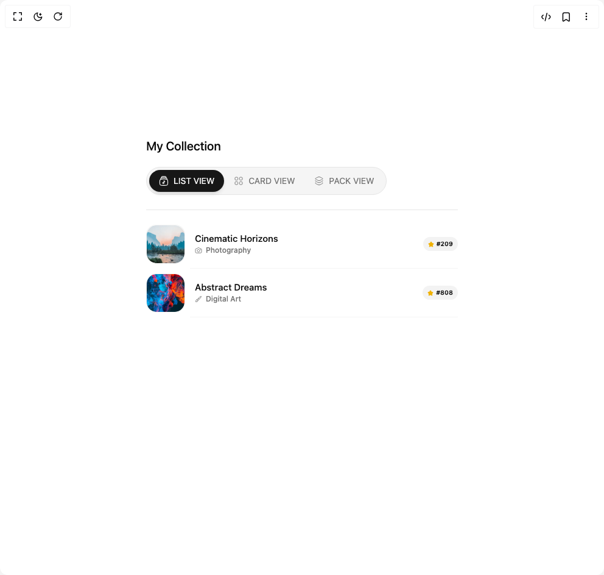
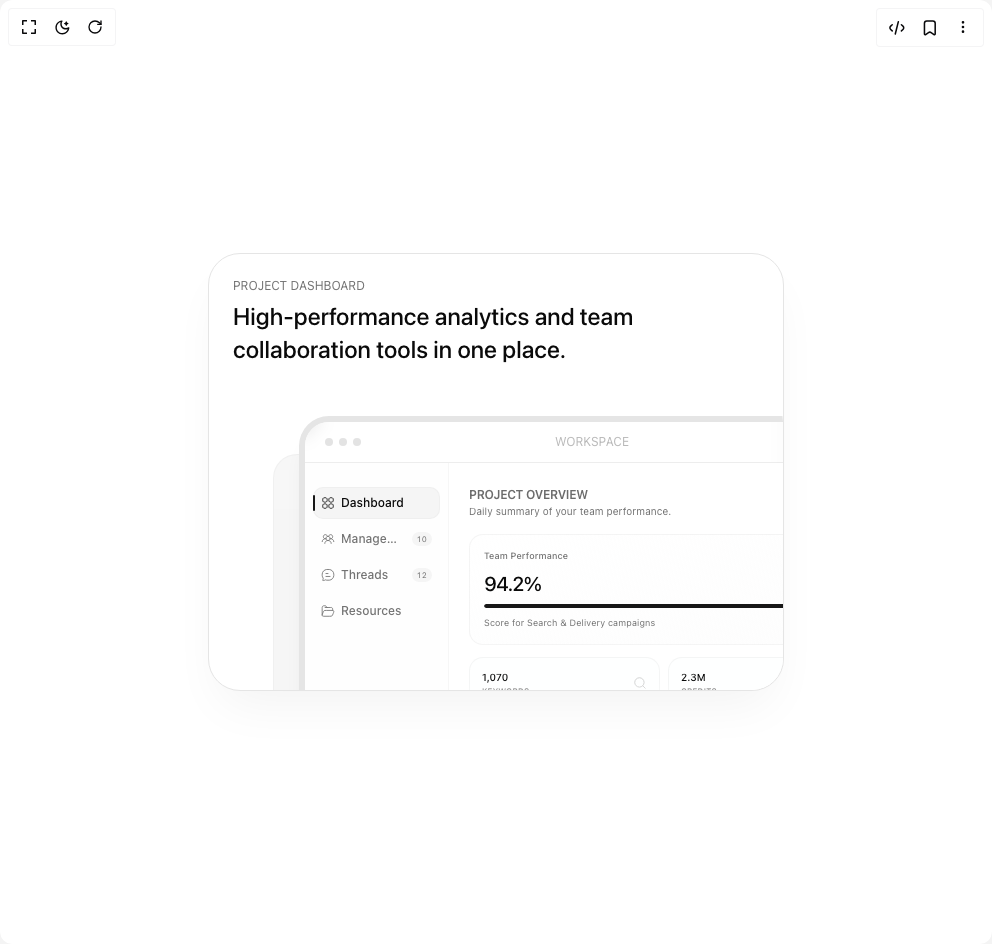
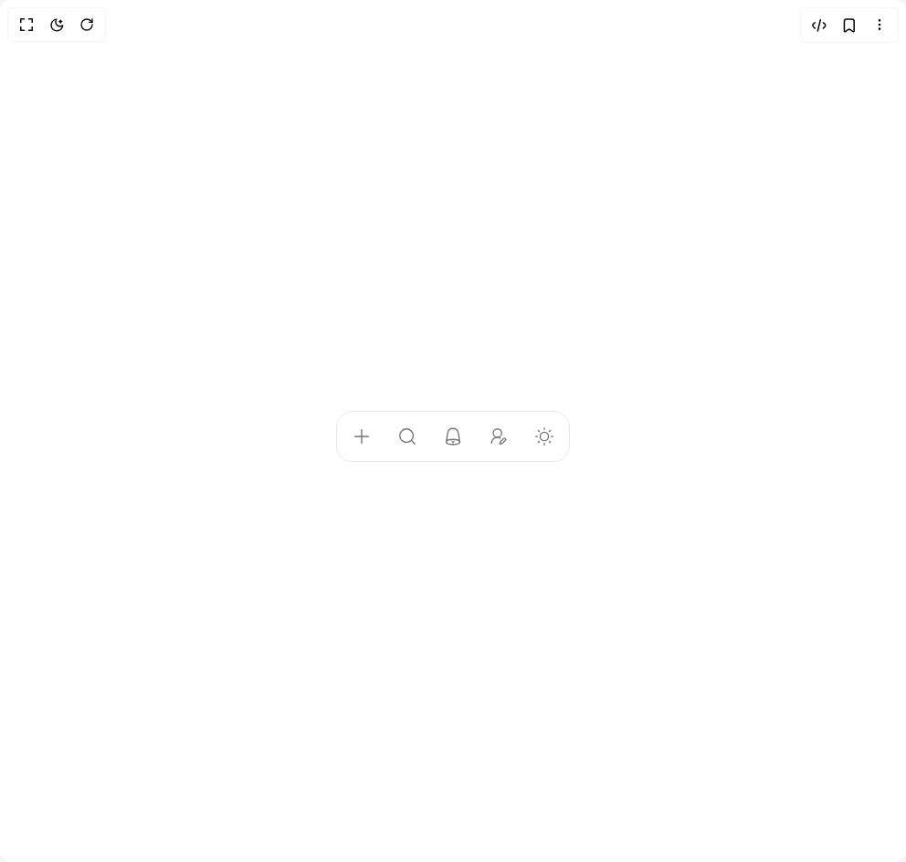
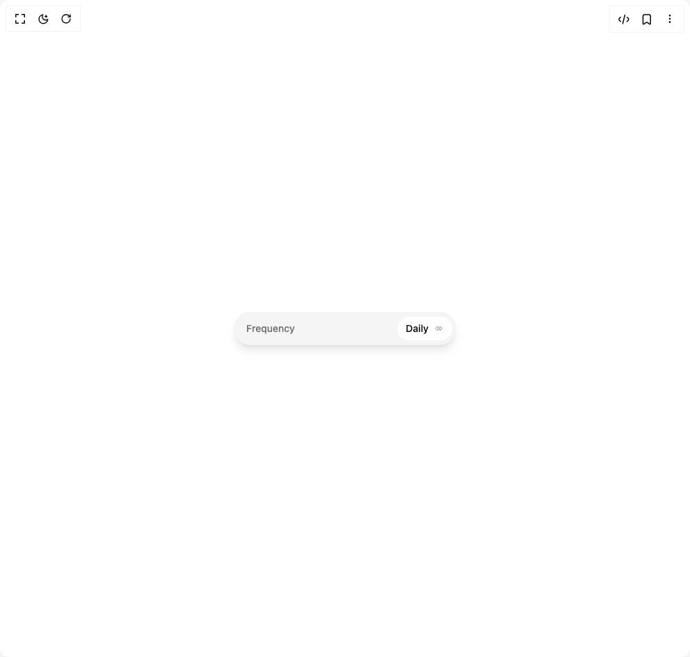
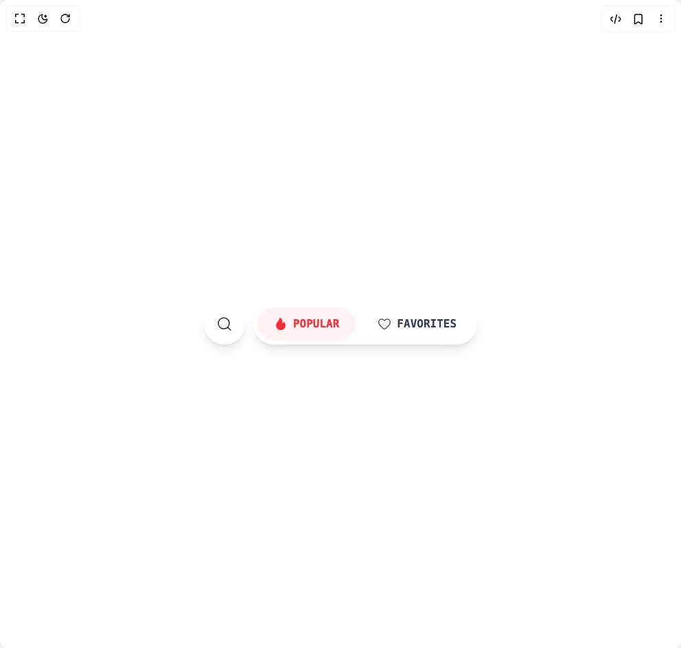
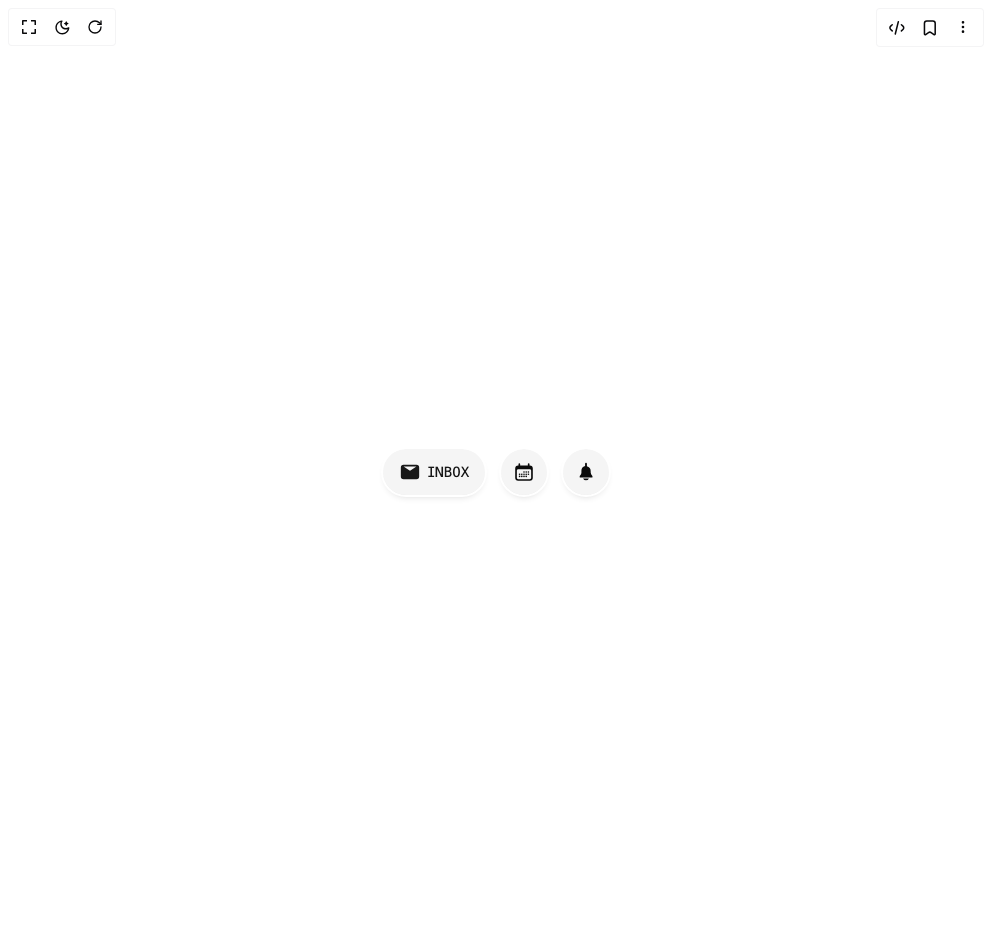
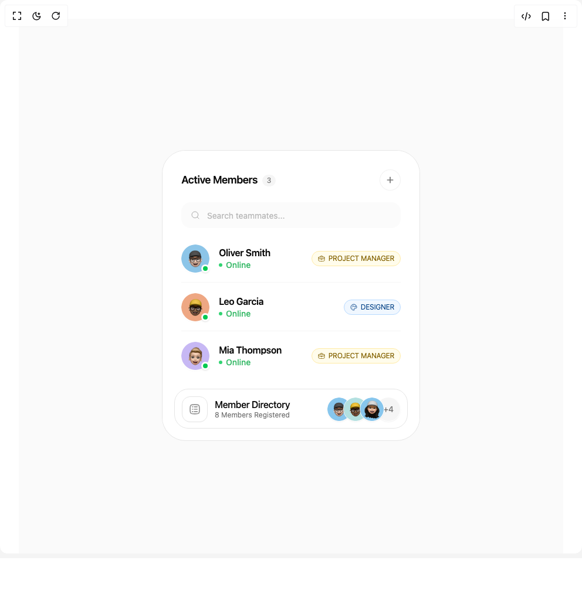
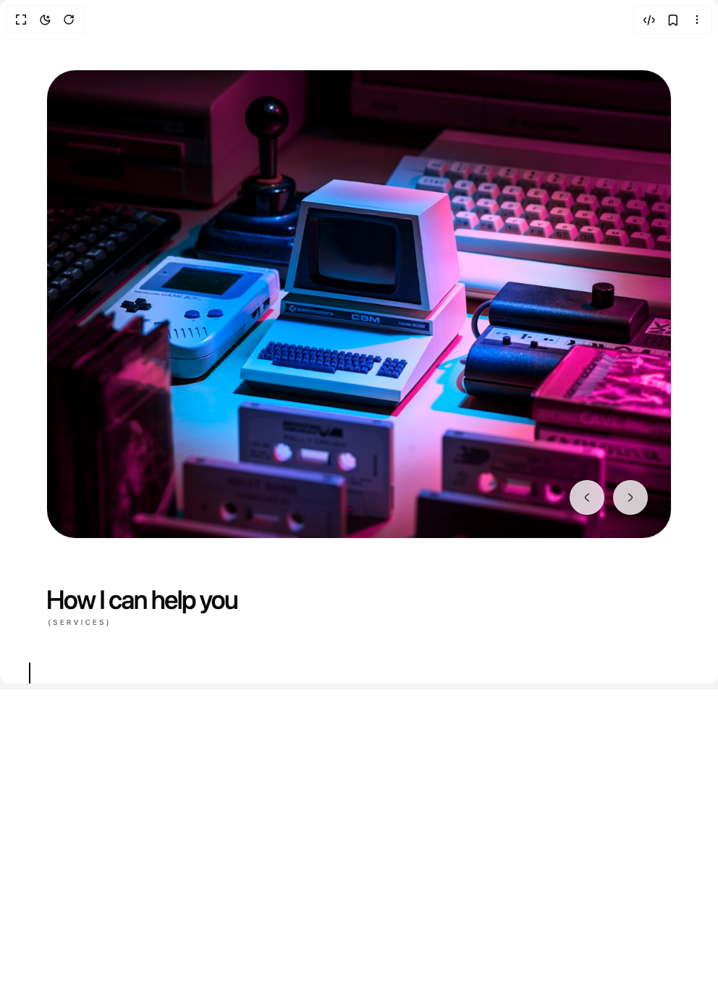

# 0xurvish Components

20 components are available in this author group.

> Build any component in [BuilderStudio](https://builderstudio.dev), then share improvements with the community on [Discord](https://discord.gg/QdWeSGCqfe) or [Reddit](https://reddit.com/r/builderstudio).

| Preview | Component | Variant |
| --- | --- | --- |
|  | [Animated Collection](animated-collection/default/README.md) | `default` |
|  | [Bento Card](bento-card/default/README.md) | `default` |
|  | [Bottom Menu](bottom-menu/default/README.md) | `default` |
|  | [Day Picker](day-picker/default/README.md) | `default` |
|  | [Delete Button](delete-button/default/README.md) | `default` |
|  | [Discover Button](discover-button/default/README.md) | `default` |
|  | [Discrete Tab](discrete-tab/default/README.md) | `default` |
|  | [Dynamic Toolbar](dynamic-toolbar/default/README.md) | `default` |
|  | [Expandable Gallery](expandable-gallery/default/README.md) | `default` |
|  | [Feature Carousel](feature-carousel/default/README.md) | `default` |
|  | [Fluid Expanding Grid](fluid-expanding-grid/default/README.md) | `default` |
|  | [Folder Interaction](folder-interaction/default/README.md) | `default` |
|  | [Inline Edit](inline-edit/default/README.md) | `default` |
|  | [List Item](list-item/default/README.md) | `default` |
|  | [Magnified Bento](magnified-bento/default/README.md) | `default` |
|  | [Morphing Input](morphing-input/default/README.md) | `default` |
|  | [Pricing Card](pricing-card/default/README.md) | `default` |
|  | [Smooth Dropdown](smooth-dropdown/default/README.md) | `default` |
|  | [Stacked List](stacked-list/default/README.md) | `default` |
|  | [Vertical Tabs](vertical-tabs/default/README.md) | `default` |
