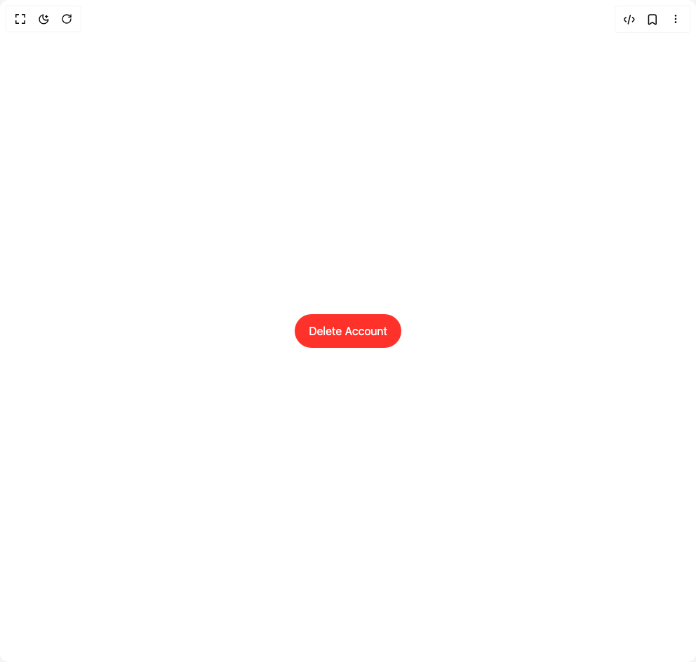

# Build Delete Button in BuilderStudio

> Build this component in our Agentic IDE: [BuilderStudio](https://builderstudio.dev).
>
> Join the BuilderStudio community on [Discord](https://discord.gg/QdWeSGCqfe) and [Reddit](https://reddit.com/r/builderstudio).



## Component

- Author group: `0xurvish`
- Component: `delete-button`
- Variant: `default`
- Rendered HTML snapshot: [`rendered.html`](rendered.html)

## BuilderStudio prompt

You are implementing a React component based on a component reference.

## Component identity

- Author: 0xUrvish
- Component slug: delete-button
- Demo slug: default
- Title: delete-button
- Description: 

## Goal

Recreate this component in a React + TypeScript + Tailwind CSS project. Preserve the visual layout, spacing, colors, border radius, shadows, interaction behavior, animation behavior, responsive behavior, and dark mode behavior shown in the rendered demo.

## Implementation requirements

- Use React and TypeScript.
- Use Tailwind CSS classes whenever possible.
- Keep the component self-contained unless the source files require helper components.
- If the source uses CSS variables, custom CSS, animations, or keyframes, include them.
- If the source uses external packages, list and use the required packages.
- Preserve accessibility attributes, button semantics, links, keyboard behavior, and ARIA attributes when visible in the source.
- Do not replace the component with a simplified placeholder.
- Return complete production-ready code.

## Dependencies

No reference metadata available.

## Rendered DOM snapshot

This is the rendered demo HTML extracted from the live preview. Use it to verify structure, class names, visible content, and layout.

```html
<div id="root"><div class="w-screen min-h-screen flex justify-center items-center"><div class="w-screen min-h-screen flex justify-center items-center"><div class="flex items-center justify-center w-full min-h-screen bg-background p-8"><div class="flex items-center justify-center"><button class="text-white px-5 py-3 rounded-full flex items-center justify-center overflow-hidden" tabindex="0" style="pointer-events: auto; background-color: rgb(254, 50, 42); filter: blur(0px); opacity: 1;"><span class="flex" style="opacity: 1;"><span style="display: inline-block; white-space: pre; opacity: 1; transform: none;">D</span><span style="display: inline-block; white-space: pre; opacity: 1; transform: none;">e</span><span style="display: inline-block; white-space: pre; opacity: 1; transform: none;">l</span><span style="display: inline-block; white-space: pre; opacity: 1; transform: none;">e</span><span style="display: inline-block; white-space: pre; opacity: 1; transform: none;">t</span><span style="display: inline-block; white-space: pre; opacity: 1; transform: none;">e</span><span style="display: inline-block; white-space: pre; opacity: 1; transform: none;"> </span><span style="display: inline-block; white-space: pre; opacity: 1; transform: none;">A</span><span style="display: inline-block; white-space: pre; opacity: 1; transform: none;">c</span><span style="display: inline-block; white-space: pre; opacity: 1; transform: none;">c</span><span style="display: inline-block; white-space: pre; opacity: 1; transform: none;">o</span><span style="display: inline-block; white-space: pre; opacity: 1; transform: none;">u</span><span style="display: inline-block; white-space: pre; opacity: 1; transform: none;">n</span><span style="display: inline-block; white-space: pre; opacity: 1; transform: none;">t</span></span></button></div></div></div></div></div>
```

## Reference source files

No reference source files were available.
