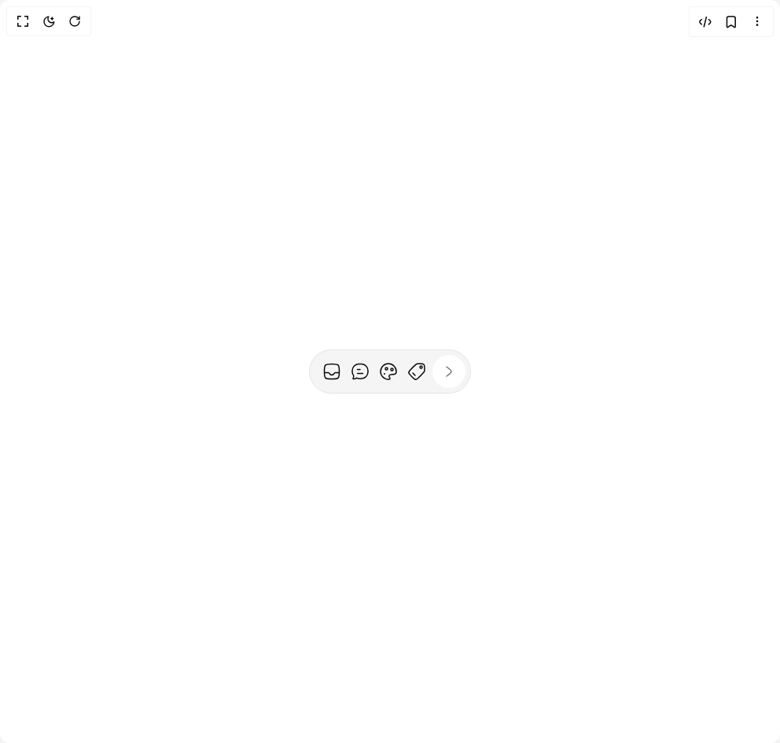

# Build Dynamic Toolbar in BuilderStudio

> Build this component in our Agentic IDE: [BuilderStudio](https://builderstudio.dev).
>
> Join the BuilderStudio community on [Discord](https://discord.gg/QdWeSGCqfe) and [Reddit](https://reddit.com/r/builderstudio).



## Component

- Author group: `0xurvish`
- Component: `dynamic-toolbar`
- Variant: `default`
- Rendered HTML snapshot: [`rendered.html`](rendered.html)

## BuilderStudio prompt

You are implementing a React component based on a component reference.

## Component identity

- Author: 0xUrvish
- Component slug: dynamic-toolbar
- Demo slug: default
- Title: dynamic-toolbar
- Description: 

## Goal

Recreate this component in a React + TypeScript + Tailwind CSS project. Preserve the visual layout, spacing, colors, border radius, shadows, interaction behavior, animation behavior, responsive behavior, and dark mode behavior shown in the rendered demo.

## Implementation requirements

- Use React and TypeScript.
- Use Tailwind CSS classes whenever possible.
- Keep the component self-contained unless the source files require helper components.
- If the source uses CSS variables, custom CSS, animations, or keyframes, include them.
- If the source uses external packages, list and use the required packages.
- Preserve accessibility attributes, button semantics, links, keyboard behavior, and ARIA attributes when visible in the source.
- Do not replace the component with a simplified placeholder.
- Return complete production-ready code.

## Dependencies

No reference metadata available.

## Rendered DOM snapshot

This is the rendered demo HTML extracted from the live preview. Use it to verify structure, class names, visible content, and layout.

```html
<div id="root"><div class="w-screen min-h-screen flex justify-center items-center"><div class="w-screen min-h-screen flex justify-center items-center"><div class="flex items-center justify-center w-full min-h-screen bg-background p-8"><div class="relative h-14 rounded-full bg-muted border border-border overflow-hidden" style="width: 206px;"><div class="h-full flex" style="transform: none;"><div class="flex items-center gap-1 p-1.5 pl-3 pr-2 flex-shrink-0"><button class="p-1 rounded-md hover:bg-accent/50 transition-colors hover:cursor-pointer "><svg xmlns="http://www.w3.org/2000/svg" width="24" height="24" viewBox="0 0 24 24" fill="none" color="currentColor" class="text-foreground "><path d="M2.5 12C2.5 7.52166 2.5 5.28249 3.89124 3.89124C5.28249 2.5 7.52166 2.5 12 2.5C16.4783 2.5 18.7175 2.5 20.1088 3.89124C21.5 5.28249 21.5 7.52166 21.5 12C21.5 16.4783 21.5 18.7175 20.1088 20.1088C18.7175 21.5 16.4783 21.5 12 21.5C7.52166 21.5 5.28249 21.5 3.89124 20.1088C2.5 18.7175 2.5 16.4783 2.5 12Z" stroke="currentColor" stroke-linecap="round" stroke-linejoin="round" stroke-width="1.5"></path><path d="M21.5 13.5H16.5743C15.7322 13.5 15.0706 14.2036 14.6995 14.9472C14.2963 15.7551 13.4889 16.5 12 16.5C10.5111 16.5 9.70373 15.7551 9.30054 14.9472C8.92942 14.2036 8.26777 13.5 7.42566 13.5H2.5" stroke="currentColor" stroke-linejoin="round" stroke-width="1.5"></path></svg></button><button class="p-1 rounded-md hover:bg-accent/50 transition-colors hover:cursor-pointer "><svg xmlns="http://www.w3.org/2000/svg" width="24" height="24" viewBox="0 0 24 24" fill="none" color="currentColor" class="text-foreground "><path d="M8.5 14.5H15.5M8.5 9.5H12" stroke="currentColor" stroke-linecap="round" stroke-linejoin="round" stroke-width="1.5"></path><path d="M14.1706 20.8905C18.3536 20.6125 21.6856 17.2332 21.9598 12.9909C22.0134 12.1607 22.0134 11.3009 21.9598 10.4707C21.6856 6.22838 18.3536 2.84913 14.1706 2.57107C12.7435 2.47621 11.2536 2.47641 9.8294 2.57107C5.64639 2.84913 2.31441 6.22838 2.04024 10.4707C1.98659 11.3009 1.98659 12.1607 2.04024 12.9909C2.1401 14.536 2.82343 15.9666 3.62791 17.1746C4.09501 18.0203 3.78674 19.0758 3.30021 19.9978C2.94941 20.6626 2.77401 20.995 2.91484 21.2351C3.05568 21.4752 3.37026 21.4829 3.99943 21.4982C5.24367 21.5285 6.08268 21.1757 6.74868 20.6846C7.1264 20.4061 7.31527 20.2668 7.44544 20.2508C7.5756 20.2348 7.83177 20.3403 8.34401 20.5513C8.8044 20.7409 9.33896 20.8579 9.8294 20.8905C11.2536 20.9852 12.7435 20.9854 14.1706 20.8905Z" stroke="currentColor" stroke-linejoin="round" stroke-width="1.5"></path></svg></button><button class="p-1 rounded-md hover:bg-accent/50 transition-colors hover:cursor-pointer "><svg xmlns="http://www.w3.org/2000/svg" width="24" height="24" viewBox="0 0 24 24" fill="none" color="currentColor" class="text-foreground "><path d="M22 12C22 6.47715 17.5228 2 12 2C6.47715 2 2 6.47715 2 12C2 17.5228 6.47715 22 12 22C12.8417 22 14 22.1163 14 21C14 20.391 13.6832 19.9212 13.3686 19.4544C12.9082 18.7715 12.4523 18.0953 13 17C13.6667 15.6667 14.7778 15.6667 16.4815 15.6667C17.3334 15.6667 18.3334 15.6667 19.5 15.5C21.601 15.1999 22 13.9084 22 12Z" stroke="currentColor" stroke-width="1.5"></path><path d="M7 15.002L7.00868 14.9996" stroke="currentColor" stroke-linecap="round" stroke-linejoin="round" stroke-width="2"></path><circle cx="9.5" cy="8.5" r="1.5" stroke="currentColor" stroke-width="1.5"></circle><circle cx="16.5" cy="9.5" r="1.5" stroke="currentColor" stroke-width="1.5"></circle></svg></button><button class="p-1 rounded-md hover:bg-accent/50 transition-colors hover:cursor-pointer"><div style="filter: blur(0px);"><svg xmlns="http://www.w3.org/2000/svg" width="24" height="24" viewBox="0 0 24 24" fill="none" color="currentColor" class="text-foreground "><circle cx="1.5" cy="1.5" r="1.5" transform="matrix(1 0 0 -1 16 8.00024)" stroke="currentColor" stroke-linecap="round" stroke-linejoin="round" stroke-width="1.5"></circle><path d="M2.77423 11.1439C1.77108 12.2643 1.7495 13.9546 2.67016 15.1437C4.49711 17.5033 6.49674 19.5029 8.85633 21.3298C10.0454 22.2505 11.7357 22.2289 12.8561 21.2258C15.8979 18.5022 18.6835 15.6559 21.3719 12.5279C21.6377 12.2187 21.8039 11.8397 21.8412 11.4336C22.0062 9.63798 22.3452 4.46467 20.9403 3.05974C19.5353 1.65481 14.362 1.99377 12.5664 2.15876C12.1603 2.19608 11.7813 2.36233 11.472 2.62811C8.34412 5.31646 5.49781 8.10211 2.77423 11.1439Z" stroke="currentColor" stroke-width="1.5"></path><path d="M7.00002 14.0002L10 17.0002" stroke="currentColor" stroke-linecap="round" stroke-linejoin="round" stroke-width="1.5"></path></svg></div></button><button class="h-full aspect-square flex justify-center items-center bg-background rounded-full" tabindex="0"><svg xmlns="http://www.w3.org/2000/svg" width="24" height="24" viewBox="0 0 24 24" fill="none" color="currentColor" class="text-muted-foreground"><path d="M9.00005 6C9.00005 6 15 10.4189 15 12C15 13.5812 9 18 9 18" stroke="currentColor" stroke-linecap="round" stroke-linejoin="round" stroke-width="1.5"></path></svg></button></div><div class="flex items-center gap-1 p-1.5 pl-2 pr-3 flex-shrink-0" style="position: absolute; opacity: 0; pointer-events: none;"><button class="h-full aspect-square flex justify-center items-center bg-background rounded-full" tabindex="0"><svg xmlns="http://www.w3.org/2000/svg" width="24" height="24" viewBox="0 0 24 24" fill="none" color="currentColor" class="text-muted-foreground"><path d="M15 6C15 6 9.00001 10.4189 9 12C8.99999 13.5812 15 18 15 18" stroke="currentColor" stroke-linecap="round" stroke-linejoin="round" stroke-width="1.5"></path></svg></button><button class="p-1 rounded-md hover:bg-accent/50 transition-colors hover:cursor-pointer"><div style="filter: blur(1px);"><svg xmlns="http://www.w3.org/2000/svg" width="24" height="24" viewBox="0 0 24 24" fill="none" color="currentColor" class="text-foreground "><circle cx="7.5" cy="7.5" r="1.5" stroke="currentColor" stroke-linecap="round" stroke-linejoin="round" stroke-width="1.5"></circle><path d="M2.5 12C2.5 7.52166 2.5 5.28249 3.89124 3.89124C5.28249 2.5 7.52166 2.5 12 2.5C16.4783 2.5 18.7175 2.5 20.1088 3.89124C21.5 5.28249 21.5 7.52166 21.5 12C21.5 16.4783 21.5 18.7175 20.1088 20.1088C18.7175 21.5 16.4783 21.5 12 21.5C7.52166 21.5 5.28249 21.5 3.89124 20.1088C2.5 18.7175 2.5 16.4783 2.5 12Z" stroke="currentColor" stroke-width="1.5"></path><path d="M5 21C9.37246 15.775 14.2741 8.88406 21.4975 13.5424" stroke="currentColor" stroke-width="1.5"></path></svg></div></button><button class="p-1 rounded-md hover:bg-accent/50 transition-colors hover:cursor-pointer "><svg xmlns="http://www.w3.org/2000/svg" width="24" height="24" viewBox="0 0 24 24" fill="none" color="currentColor" class="text-foreground "><path d="M7 21H16.9999C19.3569 21 20.5354 21 21.2677 20.2678C21.9999 19.5355 21.9999 18.357 21.9999 16C21.9999 13.643 21.9999 12.4645 21.2677 11.7322C20.5354 11 19.3569 11 16.9999 11H7C4.64302 11 3.46453 11 2.7323 11.7322C2.00007 12.4644 2.00005 13.6429 2 15.9999C1.99995 18.357 1.99993 19.5355 2.73217 20.2677C3.4644 21 4.64294 21 7 21Z" stroke="currentColor" stroke-linecap="round" stroke-linejoin="round" stroke-width="1.5"></path><path d="M4 11C4.00005 9.59977 4.00008 8.89966 4.27263 8.36485C4.5123 7.89455 4.89469 7.51218 5.365 7.27253C5.89981 7 6.59993 7 8.00015 7H16C17.4001 7 18.1002 7 18.635 7.27248C19.1054 7.51217 19.4878 7.89462 19.7275 8.36502C20 8.8998 20 9.59987 20 11" stroke="currentColor" stroke-linecap="round" stroke-linejoin="round" stroke-width="1.5"></path><path d="M6 7C6.00004 5.5998 6.00006 4.89969 6.27259 4.3649C6.51227 3.89457 6.89467 3.51218 7.36501 3.27252C7.89981 3 8.59991 3 10.0001 3H14C15.4001 3 16.1002 3 16.635 3.27248C17.1054 3.51217 17.4878 3.89462 17.7275 4.36502C18 4.8998 18 5.59987 18 7" stroke="currentColor" stroke-linecap="round" stroke-linejoin="round" stroke-width="1.5"></path><path d="M16 15L15.7 15.4C15.1111 16.1851 14.8167 16.5777 14.3944 16.7889C13.9721 17 13.4814 17 12.5 17H11.5C10.5186 17 10.0279 17 9.60557 16.7889C9.18328 16.5777 8.88885 16.1851 8.3 15.4L8 15" stroke="currentColor" stroke-linecap="round" stroke-linejoin="round" stroke-width="1.5"></path></svg></button><button class="p-1 rounded-md hover:bg-accent/50 transition-colors hover:cursor-pointer "><svg xmlns="http://www.w3.org/2000/svg" width="24" height="24" viewBox="0 0 24 24" fill="none" color="currentColor" class="text-foreground -scale-x-100"><path d="M20.5 5.5H9.5C5.78672 5.5 3 8.18503 3 12" stroke="currentColor" stroke-linecap="round" stroke-linejoin="round" stroke-width="1.5"></path><path d="M3.5 18.5H14.5C18.2133 18.5 21 15.815 21 12" stroke="currentColor" stroke-linecap="round" stroke-linejoin="round" stroke-width="1.5"></path><path d="M18.5 3C18.5 3 21 4.84122 21 5.50002C21 6.15882 18.5 8 18.5 8" stroke="currentColor" stroke-linecap="round" stroke-linejoin="round" stroke-width="1.5"></path><path d="M5.49998 16C5.49998 16 3.00001 17.8412 3 18.5C2.99999 19.1588 5.5 21 5.5 21" stroke="currentColor" stroke-linecap="round" stroke-linejoin="round" stroke-width="1.5"></path></svg></button><button class="p-1 rounded-md hover:bg-accent/50 transition-colors hover:cursor-pointer "><svg xmlns="http://www.w3.org/2000/svg" width="24" height="24" viewBox="0 0 24 24" fill="none" color="currentColor" class="text-foreground -scale-x-100"><path d="M20.5 5.5H9.5C5.78672 5.5 3 8.18503 3 12" stroke="currentColor" stroke-linecap="round" stroke-linejoin="round" stroke-width="1.5"></path><path d="M3.5 18.5H14.5C18.2133 18.5 21 15.815 21 12" stroke="currentColor" stroke-linecap="round" stroke-linejoin="round" stroke-width="1.5"></path><path d="M18.5 3C18.5 3 21 4.84122 21 5.50002C21 6.15882 18.5 8 18.5 8" stroke="currentColor" stroke-linecap="round" stroke-linejoin="round" stroke-width="1.5"></path><path d="M5.49998 16C5.49998 16 3.00001 17.8412 3 18.5C2.99999 19.1588 5.5 21 5.5 21" stroke="currentColor" stroke-linecap="round" stroke-linejoin="round" stroke-width="1.5"></path></svg></button><button class="p-1 rounded-md hover:bg-accent/50 transition-colors hover:cursor-pointer "><svg xmlns="http://www.w3.org/2000/svg" width="24" height="24" viewBox="0 0 24 24" fill="none" color="currentColor" class="text-foreground text-red-500"><path d="M19.5 5.5L18.8803 15.5251C18.7219 18.0864 18.6428 19.3671 18.0008 20.2879C17.6833 20.7431 17.2747 21.1273 16.8007 21.416C15.8421 22 14.559 22 11.9927 22C9.42312 22 8.1383 22 7.17905 21.4149C6.7048 21.1257 6.296 20.7408 5.97868 20.2848C5.33688 19.3626 5.25945 18.0801 5.10461 15.5152L4.5 5.5" stroke="currentColor" stroke-linecap="round" stroke-width="1.5"></path><path d="M3 5.5H21M16.0557 5.5L15.3731 4.09173C14.9196 3.15626 14.6928 2.68852 14.3017 2.39681C14.215 2.3321 14.1231 2.27454 14.027 2.2247C13.5939 2 13.0741 2 12.0345 2C10.9688 2 10.436 2 9.99568 2.23412C9.8981 2.28601 9.80498 2.3459 9.71729 2.41317C9.32164 2.7167 9.10063 3.20155 8.65861 4.17126L8.05292 5.5" stroke="currentColor" stroke-linecap="round" stroke-width="1.5"></path><path d="M9.5 16.5L9.5 10.5" stroke="currentColor" stroke-linecap="round" stroke-width="1.5"></path><path d="M14.5 16.5L14.5 10.5" stroke="currentColor" stroke-linecap="round" stroke-width="1.5"></path></svg></button></div></div></div></div></div></div></div>
```

## Reference source files

No reference source files were available.
