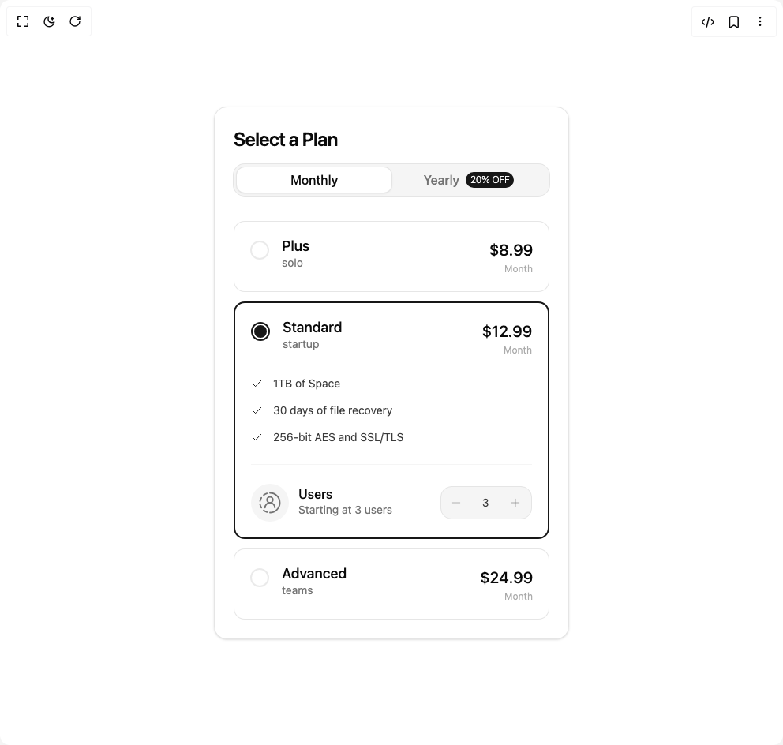

# Build Pricing Card in BuilderStudio

> Build this component in our Agentic IDE: [BuilderStudio](https://builderstudio.dev).
>
> Join the BuilderStudio community on [Discord](https://discord.gg/QdWeSGCqfe) and [Reddit](https://reddit.com/r/builderstudio).



## Component

- Author group: `0xurvish`
- Component: `pricing-card`
- Variant: `default`
- Rendered HTML snapshot: [`rendered.html`](rendered.html)

## BuilderStudio prompt

You are implementing a React component based on a component reference.

## Component identity

- Author: 0xUrvish
- Component slug: pricing-card
- Demo slug: default
- Title: pricing-card
- Description: 

## Goal

Recreate this component in a React + TypeScript + Tailwind CSS project. Preserve the visual layout, spacing, colors, border radius, shadows, interaction behavior, animation behavior, responsive behavior, and dark mode behavior shown in the rendered demo.

## Implementation requirements

- Use React and TypeScript.
- Use Tailwind CSS classes whenever possible.
- Keep the component self-contained unless the source files require helper components.
- If the source uses CSS variables, custom CSS, animations, or keyframes, include them.
- If the source uses external packages, list and use the required packages.
- Preserve accessibility attributes, button semantics, links, keyboard behavior, and ARIA attributes when visible in the source.
- Do not replace the component with a simplified placeholder.
- Return complete production-ready code.

## Dependencies

No reference metadata available.

## Rendered DOM snapshot

This is the rendered demo HTML extracted from the live preview. Use it to verify structure, class names, visible content, and layout.

```html
<div id="root"><div class="w-screen min-h-screen flex justify-center items-center"><div class="w-screen min-h-screen flex justify-center items-center"><div class="flex items-center justify-center w-full min-h-screen bg-background p-8"><div class="w-full max-w-[450px] flex flex-col gap-6 p-5 px-4 sm:p-6 rounded-4xl sm:rounded-2xl border border-border bg-background shadow-sm transition-colors duration-300 not-prose"><div class="flex flex-col gap-4 mb-2"><h1 class="text-2xl font-semibold text-foreground tracking-tight">Select a Plan</h1><div class="bg-muted p-1 h-10 w-full rounded-xl ring-1 ring-border flex"><button class="flex-1 h-full rounded-lg text-base font-medium  relative transition-colors duration-300 text-foreground"><div class="absolute inset-0 bg-background rounded-lg shadow-sm ring-1 ring-border" style="opacity: 1;"></div><span class="relative z-10">Monthly</span></button><button class="flex-1 h-full rounded-lg text-base font-medium relative transition-colors duration-300 flex items-center justify-center gap-2 text-muted-foreground hover:text-foreground"><span class="relative z-10">Yearly</span><span class="relative z-10 bg-primary text-xs font-black px-1.5 py-0.5 rounded-full uppercase text-primary-foreground tracking-tight whitespace-nowrap font-light">20% OFF</span></button></div></div><div class="flex flex-col gap-3"><div class="relative cursor-pointer"><div class="relative rounded-xl bg-card border border-foreground/10 transition-colors duration-300 "><div class="p-5"><div class="flex justify-between items-start"><div class="flex gap-4"><div class="mt-1 shrink-0"><div class="w-6 h-6 rounded-full border-2 flex items-center justify-center transition-all duration-300 border-muted-foreground/15"></div></div><div><h3 class="text-lg font-medium text-foreground leading-tight">Plus</h3><p class="text-sm text-muted-foreground lowercase">solo</p></div></div><div class="text-right"><div class="text-xl font-medium text-foreground"><number-flow-react></number-flow-react></div><div class="text-xs text-muted-foreground/60 flex items-center justify-end gap-1 ">Month</div></div></div></div></div></div><div class="relative cursor-pointer"><div class="relative rounded-xl bg-card border border-foreground/10 transition-colors duration-300 z-10 border-primary border-2"><div class="p-5"><div class="flex justify-between items-start"><div class="flex gap-4"><div class="mt-1 shrink-0"><div class="w-6 h-6 rounded-full border-2 flex items-center justify-center transition-all duration-300 border-primary"><div class="w-4 h-4 rounded-full bg-primary" style="transform: none;"></div></div></div><div><h3 class="text-lg font-medium text-foreground leading-tight">Standard</h3><p class="text-sm text-muted-foreground lowercase">startup</p></div></div><div class="text-right"><div class="text-xl font-medium text-foreground"><number-flow-react></number-flow-react></div><div class="text-xs text-muted-foreground/60 flex items-center justify-end gap-1 ">Month</div></div></div><div class="overflow-hidden w-full" style="height: auto; opacity: 1;"><div class="pt-6 flex flex-col gap-6"><div class="flex flex-col gap-3.5"><div class="flex items-center gap-3 text-sm text-foreground/80 " style="opacity: 1; transform: none;"><svg xmlns="http://www.w3.org/2000/svg" width="16" height="16" viewBox="0 0 24 24" fill="none" color="currentColor" class="text-primary"><path d="M5 14L8.5 17.5L19 6.5" stroke="currentColor" stroke-linecap="round" stroke-linejoin="round" stroke-width="1.5"></path></svg>1TB of Space</div><div class="flex items-center gap-3 text-sm text-foreground/80 " style="opacity: 1; transform: none;"><svg xmlns="http://www.w3.org/2000/svg" width="16" height="16" viewBox="0 0 24 24" fill="none" color="currentColor" class="text-primary"><path d="M5 14L8.5 17.5L19 6.5" stroke="currentColor" stroke-linecap="round" stroke-linejoin="round" stroke-width="1.5"></path></svg>30 days of file recovery</div><div class="flex items-center gap-3 text-sm text-foreground/80 " style="opacity: 1; transform: none;"><svg xmlns="http://www.w3.org/2000/svg" width="16" height="16" viewBox="0 0 24 24" fill="none" color="currentColor" class="text-primary"><path d="M5 14L8.5 17.5L19 6.5" stroke="currentColor" stroke-linecap="round" stroke-linejoin="round" stroke-width="1.5"></path></svg>256-bit AES and SSL/TLS</div></div><div class="h-px bg-muted"></div><div class="flex items-center justify-between"><div class="flex items-center gap-3"><div class="w-12 h-12 rounded-full bg-muted shrink-0 flex items-center justify-center"><svg xmlns="http://www.w3.org/2000/svg" width="30" height="30" viewBox="0 0 24 24" fill="none" color="currentColor" class="text-muted-foreground"><path d="M12 2C17.5237 2 22 6.47778 22 12C22 17.5222 17.5237 22 12 22" stroke="currentColor" stroke-linecap="round" stroke-linejoin="round" stroke-width="1.5"></path><path d="M9 21.5C7.81163 21.0953 6.69532 20.5107 5.72302 19.7462M5.72302 4.25385C6.69532 3.50059 7.81163 2.90473 9 2.5M2 10.2461C2.21607 9.08813 2.66019 7.96386 3.29638 6.94078M2 13.7539C2.21607 14.9119 2.66019 16.0361 3.29638 17.0592" stroke="currentColor" stroke-linecap="round" stroke-linejoin="round" stroke-width="1.5"></path><path d="M15 9C15 7.34315 13.6569 6 12 6C10.3431 6 9 7.34315 9 9C9 10.6569 10.3431 12 12 12C13.6569 12 15 10.6569 15 9Z" stroke="currentColor" stroke-linecap="round" stroke-linejoin="round" stroke-width="1.5"></path><path d="M17 17C17 14.2386 14.7614 12 12 12C9.23858 12 7 14.2386 7 17" stroke="currentColor" stroke-linecap="round" stroke-linejoin="round" stroke-width="1.5"></path></svg></div><div class="flex flex-col"><span class="text-base font-medium  text-foreground leading-none">Users</span><span class="text-sm text-muted-foreground mt-0.5">Starting at 3 users</span></div></div><div class="flex items-center gap-4 bg-muted p-1.5 rounded-xl border border-border"><button class="p-1.5 rounded-lg hover:bg-background hover:shadow-sm transition-all text-muted-foreground/60 hover:text-foreground active:scale-95"><svg xmlns="http://www.w3.org/2000/svg" width="14" height="14" viewBox="0 0 24 24" fill="none" color="currentColor" class=""><path d="M20 12L4 12" stroke="currentColor" stroke-linecap="round" stroke-linejoin="round" stroke-width="1.5"></path></svg></button><span class="text-sm  w-4 text-center tabular-nums text-foreground/80"><number-flow-react></number-flow-react></span><button class="p-1.5 rounded-lg hover:bg-background hover:shadow-sm transition-all text-muted-foreground/60 hover:text-foreground active:scale-95"><svg xmlns="http://www.w3.org/2000/svg" width="16" height="16" viewBox="0 0 24 24" fill="none" color="currentColor" class=""><path d="M12.001 5.00003V19.002" stroke="currentColor" stroke-linecap="round" stroke-linejoin="round" stroke-width="1.5"></path><path d="M19.002 12.002L4.99998 12.002" stroke="currentColor" stroke-linecap="round" stroke-linejoin="round" stroke-width="1.5"></path></svg></button></div></div></div></div></div></div></div><div class="relative cursor-pointer"><div class="relative rounded-xl bg-card border border-foreground/10 transition-colors duration-300 "><div class="p-5"><div class="flex justify-between items-start"><div class="flex gap-4"><div class="mt-1 shrink-0"><div class="w-6 h-6 rounded-full border-2 flex items-center justify-center transition-all duration-300 border-muted-foreground/15"></div></div><div><h3 class="text-lg font-medium text-foreground leading-tight">Advanced</h3><p class="text-sm text-muted-foreground lowercase">teams</p></div></div><div class="text-right"><div class="text-xl font-medium text-foreground"><number-flow-react></number-flow-react></div><div class="text-xs text-muted-foreground/60 flex items-center justify-end gap-1 ">Month</div></div></div></div></div></div></div></div></div></div></div></div>
```

## Reference source files

No reference source files were available.
