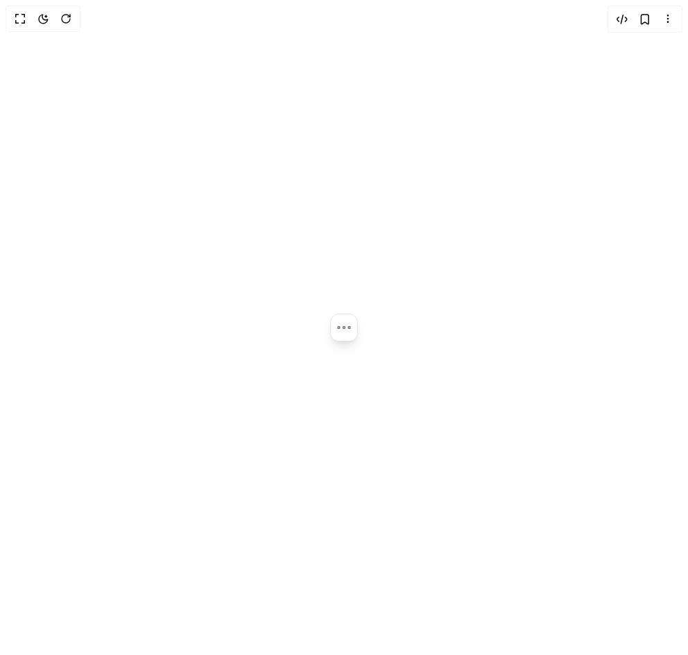

# Build Smooth Dropdown in BuilderStudio

> Build this component in our Agentic IDE: [BuilderStudio](https://builderstudio.dev).
>
> Join the BuilderStudio community on [Discord](https://discord.gg/QdWeSGCqfe) and [Reddit](https://reddit.com/r/builderstudio).



## Component

- Author group: `0xurvish`
- Component: `smooth-dropdown`
- Variant: `default`
- Rendered HTML snapshot: [`rendered.html`](rendered.html)

## BuilderStudio prompt

You are implementing a React component based on a component reference.

## Component identity

- Author: 0xUrvish
- Component slug: smooth-dropdown
- Demo slug: default
- Title: smooth-dropdown
- Description: 

## Goal

Recreate this component in a React + TypeScript + Tailwind CSS project. Preserve the visual layout, spacing, colors, border radius, shadows, interaction behavior, animation behavior, responsive behavior, and dark mode behavior shown in the rendered demo.

## Implementation requirements

- Use React and TypeScript.
- Use Tailwind CSS classes whenever possible.
- Keep the component self-contained unless the source files require helper components.
- If the source uses CSS variables, custom CSS, animations, or keyframes, include them.
- If the source uses external packages, list and use the required packages.
- Preserve accessibility attributes, button semantics, links, keyboard behavior, and ARIA attributes when visible in the source.
- Do not replace the component with a simplified placeholder.
- Return complete production-ready code.

## Dependencies

No reference metadata available.

## Rendered DOM snapshot

This is the rendered demo HTML extracted from the live preview. Use it to verify structure, class names, visible content, and layout.

```html
<div id="root"><div class="w-screen min-h-screen flex justify-center items-center"><div class="w-screen min-h-screen flex justify-center items-center"><div class="flex items-center justify-center w-full min-h-screen bg-background p-8"><div class="relative h-10 w-10 not-prose"><div class="absolute top-0 right-0 bg-popover border border-border shadow-lg overflow-hidden cursor-pointer origin-top-right " style="width: 40px; height: 40px; border-radius: 12px;"><div class="absolute inset-0 flex items-center justify-center" style="pointer-events: auto; will-change: transform; opacity: 1; transform: none;"><svg xmlns="http://www.w3.org/2000/svg" width="24" height="24" viewBox="0 0 24 24" fill="none" color="currentColor" class="w-6 h-6 text-muted-foreground"><path d="M21 12C21 11.1716 20.3284 10.5 19.5 10.5C18.6716 10.5 18 11.1716 18 12C18 12.8284 18.6716 13.5 19.5 13.5C20.3284 13.5 21 12.8284 21 12Z" stroke="currentColor" stroke-width="1.5"></path><path d="M13.5 12C13.5 11.1716 12.8284 10.5 12 10.5C11.1716 10.5 10.5 11.1716 10.5 12C10.5 12.8284 11.1716 13.5 12 13.5C12.8284 13.5 13.5 12.8284 13.5 12Z" stroke="currentColor" stroke-width="1.5"></path><path d="M6 12C6 11.1716 5.32843 10.5 4.5 10.5C3.67157 10.5 3 11.1716 3 12C3 12.8284 3.67157 13.5 4.5 13.5C5.32843 13.5 6 12.8284 6 12Z" stroke="currentColor" stroke-width="1.5"></path></svg></div><div><div class="p-2" style="pointer-events: none; will-change: transform; opacity: 0;"><ul class="flex flex-col gap-0.5 m-0! p-0! list-none!"><li class="relative flex items-center gap-3 rounded-lg text-sm cursor-pointer transition-colors duration-200 ease-out m-0! pl-3! py-2! text-foreground" style="opacity: 0; transform: translateX(8px);"><div class="absolute inset-0 rounded-lg bg-muted" style="opacity: 1;"></div><div class="absolute left-0 top-0 bottom-0 my-auto w-[3px] h-5 rounded-full bg-foreground" style="opacity: 1;"></div><svg xmlns="http://www.w3.org/2000/svg" width="24" height="24" viewBox="0 0 24 24" fill="none" color="currentColor" class="w-[18px] h-[18px] relative z-10"><path d="M17 8.5C17 5.73858 14.7614 3.5 12 3.5C9.23858 3.5 7 5.73858 7 8.5C7 11.2614 9.23858 13.5 12 13.5C14.7614 13.5 17 11.2614 17 8.5Z" stroke="currentColor" stroke-linecap="round" stroke-linejoin="round" stroke-width="1.5"></path><path d="M19 20.5C19 16.634 15.866 13.5 12 13.5C8.13401 13.5 5 16.634 5 20.5" stroke="currentColor" stroke-linecap="round" stroke-linejoin="round" stroke-width="1.5"></path></svg><span class="font-medium relative z-10">Profile</span></li><li class="relative flex items-center gap-3 rounded-lg text-sm cursor-pointer transition-colors duration-200 ease-out m-0! pl-3! py-2! text-muted-foreground hover:text-foreground" style="opacity: 0; transform: translateX(8px);"><svg xmlns="http://www.w3.org/2000/svg" width="24" height="24" viewBox="0 0 24 24" fill="none" color="currentColor" class="w-[18px] h-[18px] relative z-10"><path d="M2 12C2 8.46252 2 6.69377 3.0528 5.5129C3.22119 5.32403 3.40678 5.14935 3.60746 4.99087C4.86213 4 6.74142 4 10.5 4H13.5C17.2586 4 19.1379 4 20.3925 4.99087C20.5932 5.14935 20.7788 5.32403 20.9472 5.5129C22 6.69377 22 8.46252 22 12C22 15.5375 22 17.3062 20.9472 18.4871C20.7788 18.676 20.5932 18.8506 20.3925 19.0091C19.1379 20 17.2586 20 13.5 20H10.5C6.74142 20 4.86213 20 3.60746 19.0091C3.40678 18.8506 3.22119 18.676 3.0528 18.4871C2 17.3062 2 15.5375 2 12Z" stroke="currentColor" stroke-linecap="round" stroke-linejoin="round" stroke-width="1.5"></path><path d="M10 16H11.5" stroke="currentColor" stroke-linecap="round" stroke-linejoin="round" stroke-width="1.5"></path><path d="M14.5 16L18 16" stroke="currentColor" stroke-linecap="round" stroke-linejoin="round" stroke-width="1.5"></path><path d="M2 9H22" stroke="currentColor" stroke-linejoin="round" stroke-width="1.5"></path></svg><span class="font-medium relative z-10">Upgrade</span></li><li class="relative flex items-center gap-3 rounded-lg text-sm cursor-pointer transition-colors duration-200 ease-out m-0! pl-3! py-2! text-muted-foreground hover:text-foreground" style="opacity: 0; transform: translateX(8px);"><svg xmlns="http://www.w3.org/2000/svg" width="24" height="24" viewBox="0 0 24 24" fill="none" color="currentColor" class="w-[18px] h-[18px] relative z-10"><path d="M8 7H16.75C18.8567 7 19.91 7 20.6667 7.50559C20.9943 7.72447 21.2755 8.00572 21.4944 8.33329C22 9.08996 22 10.1433 22 12.25C22 15.7612 22 17.5167 21.1573 18.7779C20.7926 19.3238 20.3238 19.7926 19.7779 20.1573C18.5167 21 16.7612 21 13.25 21H12C7.28595 21 4.92893 21 3.46447 19.5355C2 18.0711 2 15.714 2 11V7.94427C2 6.1278 2 5.21956 2.38032 4.53806C2.65142 4.05227 3.05227 3.65142 3.53806 3.38032C4.21956 3 5.1278 3 6.94427 3C8.10802 3 8.6899 3 9.19926 3.19101C10.3622 3.62712 10.8418 4.68358 11.3666 5.73313L12 7" stroke="currentColor" stroke-linecap="round" stroke-width="1.5"></path></svg><span class="font-medium relative z-10">Projects</span></li><li class="relative flex items-center gap-3 rounded-lg text-sm cursor-pointer transition-colors duration-200 ease-out m-0! pl-3! py-2! text-muted-foreground hover:text-foreground" style="opacity: 0; transform: translateX(8px);"><svg xmlns="http://www.w3.org/2000/svg" width="24" height="24" viewBox="0 0 24 24" fill="none" color="currentColor" class="w-[18px] h-[18px] relative z-10"><path d="M8 7L16 7" stroke="currentColor" stroke-linecap="round" stroke-linejoin="round" stroke-width="1.5"></path><path d="M8 11L12 11" stroke="currentColor" stroke-linecap="round" stroke-linejoin="round" stroke-width="1.5"></path><path d="M13 21.5V21C13 18.1716 13 16.7574 13.8787 15.8787C14.7574 15 16.1716 15 19 15H19.5M20 13.3431V10C20 6.22876 20 4.34315 18.8284 3.17157C17.6569 2 15.7712 2 12 2C8.22877 2 6.34315 2 5.17157 3.17157C4 4.34314 4 6.22876 4 10L4 14.5442C4 17.7892 4 19.4117 4.88607 20.5107C5.06508 20.7327 5.26731 20.9349 5.48933 21.1139C6.58831 22 8.21082 22 11.4558 22C12.1614 22 12.5141 22 12.8372 21.886C12.9044 21.8623 12.9702 21.835 13.0345 21.8043C13.3436 21.6564 13.593 21.407 14.0919 20.9081L18.8284 16.1716C19.4065 15.5935 19.6955 15.3045 19.8478 14.9369C20 14.5694 20 14.1606 20 13.3431Z" stroke="currentColor" stroke-linecap="round" stroke-linejoin="round" stroke-width="1.5"></path></svg><span class="font-medium relative z-10">Documentation</span></li><hr class="border-border my-1.5!" style="opacity: 0;"><li class="relative flex items-center gap-3 rounded-lg text-sm cursor-pointer transition-colors duration-200 ease-out m-0! pl-3! py-2! text-muted-foreground hover:text-foreground" style="opacity: 0; transform: translateX(8px);"><svg xmlns="http://www.w3.org/2000/svg" width="24" height="24" viewBox="0 0 24 24" fill="none" color="currentColor" class="w-[18px] h-[18px] relative z-10"><path d="M21.3175 7.14139L20.8239 6.28479C20.4506 5.63696 20.264 5.31305 19.9464 5.18388C19.6288 5.05472 19.2696 5.15664 18.5513 5.36048L17.3311 5.70418C16.8725 5.80994 16.3913 5.74994 15.9726 5.53479L15.6357 5.34042C15.2766 5.11043 15.0004 4.77133 14.8475 4.37274L14.5136 3.37536C14.294 2.71534 14.1842 2.38533 13.9228 2.19657C13.6615 2.00781 13.3143 2.00781 12.6199 2.00781H11.5051C10.8108 2.00781 10.4636 2.00781 10.2022 2.19657C9.94085 2.38533 9.83106 2.71534 9.61149 3.37536L9.27753 4.37274C9.12465 4.77133 8.84845 5.11043 8.48937 5.34042L8.15249 5.53479C7.73374 5.74994 7.25259 5.80994 6.79398 5.70418L5.57375 5.36048C4.85541 5.15664 4.49625 5.05472 4.17867 5.18388C3.86109 5.31305 3.67445 5.63696 3.30115 6.28479L2.80757 7.14139C2.45766 7.74864 2.2827 8.05227 2.31666 8.37549C2.35061 8.69871 2.58483 8.95918 3.05326 9.48012L4.0843 10.6328C4.3363 10.9518 4.51521 11.5078 4.51521 12.0077C4.51521 12.5078 4.33636 13.0636 4.08433 13.3827L3.05326 14.5354C2.58483 15.0564 2.35062 15.3168 2.31666 15.6401C2.2827 15.9633 2.45766 16.2669 2.80757 16.8741L3.30114 17.7307C3.67443 18.3785 3.86109 18.7025 4.17867 18.8316C4.49625 18.9608 4.85542 18.8589 5.57377 18.655L6.79394 18.3113C7.25263 18.2055 7.73387 18.2656 8.15267 18.4808L8.4895 18.6752C8.84851 18.9052 9.12464 19.2442 9.2775 19.6428L9.61149 20.6403C9.83106 21.3003 9.94085 21.6303 10.2022 21.8191C10.4636 22.0078 10.8108 22.0078 11.5051 22.0078H12.6199C13.3143 22.0078 13.6615 22.0078 13.9228 21.8191C14.1842 21.6303 14.294 21.3003 14.5136 20.6403L14.8476 19.6428C15.0004 19.2442 15.2765 18.9052 15.6356 18.6752L15.9724 18.4808C16.3912 18.2656 16.8724 18.2055 17.3311 18.3113L18.5513 18.655C19.2696 18.8589 19.6288 18.9608 19.9464 18.8316C20.264 18.7025 20.4506 18.3785 20.8239 17.7307L21.3175 16.8741C21.6674 16.2669 21.8423 15.9633 21.8084 15.6401C21.7744 15.3168 21.5402 15.0564 21.0718 14.5354L20.0407 13.3827C19.7887 13.0636 19.6098 12.5078 19.6098 12.0077C19.6098 11.5078 19.7888 10.9518 20.0407 10.6328L21.0718 9.48012C21.5402 8.95918 21.7744 8.69871 21.8084 8.37549C21.8423 8.05227 21.6674 7.74864 21.3175 7.14139Z" stroke="currentColor" stroke-linecap="round" stroke-width="1.5"></path><path d="M15.5195 12C15.5195 13.933 13.9525 15.5 12.0195 15.5C10.0865 15.5 8.51953 13.933 8.51953 12C8.51953 10.067 10.0865 8.5 12.0195 8.5C13.9525 8.5 15.5195 10.067 15.5195 12Z" stroke="currentColor" stroke-width="1.5"></path></svg><span class="font-medium relative z-10">Settings</span></li><li class="relative flex items-center gap-3 rounded-lg text-sm cursor-pointer transition-colors duration-200 ease-out m-0! pl-3! py-2! text-muted-foreground hover:text-foreground" style="opacity: 0; transform: translateX(8px);"><svg xmlns="http://www.w3.org/2000/svg" width="24" height="24" viewBox="0 0 24 24" fill="none" color="currentColor" class="w-[18px] h-[18px] relative z-10"><circle cx="12" cy="12" r="10" stroke="currentColor" stroke-linecap="round" stroke-linejoin="round" stroke-width="1.5"></circle><path d="M9.5 9.5C9.5 8.11929 10.6193 7 12 7C13.3807 7 14.5 8.11929 14.5 9.5C14.5 10.3569 14.0689 11.1131 13.4117 11.5636C12.7283 12.0319 12 12.6716 12 13.5" stroke="currentColor" stroke-linecap="round" stroke-linejoin="round" stroke-width="1.5"></path><path d="M12.0001 17H12.009" stroke="currentColor" stroke-linecap="round" stroke-linejoin="round" stroke-width="1.8"></path></svg><span class="font-medium relative z-10">Get Help</span></li><li class="relative flex items-center gap-3 rounded-lg text-sm cursor-pointer transition-colors duration-200 ease-out m-0! pl-3! py-2! text-muted-foreground hover:text-red-600" style="opacity: 0; transform: translateX(8px);"><svg xmlns="http://www.w3.org/2000/svg" width="24" height="24" viewBox="0 0 24 24" fill="none" color="currentColor" class="w-[18px] h-[18px] relative z-10"><path d="M15.5 8.04045C15.4588 6.87972 15.3216 6.15451 14.8645 5.58671C14.2114 4.77536 13.0944 4.52064 10.8605 4.01121L9.85915 3.78286C6.4649 3.00882 4.76777 2.6218 3.63388 3.51317C2.5 4.40454 2.5 6.1257 2.5 9.56803V14.432C2.5 17.8743 2.5 19.5955 3.63388 20.4868C4.76777 21.3782 6.4649 20.9912 9.85915 20.2171L10.8605 19.9888C13.0944 19.4794 14.2114 19.2246 14.8645 18.4133C15.3216 17.8455 15.4588 17.1203 15.5 15.9595" stroke="currentColor" stroke-linecap="round" stroke-linejoin="round" stroke-width="1.5"></path><path d="M18.5 9.01172C18.5 9.01172 21.5 11.2212 21.5 12.0117C21.5 12.8023 18.5 15.0117 18.5 15.0117M21 12.0117H8.49998" stroke="currentColor" stroke-linecap="round" stroke-linejoin="round" stroke-width="1.5"></path></svg><span class="font-medium relative z-10">Logout</span></li></ul></div></div></div></div></div></div></div></div>
```

## Reference source files

No reference source files were available.
