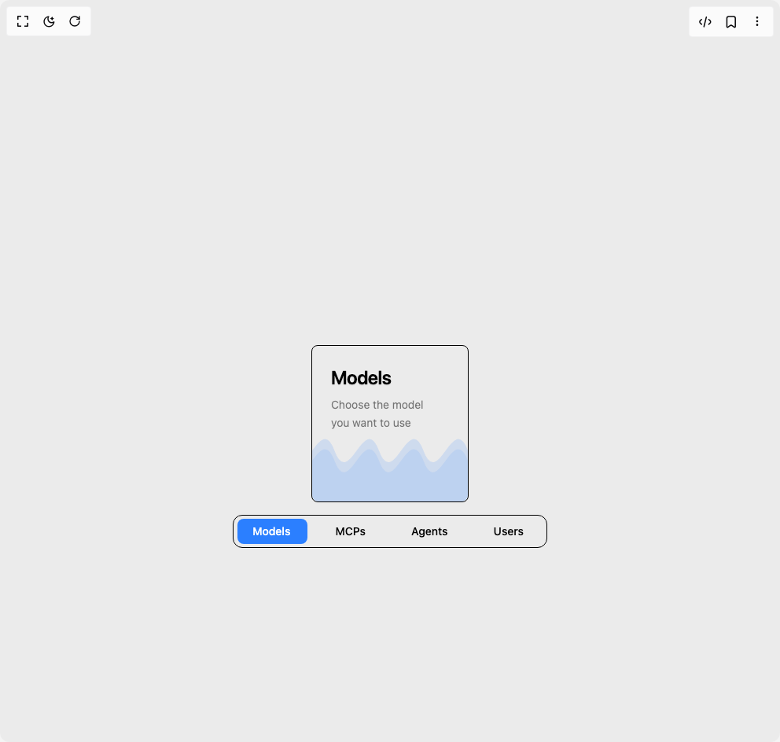
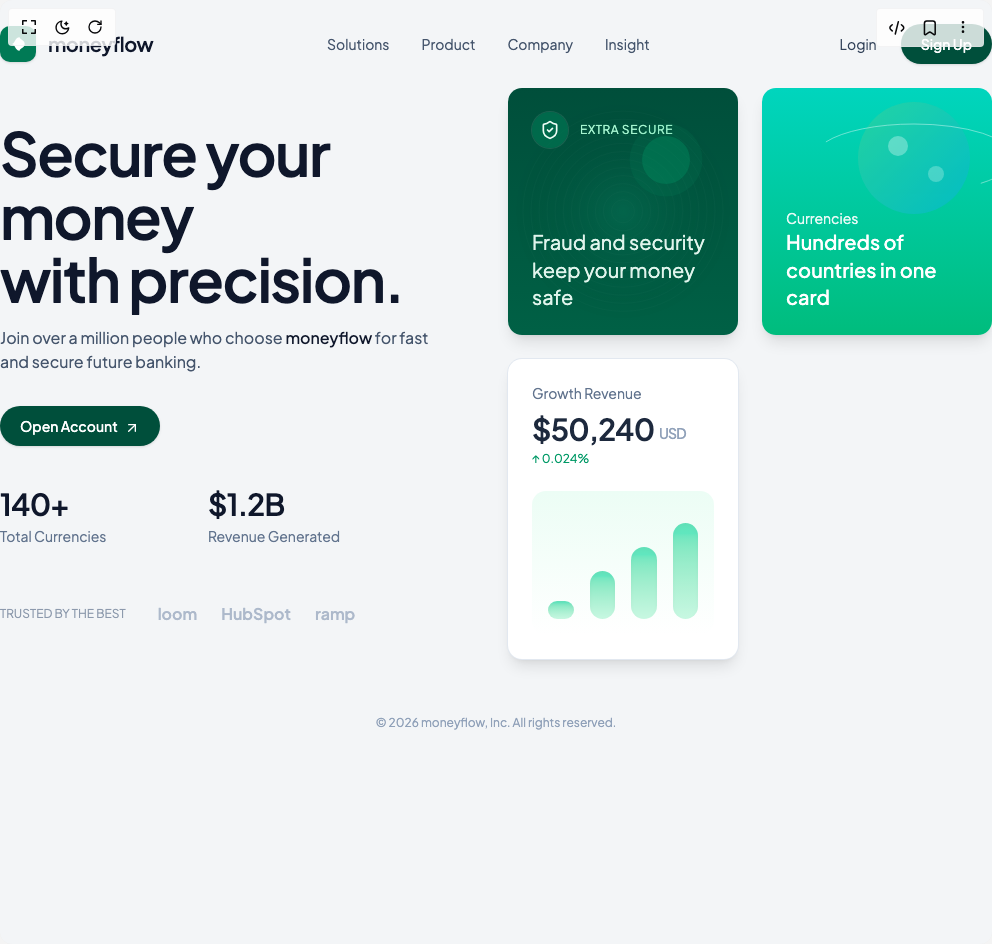
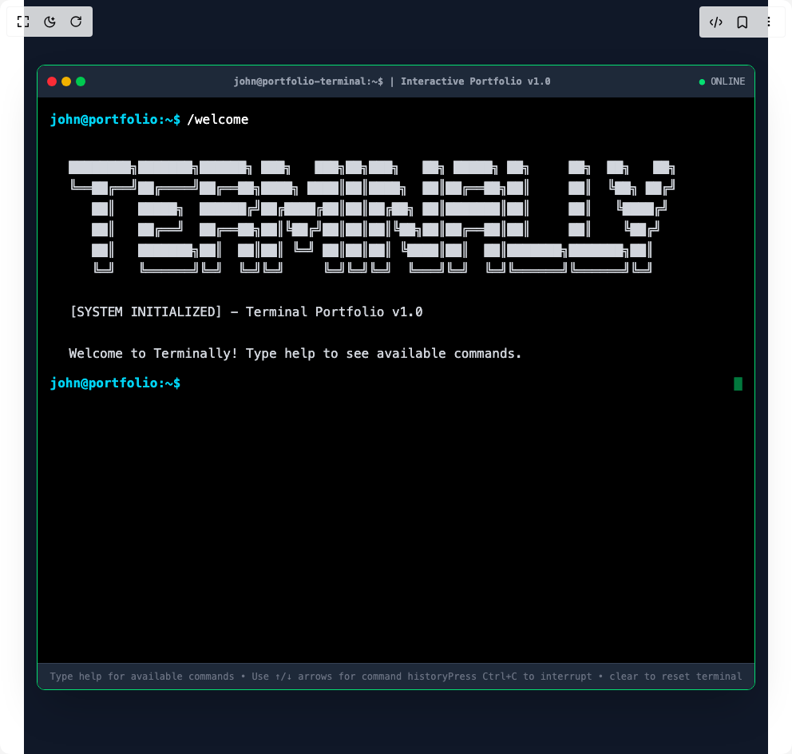

# Abhinavcdev Components

4 components are available in this author group.

> Build any component in [BuilderStudio](https://builderstudio.dev), then share improvements with the community on [Discord](https://discord.gg/QdWeSGCqfe) or [Reddit](https://reddit.com/r/builderstudio).

| Preview | Component | Variant |
| --- | --- | --- |
|  | [3d Sliding Cards](3d-sliding-cards/default/README.md) | `default` |
|  | [Animated Tab Card](animated-tab-card/default/README.md) | `default` |
|  | [Fin Tech Landing Page](fin-tech-landing-page/default/README.md) | `default` |
|  | [Interactive Portfolio Terminal Component](interactive-portfolio-terminal-component/default/README.md) | `default` |
