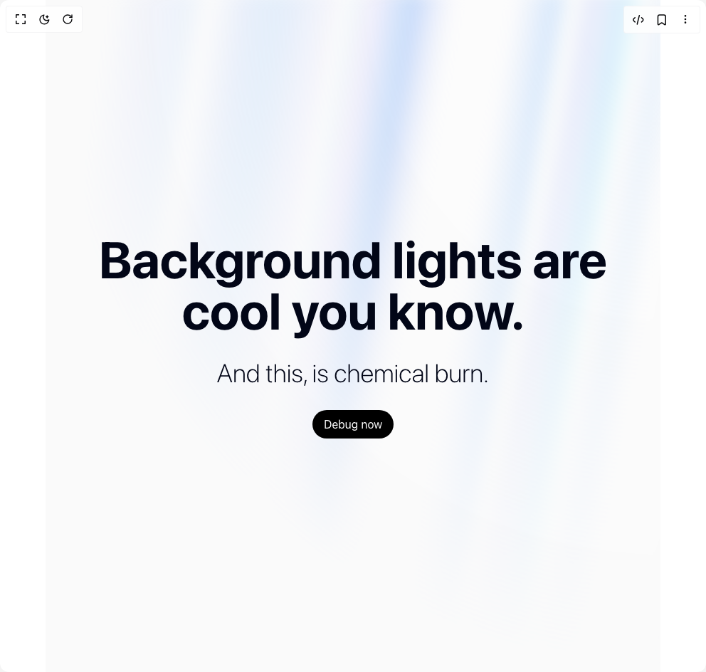

# Build Aurora Background in BuilderStudio

> Build this component in our Agentic IDE: [BuilderStudio](https://builderstudio.dev).
>
> Join the BuilderStudio community on [Discord](https://discord.gg/QdWeSGCqfe) and [Reddit](https://reddit.com/r/builderstudio).



## Component

- Author group: `aceternity`
- Component: `aurora-background`
- Variant: `default`
- Rendered HTML snapshot: [`rendered.html`](rendered.html)

## BuilderStudio prompt

You are implementing a React component based on a component reference.

## Component identity

- Author: aceternity
- Component slug: aurora-background
- Demo slug: default
- Title: aurora-background
- Description: 

## Goal

Recreate this component in a React + TypeScript + Tailwind CSS project. Preserve the visual layout, spacing, colors, border radius, shadows, interaction behavior, animation behavior, responsive behavior, and dark mode behavior shown in the rendered demo.

## Implementation requirements

- Use React and TypeScript.
- Use Tailwind CSS classes whenever possible.
- Keep the component self-contained unless the source files require helper components.
- If the source uses CSS variables, custom CSS, animations, or keyframes, include them.
- If the source uses external packages, list and use the required packages.
- Preserve accessibility attributes, button semantics, links, keyboard behavior, and ARIA attributes when visible in the source.
- Do not replace the component with a simplified placeholder.
- Return complete production-ready code.

## Dependencies

No reference metadata available.

## Rendered DOM snapshot

This is the rendered demo HTML extracted from the live preview. Use it to verify structure, class names, visible content, and layout.

```html
<div id="root"><div class="relative flex items-center justify-center h-screen w-full m-auto p-16 bg-background text-foreground"><div class="absolute lab-bg inset-0 size-full"><div class="absolute inset-0 bg-[radial-gradient(#00000021_1px,transparent_1px)] dark:bg-[radial-gradient(#ffffff22_1px,transparent_1px)]"></div></div><div class="flex w-full justify-center relative"><main><div class="relative flex flex-col h-[100vh] items-center justify-center bg-zinc-50 dark:bg-zinc-900 text-slate-950 transition-bg"><div class="absolute inset-0 overflow-hidden"><div class="[--white-gradient:repeating-linear-gradient(100deg,var(--white)_0%,var(--white)_7%,var(--transparent)_10%,var(--transparent)_12%,var(--white)_16%)] [--dark-gradient:repeating-linear-gradient(100deg,var(--black)_0%,var(--black)_7%,var(--transparent)_10%,var(--transparent)_12%,var(--black)_16%)] [--aurora:repeating-linear-gradient(100deg,var(--blue-500)_10%,var(--indigo-300)_15%,var(--blue-300)_20%,var(--violet-200)_25%,var(--blue-400)_30%)] [background-image:var(--white-gradient),var(--aurora)] dark:[background-image:var(--dark-gradient),var(--aurora)] [background-size:300%,_200%] [background-position:50%_50%,50%_50%] filter blur-[10px] invert dark:invert-0 after:content-[&quot;&quot;] after:absolute after:inset-0 after:[background-image:var(--white-gradient),var(--aurora)] after:dark:[background-image:var(--dark-gradient),var(--aurora)] after:[background-size:200%,_100%] after:animate-aurora after:[background-attachment:fixed] after:mix-blend-difference pointer-events-none absolute -inset-[10px] opacity-50 will-change-transform [mask-image:radial-gradient(ellipse_at_100%_0%,black_10%,var(--transparent)_70%)]"></div></div><div class="relative flex flex-col gap-4 items-center justify-center px-4" style="opacity: 1; transform: none;"><div class="text-3xl md:text-7xl font-bold dark:text-white text-center">Background lights are cool you know.</div><div class="font-extralight text-base md:text-4xl dark:text-neutral-200 py-4">And this, is chemical burn.</div><button class="bg-black dark:bg-white rounded-full w-fit text-white dark:text-black px-4 py-2">Debug now</button></div></div></main></div></div></div>
```

## Reference source files

No reference source files were available.
