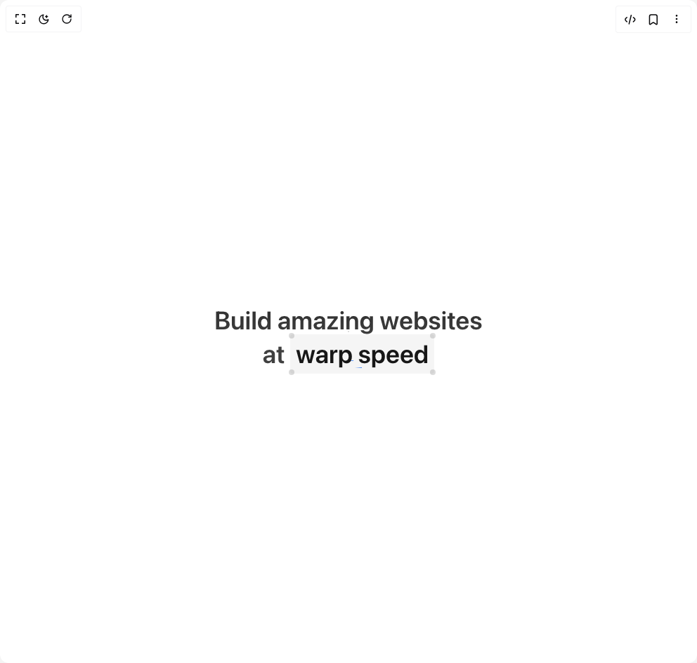

# Build Cover in BuilderStudio

> Build this component in our Agentic IDE: [BuilderStudio](https://builderstudio.dev).
>
> Join the BuilderStudio community on [Discord](https://discord.gg/QdWeSGCqfe) and [Reddit](https://reddit.com/r/builderstudio).



## Component

- Author group: `aceternity`
- Component: `cover`
- Variant: `default`
- Rendered HTML snapshot: [`rendered.html`](rendered.html)

## BuilderStudio prompt

You are implementing a React component based on a component reference.

## Component identity

- Author: aceternity
- Component slug: cover
- Demo slug: default
- Title: cover
- Description: 

## Goal

Recreate this component in a React + TypeScript + Tailwind CSS project. Preserve the visual layout, spacing, colors, border radius, shadows, interaction behavior, animation behavior, responsive behavior, and dark mode behavior shown in the rendered demo.

## Implementation requirements

- Use React and TypeScript.
- Use Tailwind CSS classes whenever possible.
- Keep the component self-contained unless the source files require helper components.
- If the source uses CSS variables, custom CSS, animations, or keyframes, include them.
- If the source uses external packages, list and use the required packages.
- Preserve accessibility attributes, button semantics, links, keyboard behavior, and ARIA attributes when visible in the source.
- Do not replace the component with a simplified placeholder.
- Return complete production-ready code.

## Dependencies

No reference metadata available.

## Rendered DOM snapshot

This is the rendered demo HTML extracted from the live preview. Use it to verify structure, class names, visible content, and layout.

```html
<div id="root"><div class="relative flex items-center justify-center h-screen w-full m-auto p-16 bg-background text-foreground"><div class="absolute lab-bg inset-0 size-full"><div class="absolute inset-0 bg-[radial-gradient(#00000021_1px,transparent_1px)] dark:bg-[radial-gradient(#ffffff22_1px,transparent_1px)]"></div></div><div class="flex w-full justify-center relative"><div><h1 class="text-4xl md:text-4xl lg:text-6xl font-semibold max-w-7xl mx-auto text-center mt-6 relative z-20 py-6 bg-clip-text text-transparent bg-gradient-to-b from-neutral-800 via-neutral-700 to-neutral-700 dark:from-neutral-800 dark:via-white dark:to-white">Build amazing websites <br> at <div class="relative hover:bg-neutral-900  group/cover inline-block dark:bg-neutral-900 bg-neutral-100 px-2 py-2  transition duration-200 rounded-sm"><svg width="205" height="1" viewBox="0 0 205 1" fill="none" xmlns="http://www.w3.org/2000/svg" class="absolute inset-x-0 w-full" style="top: 9.33333px;"><path d="M0 0.5H205" stroke="url(#svgGradient-«r0»)"></path><defs><linearGradient id="svgGradient-«r0»" gradientUnits="userSpaceOnUse" x1="110%" x2="105%" y1="0" y2="0"><stop stop-color="#2EB9DF" stop-opacity="0"></stop><stop stop-color="#3b82f6"></stop><stop offset="1" stop-color="#3b82f6" stop-opacity="0"></stop></linearGradient></defs></svg><svg width="205" height="1" viewBox="0 0 205 1" fill="none" xmlns="http://www.w3.org/2000/svg" class="absolute inset-x-0 w-full" style="top: 18.6667px;"><path d="M0 0.5H205" stroke="url(#svgGradient-«r1»)"></path><defs><linearGradient id="svgGradient-«r1»" gradientUnits="userSpaceOnUse" x1="110%" x2="105%" y1="0" y2="0"><stop stop-color="#2EB9DF" stop-opacity="0"></stop><stop stop-color="#3b82f6"></stop><stop offset="1" stop-color="#3b82f6" stop-opacity="0"></stop></linearGradient></defs></svg><svg width="205" height="1" viewBox="0 0 205 1" fill="none" xmlns="http://www.w3.org/2000/svg" class="absolute inset-x-0 w-full" style="top: 28px;"><path d="M0 0.5H205" stroke="url(#svgGradient-«r2»)"></path><defs><linearGradient id="svgGradient-«r2»" gradientUnits="userSpaceOnUse" x1="110%" x2="105%" y1="0" y2="0"><stop stop-color="#2EB9DF" stop-opacity="0"></stop><stop stop-color="#3b82f6"></stop><stop offset="1" stop-color="#3b82f6" stop-opacity="0"></stop></linearGradient></defs></svg><svg width="205" height="1" viewBox="0 0 205 1" fill="none" xmlns="http://www.w3.org/2000/svg" class="absolute inset-x-0 w-full" style="top: 37.3333px;"><path d="M0 0.5H205" stroke="url(#svgGradient-«r3»)"></path><defs><linearGradient id="svgGradient-«r3»" gradientUnits="userSpaceOnUse" x1="41.41814%" x2="36.41814%" y1="0" y2="0"><stop stop-color="#2EB9DF" stop-opacity="0"></stop><stop stop-color="#3b82f6"></stop><stop offset="1" stop-color="#3b82f6" stop-opacity="0"></stop></linearGradient></defs></svg><svg width="205" height="1" viewBox="0 0 205 1" fill="none" xmlns="http://www.w3.org/2000/svg" class="absolute inset-x-0 w-full" style="top: 46.6667px;"><path d="M0 0.5H205" stroke="url(#svgGradient-«r4»)"></path><defs><linearGradient id="svgGradient-«r4»" gradientUnits="userSpaceOnUse" x1="48.08413%" x2="43.08413%" y1="0" y2="0"><stop stop-color="#2EB9DF" stop-opacity="0"></stop><stop stop-color="#3b82f6"></stop><stop offset="1" stop-color="#3b82f6" stop-opacity="0"></stop></linearGradient></defs></svg><span class="dark:text-white inline-block text-neutral-900 relative z-20 group-hover/cover:text-white transition duration-200" style="transform: none;">warp speed</span><div class="pointer-events-none animate-pulse group-hover/cover:hidden group-hover/cover:opacity-100 group h-2 w-2 rounded-full bg-neutral-600 dark:bg-white opacity-20 group-hover/cover:bg-white absolute -right-[2px] -top-[2px]"></div><div class="pointer-events-none animate-pulse group-hover/cover:hidden group-hover/cover:opacity-100 group h-2 w-2 rounded-full bg-neutral-600 dark:bg-white opacity-20 group-hover/cover:bg-white absolute -bottom-[2px] -right-[2px]"></div><div class="pointer-events-none animate-pulse group-hover/cover:hidden group-hover/cover:opacity-100 group h-2 w-2 rounded-full bg-neutral-600 dark:bg-white opacity-20 group-hover/cover:bg-white absolute -left-[2px] -top-[2px]"></div><div class="pointer-events-none animate-pulse group-hover/cover:hidden group-hover/cover:opacity-100 group h-2 w-2 rounded-full bg-neutral-600 dark:bg-white opacity-20 group-hover/cover:bg-white absolute -bottom-[2px] -left-[2px]"></div></div></h1></div></div></div></div>
```

## Reference source files

No reference source files were available.
