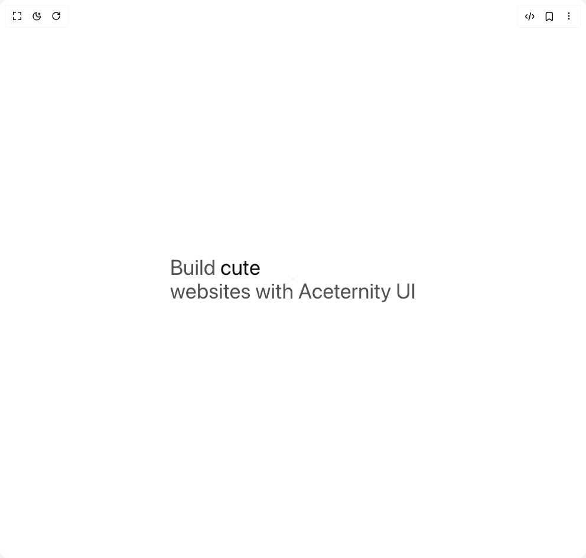

# Build Flip Words in BuilderStudio

> Build this component in our Agentic IDE: [BuilderStudio](https://builderstudio.dev).
>
> Join the BuilderStudio community on [Discord](https://discord.gg/QdWeSGCqfe) and [Reddit](https://reddit.com/r/builderstudio).



## Component

- Author group: `aceternity`
- Component: `flip-words`
- Variant: `default`
- Rendered HTML snapshot: [`rendered.html`](rendered.html)

## BuilderStudio prompt

You are implementing a React component based on a component reference.

## Component identity

- Author: aceternity
- Component slug: flip-words
- Demo slug: default
- Title: flip-words
- Description: 

## Goal

Recreate this component in a React + TypeScript + Tailwind CSS project. Preserve the visual layout, spacing, colors, border radius, shadows, interaction behavior, animation behavior, responsive behavior, and dark mode behavior shown in the rendered demo.

## Implementation requirements

- Use React and TypeScript.
- Use Tailwind CSS classes whenever possible.
- Keep the component self-contained unless the source files require helper components.
- If the source uses CSS variables, custom CSS, animations, or keyframes, include them.
- If the source uses external packages, list and use the required packages.
- Preserve accessibility attributes, button semantics, links, keyboard behavior, and ARIA attributes when visible in the source.
- Do not replace the component with a simplified placeholder.
- Return complete production-ready code.

## Dependencies

No reference metadata available.

## Rendered DOM snapshot

This is the rendered demo HTML extracted from the live preview. Use it to verify structure, class names, visible content, and layout.

```html
<div id="root"><div class="relative flex items-center justify-center h-screen w-full m-auto p-16 bg-background text-foreground"><div class="absolute lab-bg inset-0 size-full"><div class="absolute inset-0 bg-[radial-gradient(#00000021_1px,transparent_1px)] dark:bg-[radial-gradient(#ffffff22_1px,transparent_1px)]"></div></div><div class="flex w-full justify-center relative"><div class="h-[40rem] flex justify-center items-center px-4"><div class="text-4xl mx-auto font-normal text-neutral-600 dark:text-neutral-400">Build<div class="z-10 inline-block relative text-left text-foreground px-2" style="opacity: 1; transform: none;"><span class="inline-block whitespace-nowrap" style="opacity: 1; filter: blur(0px); transform: none;"><span class="inline-block" style="opacity: 1; filter: blur(0px); transform: none;">c</span><span class="inline-block" style="opacity: 1; filter: blur(0px); transform: none;">u</span><span class="inline-block" style="opacity: 1; filter: blur(0px); transform: none;">t</span><span class="inline-block" style="opacity: 1; filter: blur(0px); transform: none;">e</span><span class="inline-block">&nbsp;</span></span></div> <br>websites with Aceternity UI</div></div></div></div></div>
```

## Reference source files

No reference source files were available.
