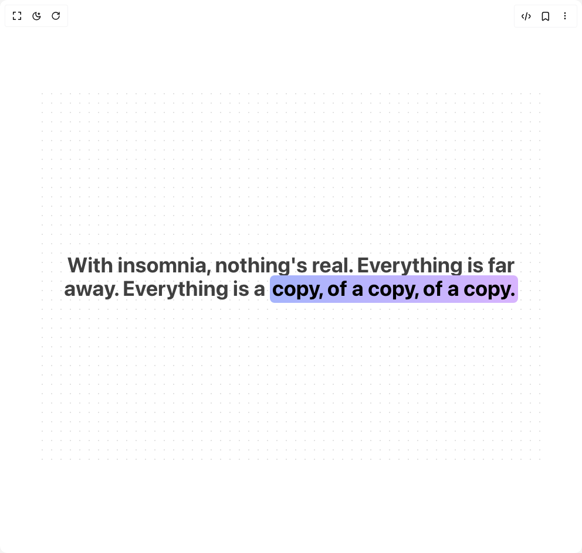

# Build Hero Highlight in BuilderStudio

> Build this component in our Agentic IDE: [BuilderStudio](https://builderstudio.dev).
>
> Join the BuilderStudio community on [Discord](https://discord.gg/QdWeSGCqfe) and [Reddit](https://reddit.com/r/builderstudio).



## Component

- Author group: `aceternity`
- Component: `hero-highlight`
- Variant: `default`
- Rendered HTML snapshot: [`rendered.html`](rendered.html)

## BuilderStudio prompt

You are implementing a React component based on a component reference.

## Component identity

- Author: aceternity
- Component slug: hero-highlight
- Demo slug: default
- Title: hero-highlight
- Description: 

## Goal

Recreate this component in a React + TypeScript + Tailwind CSS project. Preserve the visual layout, spacing, colors, border radius, shadows, interaction behavior, animation behavior, responsive behavior, and dark mode behavior shown in the rendered demo.

## Implementation requirements

- Use React and TypeScript.
- Use Tailwind CSS classes whenever possible.
- Keep the component self-contained unless the source files require helper components.
- If the source uses CSS variables, custom CSS, animations, or keyframes, include them.
- If the source uses external packages, list and use the required packages.
- Preserve accessibility attributes, button semantics, links, keyboard behavior, and ARIA attributes when visible in the source.
- Do not replace the component with a simplified placeholder.
- Return complete production-ready code.

## Dependencies

No reference metadata available.

## Rendered DOM snapshot

This is the rendered demo HTML extracted from the live preview. Use it to verify structure, class names, visible content, and layout.

```html
<div id="root"><div class="relative flex items-center justify-center h-screen w-full m-auto p-16 bg-background text-foreground"><div class="absolute lab-bg inset-0 size-full"><div class="absolute inset-0 bg-[radial-gradient(#00000021_1px,transparent_1px)] dark:bg-[radial-gradient(#ffffff22_1px,transparent_1px)]"></div></div><div class="flex w-full justify-center relative"><div class="relative h-[40rem] flex items-center bg-white dark:bg-black justify-center w-full group"><div class="absolute inset-0 pointer-events-none opacity-70" style="background-image: radial-gradient(circle, rgb(212, 212, 212) 1px, transparent 1px); background-size: 16px 16px;"></div><div class="absolute inset-0 dark:opacity-70 opacity-0 pointer-events-none" style="background-image: radial-gradient(circle, rgb(38, 38, 38) 1px, transparent 1px); background-size: 16px 16px;"></div><div class="pointer-events-none absolute inset-0 opacity-0 transition duration-300 group-hover:opacity-100" style="background-image: radial-gradient(circle, rgb(99, 102, 241) 1px, transparent 1px); background-size: 16px 16px; mask-image: radial-gradient(200px at 0px 0px, black 0%, transparent 100%);"></div><div class="relative z-20"><h1 class="text-2xl px-4 md:text-4xl lg:text-5xl font-bold text-neutral-700 dark:text-white max-w-4xl leading-relaxed lg:leading-snug text-center mx-auto " style="opacity: 1; transform: none;">With insomnia, nothing's real. Everything is far away. Everything is a <span class="relative inline-block pb-1 px-1 rounded-lg bg-gradient-to-r from-indigo-300 to-purple-300 dark:from-indigo-500 dark:to-purple-500 text-black dark:text-white" style="background-repeat: no-repeat; background-position: left center; display: inline; background-size: 100% 100%;">copy, of a copy, of a copy.</span></h1></div></div></div></div></div>
```

## Reference source files

No reference source files were available.
