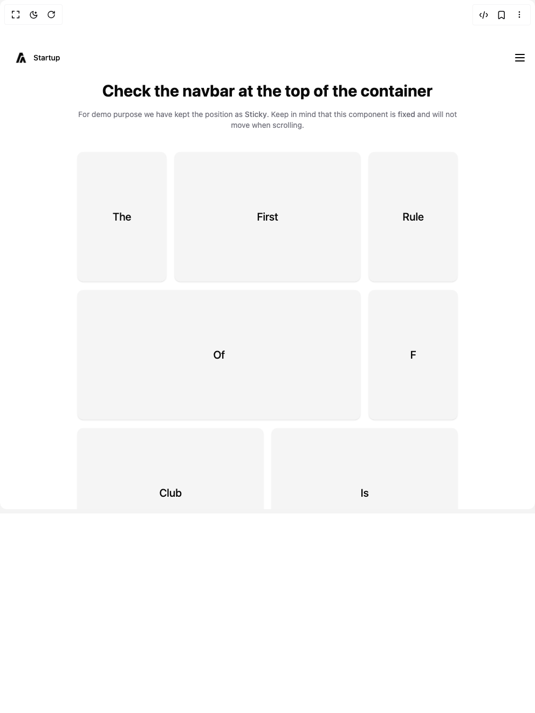

# Build Resizable Navbar in BuilderStudio

> Build this component in our Agentic IDE: [BuilderStudio](https://builderstudio.dev).
>
> Join the BuilderStudio community on [Discord](https://discord.gg/QdWeSGCqfe) and [Reddit](https://reddit.com/r/builderstudio).



## Component

- Author group: `aceternity`
- Component: `resizable-navbar`
- Variant: `default`
- Rendered HTML snapshot: [`rendered.html`](rendered.html)

## BuilderStudio prompt

You are implementing a React component based on a component reference.

## Component identity

- Author: aceternity
- Component slug: resizable-navbar
- Demo slug: default
- Title: resizable-navbar
- Description: 

## Goal

Recreate this component in a React + TypeScript + Tailwind CSS project. Preserve the visual layout, spacing, colors, border radius, shadows, interaction behavior, animation behavior, responsive behavior, and dark mode behavior shown in the rendered demo.

## Implementation requirements

- Use React and TypeScript.
- Use Tailwind CSS classes whenever possible.
- Keep the component self-contained unless the source files require helper components.
- If the source uses CSS variables, custom CSS, animations, or keyframes, include them.
- If the source uses external packages, list and use the required packages.
- Preserve accessibility attributes, button semantics, links, keyboard behavior, and ARIA attributes when visible in the source.
- Do not replace the component with a simplified placeholder.
- Return complete production-ready code.

## Dependencies

No reference metadata available.

## Rendered DOM snapshot

This is the rendered demo HTML extracted from the live preview. Use it to verify structure, class names, visible content, and layout.

```html
<div id="root"><div class="w-screen min-h-screen flex justify-center items-center"><div class="w-screen min-h-screen flex justify-center items-center"><div class="relative w-full"><div class="sticky inset-x-0 top-20 z-40 w-full"><div class="relative z-[60] mx-auto hidden w-full max-w-7xl flex-row items-center justify-between self-start rounded-full bg-transparent px-4 py-2 lg:flex dark:bg-transparent" style="min-width: 800px; backdrop-filter: none; box-shadow: none; width: 100%; transform: none;"><a href="#" class="relative z-20 mr-4 flex items-center space-x-2 px-2 py-1 text-sm font-normal text-black"><span class="font-medium text-black dark:text-white">Startup</span></a><div class="absolute inset-0 hidden flex-1 flex-row items-center justify-center space-x-2 text-sm font-medium text-zinc-600 transition duration-200 hover:text-zinc-800 lg:flex lg:space-x-2"><a class="relative px-4 py-2 text-neutral-600 dark:text-neutral-300" href="#features"><span class="relative z-20">Features</span></a><a class="relative px-4 py-2 text-neutral-600 dark:text-neutral-300" href="#pricing"><span class="relative z-20">Pricing</span></a><a class="relative px-4 py-2 text-neutral-600 dark:text-neutral-300" href="#contact"><span class="relative z-20">Contact</span></a></div><div class="flex items-center gap-4"><a class="px-4 py-2 rounded-md button text-black text-sm font-bold relative cursor-pointer hover:-translate-y-0.5 transition duration-200 inline-block text-center bg-transparent shadow-none dark:text-white">Login</a><a class="px-4 py-2 rounded-md button bg-white text-black text-sm font-bold relative cursor-pointer hover:-translate-y-0.5 transition duration-200 inline-block text-center shadow-[0_0_24px_rgba(34,_42,_53,_0.06),_0_1px_1px_rgba(0,_0,_0,_0.05),_0_0_0_1px_rgba(34,_42,_53,_0.04),_0_0_4px_rgba(34,_42,_53,_0.08),_0_16px_68px_rgba(47,_48,_55,_0.05),_0_1px_0_rgba(255,_255,_255,_0.1)_inset]">Book a call</a></div></div><div class="relative z-50 mx-auto flex w-full max-w-[calc(100vw-2rem)] flex-col items-center justify-between bg-transparent px-0 py-2 lg:hidden" style="backdrop-filter: none; box-shadow: none; width: 100%; padding-right: 0px; padding-left: 0px; border-radius: 2rem; transform: none;"><div class="flex w-full flex-row items-center justify-between"><a href="#" class="relative z-20 mr-4 flex items-center space-x-2 px-2 py-1 text-sm font-normal text-black"><span class="font-medium text-black dark:text-white">Startup</span></a><svg xmlns="http://www.w3.org/2000/svg" width="24" height="24" viewBox="0 0 24 24" fill="none" stroke="currentColor" stroke-width="2" stroke-linecap="round" stroke-linejoin="round" class="tabler-icon tabler-icon-menu-2 text-black dark:text-white"><path d="M4 6l16 0"></path><path d="M4 12l16 0"></path><path d="M4 18l16 0"></path></svg></div></div></div><div class="container mx-auto p-8 pt-24"><h1 class="mb-4 text-center text-3xl font-bold">Check the navbar at the top of the container</h1><p class="mb-10 text-center text-sm text-zinc-500">For demo purpose we have kept the position as <span class="font-medium">Sticky</span>. Keep in mind that this component is <span class="font-medium">fixed</span> and will not move when scrolling.</p><div class="grid grid-cols-1 gap-4 md:grid-cols-4"><div class="md:col-span-1 h-60 bg-neutral-100 dark:bg-neutral-800 flex items-center justify-center rounded-lg p-4 shadow-sm"><h2 class="text-xl font-medium">The</h2></div><div class="md:col-span-2 h-60 bg-neutral-100 dark:bg-neutral-800 flex items-center justify-center rounded-lg p-4 shadow-sm"><h2 class="text-xl font-medium">First</h2></div><div class="md:col-span-1 h-60 bg-neutral-100 dark:bg-neutral-800 flex items-center justify-center rounded-lg p-4 shadow-sm"><h2 class="text-xl font-medium">Rule</h2></div><div class="md:col-span-3 h-60 bg-neutral-100 dark:bg-neutral-800 flex items-center justify-center rounded-lg p-4 shadow-sm"><h2 class="text-xl font-medium">Of</h2></div><div class="md:col-span-1 h-60 bg-neutral-100 dark:bg-neutral-800 flex items-center justify-center rounded-lg p-4 shadow-sm"><h2 class="text-xl font-medium">F</h2></div><div class="md:col-span-2 h-60 bg-neutral-100 dark:bg-neutral-800 flex items-center justify-center rounded-lg p-4 shadow-sm"><h2 class="text-xl font-medium">Club</h2></div><div class="md:col-span-2 h-60 bg-neutral-100 dark:bg-neutral-800 flex items-center justify-center rounded-lg p-4 shadow-sm"><h2 class="text-xl font-medium">Is</h2></div><div class="md:col-span-1 h-60 bg-neutral-100 dark:bg-neutral-800 flex items-center justify-center rounded-lg p-4 shadow-sm"><h2 class="text-xl font-medium">You</h2></div><div class="md:col-span-2 h-60 bg-neutral-100 dark:bg-neutral-800 flex items-center justify-center rounded-lg p-4 shadow-sm"><h2 class="text-xl font-medium">Do NOT TALK about</h2></div><div class="md:col-span-1 h-60 bg-neutral-100 dark:bg-neutral-800 flex items-center justify-center rounded-lg p-4 shadow-sm"><h2 class="text-xl font-medium">F Club</h2></div></div></div></div></div></div></div>
```

## Reference source files

No reference source files were available.
