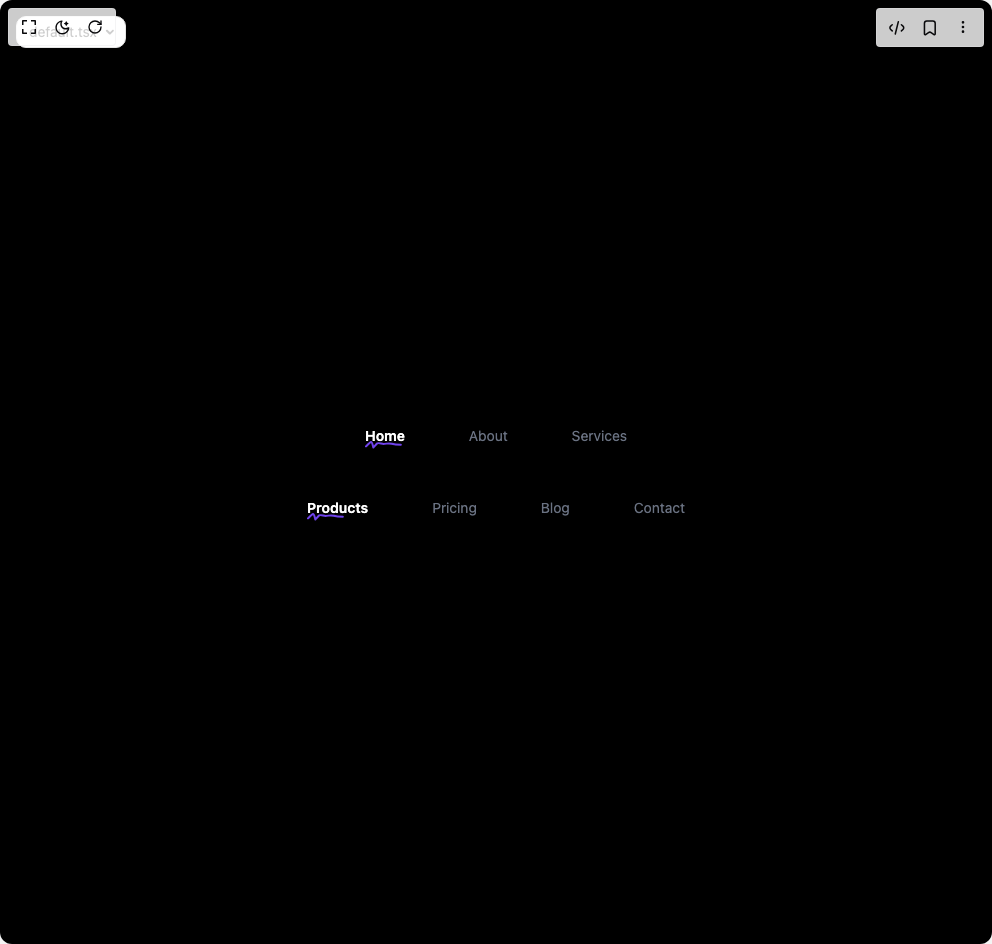

# Build Squiggly Underline in BuilderStudio

> Build this component in our Agentic IDE: [BuilderStudio](https://builderstudio.dev).
>
> Join the BuilderStudio community on [Discord](https://discord.gg/QdWeSGCqfe) and [Reddit](https://reddit.com/r/builderstudio).



## Component

- Author group: `aceternity`
- Component: `squiggly-underline`
- Variant: `default`
- Rendered HTML snapshot: [`rendered.html`](rendered.html)

## BuilderStudio prompt

You are implementing a React component based on a component reference.

## Component identity

- Author: aceternity
- Component slug: squiggly-underline
- Demo slug: default
- Title: squiggly-underline
- Description: 

## Goal

Recreate this component in a React + TypeScript + Tailwind CSS project. Preserve the visual layout, spacing, colors, border radius, shadows, interaction behavior, animation behavior, responsive behavior, and dark mode behavior shown in the rendered demo.

## Implementation requirements

- Use React and TypeScript.
- Use Tailwind CSS classes whenever possible.
- Keep the component self-contained unless the source files require helper components.
- If the source uses CSS variables, custom CSS, animations, or keyframes, include them.
- If the source uses external packages, list and use the required packages.
- Preserve accessibility attributes, button semantics, links, keyboard behavior, and ARIA attributes when visible in the source.
- Do not replace the component with a simplified placeholder.
- Return complete production-ready code.

## Dependencies

No reference metadata available.

## Rendered DOM snapshot

This is the rendered demo HTML extracted from the live preview. Use it to verify structure, class names, visible content, and layout.

```html
<div id="root"><div class="w-screen min-h-screen flex justify-center items-center"><div class="fixed top-4 left-4 z-10"><select class="appearance-none h-8 max-w-[200px] text-sm leading-tight rounded-lg pl-3 pr-7 py-0 border bg-background focus:outline-none focus:ring-0"><option value="default.tsx_SquigglyUnderlineDemo">default.tsx</option></select><div class="absolute top-1/2 transform -translate-y-1/2 right-2 pointer-events-none"><svg class="w-4 h-4 fill-current" viewBox="0 0 20 20"><path d="M5.516 7.548c.436-.446 1.043-.48 1.576 0L10 10.405l2.908-2.857c.533-.48 1.14-.446 1.576 0 .436.445.408 1.197 0 1.615l-3.734 3.705c-.533.534-1.39.534-1.923 0l-3.734-3.705c-.408-.418-.436-1.17 0-1.615z"></path></svg></div></div><div class="w-screen min-h-screen flex justify-center items-center"><div class="flex items-center justify-center w-full min-h-screen bg-black p-8"><div class="flex flex-col items-center gap-12"><div class="flex gap-16"><a href="#" class="relative text-sm leading-6 no-underline font-semibold text-white">Home<div class="absolute -bottom-[1px] left-0 right-0 h-[8px]" style="opacity: 1;"><svg width="37" height="8" viewBox="0 0 37 8" fill="none"><path d="M1 5.39971C7.48565 -1.08593 6.44837 -0.12827 8.33643 6.47992C8.34809 6.52075 11.6019 2.72875 12.3422 2.33912C13.8991 1.5197 16.6594 2.96924 18.3734 2.96924C21.665 2.96924 23.1972 1.69759 26.745 2.78921C29.7551 3.71539 32.6954 3.7794 35.8368 3.7794" stroke="#7043EC" stroke-width="2" stroke-linecap="round" stroke-linejoin="round" stroke-dasharray="84.20591735839844" stroke-dashoffset="0"></path></svg></div></a><a href="#" class="relative text-sm leading-6 no-underline text-gray-500 hover:text-gray-300">About</a><a href="#" class="relative text-sm leading-6 no-underline text-gray-500 hover:text-gray-300">Services</a></div><div class="flex gap-16"><a href="#" class="relative text-sm leading-6 no-underline font-semibold text-white">Products<div class="absolute -bottom-[1px] left-0 right-0 h-[8px]" style="opacity: 1;"><svg width="37" height="8" viewBox="0 0 37 8" fill="none"><path d="M1 5.39971C7.48565 -1.08593 6.44837 -0.12827 8.33643 6.47992C8.34809 6.52075 11.6019 2.72875 12.3422 2.33912C13.8991 1.5197 16.6594 2.96924 18.3734 2.96924C21.665 2.96924 23.1972 1.69759 26.745 2.78921C29.7551 3.71539 32.6954 3.7794 35.8368 3.7794" stroke="#7043EC" stroke-width="2" stroke-linecap="round" stroke-linejoin="round" stroke-dasharray="84.20591735839844" stroke-dashoffset="0"></path></svg></div></a><a href="#" class="relative text-sm leading-6 no-underline text-gray-500 hover:text-gray-300">Pricing</a><a href="#" class="relative text-sm leading-6 no-underline text-gray-500 hover:text-gray-300">Blog</a><a href="#" class="relative text-sm leading-6 no-underline text-gray-500 hover:text-gray-300">Contact</a></div></div></div></div></div></div>
```

## Reference source files

No reference source files were available.
