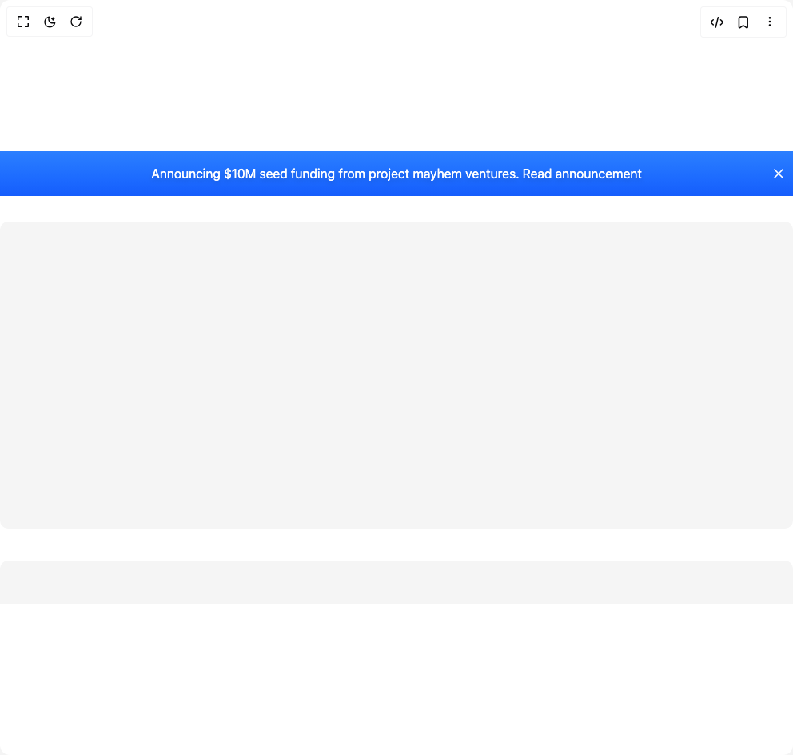

# Build Sticky Banner in BuilderStudio

> Build this component in our Agentic IDE: [BuilderStudio](https://builderstudio.dev).
>
> Join the BuilderStudio community on [Discord](https://discord.gg/QdWeSGCqfe) and [Reddit](https://reddit.com/r/builderstudio).



## Component

- Author group: `aceternity`
- Component: `sticky-banner`
- Variant: `default`
- Rendered HTML snapshot: [`rendered.html`](rendered.html)

## BuilderStudio prompt

You are implementing a React component based on a component reference.

## Component identity

- Author: aceternity
- Component slug: sticky-banner
- Demo slug: default
- Title: sticky-banner
- Description: 

## Goal

Recreate this component in a React + TypeScript + Tailwind CSS project. Preserve the visual layout, spacing, colors, border radius, shadows, interaction behavior, animation behavior, responsive behavior, and dark mode behavior shown in the rendered demo.

## Implementation requirements

- Use React and TypeScript.
- Use Tailwind CSS classes whenever possible.
- Keep the component self-contained unless the source files require helper components.
- If the source uses CSS variables, custom CSS, animations, or keyframes, include them.
- If the source uses external packages, list and use the required packages.
- Preserve accessibility attributes, button semantics, links, keyboard behavior, and ARIA attributes when visible in the source.
- Do not replace the component with a simplified placeholder.
- Return complete production-ready code.

## Dependencies

No reference metadata available.

## Rendered DOM snapshot

This is the rendered demo HTML extracted from the live preview. Use it to verify structure, class names, visible content, and layout.

```html
<div id="root"><div class="w-screen min-h-screen flex justify-center items-center"><div class="w-screen min-h-screen flex justify-center items-center"><div class="relative flex h-[60vh] w-full flex-col overflow-y-auto"><div class="sticky inset-x-0 top-0 z-40 flex min-h-14 w-full items-center justify-center px-4 py-1 bg-gradient-to-b from-blue-500 to-blue-600" style="opacity: 1; transform: none;"><p class="mx-0 max-w-[90%] text-white drop-shadow-md">Announcing $10M seed funding from project mayhem ventures. <a href="#" class="transition duration-200 hover:underline">Read announcement</a></p><button class="absolute top-1/2 right-2 -translate-y-1/2 cursor-pointer" style="transform: none;"><svg xmlns="http://www.w3.org/2000/svg" width="24" height="24" viewBox="0 0 24 24" fill="none" stroke="currentColor" stroke-width="2" stroke-linecap="round" stroke-linejoin="round" class="h-5 w-5 text-white"><path stroke="none" d="M0 0h24v24H0z" fill="none"></path><path d="M18 6l-12 12"></path><path d="M6 6l12 12"></path></svg></button></div><div class="relative mx-auto flex w-full max-w-7xl flex-col gap-10 py-8"><div class="h-96 w-full animate-pulse rounded-lg bg-neutral-100 dark:bg-neutral-800"></div><div class="h-96 w-full animate-pulse rounded-lg bg-neutral-100 dark:bg-neutral-800"></div><div class="h-96 w-full animate-pulse rounded-lg bg-neutral-100 dark:bg-neutral-800"></div></div></div></div></div></div>
```

## Reference source files

No reference source files were available.
