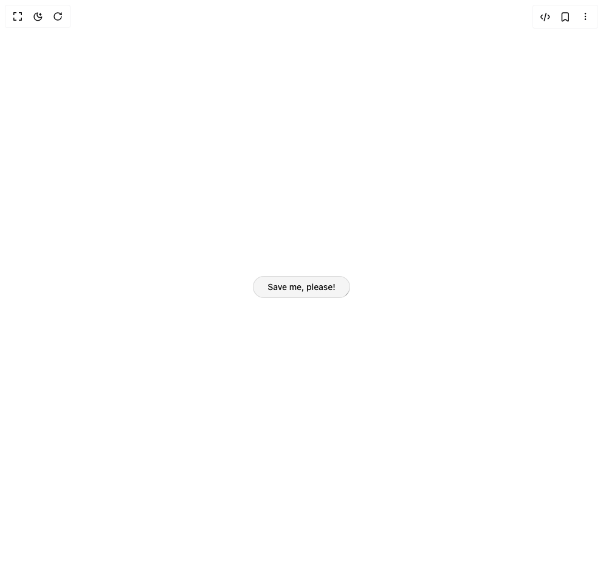

# Build Save Button in BuilderStudio

> Build this component in our Agentic IDE: [BuilderStudio](https://builderstudio.dev).
>
> Join the BuilderStudio community on [Discord](https://discord.gg/QdWeSGCqfe) and [Reddit](https://reddit.com/r/builderstudio).



## Component

- Author group: `adurotimi`
- Component: `save-button`
- Variant: `default`
- Rendered HTML snapshot: [`rendered.html`](rendered.html)

## BuilderStudio prompt

You are implementing a React component based on a component reference.

## Component identity

- Author: Adurotimi
- Component slug: save-button
- Demo slug: default
- Title: save-button
- Description: 

## Goal

Recreate this component in a React + TypeScript + Tailwind CSS project. Preserve the visual layout, spacing, colors, border radius, shadows, interaction behavior, animation behavior, responsive behavior, and dark mode behavior shown in the rendered demo.

## Implementation requirements

- Use React and TypeScript.
- Use Tailwind CSS classes whenever possible.
- Keep the component self-contained unless the source files require helper components.
- If the source uses CSS variables, custom CSS, animations, or keyframes, include them.
- If the source uses external packages, list and use the required packages.
- Preserve accessibility attributes, button semantics, links, keyboard behavior, and ARIA attributes when visible in the source.
- Do not replace the component with a simplified placeholder.
- Return complete production-ready code.

## Dependencies

No reference metadata available.

## Rendered DOM snapshot

This is the rendered demo HTML extracted from the live preview. Use it to verify structure, class names, visible content, and layout.

```html
<div id="root"><div class="relative flex items-center justify-center h-screen w-full m-auto p-16 bg-background text-foreground"><div class="absolute lab-bg inset-0 size-full"><div class="absolute inset-0 bg-[radial-gradient(#00000021_1px,transparent_1px)] dark:bg-[radial-gradient(#ffffff22_1px,transparent_1px)]"></div></div><div class="flex w-full justify-center relative"><div class="relative"><button class="group relative grid overflow-hidden rounded-full px-6 py-2 transition-all duration-200 shadow-[0_1000px_0_0_hsl(0_0%_85%)_inset] dark:shadow-[0_1000px_0_0_hsl(0_0%_20%)_inset] hover:shadow-lg" tabindex="0" style="min-width: 150px; transform: none; background-color: rgb(243, 244, 246); color: black;"><span><span class="spark mask-gradient absolute inset-0 h-[100%] w-[100%] animate-flip overflow-hidden rounded-full [mask:linear-gradient(black,_transparent_50%)] before:absolute before:aspect-square before:w-[200%] before:bg-[conic-gradient(from_0deg,transparent_0_340deg,black_360deg)] before:rotate-[-90deg] before:animate-rotate dark:before:bg-[conic-gradient(from_0deg,transparent_0_340deg,white_360deg)] before:content-[''] before:[inset:0_auto_auto_50%] before:[translate:-50%_-15%] dark:[mask:linear-gradient(white,_transparent_50%)]"></span></span><span class="backdrop absolute inset-px rounded-[22px] transition-colors duration-200 bg-neutral-100 group-hover:bg-neutral-200 dark:bg-neutral-950 dark:group-hover:bg-neutral-900"></span><span class="z-10 flex items-center justify-center gap-2 text-sm font-medium"><span style="opacity: 1; transform: none;">Save me, please!</span></span></button></div></div></div></div>
```

## Reference source files

No reference source files were available.
