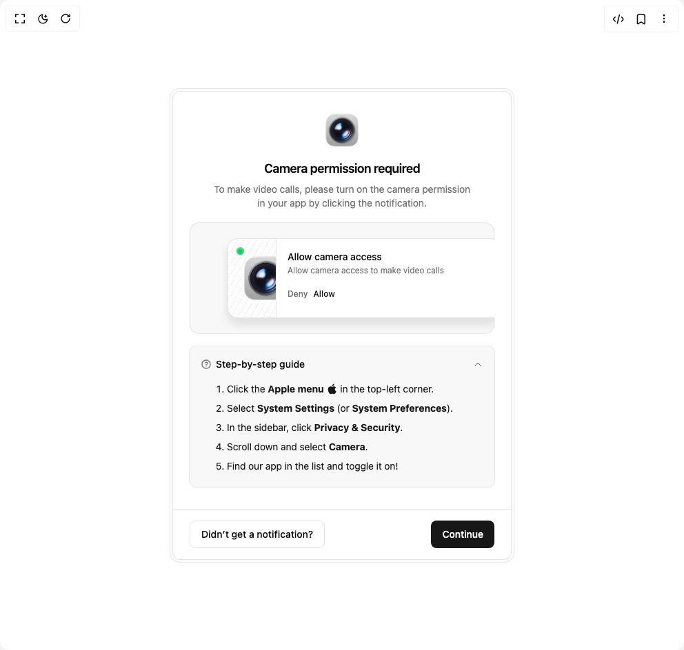

# Build Camera Permission Request Card in BuilderStudio

> Build this component in our Agentic IDE: [BuilderStudio](https://builderstudio.dev).
>
> Join the BuilderStudio community on [Discord](https://discord.gg/QdWeSGCqfe) and [Reddit](https://reddit.com/r/builderstudio).



## Component

- Author group: `ahmedmayara`
- Component: `camera-permission-request-card`
- Variant: `default`
- Rendered HTML snapshot: [`rendered.html`](rendered.html)

## BuilderStudio prompt

You are implementing a React component based on a component reference.

## Component identity

- Author: ahmedmayara
- Component slug: camera-permission-request-card
- Demo slug: default
- Title: camera-permission-request-card
- Description: 

## Goal

Recreate this component in a React + TypeScript + Tailwind CSS project. Preserve the visual layout, spacing, colors, border radius, shadows, interaction behavior, animation behavior, responsive behavior, and dark mode behavior shown in the rendered demo.

## Implementation requirements

- Use React and TypeScript.
- Use Tailwind CSS classes whenever possible.
- Keep the component self-contained unless the source files require helper components.
- If the source uses CSS variables, custom CSS, animations, or keyframes, include them.
- If the source uses external packages, list and use the required packages.
- Preserve accessibility attributes, button semantics, links, keyboard behavior, and ARIA attributes when visible in the source.
- Do not replace the component with a simplified placeholder.
- Return complete production-ready code.

## Dependencies

No reference metadata available.

## Rendered DOM snapshot

This is the rendered demo HTML extracted from the live preview. Use it to verify structure, class names, visible content, and layout.

```html
<div id="root"><div class="w-screen min-h-screen flex justify-center items-center"><div class="w-screen min-h-screen flex justify-center items-center"><div class="border text-card-foreground flex w-full max-w-[500px] flex-col rounded-[14px] bg-muted/40 p-[4px] shadow-none"><div class="relative flex flex-col items-center justify-center overflow-hidden rounded-[10px] bg-background p-0 ring-1 ring-border"><div class="z-10 flex w-full flex-col items-center justify-center gap-4.5 px-6 py-8 text-center"><div class="flex max-w-96 flex-col gap-1.5"><h3 class="font-semibold tracking-tight text-lg">Camera permission required</h3><p class="text-sm text-muted-foreground tracking-[-0.006em]">To make video calls, please turn on the camera permission in your app by clicking the notification.</p></div><div class="relative w-full overflow-hidden rounded-xl bg-accent/70 p-6 ring-1 ring-border ring-inset dark:bg-popover"><div class="ml-8 grid w-full grid-cols-[70px_1fr] overflow-hidden rounded-xl bg-card ring-1 ring-border drop-shadow-xl"><div class="relative flex h-full w-full items-center justify-center overflow-hidden border-r bg-[repeating-linear-gradient(-60deg,var(--color-border)_0_0.5px,transparent_0.5px_8px)]"><span class="absolute top-3 left-3 size-[11px] rounded-full bg-gradient-to-b from-green-600 via-green-500 to-green-400 inset-shadow-sm inset-shadow-green-300"></span></div><div class="flex flex-col gap-2 p-4"><div class="flex flex-col gap-0.5 text-left"><h3 class="text-sm font-medium tracking-[-0.006em]">Allow camera access</h3><p class="text-xs tracking-[-0.006em] text-muted-foreground">Allow camera access to make video calls</p></div><div class="flex items-center gap-2"><button class="inline-flex items-center justify-center whitespace-nowrap font-medium ring-offset-background transition-colors focus-visible:outline-none focus-visible:ring-2 focus-visible:ring-ring focus-visible:ring-offset-2 disabled:pointer-events-none disabled:opacity-50 underline-offset-4 hover:underline h-9 rounded-md p-0 text-xs text-muted-foreground">Deny</button><button class="inline-flex items-center justify-center whitespace-nowrap font-medium ring-offset-background transition-colors focus-visible:outline-none focus-visible:ring-2 focus-visible:ring-ring focus-visible:ring-offset-2 disabled:pointer-events-none disabled:opacity-50 text-primary underline-offset-4 hover:underline h-9 rounded-md p-0 text-xs">Allow</button></div></div></div></div><div data-slot="accordion" class="space-y-2 w-full" data-orientation="vertical"><div data-state="open" data-orientation="vertical" data-slot="accordion-item" class="rounded-lg bg-accent/70 px-4 ring-1 ring-border dark:bg-popover"><h3 data-orientation="vertical" data-state="open" class="flex"><button type="button" aria-controls="radix-«r1»" aria-expanded="true" data-state="open" data-orientation="vertical" id="radix-«r0»" data-slot="accordion-trigger" class="flex flex-1 items-center justify-between py-4 gap-2.5 text-foreground font-medium transition-all [&amp;[data-state=open]&gt;svg]:rotate-180 cursor-pointer text-sm dark:bg-popover" data-radix-collection-item=""><div class="flex items-center gap-1.5"><svg viewBox="0 0 24 24" xmlns="http://www.w3.org/2000/svg" width="24" height="24" fill="currentColor" class="remixicon size-4 text-muted-foreground"><path d="M12 22C6.47715 22 2 17.5228 2 12C2 6.47715 6.47715 2 12 2C17.5228 2 22 6.47715 22 12C22 17.5228 17.5228 22 12 22ZM12 20C16.4183 20 20 16.4183 20 12C20 7.58172 16.4183 4 12 4C7.58172 4 4 7.58172 4 12C4 16.4183 7.58172 20 12 20ZM11 15H13V17H11V15ZM13 13.3551V14H11V12.5C11 11.9477 11.4477 11.5 12 11.5C12.8284 11.5 13.5 10.8284 13.5 10C13.5 9.17157 12.8284 8.5 12 8.5C11.2723 8.5 10.6656 9.01823 10.5288 9.70577L8.56731 9.31346C8.88637 7.70919 10.302 6.5 12 6.5C13.933 6.5 15.5 8.067 15.5 10C15.5 11.5855 14.4457 12.9248 13 13.3551Z"></path></svg>Step-by-step guide</div><svg xmlns="http://www.w3.org/2000/svg" width="24" height="24" viewBox="0 0 24 24" fill="none" stroke="currentColor" stroke-width="1" stroke-linecap="round" stroke-linejoin="round" class="lucide lucide-chevron-down size-4 shrink-0 transition-transform duration-200" aria-hidden="true"><path d="m6 9 6 6 6-6"></path></svg></button></h3><div data-state="open" id="radix-«r1»" role="region" aria-labelledby="radix-«r0»" data-orientation="vertical" data-slot="accordion-content" class="overflow-hidden text-sm text-accent-foreground transition-all data-[state=closed]:animate-accordion-up data-[state=open]:animate-accordion-down" style="--radix-accordion-content-height: var(--radix-collapsible-content-height); --radix-accordion-content-width: var(--radix-collapsible-content-width); transition-duration: 0s; animation-name: none; --radix-collapsible-content-height: 152px; --radix-collapsible-content-width: 410px;"><div class="pb-5 pt-0"><ol class="ml-9.5 list-decimal space-y-2 text-left tracking-[-0.006em]"><li>Click the <span class="inline-flex items-center gap-1 font-bold">Apple menu<svg viewBox="0 0 24 24" xmlns="http://www.w3.org/2000/svg" width="24" height="24" fill="currentColor" class="remixicon size-4"><path d="M11.6734 7.22198C10.7974 7.22198 9.44138 6.22598 8.01338 6.26198C6.12938 6.28598 4.40138 7.35397 3.42938 9.04597C1.47338 12.442 2.92538 17.458 4.83338 20.218C5.76938 21.562 6.87338 23.074 8.33738 23.026C9.74138 22.966 10.2694 22.114 11.9734 22.114C13.6654 22.114 14.1454 23.026 15.6334 22.99C17.1454 22.966 18.1054 21.622 19.0294 20.266C20.0974 18.706 20.5414 17.194 20.5654 17.11C20.5294 17.098 17.6254 15.982 17.5894 12.622C17.5654 9.81397 19.8814 8.46998 19.9894 8.40998C18.6694 6.47798 16.6414 6.26198 15.9334 6.21398C14.0854 6.06998 12.5374 7.22198 11.6734 7.22198ZM14.7934 4.38998C15.5734 3.45398 16.0894 2.14598 15.9454 0.849976C14.8294 0.897976 13.4854 1.59398 12.6814 2.52998C11.9614 3.35798 11.3374 4.68998 11.5054 5.96198C12.7414 6.05798 14.0134 5.32598 14.7934 4.38998Z"></path></svg></span> in the top-left corner.</li><li>Select <span class="font-bold">System Settings</span> (or <span class="font-bold">System Preferences</span>).</li><li>In the sidebar, click <span class="font-bold">Privacy &amp; Security</span>.</li><li>Scroll down and select <span class="font-bold">Camera</span>.</li><li>Find our app in the list and toggle it on!</li></ol></div></div></div></div></div><div class="z-10 flex w-full items-center justify-between border-t bg-background px-6 py-4"><button class="inline-flex items-center justify-center whitespace-nowrap rounded-md text-sm font-medium ring-offset-background transition-colors focus-visible:outline-none focus-visible:ring-2 focus-visible:ring-ring focus-visible:ring-offset-2 disabled:pointer-events-none disabled:opacity-50 border border-input bg-background hover:bg-accent hover:text-accent-foreground h-10 px-4 py-2">Didn’t get a notification?</button><button class="inline-flex items-center justify-center whitespace-nowrap rounded-md text-sm font-medium ring-offset-background transition-colors focus-visible:outline-none focus-visible:ring-2 focus-visible:ring-ring focus-visible:ring-offset-2 disabled:pointer-events-none disabled:opacity-50 bg-primary text-primary-foreground hover:bg-primary/90 h-10 px-4 py-2">Continue</button></div></div></div></div></div></div>
```

## Reference source files

No reference source files were available.
