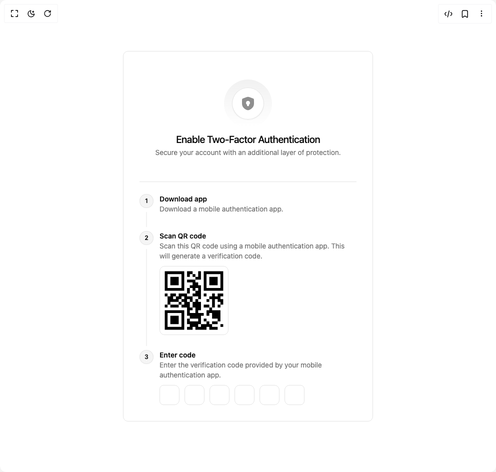

# Build Enable 2fa Card in BuilderStudio

> Build this component in our Agentic IDE: [BuilderStudio](https://builderstudio.dev).
>
> Join the BuilderStudio community on [Discord](https://discord.gg/QdWeSGCqfe) and [Reddit](https://reddit.com/r/builderstudio).



## Component

- Author group: `ahmedmayara`
- Component: `enable-2fa-card`
- Variant: `default`
- Rendered HTML snapshot: [`rendered.html`](rendered.html)

## BuilderStudio prompt

You are implementing a React component based on a component reference.

## Component identity

- Author: ahmedmayara
- Component slug: enable-2fa-card
- Demo slug: default
- Title: enable-2fa-card
- Description: 

## Goal

Recreate this component in a React + TypeScript + Tailwind CSS project. Preserve the visual layout, spacing, colors, border radius, shadows, interaction behavior, animation behavior, responsive behavior, and dark mode behavior shown in the rendered demo.

## Implementation requirements

- Use React and TypeScript.
- Use Tailwind CSS classes whenever possible.
- Keep the component self-contained unless the source files require helper components.
- If the source uses CSS variables, custom CSS, animations, or keyframes, include them.
- If the source uses external packages, list and use the required packages.
- Preserve accessibility attributes, button semantics, links, keyboard behavior, and ARIA attributes when visible in the source.
- Do not replace the component with a simplified placeholder.
- Return complete production-ready code.

## Dependencies

No reference metadata available.

## Rendered DOM snapshot

This is the rendered demo HTML extracted from the live preview. Use it to verify structure, class names, visible content, and layout.

```html
<div id="root"><div class="w-screen min-h-screen flex justify-center items-center"><div class="w-screen min-h-screen flex justify-center items-center"><div class="rounded-lg border bg-card text-card-foreground flex w-full max-w-[500px] shadow-none flex-col gap-6 p-5 md:p-8"><div class="space-y-1.5 p-6 flex flex-col items-center gap-2"><div class="relative flex size-[68px] shrink-0 items-center justify-center rounded-full backdrop-blur-xl md:size-24 before:absolute before:inset-0 before:rounded-full before:bg-gradient-to-b before:from-neutral-500 before:to-transparent before:opacity-10"><div class="relative z-10 flex size-12 items-center justify-center rounded-full bg-background dark:bg-muted/80 shadow-xs ring-1 ring-inset ring-border md:size-16"><svg xmlns="http://www.w3.org/2000/svg" width="32" height="32" viewBox="0 0 24 24" class="size-6 text-muted-foreground/80 md:size-8"><path fill="currentColor" fill-rule="evenodd" d="M3.378 5.082C3 5.62 3 7.22 3 10.417v1.574c0 5.638 4.239 8.375 6.899 9.536c.721.315 1.082.473 2.101.473c1.02 0 1.38-.158 2.101-.473C16.761 20.365 21 17.63 21 11.991v-1.574c0-3.198 0-4.797-.378-5.335c-.377-.537-1.88-1.052-4.887-2.081l-.573-.196C13.595 2.268 12.812 2 12 2s-1.595.268-3.162.805L8.265 3c-3.007 1.03-4.51 1.545-4.887 2.082M13.5 15a1 1 0 0 1-1 1h-1a1 1 0 0 1-1-1v-1.401A2.999 2.999 0 0 1 12 8a3 3 0 0 1 1.5 5.599z" clip-rule="evenodd"></path></svg></div></div><div class="flex flex-col space-y-1.5 text-center"><h3 class="text-2xl leading-none tracking-tight md:text-xl font-medium">Enable Two-Factor Authentication</h3><p class="text-sm text-muted-foreground tracking-[-0.006em]">Secure your account with an additional layer of protection.</p></div></div><div data-orientation="horizontal" role="none" class="shrink-0 bg-border h-[1px] w-full"></div><div class="p-0"><div class="grid items-start justify-start grid-cols-1!"><div class="relative flex flex-row items-start before:absolute before:start-0 gap-3 last:after:hidden after:absolute after:top-9 after:bottom-2 after:start-3.5 after:w-px after:-translate-x-[0.5px] after:bg-border pb-6"><div class="flex flex-col items-center self-stretch"><span class="z-10 text-xs font-semibold flex shrink-0 items-center justify-center rounded-full bg-muted ring-1 ring-inset ring-border text-foreground size-7">1</span></div><div class="flex flex-col items-start"><p class="text-sm leading-5 tracking-[-0.006em] font-semibold text-foreground">Download app</p><p class="text-sm leading-5 tracking-[-0.006em] text-muted-foreground">Download a mobile authentication app.</p><div class="mt-2.5"></div></div></div><div class="relative flex flex-row items-start before:absolute before:start-0 gap-3 last:after:hidden after:absolute after:top-9 after:bottom-2 after:start-3.5 after:w-px after:-translate-x-[0.5px] after:bg-border pb-6"><div class="flex flex-col items-center self-stretch"><span class="z-10 text-xs font-semibold flex shrink-0 items-center justify-center rounded-full bg-muted ring-1 ring-inset ring-border text-foreground size-7">2</span></div><div class="flex flex-col items-start"><p class="text-sm leading-5 tracking-[-0.006em] font-semibold text-foreground">Scan QR code</p><p class="text-sm leading-5 tracking-[-0.006em] text-muted-foreground">Scan this QR code using a mobile authentication app. This will generate a verification code.</p><div class="mt-2.5"><div class="inline-block p-1 border rounded-lg"></div></div></div></div><div class="relative flex flex-row items-start before:absolute before:start-0 gap-3 last:after:hidden after:absolute after:top-9 after:bottom-2 after:start-3.5 after:w-px after:-translate-x-[0.5px] after:bg-border"><div class="flex flex-col items-center self-stretch"><span class="z-10 text-xs font-semibold flex shrink-0 items-center justify-center rounded-full bg-muted ring-1 ring-inset ring-border text-foreground size-7">3</span></div><div class="flex flex-col items-start"><p class="text-sm leading-5 tracking-[-0.006em] font-semibold text-foreground">Enter code</p><p class="text-sm leading-5 tracking-[-0.006em] text-muted-foreground">Enter the verification code provided by your mobile authentication app.</p><div class="mt-2.5"><noscript></noscript><div data-input-otp-container="true" class="flex items-center gap-2 has-[:disabled]:opacity-50" style="position: relative; cursor: text; user-select: none; pointer-events: none; --root-height: 40px;"><div class="flex items-center gap-2.5"><div class="relative flex h-10 w-10 items-center justify-center border-input text-sm transition-all first:rounded-l-md first:border-l last:rounded-r-md border rounded-lg"></div><div class="relative flex h-10 w-10 items-center justify-center border-input text-sm transition-all first:rounded-l-md first:border-l last:rounded-r-md border rounded-lg"></div><div class="relative flex h-10 w-10 items-center justify-center border-input text-sm transition-all first:rounded-l-md first:border-l last:rounded-r-md border rounded-lg"></div><div class="relative flex h-10 w-10 items-center justify-center border-input text-sm transition-all first:rounded-l-md first:border-l last:rounded-r-md border rounded-lg"></div><div class="relative flex h-10 w-10 items-center justify-center border-input text-sm transition-all first:rounded-l-md first:border-l last:rounded-r-md border rounded-lg"></div><div class="relative flex h-10 w-10 items-center justify-center border-input text-sm transition-all first:rounded-l-md first:border-l last:rounded-r-md border rounded-lg"></div></div><div style="position: absolute; inset: 0px; pointer-events: none;"><input autocomplete="one-time-code" class="disabled:cursor-not-allowed" data-input-otp="true" data-input-otp-placeholder-shown="true" inputmode="numeric" maxlength="6" value="" data-input-otp-mss="0" data-input-otp-mse="0" style="position: absolute; inset: 0px; width: 100%; height: 100%; display: flex; text-align: left; opacity: 1; color: transparent; pointer-events: all; background: transparent; caret-color: transparent; border: 0px solid transparent; outline: transparent solid 0px; box-shadow: none; line-height: 1; letter-spacing: -0.5em; font-size: var(--root-height); font-family: monospace; font-variant-numeric: tabular-nums;"></div></div></div></div></div></div></div></div></div></div></div>
```

## Reference source files

No reference source files were available.
