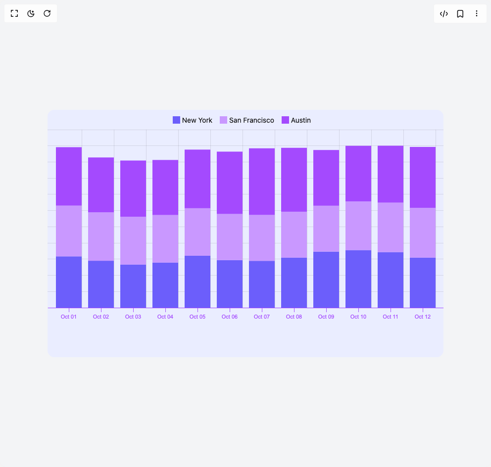

# Build Bar Stack in BuilderStudio

> Build this component in our Agentic IDE: [BuilderStudio](https://builderstudio.dev).
>
> Join the BuilderStudio community on [Discord](https://discord.gg/QdWeSGCqfe) and [Reddit](https://reddit.com/r/builderstudio).



## Component

- Author group: `airbnb`
- Component: `bar-stack`
- Variant: `default`
- Rendered HTML snapshot: [`rendered.html`](rendered.html)

## BuilderStudio prompt

You are implementing a React component based on a component reference.

## Component identity

- Author: airbnb
- Component slug: bar-stack
- Demo slug: default
- Title: bar-stack
- Description: 

## Goal

Recreate this component in a React + TypeScript + Tailwind CSS project. Preserve the visual layout, spacing, colors, border radius, shadows, interaction behavior, animation behavior, responsive behavior, and dark mode behavior shown in the rendered demo.

## Implementation requirements

- Use React and TypeScript.
- Use Tailwind CSS classes whenever possible.
- Keep the component self-contained unless the source files require helper components.
- If the source uses CSS variables, custom CSS, animations, or keyframes, include them.
- If the source uses external packages, list and use the required packages.
- Preserve accessibility attributes, button semantics, links, keyboard behavior, and ARIA attributes when visible in the source.
- Do not replace the component with a simplified placeholder.
- Return complete production-ready code.

## Dependencies

No reference metadata available.

## Rendered DOM snapshot

This is the rendered demo HTML extracted from the live preview. Use it to verify structure, class names, visible content, and layout.

```html
<div id="root"><div class="flex w-full h-screen justify-center items-center bg-gray-100"><div style="position: relative;"><svg width="800" height="500"><rect x="0" y="0" width="800" height="500" fill="#eaedff" rx="14"></rect><g class="visx-group visx-grid" transform="translate(0, 40)"><g class="visx-group visx-rows" transform="translate(0, 0)"><line class="visx-line" x1="0" y1="360" x2="800" y2="360" fill="transparent" shape-rendering="crispEdges" stroke="black" stroke-width="1" stroke-opacity="0.1"></line><line class="visx-line" x1="0" y1="327.27272727272725" x2="800" y2="327.27272727272725" fill="transparent" shape-rendering="crispEdges" stroke="black" stroke-width="1" stroke-opacity="0.1"></line><line class="visx-line" x1="0" y1="294.5454545454545" x2="800" y2="294.5454545454545" fill="transparent" shape-rendering="crispEdges" stroke="black" stroke-width="1" stroke-opacity="0.1"></line><line class="visx-line" x1="0" y1="261.8181818181818" x2="800" y2="261.8181818181818" fill="transparent" shape-rendering="crispEdges" stroke="black" stroke-width="1" stroke-opacity="0.1"></line><line class="visx-line" x1="0" y1="229.0909090909091" x2="800" y2="229.0909090909091" fill="transparent" shape-rendering="crispEdges" stroke="black" stroke-width="1" stroke-opacity="0.1"></line><line class="visx-line" x1="0" y1="196.36363636363635" x2="800" y2="196.36363636363635" fill="transparent" shape-rendering="crispEdges" stroke="black" stroke-width="1" stroke-opacity="0.1"></line><line class="visx-line" x1="0" y1="163.63636363636365" x2="800" y2="163.63636363636365" fill="transparent" shape-rendering="crispEdges" stroke="black" stroke-width="1" stroke-opacity="0.1"></line><line class="visx-line" x1="0" y1="130.9090909090909" x2="800" y2="130.9090909090909" fill="transparent" shape-rendering="crispEdges" stroke="black" stroke-width="1" stroke-opacity="0.1"></line><line class="visx-line" x1="0" y1="98.18181818181817" x2="800" y2="98.18181818181817" fill="transparent" shape-rendering="crispEdges" stroke="black" stroke-width="1" stroke-opacity="0.1"></line><line class="visx-line" x1="0" y1="65.45454545454544" x2="800" y2="65.45454545454544" fill="transparent" shape-rendering="crispEdges" stroke="black" stroke-width="1" stroke-opacity="0.1"></line><line class="visx-line" x1="0" y1="32.72727272727274" x2="800" y2="32.72727272727274" fill="transparent" shape-rendering="crispEdges" stroke="black" stroke-width="1" stroke-opacity="0.1"></line><line class="visx-line" x1="0" y1="0" x2="800" y2="0" fill="transparent" shape-rendering="crispEdges" stroke="black" stroke-width="1" stroke-opacity="0.1"></line></g><g class="visx-group visx-columns" transform="translate(0, 0)"><line class="visx-line" x1="69" y1="0" x2="69" y2="360" fill="transparent" shape-rendering="crispEdges" stroke="black" stroke-width="1" stroke-opacity="0.1"></line><line class="visx-line" x1="134" y1="0" x2="134" y2="360" fill="transparent" shape-rendering="crispEdges" stroke="black" stroke-width="1" stroke-opacity="0.1"></line><line class="visx-line" x1="199" y1="0" x2="199" y2="360" fill="transparent" shape-rendering="crispEdges" stroke="black" stroke-width="1" stroke-opacity="0.1"></line><line class="visx-line" x1="264" y1="0" x2="264" y2="360" fill="transparent" shape-rendering="crispEdges" stroke="black" stroke-width="1" stroke-opacity="0.1"></line><line class="visx-line" x1="329" y1="0" x2="329" y2="360" fill="transparent" shape-rendering="crispEdges" stroke="black" stroke-width="1" stroke-opacity="0.1"></line><line class="visx-line" x1="394" y1="0" x2="394" y2="360" fill="transparent" shape-rendering="crispEdges" stroke="black" stroke-width="1" stroke-opacity="0.1"></line><line class="visx-line" x1="459" y1="0" x2="459" y2="360" fill="transparent" shape-rendering="crispEdges" stroke="black" stroke-width="1" stroke-opacity="0.1"></line><line class="visx-line" x1="524" y1="0" x2="524" y2="360" fill="transparent" shape-rendering="crispEdges" stroke="black" stroke-width="1" stroke-opacity="0.1"></line><line class="visx-line" x1="589" y1="0" x2="589" y2="360" fill="transparent" shape-rendering="crispEdges" stroke="black" stroke-width="1" stroke-opacity="0.1"></line><line class="visx-line" x1="654" y1="0" x2="654" y2="360" fill="transparent" shape-rendering="crispEdges" stroke="black" stroke-width="1" stroke-opacity="0.1"></line><line class="visx-line" x1="719" y1="0" x2="719" y2="360" fill="transparent" shape-rendering="crispEdges" stroke="black" stroke-width="1" stroke-opacity="0.1"></line><line class="visx-line" x1="784" y1="0" x2="784" y2="360" fill="transparent" shape-rendering="crispEdges" stroke="black" stroke-width="1" stroke-opacity="0.1"></line></g></g><g class="visx-group" transform="translate(0, 40)"><rect x="17" y="256.2545454545455" height="103.74545454545449" width="52" fill="#6c5efb"></rect><rect x="82" y="265.09090909090907" height="94.90909090909093" width="52" fill="#6c5efb"></rect><rect x="147" y="272.7818181818182" height="87.21818181818179" width="52" fill="#6c5efb"></rect><rect x="212" y="268.8545454545455" height="91.14545454545453" width="52" fill="#6c5efb"></rect><rect x="277" y="254.94545454545457" height="105.05454545454543" width="52" fill="#6c5efb"></rect><rect x="342" y="263.78181818181815" height="96.21818181818185" width="52" fill="#6c5efb"></rect><rect x="407" y="265.25454545454545" height="94.74545454545455" width="52" fill="#6c5efb"></rect><rect x="472" y="258.8727272727273" height="101.12727272727273" width="52" fill="#6c5efb"></rect><rect x="537" y="246.60000000000002" height="113.39999999999998" width="52" fill="#6c5efb"></rect><rect x="602" y="243.49090909090907" height="116.50909090909093" width="52" fill="#6c5efb"></rect><rect x="667" y="247.5818181818182" height="112.41818181818181" width="52" fill="#6c5efb"></rect><rect x="732" y="258.8727272727273" height="101.12727272727273" width="52" fill="#6c5efb"></rect><rect x="17" y="153.65454545454548" height="102.60000000000002" width="52" fill="#c998ff"></rect><rect x="82" y="167.0727272727273" height="98.01818181818177" width="52" fill="#c998ff"></rect><rect x="147" y="176.07272727272724" height="96.70909090909097" width="52" fill="#c998ff"></rect><rect x="212" y="172.63636363636363" height="96.21818181818185" width="52" fill="#c998ff"></rect><rect x="277" y="158.89090909090908" height="96.05454545454549" width="52" fill="#c998ff"></rect><rect x="342" y="170.5090909090909" height="93.27272727272725" width="52" fill="#c998ff"></rect><rect x="407" y="172.4727272727273" height="92.78181818181815" width="52" fill="#c998ff"></rect><rect x="472" y="165.92727272727274" height="92.94545454545454" width="52" fill="#c998ff"></rect><rect x="537" y="153.8181818181818" height="92.78181818181821" width="52" fill="#c998ff"></rect><rect x="602" y="145.1454545454545" height="98.34545454545457" width="52" fill="#c998ff"></rect><rect x="667" y="147.59999999999997" height="99.98181818181823" width="52" fill="#c998ff"></rect><rect x="732" y="158.23636363636365" height="100.63636363636363" width="52" fill="#c998ff"></rect><rect x="17" y="35.50909090909091" height="118.14545454545458" width="52" fill="#a44afe"></rect><rect x="82" y="56.290909090909054" height="110.78181818181824" width="52" fill="#a44afe"></rect><rect x="147" y="62.509090909090894" height="113.56363636363633" width="52" fill="#a44afe"></rect><rect x="212" y="61.363636363636346" height="111.27272727272728" width="52" fill="#a44afe"></rect><rect x="277" y="40.418181818181786" height="118.4727272727273" width="52" fill="#a44afe"></rect><rect x="342" y="44.50909090909087" height="126.00000000000003" width="52" fill="#a44afe"></rect><rect x="407" y="37.80000000000003" height="134.67272727272726" width="52" fill="#a44afe"></rect><rect x="472" y="36.81818181818183" height="129.10909090909092" width="52" fill="#a44afe"></rect><rect x="537" y="41.23636363636362" height="112.58181818181819" width="52" fill="#a44afe"></rect><rect x="602" y="32.72727272727274" height="112.41818181818175" width="52" fill="#a44afe"></rect><rect x="667" y="32.56363636363632" height="115.03636363636365" width="52" fill="#a44afe"></rect><rect x="732" y="35.01818181818182" height="123.21818181818182" width="52" fill="#a44afe"></rect></g><g class="visx-group visx-axis visx-axis-bottom" transform="translate(0, 400)"><g class="visx-group visx-axis-tick" transform="translate(0, 0)"><line class="visx-line" x1="43" y1="0" x2="43" y2="8" fill="transparent" shape-rendering="crispEdges" stroke="#a44afe" stroke-width="1" stroke-linecap="square"></line><svg x="0" y="0.25em" font-size="11" style="overflow: visible;"><text transform="" x="43" y="19" font-family="Arial" font-size="11" fill="#a44afe" text-anchor="middle"><tspan x="43" dy="0em">Oct 01</tspan></text></svg></g><g class="visx-group visx-axis-tick" transform="translate(0, 0)"><line class="visx-line" x1="108" y1="0" x2="108" y2="8" fill="transparent" shape-rendering="crispEdges" stroke="#a44afe" stroke-width="1" stroke-linecap="square"></line><svg x="0" y="0.25em" font-size="11" style="overflow: visible;"><text transform="" x="108" y="19" font-family="Arial" font-size="11" fill="#a44afe" text-anchor="middle"><tspan x="108" dy="0em">Oct 02</tspan></text></svg></g><g class="visx-group visx-axis-tick" transform="translate(0, 0)"><line class="visx-line" x1="173" y1="0" x2="173" y2="8" fill="transparent" shape-rendering="crispEdges" stroke="#a44afe" stroke-width="1" stroke-linecap="square"></line><svg x="0" y="0.25em" font-size="11" style="overflow: visible;"><text transform="" x="173" y="19" font-family="Arial" font-size="11" fill="#a44afe" text-anchor="middle"><tspan x="173" dy="0em">Oct 03</tspan></text></svg></g><g class="visx-group visx-axis-tick" transform="translate(0, 0)"><line class="visx-line" x1="238" y1="0" x2="238" y2="8" fill="transparent" shape-rendering="crispEdges" stroke="#a44afe" stroke-width="1" stroke-linecap="square"></line><svg x="0" y="0.25em" font-size="11" style="overflow: visible;"><text transform="" x="238" y="19" font-family="Arial" font-size="11" fill="#a44afe" text-anchor="middle"><tspan x="238" dy="0em">Oct 04</tspan></text></svg></g><g class="visx-group visx-axis-tick" transform="translate(0, 0)"><line class="visx-line" x1="303" y1="0" x2="303" y2="8" fill="transparent" shape-rendering="crispEdges" stroke="#a44afe" stroke-width="1" stroke-linecap="square"></line><svg x="0" y="0.25em" font-size="11" style="overflow: visible;"><text transform="" x="303" y="19" font-family="Arial" font-size="11" fill="#a44afe" text-anchor="middle"><tspan x="303" dy="0em">Oct 05</tspan></text></svg></g><g class="visx-group visx-axis-tick" transform="translate(0, 0)"><line class="visx-line" x1="368" y1="0" x2="368" y2="8" fill="transparent" shape-rendering="crispEdges" stroke="#a44afe" stroke-width="1" stroke-linecap="square"></line><svg x="0" y="0.25em" font-size="11" style="overflow: visible;"><text transform="" x="368" y="19" font-family="Arial" font-size="11" fill="#a44afe" text-anchor="middle"><tspan x="368" dy="0em">Oct 06</tspan></text></svg></g><g class="visx-group visx-axis-tick" transform="translate(0, 0)"><line class="visx-line" x1="433" y1="0" x2="433" y2="8" fill="transparent" shape-rendering="crispEdges" stroke="#a44afe" stroke-width="1" stroke-linecap="square"></line><svg x="0" y="0.25em" font-size="11" style="overflow: visible;"><text transform="" x="433" y="19" font-family="Arial" font-size="11" fill="#a44afe" text-anchor="middle"><tspan x="433" dy="0em">Oct 07</tspan></text></svg></g><g class="visx-group visx-axis-tick" transform="translate(0, 0)"><line class="visx-line" x1="498" y1="0" x2="498" y2="8" fill="transparent" shape-rendering="crispEdges" stroke="#a44afe" stroke-width="1" stroke-linecap="square"></line><svg x="0" y="0.25em" font-size="11" style="overflow: visible;"><text transform="" x="498" y="19" font-family="Arial" font-size="11" fill="#a44afe" text-anchor="middle"><tspan x="498" dy="0em">Oct 08</tspan></text></svg></g><g class="visx-group visx-axis-tick" transform="translate(0, 0)"><line class="visx-line" x1="563" y1="0" x2="563" y2="8" fill="transparent" shape-rendering="crispEdges" stroke="#a44afe" stroke-width="1" stroke-linecap="square"></line><svg x="0" y="0.25em" font-size="11" style="overflow: visible;"><text transform="" x="563" y="19" font-family="Arial" font-size="11" fill="#a44afe" text-anchor="middle"><tspan x="563" dy="0em">Oct 09</tspan></text></svg></g><g class="visx-group visx-axis-tick" transform="translate(0, 0)"><line class="visx-line" x1="628" y1="0" x2="628" y2="8" fill="transparent" shape-rendering="crispEdges" stroke="#a44afe" stroke-width="1" stroke-linecap="square"></line><svg x="0" y="0.25em" font-size="11" style="overflow: visible;"><text transform="" x="628" y="19" font-family="Arial" font-size="11" fill="#a44afe" text-anchor="middle"><tspan x="628" dy="0em">Oct 10</tspan></text></svg></g><g class="visx-group visx-axis-tick" transform="translate(0, 0)"><line class="visx-line" x1="693" y1="0" x2="693" y2="8" fill="transparent" shape-rendering="crispEdges" stroke="#a44afe" stroke-width="1" stroke-linecap="square"></line><svg x="0" y="0.25em" font-size="11" style="overflow: visible;"><text transform="" x="693" y="19" font-family="Arial" font-size="11" fill="#a44afe" text-anchor="middle"><tspan x="693" dy="0em">Oct 11</tspan></text></svg></g><g class="visx-group visx-axis-tick" transform="translate(0, 0)"><line class="visx-line" x1="758" y1="0" x2="758" y2="8" fill="transparent" shape-rendering="crispEdges" stroke="#a44afe" stroke-width="1" stroke-linecap="square"></line><svg x="0" y="0.25em" font-size="11" style="overflow: visible;"><text transform="" x="758" y="19" font-family="Arial" font-size="11" fill="#a44afe" text-anchor="middle"><tspan x="758" dy="0em">Oct 12</tspan></text></svg></g><line class="visx-line visx-axis-line" x1="0.5" y1="0" x2="800.5" y2="0" fill="transparent" shape-rendering="crispEdges" stroke="#a44afe" stroke-width="1"></line></g></svg><div style="position: absolute; top: 10px; width: 100%; display: flex; justify-content: center; font-size: 14px;"><div class="visx-legend" style="display: flex; flex-direction: row;"><div class="visx-legend-item" style="display: flex; align-items: center; flex-direction: row; margin: 0px;"><div class="visx-legend-shape" style="display: flex; margin: 2px 4px 2px 0px;"><div style="width: 15px; height: 15px; background: rgb(108, 94, 251);"></div></div><div class="visx-legend-label" style="justify-content: left; display: flex; flex: 1 1 0%; margin: 0px 15px 0px 0px;">New York</div></div><div class="visx-legend-item" style="display: flex; align-items: center; flex-direction: row; margin: 0px;"><div class="visx-legend-shape" style="display: flex; margin: 2px 4px 2px 0px;"><div style="width: 15px; height: 15px; background: rgb(201, 152, 255);"></div></div><div class="visx-legend-label" style="justify-content: left; display: flex; flex: 1 1 0%; margin: 0px 15px 0px 0px;">San Francisco</div></div><div class="visx-legend-item" style="display: flex; align-items: center; flex-direction: row; margin: 0px;"><div class="visx-legend-shape" style="display: flex; margin: 2px 4px 2px 0px;"><div style="width: 15px; height: 15px; background: rgb(164, 74, 254);"></div></div><div class="visx-legend-label" style="justify-content: left; display: flex; flex: 1 1 0%; margin: 0px 15px 0px 0px;">Austin</div></div></div></div></div></div></div>
```

## Reference source files

No reference source files were available.
