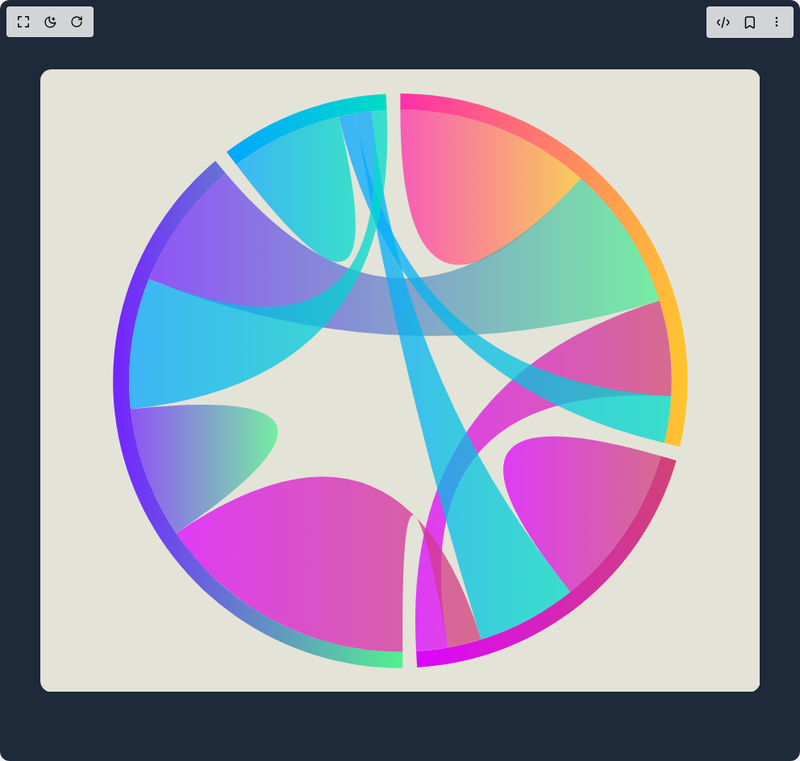

# Build Chords in BuilderStudio

> Build this component in our Agentic IDE: [BuilderStudio](https://builderstudio.dev).
>
> Join the BuilderStudio community on [Discord](https://discord.gg/QdWeSGCqfe) and [Reddit](https://reddit.com/r/builderstudio).



## Component

- Author group: `airbnb`
- Component: `chords`
- Variant: `default`
- Rendered HTML snapshot: [`rendered.html`](rendered.html)

## BuilderStudio prompt

You are implementing a React component based on a component reference.

## Component identity

- Author: airbnb
- Component slug: chords
- Demo slug: default
- Title: chords
- Description: 

## Goal

Recreate this component in a React + TypeScript + Tailwind CSS project. Preserve the visual layout, spacing, colors, border radius, shadows, interaction behavior, animation behavior, responsive behavior, and dark mode behavior shown in the rendered demo.

## Implementation requirements

- Use React and TypeScript.
- Use Tailwind CSS classes whenever possible.
- Keep the component self-contained unless the source files require helper components.
- If the source uses CSS variables, custom CSS, animations, or keyframes, include them.
- If the source uses external packages, list and use the required packages.
- Preserve accessibility attributes, button semantics, links, keyboard behavior, and ARIA attributes when visible in the source.
- Do not replace the component with a simplified placeholder.
- Return complete production-ready code.

## Dependencies

No reference metadata available.

## Rendered DOM snapshot

This is the rendered demo HTML extracted from the live preview. Use it to verify structure, class names, visible content, and layout.

```html
<div id="root"><div class="w-screen h-screen overflow-hidden bg-gray-800 flex justify-center items-center"><div class="chords" style="touch-action: none;"><svg width="892.8000000000001" height="772.6"><defs><linearGradient id="gpinkorange"><stop offset="0%" stop-color="#ff2fab" stop-opacity="1"></stop><stop offset="100%" stop-color="#ffc62e" stop-opacity="1"></stop></linearGradient></defs><defs><linearGradient id="gpurplered"><stop offset="0%" stop-color="#dc04ff" stop-opacity="1"></stop><stop offset="100%" stop-color="#d04376" stop-opacity="1"></stop></linearGradient></defs><defs><linearGradient id="gpurplegreen"><stop offset="0%" stop-color="#7324ff" stop-opacity="1"></stop><stop offset="100%" stop-color="#52f091" stop-opacity="1"></stop></linearGradient></defs><defs><linearGradient id="gbluelime"><stop offset="0%" stop-color="#04a6ff" stop-opacity="1"></stop><stop offset="100%" stop-color="#00ddc6" stop-opacity="1"></stop></linearGradient></defs><rect width="892.8000000000001" height="772.6" fill="#e4e3d8" rx="14"></rect><g class="visx-group" transform="translate(446.40000000000003, 386.3)"><g><path class="visx-arc" d="M2.1817082726810098e-14,-356.3A356.3,356.3,0,0,1,346.78271647121306,81.80120755127189L327.3169451284562,77.20950350685584A336.3,336.3,0,0,0,2.0592435927662746e-14,-336.3Z" fill="url(#gpinkorange)"></path><path class="visx-arc" d="M342.26097197734686,99.03088942911589A356.3,356.3,0,0,1,20.837517854380767,355.6901570885373L19.66785645362967,335.7243890790769A336.3,336.3,0,0,0,323.04901733365637,93.47204073817478Z" fill="url(#gpurplered)"></path><path class="visx-arc" d="M3.034377814005441,356.287078844128A356.3,356.3,0,0,1,-229.31497431018795,-272.6982445068502L-216.4429577898294,-257.39101775934245A336.3,336.3,0,0,0,2.8640506843952562,336.28780414055643Z" fill="url(#gpurplegreen)"></path><path class="visx-arc" d="M-215.3991585827406,-283.8184146278169A356.3,356.3,0,0,1,-17.807578011143324,-355.85471777872647L-16.80799462572972,-335.8797125708271A336.3,336.3,0,0,0,-203.3082712079025,-267.8869852352928Z" fill="url(#gbluelime)"></path><path class="visx-ribbon" d="M2.0592435927662746e-14,-336.3A336.3,336.3,0,0,1,223.88242665168698,-250.94690481564425Q0,0,2.0592435927662746e-14,-336.3Z" fill="url(#gpinkorange)" fill-opacity="0.75"></path><path class="visx-ribbon" d="M321.2838267401758,-99.36997874201589A336.3,336.3,0,0,1,335.7502645035225,19.221079205255528Q0,0,59.280787124646565,331.03395336110515A336.3,336.3,0,0,1,19.66785645362967,335.7243890790769Q0,0,321.2838267401758,-99.36997874201589Z" fill="url(#gpurplered)" fill-opacity="0.75"></path><path class="visx-ribbon" d="M223.88242665168698,-250.94690481564425A336.3,336.3,0,0,1,321.2838267401758,-99.36997874201589Q0,0,-311.7656751287958,-126.09462245268888A336.3,336.3,0,0,1,-216.4429577898294,-257.39101775934245Q0,0,223.88242665168698,-250.94690481564425Z" fill="url(#gpurplegreen)" fill-opacity="0.75"></path><path class="visx-ribbon" d="M335.7502645035225,19.221079205255528A336.3,336.3,0,0,1,327.3169451284562,77.20950350685584Q0,0,-76.35057644931808,-327.5183650970688A336.3,336.3,0,0,1,-56.03587302243285,-331.5986594282519Q0,0,335.7502645035225,19.221079205255528Z" fill="url(#gbluelime)" fill-opacity="0.75"></path><path class="visx-ribbon" d="M323.04901733365637,93.47204073817478A336.3,336.3,0,0,1,210.91515604469598,261.93985368905123Q0,0,323.04901733365637,93.47204073817478Z" fill="url(#gpurplered)" fill-opacity="0.75"></path><path class="visx-ribbon" d="M2.8640506843952562,336.28780414055643A336.3,336.3,0,0,1,-278.09427443224007,189.10648991508975Q0,0,100.19051372285772,321.028894275811A336.3,336.3,0,0,1,59.280787124646565,331.03395336110515Q0,0,2.8640506843952562,336.28780414055643Z" fill="url(#gpurplered)" fill-opacity="0.75"></path><path class="visx-ribbon" d="M210.91515604469598,261.93985368905123A336.3,336.3,0,0,1,100.19051372285772,321.028894275811Q0,0,-56.03587302243285,-331.5986594282519A336.3,336.3,0,0,1,-35.97631216637237,-334.37014663828427Q0,0,210.91515604469598,261.93985368905123Z" fill="url(#gbluelime)" fill-opacity="0.75"></path><path class="visx-ribbon" d="M-278.09427443224007,189.10648991508975A336.3,336.3,0,0,1,-334.44598640976716,35.26431871450033Q0,0,-278.09427443224007,189.10648991508975Z" fill="url(#gpurplegreen)" fill-opacity="0.75"></path><path class="visx-ribbon" d="M-334.44598640976716,35.26431871450033A336.3,336.3,0,0,1,-311.7656751287958,-126.09462245268888Q0,0,-35.97631216637237,-334.37014663828427A336.3,336.3,0,0,1,-16.80799462572972,-335.8797125708271Q0,0,-334.44598640976716,35.26431871450033Z" fill="url(#gbluelime)" fill-opacity="0.75"></path><path class="visx-ribbon" d="M-203.3082712079025,-267.8869852352928A336.3,336.3,0,0,1,-76.35057644931808,-327.5183650970688Q0,0,-203.3082712079025,-267.8869852352928Z" fill="url(#gbluelime)" fill-opacity="0.75"></path></g></g></svg><style>
        .chords {
          display: flex;
          flex-direction: column;
          user-select: none;
        }
        svg {
          margin: 1rem 0;
          cursor: pointer;
        }
        .deets {
          display: flex;
          flex-direction: row;
          font-size: 12px;
        }
        .deets > div {
          margin: 0.25rem;
        }
      </style></div></div></div>
```

## Reference source files

No reference source files were available.
