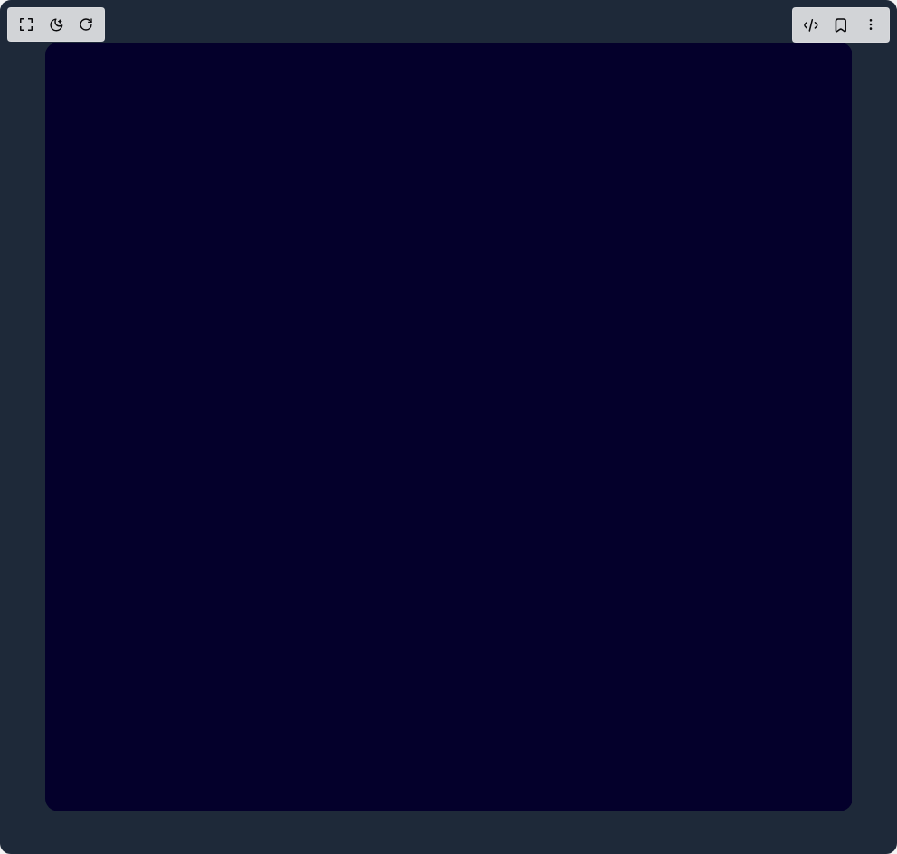

# Build Drag And Draw in BuilderStudio

> Build this component in our Agentic IDE: [BuilderStudio](https://builderstudio.dev).
>
> Join the BuilderStudio community on [Discord](https://discord.gg/QdWeSGCqfe) and [Reddit](https://reddit.com/r/builderstudio).



## Component

- Author group: `airbnb`
- Component: `drag-and-draw`
- Variant: `default`
- Rendered HTML snapshot: [`rendered.html`](rendered.html)

## BuilderStudio prompt

You are implementing a React component based on a component reference.

## Component identity

- Author: airbnb
- Component slug: drag-and-draw
- Demo slug: default
- Title: drag-and-draw
- Description: 

## Goal

Recreate this component in a React + TypeScript + Tailwind CSS project. Preserve the visual layout, spacing, colors, border radius, shadows, interaction behavior, animation behavior, responsive behavior, and dark mode behavior shown in the rendered demo.

## Implementation requirements

- Use React and TypeScript.
- Use Tailwind CSS classes whenever possible.
- Keep the component self-contained unless the source files require helper components.
- If the source uses CSS variables, custom CSS, animations, or keyframes, include them.
- If the source uses external packages, list and use the required packages.
- Preserve accessibility attributes, button semantics, links, keyboard behavior, and ARIA attributes when visible in the source.
- Do not replace the component with a simplified placeholder.
- Return complete production-ready code.

## Dependencies

No reference metadata available.

## Rendered DOM snapshot

This is the rendered demo HTML extracted from the live preview. Use it to verify structure, class names, visible content, and layout.

```html
<div id="root"><div class="w-screen h-screen overflow-hidden bg-gray-800 flex justify-center items-center"><div class="DragII" style="touch-action: none;"><svg width="892.8000000000001" height="849.6"><defs><linearGradient id="stroke" x1="0" y1="0" x2="0" y2="1"><stop offset="0%" stop-color="#ff614e" stop-opacity="1"></stop><stop offset="100%" stop-color="#ffdc64" stop-opacity="1"></stop></linearGradient></defs><rect fill="#04002b" width="892.8000000000001" height="849.6" rx="14"></rect><g><rect fill="transparent" width="892.8000000000001" height="849.6"></rect></g></svg><style>
        .DragII {
          display: flex;
          flex-direction: column;
          user-select: none;
        }

        svg {
          margin: 1rem 0;
          cursor: crosshair;
        }

        .deets {
          display: flex;
          flex-direction: row;
          font-size: 12px;
        }
        .deets > div {
          margin: 0.25rem;
        }
      </style></div></div></div>
```

## Reference source files

No reference source files were available.
