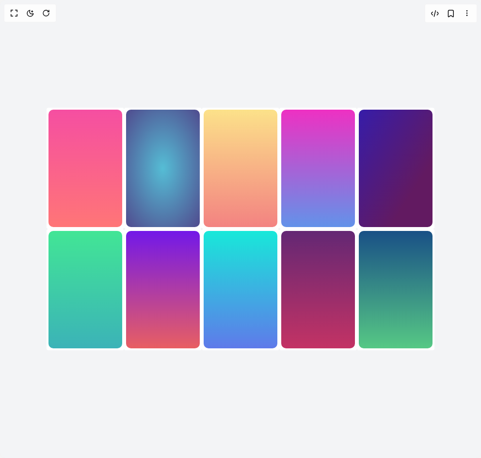

# Build Gradients in BuilderStudio

> Build this component in our Agentic IDE: [BuilderStudio](https://builderstudio.dev).
>
> Join the BuilderStudio community on [Discord](https://discord.gg/QdWeSGCqfe) and [Reddit](https://reddit.com/r/builderstudio).



## Component

- Author group: `airbnb`
- Component: `gradients`
- Variant: `default`
- Rendered HTML snapshot: [`rendered.html`](rendered.html)

## BuilderStudio prompt

You are implementing a React component based on a component reference.

## Component identity

- Author: airbnb
- Component slug: gradients
- Demo slug: default
- Title: gradients
- Description: 

## Goal

Recreate this component in a React + TypeScript + Tailwind CSS project. Preserve the visual layout, spacing, colors, border radius, shadows, interaction behavior, animation behavior, responsive behavior, and dark mode behavior shown in the rendered demo.

## Implementation requirements

- Use React and TypeScript.
- Use Tailwind CSS classes whenever possible.
- Keep the component self-contained unless the source files require helper components.
- If the source uses CSS variables, custom CSS, animations, or keyframes, include them.
- If the source uses external packages, list and use the required packages.
- Preserve accessibility attributes, button semantics, links, keyboard behavior, and ARIA attributes when visible in the source.
- Do not replace the component with a simplified placeholder.
- Return complete production-ready code.

## Dependencies

No reference metadata available.

## Rendered DOM snapshot

This is the rendered demo HTML extracted from the live preview. Use it to verify structure, class names, visible content, and layout.

```html
<div id="root"><div class="flex w-full h-screen justify-center items-center bg-gray-100"><svg width="800" height="500"><defs><linearGradient id="visx-gradient-demo-0-00" x1="0" y1="0" x2="0" y2="1"><stop offset="0%" stop-color="#F54EA2" stop-opacity="1"></stop><stop offset="100%" stop-color="#FF7676" stop-opacity="1"></stop></linearGradient></defs><rect class="visx-bar" fill="url(#visx-gradient-demo-0-00)" x="0" y="0" width="160" height="250" stroke="#ffffff" stroke-width="8" rx="14"></rect><defs><radialGradient id="visx-gradient-demo-1-01" r="80%"><stop offset="0%" stop-color="#55bdd5" stop-opacity="1"></stop><stop offset="100%" stop-color="#4f3681" stop-opacity="1"></stop></radialGradient></defs><rect class="visx-bar" fill="url(#visx-gradient-demo-1-01)" x="160" y="0" width="160" height="250" stroke="#ffffff" stroke-width="8" rx="14"></rect><defs><linearGradient id="visx-gradient-demo-2-02" x1="0" y1="0" x2="0" y2="1"><stop offset="0%" stop-color="#FCE38A" stop-opacity="1"></stop><stop offset="100%" stop-color="#F38181" stop-opacity="1"></stop></linearGradient></defs><rect class="visx-bar" fill="url(#visx-gradient-demo-2-02)" x="320" y="0" width="160" height="250" stroke="#ffffff" stroke-width="8" rx="14"></rect><defs><linearGradient id="visx-gradient-demo-3-03" x1="0" y1="0" x2="0" y2="1"><stop offset="0%" stop-color="#F02FC2" stop-opacity="1"></stop><stop offset="100%" stop-color="#6094EA" stop-opacity="1"></stop></linearGradient></defs><rect class="visx-bar" fill="url(#visx-gradient-demo-3-03)" x="480" y="0" width="160" height="250" stroke="#ffffff" stroke-width="8" rx="14"></rect><defs><linearGradient id="visx-gradient-demo-4-04" x1="0" y1="0" x2="0" y2="1" gradientTransform="rotate(-45)"><stop offset="0%" stop-color="#351CAB" stop-opacity="1"></stop><stop offset="100%" stop-color="#621A61" stop-opacity="1"></stop></linearGradient></defs><rect class="visx-bar" fill="url(#visx-gradient-demo-4-04)" x="640" y="0" width="160" height="250" stroke="#ffffff" stroke-width="8" rx="14"></rect><defs><linearGradient id="visx-gradient-demo-5-10" x1="0" y1="0" x2="0" y2="1"><stop offset="0%" stop-color="#42E695" stop-opacity="1"></stop><stop offset="100%" stop-color="#3BB2B8" stop-opacity="1"></stop></linearGradient></defs><rect class="visx-bar" fill="url(#visx-gradient-demo-5-10)" x="0" y="250" width="160" height="250" stroke="#ffffff" stroke-width="8" rx="14"></rect><defs><linearGradient id="visx-gradient-demo-6-11" x1="0" y1="0" x2="0" y2="1"><stop offset="0%" stop-color="#7117EA" stop-opacity="1"></stop><stop offset="100%" stop-color="#EA6060" stop-opacity="1"></stop></linearGradient></defs><rect class="visx-bar" fill="url(#visx-gradient-demo-6-11)" x="160" y="250" width="160" height="250" stroke="#ffffff" stroke-width="8" rx="14"></rect><defs><linearGradient id="visx-gradient-demo-7-12" x1="0" y1="0" x2="0" y2="1"><stop offset="0%" stop-color="#17EAD9" stop-opacity="1"></stop><stop offset="100%" stop-color="#6078EA" stop-opacity="1"></stop></linearGradient></defs><rect class="visx-bar" fill="url(#visx-gradient-demo-7-12)" x="320" y="250" width="160" height="250" stroke="#ffffff" stroke-width="8" rx="14"></rect><defs><linearGradient id="visx-gradient-demo-8-13" x1="0" y1="0" x2="0" y2="1"><stop offset="0%" stop-color="#622774" stop-opacity="1"></stop><stop offset="100%" stop-color="#C53364" stop-opacity="1"></stop></linearGradient></defs><rect class="visx-bar" fill="url(#visx-gradient-demo-8-13)" x="480" y="250" width="160" height="250" stroke="#ffffff" stroke-width="8" rx="14"></rect><defs><linearGradient id="visx-gradient-demo-9-14" x1="0" y1="0" x2="0" y2="1"><stop offset="0%" stop-color="#184E86" stop-opacity="1"></stop><stop offset="100%" stop-color="#57CA85" stop-opacity="1"></stop></linearGradient></defs><rect class="visx-bar" fill="url(#visx-gradient-demo-9-14)" x="640" y="250" width="160" height="250" stroke="#ffffff" stroke-width="8" rx="14"></rect></svg></div></div>
```

## Reference source files

No reference source files were available.
