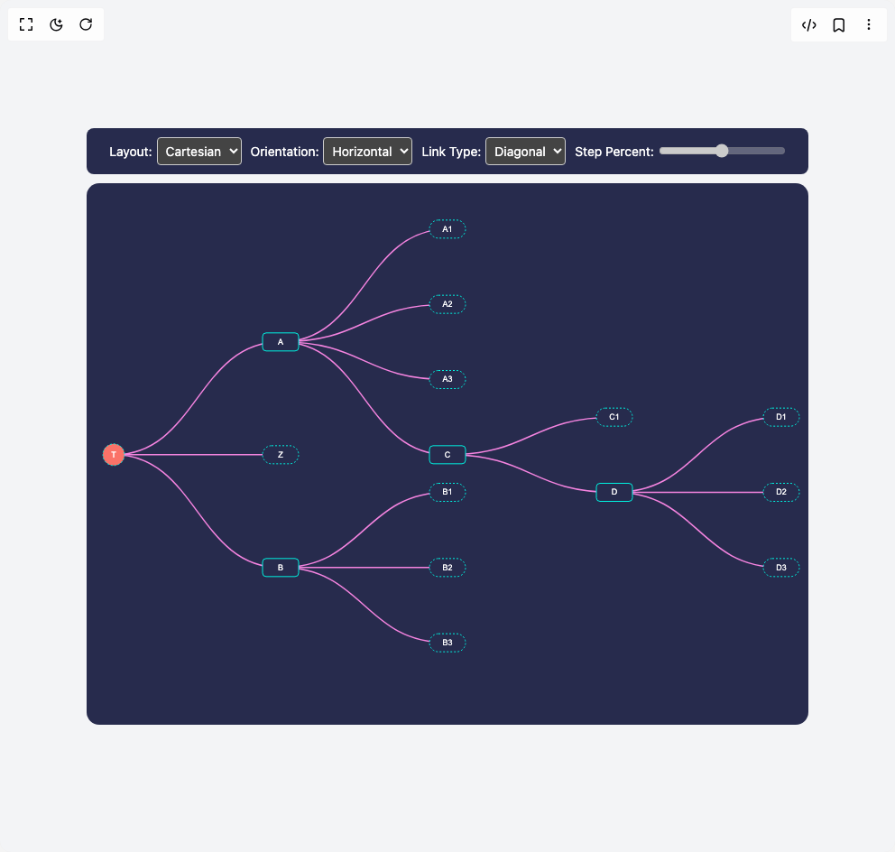

# Build Linktypes in BuilderStudio

> Build this component in our Agentic IDE: [BuilderStudio](https://builderstudio.dev).
>
> Join the BuilderStudio community on [Discord](https://discord.gg/QdWeSGCqfe) and [Reddit](https://reddit.com/r/builderstudio).



## Component

- Author group: `airbnb`
- Component: `linktypes`
- Variant: `default`
- Rendered HTML snapshot: [`rendered.html`](rendered.html)

## BuilderStudio prompt

You are implementing a React component based on a component reference.

## Component identity

- Author: airbnb
- Component slug: linktypes
- Demo slug: default
- Title: linktypes
- Description: 

## Goal

Recreate this component in a React + TypeScript + Tailwind CSS project. Preserve the visual layout, spacing, colors, border radius, shadows, interaction behavior, animation behavior, responsive behavior, and dark mode behavior shown in the rendered demo.

## Implementation requirements

- Use React and TypeScript.
- Use Tailwind CSS classes whenever possible.
- Keep the component self-contained unless the source files require helper components.
- If the source uses CSS variables, custom CSS, animations, or keyframes, include them.
- If the source uses external packages, list and use the required packages.
- Preserve accessibility attributes, button semantics, links, keyboard behavior, and ARIA attributes when visible in the source.
- Do not replace the component with a simplified placeholder.
- Return complete production-ready code.

## Dependencies

No reference metadata available.

## Rendered DOM snapshot

This is the rendered demo HTML extracted from the live preview. Use it to verify structure, class names, visible content, and layout.

```html
<div id="root"><div class="flex w-full h-screen justify-center items-center bg-gray-100"><div><div class="controls"><label>Layout:<select><option value="cartesian">Cartesian</option><option value="polar">Polar</option></select></label><label>Orientation:<select><option value="vertical">Vertical</option><option value="horizontal">Horizontal</option></select></label><label>Link Type:<select><option value="diagonal">Diagonal</option><option value="step">Step</option><option value="curve">Curve</option><option value="line">Line</option></select></label><label>Step Percent:<input min="0" max="1" step="0.1" disabled="" type="range" value="0.5"></label></div><svg width="800" height="600"><defs><linearGradient id="links-gradient" x1="0" y1="0" x2="0" y2="1"><stop offset="0%" stop-color="#fd9b93" stop-opacity="1"></stop><stop offset="100%" stop-color="#fe6e9e" stop-opacity="1"></stop></linearGradient></defs><rect width="800" height="600" rx="14" fill="#272b4d"></rect><g class="visx-group" transform="translate(30, 30)"><g class="visx-group" transform="translate(0, 0)"><path class="visx-link visx-link-horizontal-diagonal" d="M0,270.8333333333333C92.5,270.8333333333333,92.5,145.83333333333331,185,145.83333333333331" stroke="#f584e0" stroke-width="1.5" fill="none"></path><path class="visx-link visx-link-horizontal-diagonal" d="M0,270.8333333333333C92.5,270.8333333333333,92.5,270.8333333333333,185,270.8333333333333" stroke="#f584e0" stroke-width="1.5" fill="none"></path><path class="visx-link visx-link-horizontal-diagonal" d="M0,270.8333333333333C92.5,270.8333333333333,92.5,395.8333333333333,185,395.8333333333333" stroke="#f584e0" stroke-width="1.5" fill="none"></path><path class="visx-link visx-link-horizontal-diagonal" d="M185,145.83333333333331C277.5,145.83333333333331,277.5,20.833333333333332,370,20.833333333333332" stroke="#f584e0" stroke-width="1.5" fill="none"></path><path class="visx-link visx-link-horizontal-diagonal" d="M185,145.83333333333331C277.5,145.83333333333331,277.5,104.16666666666666,370,104.16666666666666" stroke="#f584e0" stroke-width="1.5" fill="none"></path><path class="visx-link visx-link-horizontal-diagonal" d="M185,145.83333333333331C277.5,145.83333333333331,277.5,187.5,370,187.5" stroke="#f584e0" stroke-width="1.5" fill="none"></path><path class="visx-link visx-link-horizontal-diagonal" d="M185,145.83333333333331C277.5,145.83333333333331,277.5,270.8333333333333,370,270.8333333333333" stroke="#f584e0" stroke-width="1.5" fill="none"></path><path class="visx-link visx-link-horizontal-diagonal" d="M185,395.8333333333333C277.5,395.8333333333333,277.5,312.5,370,312.5" stroke="#f584e0" stroke-width="1.5" fill="none"></path><path class="visx-link visx-link-horizontal-diagonal" d="M185,395.8333333333333C277.5,395.8333333333333,277.5,395.8333333333333,370,395.8333333333333" stroke="#f584e0" stroke-width="1.5" fill="none"></path><path class="visx-link visx-link-horizontal-diagonal" d="M185,395.8333333333333C277.5,395.8333333333333,277.5,479.16666666666663,370,479.16666666666663" stroke="#f584e0" stroke-width="1.5" fill="none"></path><path class="visx-link visx-link-horizontal-diagonal" d="M370,270.8333333333333C462.5,270.8333333333333,462.5,229.16666666666666,555,229.16666666666666" stroke="#f584e0" stroke-width="1.5" fill="none"></path><path class="visx-link visx-link-horizontal-diagonal" d="M370,270.8333333333333C462.5,270.8333333333333,462.5,312.5,555,312.5" stroke="#f584e0" stroke-width="1.5" fill="none"></path><path class="visx-link visx-link-horizontal-diagonal" d="M555,312.5C647.5,312.5,647.5,229.16666666666666,740,229.16666666666666" stroke="#f584e0" stroke-width="1.5" fill="none"></path><path class="visx-link visx-link-horizontal-diagonal" d="M555,312.5C647.5,312.5,647.5,312.5,740,312.5" stroke="#f584e0" stroke-width="1.5" fill="none"></path><path class="visx-link visx-link-horizontal-diagonal" d="M555,312.5C647.5,312.5,647.5,395.8333333333333,740,395.8333333333333" stroke="#f584e0" stroke-width="1.5" fill="none"></path><g class="visx-group" transform="translate(0, 270.8333333333333)"><circle r="12" fill="#fa7268" stroke="#00f2e0" stroke-width="1" stroke-dasharray="2,2"></circle><text dy=".33em" font-size="9" font-family="Arial" text-anchor="middle" fill="white" style="pointer-events: none;">T</text></g><g class="visx-group" transform="translate(185, 145.83333333333331)"><rect height="20" width="40" y="-10" x="-20" fill="#272b4d" stroke="#00f2e0" stroke-width="1" stroke-dasharray="0" rx="4"></rect><text dy=".33em" font-size="9" font-family="Arial" text-anchor="middle" fill="white" style="pointer-events: none;">A</text></g><g class="visx-group" transform="translate(185, 270.8333333333333)"><rect height="20" width="40" y="-10" x="-20" fill="#272b4d" stroke="#00f2e0" stroke-width="1" stroke-dasharray="2,2" rx="10"></rect><text dy=".33em" font-size="9" font-family="Arial" text-anchor="middle" fill="white" style="pointer-events: none;">Z</text></g><g class="visx-group" transform="translate(185, 395.8333333333333)"><rect height="20" width="40" y="-10" x="-20" fill="#272b4d" stroke="#00f2e0" stroke-width="1" stroke-dasharray="0" rx="4"></rect><text dy=".33em" font-size="9" font-family="Arial" text-anchor="middle" fill="white" style="pointer-events: none;">B</text></g><g class="visx-group" transform="translate(370, 20.833333333333332)"><rect height="20" width="40" y="-10" x="-20" fill="#272b4d" stroke="#00f2e0" stroke-width="1" stroke-dasharray="2,2" rx="10"></rect><text dy=".33em" font-size="9" font-family="Arial" text-anchor="middle" fill="white" style="pointer-events: none;">A1</text></g><g class="visx-group" transform="translate(370, 104.16666666666666)"><rect height="20" width="40" y="-10" x="-20" fill="#272b4d" stroke="#00f2e0" stroke-width="1" stroke-dasharray="2,2" rx="10"></rect><text dy=".33em" font-size="9" font-family="Arial" text-anchor="middle" fill="white" style="pointer-events: none;">A2</text></g><g class="visx-group" transform="translate(370, 187.5)"><rect height="20" width="40" y="-10" x="-20" fill="#272b4d" stroke="#00f2e0" stroke-width="1" stroke-dasharray="2,2" rx="10"></rect><text dy=".33em" font-size="9" font-family="Arial" text-anchor="middle" fill="white" style="pointer-events: none;">A3</text></g><g class="visx-group" transform="translate(370, 270.8333333333333)"><rect height="20" width="40" y="-10" x="-20" fill="#272b4d" stroke="#00f2e0" stroke-width="1" stroke-dasharray="0" rx="4"></rect><text dy=".33em" font-size="9" font-family="Arial" text-anchor="middle" fill="white" style="pointer-events: none;">C</text></g><g class="visx-group" transform="translate(370, 312.5)"><rect height="20" width="40" y="-10" x="-20" fill="#272b4d" stroke="#00f2e0" stroke-width="1" stroke-dasharray="2,2" rx="10"></rect><text dy=".33em" font-size="9" font-family="Arial" text-anchor="middle" fill="white" style="pointer-events: none;">B1</text></g><g class="visx-group" transform="translate(370, 395.8333333333333)"><rect height="20" width="40" y="-10" x="-20" fill="#272b4d" stroke="#00f2e0" stroke-width="1" stroke-dasharray="2,2" rx="10"></rect><text dy=".33em" font-size="9" font-family="Arial" text-anchor="middle" fill="white" style="pointer-events: none;">B2</text></g><g class="visx-group" transform="translate(370, 479.16666666666663)"><rect height="20" width="40" y="-10" x="-20" fill="#272b4d" stroke="#00f2e0" stroke-width="1" stroke-dasharray="2,2" rx="10"></rect><text dy=".33em" font-size="9" font-family="Arial" text-anchor="middle" fill="white" style="pointer-events: none;">B3</text></g><g class="visx-group" transform="translate(555, 229.16666666666666)"><rect height="20" width="40" y="-10" x="-20" fill="#272b4d" stroke="#00f2e0" stroke-width="1" stroke-dasharray="2,2" rx="10"></rect><text dy=".33em" font-size="9" font-family="Arial" text-anchor="middle" fill="white" style="pointer-events: none;">C1</text></g><g class="visx-group" transform="translate(555, 312.5)"><rect height="20" width="40" y="-10" x="-20" fill="#272b4d" stroke="#00f2e0" stroke-width="1" stroke-dasharray="0" rx="4"></rect><text dy=".33em" font-size="9" font-family="Arial" text-anchor="middle" fill="white" style="pointer-events: none;">D</text></g><g class="visx-group" transform="translate(740, 229.16666666666666)"><rect height="20" width="40" y="-10" x="-20" fill="#272b4d" stroke="#00f2e0" stroke-width="1" stroke-dasharray="2,2" rx="10"></rect><text dy=".33em" font-size="9" font-family="Arial" text-anchor="middle" fill="white" style="pointer-events: none;">D1</text></g><g class="visx-group" transform="translate(740, 312.5)"><rect height="20" width="40" y="-10" x="-20" fill="#272b4d" stroke="#00f2e0" stroke-width="1" stroke-dasharray="2,2" rx="10"></rect><text dy=".33em" font-size="9" font-family="Arial" text-anchor="middle" fill="white" style="pointer-events: none;">D2</text></g><g class="visx-group" transform="translate(740, 395.8333333333333)"><rect height="20" width="40" y="-10" x="-20" fill="#272b4d" stroke="#00f2e0" stroke-width="1" stroke-dasharray="2,2" rx="10"></rect><text dy=".33em" font-size="9" font-family="Arial" text-anchor="middle" fill="white" style="pointer-events: none;">D3</text></g></g></g></svg><style>
        .controls {
          display: flex;
          flex-wrap: wrap;
          justify-content: center;
          align-items: center;
          margin-bottom: 10px;
          gap: 10px;
          color: white;
          background: #272b4d;
          padding: 10px;
          border-radius: 8px;
        }
        .controls label {
          display: flex;
          align-items: center;
          gap: 5px;
          font-size: 14px;
          color: white;
        }
        .controls select,
        .controls input[type='range'] {
          padding: 5px;
          border-radius: 4px;
          border: 1px solid #ccc;
          background: #444;
          color: white;
        }
        .controls select option {
          background: #444;
          color: white;
        }
      </style></div></div></div>
```

## Reference source files

No reference source files were available.
