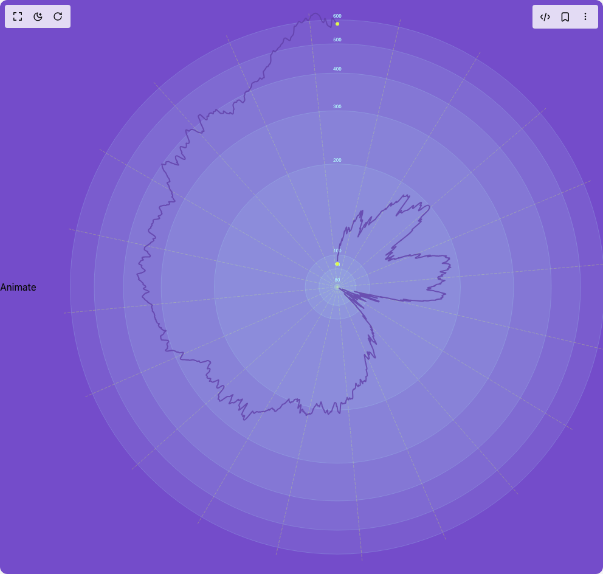

# Build Radial Lines in BuilderStudio

> Build this component in our Agentic IDE: [BuilderStudio](https://builderstudio.dev).
>
> Join the BuilderStudio community on [Discord](https://discord.gg/QdWeSGCqfe) and [Reddit](https://reddit.com/r/builderstudio).



## Component

- Author group: `airbnb`
- Component: `radial-lines`
- Variant: `default`
- Rendered HTML snapshot: [`rendered.html`](rendered.html)

## BuilderStudio prompt

You are implementing a React component based on a component reference.

## Component identity

- Author: airbnb
- Component slug: radial-lines
- Demo slug: default
- Title: radial-lines
- Description: 

## Goal

Recreate this component in a React + TypeScript + Tailwind CSS project. Preserve the visual layout, spacing, colors, border radius, shadows, interaction behavior, animation behavior, responsive behavior, and dark mode behavior shown in the rendered demo.

## Implementation requirements

- Use React and TypeScript.
- Use Tailwind CSS classes whenever possible.
- Keep the component self-contained unless the source files require helper components.
- If the source uses CSS variables, custom CSS, animations, or keyframes, include them.
- If the source uses external packages, list and use the required packages.
- Preserve accessibility attributes, button semantics, links, keyboard behavior, and ARIA attributes when visible in the source.
- Do not replace the component with a simplified placeholder.
- Return complete production-ready code.

## Dependencies

No reference metadata available.

## Rendered DOM snapshot

This is the rendered demo HTML extracted from the live preview. Use it to verify structure, class names, visible content, and layout.

```html
<div id="root"><div class="w-screen h-screen overflow-hidden flex justify-center items-center" style="background-color: rgb(116, 76, 202);"><button type="button">Animate</button><br><svg width="992" height="944"><defs><linearGradient id="line-gradient" x1="0" y1="0" x2="0" y2="1"><stop offset="0%" stop-color="#e5fd3d" stop-opacity="1"></stop><stop offset="100%" stop-color="#aeeef8" stop-opacity="1"></stop></linearGradient></defs><rect width="992" height="944" fill="#744cca" rx="14"></rect><g class="visx-group" transform="translate(496, 472)"><g class="visx-group visx-grid-angle" transform="translate(0, 0)"><line class="visx-line" x1="0" y1="0" x2="103.7848870131126" y2="-439.92351292886747" fill="transparent" shape-rendering="auto" stroke="#e5fd3d" stroke-width="1" stroke-dasharray="5,2" stroke-opacity="0.3"></line><line class="visx-line" x1="0" y1="0" x2="235.04606511459144" y2="-386.0794572029795" fill="transparent" shape-rendering="auto" stroke="#e5fd3d" stroke-width="1" stroke-dasharray="5,2" stroke-opacity="0.3"></line><line class="visx-line" x1="0" y1="0" x2="343.19175062608707" y2="-294.1486398102185" fill="transparent" shape-rendering="auto" stroke="#e5fd3d" stroke-width="1" stroke-dasharray="5,2" stroke-opacity="0.3"></line><line class="visx-line" x1="0" y1="0" x2="416.84897693499164" y2="-174.7596361527764" fill="transparent" shape-rendering="auto" stroke="#e5fd3d" stroke-width="1" stroke-dasharray="5,2" stroke-opacity="0.3"></line><line class="visx-line" x1="0" y1="0" x2="450.3596639226771" y2="-38.47301796653484" fill="transparent" shape-rendering="auto" stroke="#e5fd3d" stroke-width="1" stroke-dasharray="5,2" stroke-opacity="0.3"></line><line class="visx-line" x1="0" y1="0" x2="440.1006481323709" y2="103.03115797401799" fill="transparent" shape-rendering="auto" stroke="#e5fd3d" stroke-width="1" stroke-dasharray="5,2" stroke-opacity="0.3"></line><line class="visx-line" x1="0" y1="0" x2="386.4480563777031" y2="234.4395438527716" fill="transparent" shape-rendering="auto" stroke="#e5fd3d" stroke-width="1" stroke-dasharray="5,2" stroke-opacity="0.3"></line><line class="visx-line" x1="0" y1="0" x2="297.1258315963054" y2="340.61743965658013" fill="transparent" shape-rendering="auto" stroke="#e5fd3d" stroke-width="1" stroke-dasharray="5,2" stroke-opacity="0.3"></line><line class="visx-line" x1="0" y1="0" x2="178.32343803510304" y2="415.33691317693007" fill="transparent" shape-rendering="auto" stroke="#e5fd3d" stroke-width="1" stroke-dasharray="5,2" stroke-opacity="0.3"></line><line class="visx-line" x1="0" y1="0" x2="40.78686173419024" y2="450.1560084125014" fill="transparent" shape-rendering="auto" stroke="#e5fd3d" stroke-width="1" stroke-dasharray="5,2" stroke-opacity="0.3"></line><line class="visx-line" x1="0" y1="0" x2="-100.83106288102994" y2="440.60991450293284" fill="transparent" shape-rendering="auto" stroke="#e5fd3d" stroke-width="1" stroke-dasharray="5,2" stroke-opacity="0.3"></line><line class="visx-line" x1="0" y1="0" x2="-229.73341118897568" y2="389.2641259909228" fill="transparent" shape-rendering="auto" stroke="#e5fd3d" stroke-width="1" stroke-dasharray="5,2" stroke-opacity="0.3"></line><line class="visx-line" x1="0" y1="0" x2="-338.06013474862766" y2="300.03224042382465" fill="transparent" shape-rendering="auto" stroke="#e5fd3d" stroke-width="1" stroke-dasharray="5,2" stroke-opacity="0.3"></line><line class="visx-line" x1="0" y1="0" x2="-414.41504325784535" y2="180.4554568906082" fill="transparent" shape-rendering="auto" stroke="#e5fd3d" stroke-width="1" stroke-dasharray="5,2" stroke-opacity="0.3"></line><line class="visx-line" x1="0" y1="0" x2="-449.9466127785147" y2="43.035399953310005" fill="transparent" shape-rendering="auto" stroke="#e5fd3d" stroke-width="1" stroke-dasharray="5,2" stroke-opacity="0.3"></line><line class="visx-line" x1="0" y1="0" x2="-441.8008905585024" y2="-95.47760523659056" fill="transparent" shape-rendering="auto" stroke="#e5fd3d" stroke-width="1" stroke-dasharray="5,2" stroke-opacity="0.3"></line><line class="visx-line" x1="0" y1="0" x2="-391.217460173199" y2="-226.39103086392677" fill="transparent" shape-rendering="auto" stroke="#e5fd3d" stroke-width="1" stroke-dasharray="5,2" stroke-opacity="0.3"></line><line class="visx-line" x1="0" y1="0" x2="-301.76553483120705" y2="-336.51383625051074" fill="transparent" shape-rendering="auto" stroke="#e5fd3d" stroke-width="1" stroke-dasharray="5,2" stroke-opacity="0.3"></line><line class="visx-line" x1="0" y1="0" x2="-182.52368467906857" y2="-413.5082883464078" fill="transparent" shape-rendering="auto" stroke="#e5fd3d" stroke-width="1" stroke-dasharray="5,2" stroke-opacity="0.3"></line><line class="visx-line" x1="0" y1="0" x2="-46.95168000202025" y2="-449.55482395920063" fill="transparent" shape-rendering="auto" stroke="#e5fd3d" stroke-width="1" stroke-dasharray="5,2" stroke-opacity="0.3"></line></g><g class="visx-group visx-grid-radial" transform="translate(0, 0)"><path class="visx-arc" d="M3.004571832070976e-16,-4.906838174341983A4.906838174341983,4.906838174341983,0,1,1,-3.004571832070976e-16,4.906838174341983A4.906838174341983,4.906838174341983,0,1,1,3.004571832070976e-16,-4.906838174341983Z" fill="#aeeef8" fill-opacity="0.1" stroke="#aeeef8" stroke-width="1" stroke-opacity="0.2"></path><path class="visx-arc" d="M1.8555294312257693e-15,-30.3030952682465A30.3030952682465,30.3030952682465,0,1,1,-1.8555294312257693e-15,30.3030952682465A30.3030952682465,30.3030952682465,0,1,1,1.8555294312257693e-15,-30.3030952682465Z" fill="#aeeef8" fill-opacity="0.1" stroke="#aeeef8" stroke-width="1" stroke-opacity="0.2"></path><path class="visx-arc" d="M3.2465889587999587e-15,-53.02082136760347A53.02082136760347,53.02082136760347,0,1,1,-3.2465889587999587e-15,53.02082136760347A53.02082136760347,53.02082136760347,0,1,1,3.2465889587999587e-15,-53.02082136760347Z" fill="#aeeef8" fill-opacity="0.1" stroke="#aeeef8" stroke-width="1" stroke-opacity="0.2"></path><path class="visx-arc" d="M1.2398110128841525e-14,-202.47650404138682A202.47650404138682,202.47650404138682,0,1,1,-1.2398110128841525e-14,202.47650404138682A202.47650404138682,202.47650404138682,0,1,1,1.2398110128841525e-14,-202.47650404138682Z" fill="#aeeef8" fill-opacity="0.1" stroke="#aeeef8" stroke-width="1" stroke-opacity="0.2"></path><path class="visx-arc" d="M1.7751406837871646e-14,-289.9024739252308A289.9024739252308,289.9024739252308,0,1,1,-1.7751406837871646e-14,289.9024739252308A289.9024739252308,289.9024739252308,0,1,1,1.7751406837871646e-14,-289.9024739252308Z" fill="#aeeef8" fill-opacity="0.1" stroke="#aeeef8" stroke-width="1" stroke-opacity="0.2"></path><path class="visx-arc" d="M2.1549631298883103e-14,-351.93218671517036A351.93218671517036,351.93218671517036,0,1,1,-2.1549631298883103e-14,351.93218671517036A351.93218671517036,351.93218671517036,0,1,1,2.1549631298883103e-14,-351.93218671517036Z" fill="#aeeef8" fill-opacity="0.1" stroke="#aeeef8" stroke-width="1" stroke-opacity="0.2"></path><path class="visx-arc" d="M2.449576307447595e-14,-400.04616990843164A400.04616990843164,400.04616990843164,0,1,1,-2.449576307447595e-14,400.04616990843164A400.04616990843164,400.04616990843164,0,1,1,2.449576307447595e-14,-400.04616990843164Z" fill="#aeeef8" fill-opacity="0.1" stroke="#aeeef8" stroke-width="1" stroke-opacity="0.2"></path><path class="visx-arc" d="M2.6902928007913225e-14,-439.35815659901436A439.35815659901436,439.35815659901436,0,1,1,-2.6902928007913225e-14,439.35815659901436A439.35815659901436,439.35815659901436,0,1,1,2.6902928007913225e-14,-439.35815659901436Z" fill="#aeeef8" fill-opacity="0.1" stroke="#aeeef8" stroke-width="1" stroke-opacity="0.2"></path></g><g class="visx-group visx-axis visx-axis-left" transform="translate(0, -452)"><g class="visx-group visx-axis-tick" transform="translate(0, 0)"><line class="visx-line" x1="0" y1="447.093161825658" x2="-8" y2="447.093161825658" fill="transparent" shape-rendering="crispEdges" stroke="none" stroke-width="1" stroke-linecap="square"></line><svg x="1em" y="-0.5em" font-size="8" style="overflow: visible;"><text transform="" x="-8" y="447.093161825658" font-family="Arial" font-size="8" fill="#aeeef8" fill-opacity="1" stroke="#744cca" stroke-width="0.5" paint-order="stroke" text-anchor="middle"><tspan x="-8" dy="0em">80</tspan></text></svg></g><g class="visx-group visx-axis-tick" transform="translate(0, 0)"><line class="visx-line" x1="0" y1="421.69690473175353" x2="-8" y2="421.69690473175353" fill="transparent" shape-rendering="crispEdges" stroke="none" stroke-width="1" stroke-linecap="square"></line><svg x="1em" y="-0.5em" font-size="8" style="overflow: visible;"><text transform="" x="-8" y="421.69690473175353" font-family="Arial" font-size="8" fill="#aeeef8" fill-opacity="1" stroke="#744cca" stroke-width="0.5" paint-order="stroke" text-anchor="middle"><tspan x="-8" dy="0em">90</tspan></text></svg></g><g class="visx-group visx-axis-tick" transform="translate(0, 0)"><line class="visx-line" x1="0" y1="398.97917863239655" x2="-8" y2="398.97917863239655" fill="transparent" shape-rendering="crispEdges" stroke="none" stroke-width="1" stroke-linecap="square"></line><svg x="1em" y="-0.5em" font-size="8" style="overflow: visible;"><text transform="" x="-8" y="398.97917863239655" font-family="Arial" font-size="8" fill="#aeeef8" fill-opacity="1" stroke="#744cca" stroke-width="0.5" paint-order="stroke" text-anchor="middle"><tspan x="-8" dy="0em">100</tspan></text></svg></g><g class="visx-group visx-axis-tick" transform="translate(0, 0)"><line class="visx-line" x1="0" y1="249.5234959586132" x2="-8" y2="249.5234959586132" fill="transparent" shape-rendering="crispEdges" stroke="none" stroke-width="1" stroke-linecap="square"></line><svg x="1em" y="-0.5em" font-size="8" style="overflow: visible;"><text transform="" x="-8" y="249.5234959586132" font-family="Arial" font-size="8" fill="#aeeef8" fill-opacity="1" stroke="#744cca" stroke-width="0.5" paint-order="stroke" text-anchor="middle"><tspan x="-8" dy="0em">200</tspan></text></svg></g><g class="visx-group visx-axis-tick" transform="translate(0, 0)"><line class="visx-line" x1="0" y1="162.09752607476918" x2="-8" y2="162.09752607476918" fill="transparent" shape-rendering="crispEdges" stroke="none" stroke-width="1" stroke-linecap="square"></line><svg x="1em" y="-0.5em" font-size="8" style="overflow: visible;"><text transform="" x="-8" y="162.09752607476918" font-family="Arial" font-size="8" fill="#aeeef8" fill-opacity="1" stroke="#744cca" stroke-width="0.5" paint-order="stroke" text-anchor="middle"><tspan x="-8" dy="0em">300</tspan></text></svg></g><g class="visx-group visx-axis-tick" transform="translate(0, 0)"><line class="visx-line" x1="0" y1="100.06781328482964" x2="-8" y2="100.06781328482964" fill="transparent" shape-rendering="crispEdges" stroke="none" stroke-width="1" stroke-linecap="square"></line><svg x="1em" y="-0.5em" font-size="8" style="overflow: visible;"><text transform="" x="-8" y="100.06781328482964" font-family="Arial" font-size="8" fill="#aeeef8" fill-opacity="1" stroke="#744cca" stroke-width="0.5" paint-order="stroke" text-anchor="middle"><tspan x="-8" dy="0em">400</tspan></text></svg></g><g class="visx-group visx-axis-tick" transform="translate(0, 0)"><line class="visx-line" x1="0" y1="51.95383009156839" x2="-8" y2="51.95383009156839" fill="transparent" shape-rendering="crispEdges" stroke="none" stroke-width="1" stroke-linecap="square"></line><svg x="1em" y="-0.5em" font-size="8" style="overflow: visible;"><text transform="" x="-8" y="51.95383009156839" font-family="Arial" font-size="8" fill="#aeeef8" fill-opacity="1" stroke="#744cca" stroke-width="0.5" paint-order="stroke" text-anchor="middle"><tspan x="-8" dy="0em">500</tspan></text></svg></g><g class="visx-group visx-axis-tick" transform="translate(0, 0)"><line class="visx-line" x1="0" y1="12.641843400985648" x2="-8" y2="12.641843400985648" fill="transparent" shape-rendering="crispEdges" stroke="none" stroke-width="1" stroke-linecap="square"></line><svg x="1em" y="-0.5em" font-size="8" style="overflow: visible;"><text transform="" x="-8" y="12.641843400985648" font-family="Arial" font-size="8" fill="#aeeef8" fill-opacity="1" stroke="#744cca" stroke-width="0.5" paint-order="stroke" text-anchor="middle"><tspan x="-8" dy="0em">600</tspan></text></svg></g></g><path d="M0.15532365091439465,-43.2412523479667C0.21299902797178713,-45.33707122126904,0.27952564515807093,-47.92045346705024,0.34563962545121707,-49.60241628680476C0.41175360574436315,-51.2843791065593,0.47745494914437164,-52.064922500287146,0.5999344879160959,-52.41062348136731C0.7224140266878202,-52.75632446244746,0.9016717608312601,-52.667183030879926,1.0184669633756878,-52.50295292988289C1.1352621659201152,-52.33872282888583,1.1895948368655305,-52.09940405845928,1.2554381919090705,-52.30970911151518C1.3212815469526105,-52.52001416457108,1.3986355860942752,-53.179943041109446,1.4681635372656492,-53.512589852955955C1.537691488437023,-53.845236664802464,1.5993933516381063,-53.85060141195711,1.6660103186074482,-53.99865049159996C1.7326272855767904,-54.1466995712428,1.8041593563143914,-54.43743298337384,1.982268767951978,-55.66991007668317C2.1603781795895642,-56.902387169992494,2.4450649321271367,-59.076607944480116,2.6411772677862575,-60.55372477151028C2.8372896034453787,-62.030841598540455,2.944827522226048,-62.81085447811318,3.0666073436391774,-63.815453742335876C3.188387165052307,-64.82005300655858,3.324408889097896,-66.04923865543127,3.439287322381489,-66.81589291744734C3.554165755665082,-67.58254717946343,3.6479008981866787,-67.88667005462293,3.7608072977368567,-68.50141629152553C3.873713697287034,-69.11616252842815,4.005791353865793,-70.04153212707386,4.207344588408259,-70.70034111084796C4.408897822950725,-71.35915009462208,4.6799266354569005,-71.75139846352458,4.812796658349911,-71.33642079709648C4.945666681242922,-70.92144313066838,4.94037791452277,-69.69923942890968,4.972294472054307,-69.02521170070054C5.004211029585844,-68.3511839724914,5.073332911369071,-68.22533221783182,5.201580218819783,-68.85351573592133C5.329827526270495,-69.48169925401085,5.517200259388692,-70.86391804484946,5.66773347500553,-71.74100782074663C5.8182666906223695,-72.6180975966438,5.93196038873785,-72.99005835759958,6.1730334486801475,-73.7968950405744C6.414106508622443,-74.60373172354925,6.782558930391556,-75.84544432854314,7.058413598472036,-76.95703465687222C7.334268266552517,-78.06862498520131,7.517525180944365,-79.05009303686556,7.634378397057795,-79.3310468112315C7.751231613171228,-79.61200058559744,7.801681131006241,-79.19244008266507,7.799315207969766,-78.27458714913816C7.79694928493329,-77.35673421561127,7.741767921025324,-75.94058885148984,7.856248048444912,-76.16164283646944C7.970728175864501,-76.38269682144903,8.254869794611643,-78.24095015552966,8.607275813476095,-79.37781931202328C8.959681832340548,-80.51468846851691,9.380352251322309,-80.93017344742354,9.80479024629865,-82.48477661711043C10.229228241274987,-84.03937978679731,10.657433812245904,-86.73310114726443,11.014225556319763,-88.79259347145371C11.371017300393623,-90.85208579564299,11.656395217570426,-92.2773490835544,11.74391878532228,-92.15316211003153C11.831442353074138,-92.02897513650866,11.721111571401053,-90.35533790155148,11.940740133814963,-90.36767943744559C12.160368696228874,-90.38002097333971,12.709956602729783,-92.07834128008516,13.094882957397331,-93.31047583093095C13.479809312064882,-94.54261038177678,13.700074114899072,-95.30855917672301,13.906596997699353,-95.96347186857321C14.113119880499633,-96.61838456042341,14.305900843266004,-97.16226114917758,14.476802423610847,-97.54917495580429C14.647704003955688,-97.93608876243098,14.796726201879002,-98.1660397869302,14.94605479907807,-98.3923910677339C15.095383396277137,-98.6187423485376,15.24501839275196,-98.84149388564578,15.282595345180367,-97.67944509712083C15.32017229760877,-96.51739630859589,15.245691205990758,-93.97054719443781,15.270122295993422,-92.74433729561717C15.294553385996087,-91.51812739679649,15.417896657619432,-91.61255671331323,15.38358103044734,-90.79333886190433C15.349265403275254,-89.97412101049547,15.157290877307725,-88.24125599116093,15.176791284603778,-87.74068780401342C15.196291691899829,-87.2401196168659,15.42726703245946,-87.9718482619054,15.686551307035598,-88.8460907766625C15.945835581611739,-89.72033329141964,16.23342879020439,-90.73708967589437,16.785894211856533,-92.53602191322965C17.338359633508674,-94.33495415056494,18.155697268220305,-96.91606224076075,18.54237423177163,-97.79008245399625C18.92905119532296,-98.66410266723176,18.885067487713982,-97.83103500350698,18.79843346682973,-96.7969302283012C18.711799445945484,-95.76282545309543,18.582515111785955,-94.5276835664087,18.706964928164933,-94.57409516313824C18.83141474454391,-94.6205067598678,19.209598711461393,-95.94847184001365,19.40161848810802,-96.34451608888584C19.59363826475465,-96.74056033775803,19.59949385113043,-96.20468375535654,19.725363355076105,-95.71331662406413C19.851232859021778,-95.22194949277173,20.09711628053735,-94.7750918125884,20.102785803882437,-93.75950840575292C20.10845532722752,-92.74392499891748,19.873910952402127,-91.1596158654299,19.95274753725053,-91.00675821121888C20.031584122098934,-90.85390055700786,20.42380166662113,-92.13249438207338,20.586150947318536,-92.37527451503945C20.74850022801594,-92.61805464800553,20.680981244888546,-91.82502108887213,20.797481288805983,-91.8439561793117C20.91398133272342,-91.86289126975124,21.21450040368568,-92.69379500976373,21.47080990501834,-92.84755790194744C21.727119406350997,-93.00132079413113,21.939219338054055,-92.47794283848606,22.503951747105642,-93.86471220032706C23.06868415615723,-95.25148156216805,23.986049042557354,-98.54839824149515,24.93775255193992,-101.66452485092132C25.889456061322488,-104.78065146034749,26.87549819368749,-107.71598799987275,27.401472068133845,-109.04941013551485C27.92744594258021,-110.38283227115694,27.993351559107918,-110.11434000291585,28.075422719356023,-109.41010206425942C28.15749387960412,-108.70586412560296,28.255730583572618,-107.56588051653115,28.50970827792689,-107.5131863199356C28.763685972281163,-107.46049212334005,29.173404657021212,-108.49508733922075,29.443642887162138,-109.00586013441072C29.71388111730306,-109.51663292960068,29.844638892844856,-109.5035833040999,30.093661425728044,-109.91649668737472C30.34268395861123,-110.32941007064953,30.709971248835803,-111.16828646269992,31.219504451964223,-112.50162941224602C31.729037655092636,-113.8349723617921,32.38081677112489,-115.6627818688339,32.934717058904795,-116.61160879160168C33.4886173466847,-117.56043571436948,33.944638806212254,-117.63028005286326,34.29947075446518,-117.84696515117135C34.654302702718105,-118.06365024947945,34.907945139696416,-118.42717610760185,35.0437150479693,-118.39241593515732C35.179484956242185,-118.35765576271278,35.197382335809635,-117.92460955970132,35.4144662852924,-118.15277378517884C35.63155023477517,-118.38093801065638,36.047820754173244,-119.27031266462289,36.60348696861498,-120.60209739286825C37.15915318305671,-121.93388212111363,37.8542150925421,-123.70807692363786,38.41255671551237,-124.5161247833279C38.97089833848265,-125.32417264301795,39.39251967493781,-125.16607355987382,38.977265228847195,-122.90013323549124C38.56201078275658,-120.63419291110866,37.309880554120184,-116.26041134548764,36.941696998941886,-114.64790578932791C36.57351344376359,-113.0354002331682,37.08927656204338,-114.18417068646976,38.10787221331936,-116.84367183670533C39.126467864595334,-119.50317298694091,40.647896048867494,-123.67340483411049,41.312827742002256,-125.22858791386314C41.97775943513701,-126.78377099361579,41.786194637134365,-125.7239053059515,41.70468182781039,-124.54527782160211C41.62316901848641,-123.36665033725274,41.651708197841096,-122.06926105621828,40.89635336671525,-118.99363051079176C40.140998535589404,-115.9179999653652,38.60174969398301,-111.06412815554658,38.183182017249756,-109.43918718212454C37.76461434051651,-107.8142462087025,38.46672782865639,-109.41823607167701,39.01365045099516,-110.56929344344506C39.56057307333393,-111.72035081521312,39.95230482987157,-112.4184756957747,39.79117631277603,-111.57514388341862C39.630047795680476,-110.73181207106256,38.916059004951734,-108.34702356578883,39.05937470452095,-107.94573835790642C39.20269040409016,-107.54445315002403,40.20331059395733,-109.12667123953294,40.74620020935243,-109.83938696934513C41.28908982474754,-110.55210269915729,41.37424886567057,-110.39531606927274,41.38293867720146,-110.03842284702641C41.391628488732344,-109.68152962478007,41.3238490708711,-109.12452981017198,40.597864610863446,-106.85834678333605C39.87188015085581,-104.59216375650011,38.487690648701765,-100.61679751743635,37.70703110082354,-98.23731982774483C36.92637155294533,-95.85784213805329,36.749241959342925,-95.07425299773395,37.11632061204911,-95.35559309341397C37.48339926475529,-95.636933189094,38.39468616377006,-96.98320252077333,38.504659832164904,-96.63860262371371C38.614633500559755,-96.29400272665406,37.92329393833468,-94.25853360085542,37.17078556706981,-92.09250920442948C36.41827719580494,-89.92648480800356,35.604600015500274,-87.62990514095033,34.91732553623417,-85.66224811656849C34.23005105696807,-83.69459109218666,33.66917927874053,-82.05585671047618,34.01279563986963,-82.60826921447104C34.356412000998716,-83.16068171846591,35.604516501484454,-85.90424110816609,36.39860977362261,-87.25539519989347C37.192703045760766,-88.60654929162085,37.532785089551346,-88.5652980853754,38.36377175161111,-89.93638509950533C39.194758413670876,-91.30747211363524,40.51664969399982,-94.09089734814052,41.77849634936209,-96.7101924989917C43.040343004724356,-99.3294876498429,44.242145035119954,-101.78465271704003,44.74436917746572,-102.62677999105335C45.24659331981149,-103.4689072650667,45.049239574107425,-102.69799674589625,45.4720352794115,-103.33002293648222C45.894830984715576,-103.9620491270682,46.937776141027776,-105.99701202741058,47.30361694024766,-106.18597720231638C47.66945773946753,-106.37494237722217,47.35819418159508,-104.71790982669137,46.63100010774921,-102.49398757931834C45.903806033903344,-100.2700653319453,44.76068144408405,-97.47925338773003,45.08635034996225,-97.87297056905288C45.41201925584045,-98.26668775037574,47.20648165741614,-101.84493405723673,48.4088353646136,-104.12833721889916C49.611189071811054,-106.4117403805616,50.22143408463028,-107.40030039702548,50.83792052196503,-108.39280654196808C51.45440695929978,-109.3853126869107,52.077134821150075,-110.38176496033203,53.27772886068785,-112.05507569684238C54.47832290022563,-113.72838643335274,56.2567831174509,-116.0785556329521,56.37443256801612,-115.5227408705985C56.49208201858136,-114.96692610824488,54.948920702486554,-111.50512738393827,54.03247596690331,-109.32943639441591C53.11603123132008,-107.15374540489354,52.826303076248415,-106.2641621501554,52.34938983763394,-105.00939089339901C51.87247659901948,-103.7546196366426,51.20837827686219,-102.13466037786799,51.654356318921145,-102.41266769741988C52.10033436098009,-102.6906750169718,53.656388767255265,-104.8666489148502,54.3468311883884,-105.63721706209805C55.03727360952154,-106.40778520934589,54.86210404551263,-105.77294760596317,55.00121292802319,-105.74205147727567C55.14032181053377,-105.7111553485882,55.593709139563806,-106.28420069459601,55.92427702073866,-106.61975887633169C56.254844901913515,-106.95531705806735,56.46259333523317,-107.05338807553092,56.82487062630364,-107.43989516727144C57.18714791737411,-107.82640225901197,57.703954066195394,-108.50134542502947,58.099121241519306,-108.64712640486573C58.494288416843226,-108.792907384702,58.76781661866978,-108.40952617835705,59.277889537308596,-108.74968429786003C59.78796245594742,-109.08984241736299,60.53458009139851,-110.15353986271386,60.952748131653074,-110.61683168378165C61.37091617190763,-111.08012350484945,61.460634616965656,-110.94300970163418,61.511233755086664,-110.73657132088942C61.56183289320766,-110.53013294014467,61.573312724391634,-110.25436998187045,62.118755347034515,-110.92618308927342C62.66419796967739,-111.59799619667638,63.743603383779146,-113.21738536975651,64.98751244211815,-114.79387151428271C66.23142150045713,-116.37035765880891,67.63983420303335,-117.90394077478116,69.00038161306169,-119.64066138747548C70.36092902309007,-121.37738200016982,71.67361114057057,-123.31724010958624,72.35262542057383,-124.16231969781757C73.03163970057709,-125.0073992860489,73.07698614310313,-124.75770035309517,73.37680343711588,-124.93921199634293C73.67662073112864,-125.12072363959074,74.2309088766281,-125.73344585904003,74.4569735014292,-125.79054448507507C74.6830381262303,-125.84764311111009,74.580879230333,-125.34911814373083,75.08997800731343,-125.5394592514225C75.59907678429386,-125.72980035911417,76.71943323415202,-126.60900754187672,77.6047888766504,-127.4143580620065C78.49014451914881,-128.2197085821363,79.14049935428744,-128.95120243963333,79.47619897887516,-129.16893018683672C79.81189860346291,-129.38665793404013,79.83294301749974,-129.0906195709499,79.7132772333711,-128.570914779772C79.59361144924249,-128.05120998859414,79.33323546694841,-127.30783876932857,79.90324935689127,-127.88845755942695C80.47326324683415,-128.46907634952532,81.87366700901396,-130.37368514898762,83.56306919831077,-132.36753776304417C85.25247138760761,-134.3613903771007,87.23087200402146,-136.44448680575144,88.2932573837548,-137.42598355394531C89.35564276348818,-138.40748030213922,89.50201290654104,-138.28737736987622,89.5282587683573,-137.98365110374877C89.55450463017355,-137.6799248376213,89.46062621075322,-137.1925752376293,88.94372132146401,-136.0657937792014C88.42681643217482,-134.93901232077354,87.48688507301677,-133.17279900390974,87.69737207667384,-133.15268059998792C87.90785908033094,-133.13256219606612,89.26876444680319,-134.85853870508626,90.14978357351822,-135.5170344018239C91.03080270023322,-136.17553009856155,91.431935587191,-135.7665449830167,92.0230047500679,-135.96789231615796C92.61407391294478,-136.16923964929921,93.39507935174076,-136.98091943112658,94.24160401286092,-137.88105066719098C95.08812867398107,-138.78118190325543,96.00017255742542,-139.76976459355686,96.62519543595933,-140.3365075607861C97.25021831449324,-140.90325052801532,97.58822018811672,-141.0481537721723,97.46909712762834,-140.53689370082563C97.34997406713997,-140.02563362947896,96.77372607253976,-138.8582102426286,97.19792086718293,-138.776955017882C97.62211566182613,-138.6956997931354,99.04675324571275,-139.70061273049257,101.21339088446109,-142.05601902552428C103.38002852320942,-144.41142532055596,106.28866621681944,-148.11732497326219,107.8035036149157,-149.87179790792973C109.31834101301195,-151.62627084259728,109.43937811559442,-151.42931705922618,109.2241932442492,-150.77210250827176C109.00900837290392,-150.11488795731736,108.45760152763096,-148.9974126387797,108.48861971281379,-148.67950745521898C108.51963789799659,-148.36160227165826,109.13308111363524,-148.8432672230745,109.74013734667854,-148.95541030663958C110.34719357972183,-149.0675533902047,110.94786283016977,-148.81017460591863,111.55545370130933,-148.9119098371789C112.16304457244887,-149.01364506843916,112.77755706428002,-149.4744943152457,113.51113993529093,-150.08749702281605C114.24472280630182,-150.70049973038644,115.09737605649252,-151.46565589872066,115.31955924202244,-151.40259029295632C115.54174242755238,-151.33952468719195,115.13345554842157,-150.44823730732907,115.06493889406187,-150.00210521933062C114.99642223970217,-149.55597313133217,115.2676758101136,-149.55499633519815,115.46079607714869,-149.09759990289032C115.65391634418376,-148.6402034705825,115.76890330784249,-147.7263874021008,116.57397116200745,-148.03830717222277C117.3790390161724,-148.35022694234468,118.87418776084361,-149.88788255107022,119.05586084383647,-149.7730483339142C119.23753392682936,-149.65821411675822,118.10573134814392,-147.89089007372067,116.27238018660483,-145.26471337292122C114.43902902506579,-142.63853667212177,111.9041292806731,-139.15350731356048,109.37129424070274,-135.69441689418264C106.83845920073236,-132.23532647480476,104.30768886518433,-128.80217499461034,101.58663478054122,-124.8962923211371C98.86558069589813,-120.99040964766384,95.95424286216,-116.61179578091173,96.86948957201956,-117.13265893031257C97.78473628187912,-117.65352207971341,102.52656753533638,-123.0738622452672,104.44089988251586,-125.09236821556783C106.35523222969535,-127.11087418586845,105.44206567059705,-125.72754596091595,104.80199285007437,-124.67556140076664C104.16192002955172,-123.62357684061733,103.79494094760473,-122.90293594527127,103.9757926641438,-122.82914170242981C104.15664438068289,-122.75534745958835,104.88532689570805,-123.32839986925153,105.11244868675193,-123.03246120656034C105.3395704777958,-122.73652254386917,105.0651315448584,-121.57159280882365,105.69406397078927,-121.72509873848325C106.32299639672014,-121.87860466814284,107.85530018151924,-123.35054626250759,108.63763430109294,-123.96162627927045C109.41996842066665,-124.57270629603333,109.45233287501496,-124.32292473519432,110.04391205032273,-124.55776166055915C110.63549122563052,-124.79259858592395,111.78628512189782,-125.51205399749261,112.71778669157975,-125.83145011856271C113.64928826126165,-126.15084623963281,114.36149750435821,-126.07018307020438,115.10738591989822,-126.30975503857256C115.85327433543823,-126.54932700694071,116.63284192342167,-127.10913411310553,117.83959644690196,-128.12552437958576C119.04635097038226,-129.14191464606597,120.68029242935938,-130.61488807286162,122.11985879552368,-131.86838521518246C123.559425161688,-133.12188235750327,124.80461643503948,-134.1559032153493,125.22643915473797,-134.3048589984841C125.64826187443646,-134.45381478161892,125.24671604048194,-133.71770549004253,124.80986680364448,-132.65174388688527C124.37301756680701,-131.585782283728,123.9008649270866,-130.18996836898987,123.87039573706473,-129.5584501773013C123.83992654704286,-128.92693198561275,124.25114080671955,-129.05970951697378,125.31055408612308,-129.85777809619265C126.36996736552658,-130.65584667541148,128.07757966465695,-132.1192063024882,129.60326735252153,-133.38562580933038C131.1289550403861,-134.65204531617258,132.47271811698485,-135.72152470278027,133.79357222603932,-136.75942585270604C135.1144263350938,-137.7973270026318,136.41237147660402,-138.8036499158756,137.2878133295305,-139.0579496147221C138.16325518245696,-139.3122493135686,138.6161937467997,-138.8145257980178,138.16397453447914,-137.7378347620297C137.71175532215855,-136.66114372604162,136.3543783331747,-135.00548516961632,136.06543274646012,-134.40823259261126C135.77648715974556,-133.81098001560622,136.55597297530025,-134.27213341802144,137.15299325579903,-134.55129492021035C137.75001353629776,-134.83045642239924,138.16456828174057,-134.92762602436179,138.25422017557074,-134.70864981877415C138.3438720694009,-134.4896736131865,138.10862111161842,-133.9545516000487,137.38461106120357,-132.6592987973551C136.66060101078872,-131.3640459946615,135.44783186774154,-129.30866240241218,134.7117115652719,-128.01376605259802C133.97559126280228,-126.71886970278388,133.71611980091026,-126.1844605954049,133.67807409977667,-125.8597027335713C133.64002839864307,-125.53494487173766,133.82340845826795,-125.41983825544942,134.5681894252468,-125.82582445176745C135.31297039222568,-126.23181064808546,136.61915226655853,-127.15888965700977,138.27413044659514,-128.4002630305468C139.92910862663172,-129.6416364040838,141.93288311237202,-131.1973041422336,143.82500960435206,-132.32740831758665C145.71713609633207,-133.45751249293968,147.49761459455178,-134.16205310549603,148.56152011176775,-134.36135654251527C149.62542562898372,-134.5606599795345,149.97275816519593,-134.25472624101664,150.17130962819076,-133.97026471415802C150.36986109118558,-133.68580318729937,150.41963148096306,-133.42281387209997,150.6911425066164,-133.35533118427801C150.96265353226968,-133.2878484964561,151.45590519379883,-133.41587243601165,151.6903826368363,-133.01220768869996C151.92486007987375,-132.60854294138827,151.90056330441948,-131.6731895072093,151.585305519328,-130.64799102698453C151.27004773423644,-129.62279254675974,150.66382893950768,-128.50774902048914,150.44600098366485,-127.87511850074611C150.228173027822,-127.24248798100307,150.3987359108651,-127.09227046778756,148.3683845594072,-125.09921744408733C146.33803320794928,-123.10616442038707,142.10676762199034,-119.27027588620207,139.81316974386291,-116.80810223751064C137.5195718657355,-114.34592858881922,137.16364169543957,-113.25746982562134,136.0286673418686,-111.80379004238205C134.89369298829763,-110.35011025914275,132.9796744514516,-108.53120945586203,133.38274392736557,-108.59729264362387C133.7858134032795,-108.66337583138572,136.50597089195344,-110.61444301019014,137.7137956643946,-111.33663793246517C138.92162043683575,-112.05883285474017,138.61711249304412,-111.55215552048581,137.6739659932624,-110.53876025177199C136.7308194934807,-109.52536498305818,135.14903443770896,-108.00525177988494,135.52116691835926,-107.78182231160112C135.89329939900952,-107.55839284331732,138.21934941608185,-108.6316471099229,137.8536772206746,-107.85463030756462C137.4880050252673,-107.07761350520634,134.43061061738047,-104.45032563388422,131.3305200517709,-101.80758356688169C128.23042948616128,-99.16484149987913,125.08764276282896,-96.5066452371962,123.79242705070935,-95.27801167801935C122.49721133858974,-94.04937811884248,123.04956663768282,-94.2503072631717,123.46306345595785,-94.34346625860911C123.87656027423286,-94.43662525404649,124.15119861168978,-94.42201410059205,123.45827074198358,-93.35930095561109C122.76534287227736,-92.2965878106301,121.10484879540802,-90.18577267412256,117.060694563416,-86.67245437552106C113.016540331424,-83.15913607691957,106.58872594430936,-78.2433146162241,102.68207339567806,-75.19425940356805C98.77542084704679,-72.14520419091201,97.38993013689885,-70.96291522629541,95.51014732197463,-69.43160433399713C93.63036450705039,-67.90029344169885,91.25628958734983,-66.0199606217189,90.17833724166174,-64.92697944470592C89.10038489597365,-63.83399826769295,89.31855512429802,-63.528368733646936,89.8079328813049,-63.56570413130121C90.29731063831174,-63.60303952895549,91.0578959240011,-63.98333985831007,91.61801839746727,-64.22062936990206C92.17814087093342,-64.45791888149405,92.53780053217639,-64.55219757532349,93.45736346093186,-65.031813896345C94.37692638968731,-65.51143021736652,95.85639258595529,-66.37638416558012,96.27980145013548,-66.51002809436021C96.70321031431565,-66.64367202314028,96.07056184640807,-66.04600593248684,95.39320372335429,-65.26631379090297C94.7158456003005,-64.48662164931909,93.99377782210051,-63.52490345680479,93.14347501307473,-62.6412435863603C92.29317220404896,-61.75758371591581,91.3146343641974,-60.95198216754111,89.10339410869854,-59.336898728907194C86.89215385319967,-57.7218152902733,83.44821118205351,-55.29724996138015,81.56857789523148,-53.91606166234751C79.68894460840944,-52.53487336331484,79.37362070591153,-52.19706209414266,80.28070818238841,-52.65696524339207C81.18779565886528,-53.11686839264149,83.31729451431696,-54.37448596031252,85.42087523224397,-55.45751266554614C87.52445595017099,-56.540539370779754,89.60211853057335,-57.448975213575956,89.57734966818491,-57.15788437364497C89.55258080579647,-56.866793533713995,87.42538050061721,-55.376176011055826,87.47990185064948,-55.26387732647853C87.53442320068177,-55.151578641901246,89.77066620592556,-56.41759879540484,90.46071735582547,-56.711241058590595C91.15076850572537,-57.00488332177636,90.29462780028138,-56.3261476946443,89.21168075552333,-55.511742350755014C88.12873371076529,-54.69733700686572,86.81898032669322,-53.747261946219204,85.67118452517775,-52.709617705969244C84.52338872366228,-51.6719734657193,83.53755050470342,-50.54676004586588,83.48472762678415,-50.18168385320038C83.43190474886488,-49.81660766053488,84.31209721198519,-50.21166869505726,84.20561711834965,-50.02136924357091C84.0991370247141,-49.83106979208455,83.00598437432268,-49.055409854589435,81.95140868740954,-48.307610279440816C80.89683300049639,-47.55981070429221,79.88083427706151,-46.83987149149011,79.5241995614102,-46.38612740203536C79.16756484575889,-45.93238331258061,79.47029413789117,-45.744834346473226,79.49314904678654,-45.517964904450025C79.51600395568194,-45.29109546242683,79.25898448134042,-45.02490554448784,80.14201826640628,-45.400860039479646C81.02505205147212,-45.77681453447145,83.04813909594533,-46.79491344239406,85.81268552420205,-48.21752804316054C88.5772319524588,-49.64014264392702,92.08323776449906,-51.467272937537366,92.6599945119043,-51.65890071705551C93.23675125930954,-51.85052849657365,90.8842589420798,-50.406653761999586,88.94773158344577,-49.07746147768182C87.01120422481175,-47.74826919336406,85.49064182477348,-46.533759359302614,85.49955060513338,-46.276447142914144C85.50845938549328,-46.01913492652566,87.04683934625139,-46.71902032781017,87.80989003462675,-47.00074780324275C88.57294072300213,-47.28247527867533,88.56066213899474,-47.146044828256,87.65869639601141,-46.541476419615805C86.7567306530281,-45.93690801097563,84.96507775106882,-44.864201644114594,84.4400062049183,-44.46088719519284C83.9149346587678,-44.057572746271084,84.65644446842606,-44.32365021528859,84.42409424544897,-43.96690144900513C84.19174402247188,-43.61015268272166,82.98553376685946,-42.63057768113722,84.39607016864277,-43.09897869808043C85.80660657042604,-43.567379715023655,89.83388962960508,-45.48375675049453,91.53969869382477,-46.220664473003154C93.24550775804448,-46.957572195511794,92.62984282730486,-46.51501060505817,92.83238648593998,-46.481498085589784C93.03493014457507,-46.447985566121396,94.0556823925849,-46.82352211763823,94.25598002066403,-46.79112698683133C94.45627764874315,-46.75873185602442,93.83612065689158,-46.31840504289378,93.63450616268595,-45.952882821263366C93.43289166848031,-45.587360599632945,93.64981967192062,-45.29664296950275,95.30730822838778,-45.821662228763365C96.96479678485493,-46.34668148802399,100.06284589434892,-47.68743763667543,100.85945648932163,-47.93128710694907C101.65606708429432,-48.17513657722271,100.15123916474572,-47.32207936911855,100.31696046326738,-47.2555016684907C100.48268176178904,-47.18892396786287,102.31895227838096,-47.908825774711346,104.8506332608181,-48.707440124411136C107.38231424325524,-49.506054474110925,110.60940569153759,-50.383381366662014,112.59139442517437,-50.90837969961572C114.57338315881113,-51.43337803256943,115.31026917780234,-51.60604780592573,116.64586573289786,-52.040614376472426C117.9814622879934,-52.475180947019105,119.91576937919326,-53.17164431475616,119.80355439279437,-52.9640695202724C119.69133940639544,-52.756494725788635,117.53260234239775,-51.644881769084044,117.12443022878092,-51.30192192579282C116.71625811516408,-50.95896208250159,118.0586509519281,-51.384655352623724,118.93080321917849,-51.4402866893653C119.80295548642891,-51.495918026106885,120.20486718416568,-51.181487429467914,121.79966605797487,-51.52552361180589C123.39446493178404,-51.86955979414387,126.1821509816656,-52.87206275545878,127.15047793496409,-53.11090563883852C128.11880488826253,-53.34974852221827,127.2677727449779,-52.824931327662846,127.78817182724242,-52.865651015872C128.30857090950693,-52.906370704081155,130.20040121732055,-53.51262727505488,131.49840997472438,-53.8706425774009C132.79641873212822,-54.22865787974691,133.50060593912227,-54.33843191346521,134.55300877483523,-54.40246671678349C135.6054116105482,-54.46650152010178,137.00603007498006,-54.48479709302004,137.0757488249666,-54.1569555965566C137.14546757495316,-53.82911410009316,135.8842866104944,-53.155135534248,134.97501353954047,-52.62217086280299C134.06574046858654,-52.08920619135798,133.50837529113744,-51.69725541431311,133.94129191100694,-51.68598248057629C134.37420853087642,-51.67470954683949,135.7974069480645,-52.04411445641071,134.88720716347507,-51.52603831840037C133.97700737888565,-51.00796218039002,130.73340939251867,-49.60240499479809,129.33949880285863,-48.73447111372531C127.94558821319856,-47.86653723265254,128.40136502024544,-47.5362266560989,128.7929763507797,-47.34706827341034C129.18458768131396,-47.157909890721804,129.51203353533563,-47.10990370189836,130.89410732301099,-47.43901661170128C132.27618111068637,-47.7681295215042,134.71288283201548,-48.47436152993348,136.13281657130912,-48.810711940174905C137.55275031060273,-49.14706235041631,137.95591606786093,-49.11353116246985,139.59343345013355,-49.51176644274631C141.2309508324062,-49.91000172302276,144.1028198396933,-50.74000347152215,147.0980487620982,-51.402436064973266C150.09327768450308,-52.06486865842438,153.21186652202576,-52.559732096827226,153.14917176696804,-52.16346248703942C153.08647701191032,-51.76719287725161,149.84249866427214,-50.47979021927315,148.8164324568931,-49.94076188671818C147.79036624951402,-49.40173355416322,148.98221218239402,-49.61107954703176,150.85172764343164,-50.038352717385486C152.7212431044692,-50.46562588773921,155.2684280936644,-51.11082623557811,156.73090337213202,-51.39496368567121C158.19337865059967,-51.67910113576431,158.57114421833975,-51.60217568811163,159.3503694211344,-51.44849914346229C160.12959462392908,-51.29482259881295,161.31027946177826,-51.06439495716697,162.48510681470455,-51.02808372590227C163.6599341676308,-50.991772494637566,164.82890403563414,-51.149577673754145,165.22586261922288,-51.067493026882325C165.62282120281162,-50.98540838001051,165.24776850198577,-50.6634339071503,166.2651231721682,-50.76302096001314C167.28247784235057,-50.86260801287599,169.69223988354122,-51.38375659146188,171.10598102116106,-51.59944511230406C172.51972215878092,-51.81513363314624,172.93744239282992,-51.72536209624468,173.94933167607056,-51.58838498211628C174.96122095931116,-51.451407867987875,176.56727929174335,-51.267225176632614,177.75869286811056,-51.1750563709352C178.95010644447777,-51.082887565237776,179.72687526478,-51.08273264519821,179.38121353623322,-50.76642049375144C179.0355518076864,-50.450108342304645,177.56745953029056,-49.81763895945064,177.32684284237484,-49.52910823763899C177.08622615445915,-49.24057751582734,178.07308505602353,-49.29598545505806,178.29151075659914,-49.13900250417703C178.50993645717475,-48.98201955329599,177.9599289567615,-48.61264571230321,178.6474975270569,-48.35364417642444C179.3350660973523,-48.09464264054566,181.26021073835628,-47.94601340978088,182.58125201091866,-47.85230231869264C183.902293283481,-47.75859122760439,184.61923118760174,-47.71979827619265,184.3195668718787,-47.420756644970396C184.01990255615567,-47.12171501374814,182.70363602058885,-46.56242470271534,182.71512342600613,-46.340030808189056C182.72661083142347,-46.11763691366275,184.06585217782492,-46.23213943564295,184.37152946819728,-46.08735351930857C184.6772067585696,-45.9425676029742,183.94931999291285,-45.538493248325246,182.90344157000868,-44.84381537793892C181.8575631471045,-44.14913750755259,180.49369306695294,-43.163856121428886,180.27149417774828,-42.669939848914545C180.0492952885436,-42.1760235764002,180.96876759028575,-42.17347241749521,179.96835417408866,-41.72957432190503C178.96794075789163,-41.28567622631485,176.0476416237553,-40.40043119403946,174.3848455472394,-39.808362670568236C172.7220494707235,-39.216294147097,172.31675645182796,-38.91740213242992,172.9431778631084,-38.84818353879778C173.5695992743887,-38.77896494516564,175.22773511584504,-38.93941977256844,177.15054347371162,-38.823252020656476C179.0733518315782,-38.70708426874452,181.26083270585505,-38.314293937517796,182.48544012610049,-38.03533732087272C183.71004754634592,-37.75638070422764,183.9717815125599,-37.591257802164215,184.06348354924083,-37.39141866167074C184.1551855859218,-37.19157952117728,184.07685569306975,-36.95702414225377,184.4454775522206,-36.81050879524177C184.81409941137147,-36.663993448229775,185.62967302252525,-36.60551813312928,185.59881848298198,-36.163977975680574C185.5679639434387,-35.72243781823186,184.6906812531984,-34.89783281843494,184.132351566466,-34.35527396343988C183.57402187973358,-33.81271510844482,183.33464519650911,-33.552202398251616,183.19941658776358,-33.31124002598586C183.06418797901802,-33.07027765372012,183.0331074447514,-32.848865619381804,183.83737635908855,-32.77367867210005C184.64164527342564,-32.698491724818275,186.28126363636648,-32.76952986459306,186.40377369811395,-32.57513874555625C186.52628375986146,-32.380747626519444,185.13168552041563,-31.920927248671052,183.7079208859218,-31.250890517424377C182.28415625142796,-30.5808537861777,180.83122522188614,-29.700600701532732,180.90020366809873,-29.280472578102135C180.96918211431134,-28.860344454671544,182.56007003627838,-28.900341292455323,182.43546893497015,-28.671289775624512C182.31086783366194,-28.442238258793694,180.47077770907848,-27.94413838734828,178.05040570440215,-27.365476742855474C175.6300336997258,-26.786815098362666,172.62937981495656,-26.127591680822462,170.9603135436695,-25.674246616859346C169.2912472723825,-25.220901552896226,168.9537686145776,-24.973434842510198,169.7375352696457,-24.684779412305573C170.52130192471375,-24.396123982100956,172.42631389265486,-24.066279832077743,174.30506001840664,-23.922901157678854C176.18380614415844,-23.779522483279973,178.03628642772097,-23.822609284505415,178.44558815770998,-23.672896559225304C178.85488988769904,-23.523183833945197,177.8210130641146,-23.180671582159537,177.74325150797495,-22.962037782503064C177.6654899518353,-22.74340398284659,178.54384366314048,-22.648648635319304,177.8679206420676,-22.360955752068406C177.1919976209947,-22.07326286881751,174.96179786754377,-21.592632449843,173.44878714877802,-21.007890040733514C171.93577643001223,-20.423147631624033,171.13995474593162,-19.73429323237957,170.7713165754616,-19.294593870549633C170.40267840499163,-18.854894508719696,170.46122374813226,-18.66435018430428,171.3448917884306,-18.560209414707117C172.2285598287289,-18.456068645109955,173.93735056618496,-18.43833143033105,172.9128866561066,-18.13756655695103C171.88842274602825,-17.836801683571007,168.13070418841548,-17.25300915158987,166.64808665170082,-16.905136968924115C165.16546911498617,-16.557264786258365,165.95795259916963,-16.445312952907997,165.81855908779744,-16.054324010539034C165.67916557642525,-15.66333506817007,164.60789506949746,-14.993309016782511,165.59613805099994,-14.692438581129204C166.58438103250242,-14.391568145475903,169.63213750243526,-14.459853325556855,169.8058123659171,-14.285787552004834C169.97948722939896,-14.111721778452813,167.27908048642985,-13.695305051267823,166.34723848397587,-13.424850656802718C165.41539648152187,-13.154396262337618,166.25211921958294,-13.029904200592403,167.74442744820018,-12.65229662389128C169.2367356768174,-12.274689047190153,171.38462939599074,-11.643965955533117,173.35266433246625,-11.282809562722226C175.3206992689417,-10.921653169911332,177.1088754227193,-10.83006347594658,176.93388657897071,-10.621275288115486C176.75889773522206,-10.412487100284391,174.62074389394726,-10.086500418586951,174.0439022973511,-9.850887812269628C173.46706070075493,-9.615275205952305,174.45153134883745,-9.470036675015098,174.11635576755782,-9.255843430884264C173.78118018627822,-9.041650186753433,172.12635837563644,-8.758502229428974,171.58144112369735,-8.335468063584562C171.03652387175825,-7.91243389774015,171.6015111785218,-7.3495135233757845,171.00112616635056,-6.937834966688189C170.4007411541793,-6.526156410000592,168.63498382307327,-6.265719670989765,168.42035330576778,-6.061865269988247C168.20572278846225,-5.858010868986731,169.54221908495728,-5.710738805994524,170.00500739453972,-5.533454851625726C170.46779570412215,-5.356170897256928,170.05687602679203,-5.14887505151154,168.4337892067973,-4.91185454264948C166.81070238680252,-4.674834033787421,163.97544842414314,-4.408088861808689,162.81067822816314,-4.002466900206607C161.6459080321831,-3.596844938604525,162.15162160288241,-3.0523461873790922,161.47098559272823,-2.676009524844916C160.79034958257407,-2.2996728623107385,158.92336399156645,-2.091498288467817,158.91910794458917,-1.9056826390068966C158.91485189761187,-1.7198669895459764,160.77332539466494,-1.5564102644670574,160.1054842275878,-1.3736088259609376C159.43764306051068,-1.190807387454818,156.24348722930333,-0.9886612355214975,155.3382673872178,-0.8013823882302287C154.43304754513227,-0.61410354093896,155.8167636921686,-0.44169199828974276,154.75441603161792,-0.10122540705684506C153.69206837106728,0.2392411841760527,150.18365690292958,0.7477628239926312,149.04696241505562,1.093187638923925C147.91026792718165,1.438612453855219,149.14529041957135,1.6209404439012285,150.39648640842577,1.807756598272374C151.64768239728016,1.9945727526435195,152.9150518825993,2.1858770713398012,153.33761769331977,2.3656134117319065C153.76018350404027,2.5453497521240114,153.33794564016213,2.71351811421194,152.60365652228623,2.8733005619260212C151.86936740441035,3.0330830096401034,150.82302703253677,3.184479542980338,149.49769091568018,3.490819423029252C148.1723547988236,3.7971593030781663,146.56802293698408,4.25844252983576,147.45905124240952,4.6328890248659C148.350079547835,5.007335519896039,151.7364680205255,5.294945283198726,154.21122972711967,5.558258357883208C156.68599143371387,5.82157143256769,158.24912637421173,6.060587818633966,158.89110804604184,6.265520546454795C159.53308971787197,6.470453274275624,159.25391812103436,6.641302343851005,160.3992731247383,6.877151690328618C161.54462812844227,7.1130010368062315,164.11450973268776,7.413850660186076,166.22345990953525,7.897188621547518C168.33241008638274,8.380526582908963,169.98042883583216,9.046352882252007,171.44799890904366,9.516227971297933C172.9155689822551,9.98610306034386,174.20269037922864,10.260026939092674,175.3578466173265,10.530042524073963C176.51300285542436,10.800058109055252,177.53619393464655,11.066165400269023,178.04514358129495,11.301431149572496C178.5540932279434,11.536696898875972,178.54880144201806,11.741121106269148,177.8162409501582,11.89441244107907C177.08368045829835,12.04770377588899,175.623851260504,12.149862238115654,174.8000068711541,12.493405022524136C173.97616248180418,12.836947806932615,173.78830290089869,13.421874913522911,173.3044149404288,13.781327543193973C172.8205269799589,14.140780172865034,172.04061063992458,14.274758325616858,172.11566945833064,14.480984996060968C172.19072827673668,14.687211666505076,173.12076225358317,14.965686854641467,173.26003654417673,15.17544379324068C173.39931083477032,15.385200731839893,172.74782543911098,15.526239420901923,172.92250667579015,15.743156636635755C173.09718791246937,15.96007385236959,174.09803578148708,16.25286959477522,173.7009569973777,16.608066066761012C173.3038782132683,16.9632625387468,171.5088727760318,17.380859740312744,170.82602203027363,17.7109198454003C170.14317128451546,18.040979950487863,170.57247523023557,18.28350295909704,170.98760449803524,18.526002531329798C171.40273376583488,18.768502103562557,171.80368835571403,19.0109782394189,171.80241701817366,19.20855456296985C171.8011456806333,19.406130886520803,171.39764841567342,19.55880739776636,170.30910460716024,19.628812975543564C169.22056079864703,19.698818553320773,167.44697044658054,19.686153197629633,165.80379040782432,19.963848970712068C164.1606103690681,20.241544743794503,162.64784064362217,20.809601645650517,162.0436912906531,21.208027072485137C161.43954193768403,21.60645249931976,161.7440129571918,21.835246451132992,160.6383583643994,21.868269362894193C159.532703771607,21.90129227465539,157.01692356651435,21.738544146364557,155.51633890728303,21.71241273495116C154.0157542480517,21.68628132353777,153.5303651346817,21.796766629001826,152.74407681142486,22.036425017119424C151.95778848816806,22.276083405237017,150.87060095502443,22.64491487600816,148.882487342092,22.689906807790805C146.89437372915958,22.734898739573456,144.00533403643834,22.45605113236762,142.53163481168528,22.394550134772274C141.0579355869322,22.333049137176932,140.99957683014728,22.488894749192085,141.1997560537018,22.687074027573058C141.39993527725633,22.885253305954027,141.85865248115027,23.125766250700817,141.20251955761566,23.181021491682273C140.54638663408102,23.236276732663725,138.77540358311785,23.106274269879847,135.75023101512957,22.901499538266602C132.72505844714132,22.69672480665336,128.44569636212802,22.417177806210745,126.17213395978597,22.32625755612456C123.8985715574439,22.235337306038378,123.6308088377731,22.33304380630862,120.30093377726332,21.862273890879724C116.97105871675353,21.39150397545082,110.57907131540475,20.35225764432278,109.06020877665036,20.21104228374144C107.54134623789594,20.069826923160097,110.89560856173591,20.826642533125455,114.31098947881627,21.607210483160912C117.7263703958966,22.38777843319637,121.2028699062173,23.19209872330192,120.34417741001704,23.288633332935586C119.48548491381676,23.385167942569254,114.29160041109553,22.773916871731043,110.53277585040978,22.2930229099358C106.773951289724,21.812128948140558,104.45018667107371,21.461592095388287,103.79083681402126,21.452849510762388C103.13148695696884,21.444106926136488,104.13655186151425,21.777158609636967,105.49469853986905,22.189409750849318C106.85284521822388,22.601660892061663,108.56407367038808,23.093111490985887,108.40994869981982,23.185158655053687C108.25582372925157,23.277205819121487,106.23634533595084,22.96984954833286,98.26840950718459,21.415396192051606C90.30047367841833,19.86094283577035,76.38408041418653,17.059392393996465,72.10551940122542,16.317448804434218C67.82695838826434,15.575505214871967,73.18622962657399,16.893168477521357,74.42949348106453,17.261084033346787C75.67275733555506,17.628999589172224,72.80001380622649,17.0471674381737,68.3386126892894,16.075195400271486C63.877211572352344,15.103223362369269,57.82715286780677,13.741111437563353,53.72157682510917,12.829078806975113C49.61600078241156,11.917046176386876,47.45490740156194,11.455092840016313,46.737001103055256,11.398454224519755C46.01909480454858,11.341815609023199,46.74437558838483,11.690491714400645,43.760293052786324,11.032699525575282C40.77621051718782,10.374907336749917,34.08276466215457,8.710646853721741,30.976826944107597,7.958032085081776C27.87088922606063,7.205417316441811,28.352459644999954,7.364448262190057,28.18026682240536,7.352296154446921C28.008073999810765,7.3401440467037835,27.182117935682253,7.156808885469261,29.782631462045845,7.88964344400625C32.38314498840944,8.622478002543238,38.410128105265144,10.271482280851734,45.90906617855714,12.43061101681473C53.40800425184913,14.589739752777724,62.378897281577416,17.258992946395217,64.85836067384399,18.06988628306819C67.33782406611057,18.880779619741165,63.325857820915445,17.833313099469624,59.21327267704506,16.7422239918068C55.10068753317467,15.65113488414398,50.88748349062903,14.51642318908988,50.1341784251668,14.370955351959251C49.38087335970457,14.225487514828624,52.08746727132577,15.069263535621465,51.87787058151323,15.065410974343765C51.668273891700686,15.061558413066061,48.5424866004544,14.210077269717816,47.32135534270726,13.973476349068639C46.10022408496011,13.736875428419458,46.78374886071208,14.11515473046934,44.60334639485265,13.554393491640823C42.42294392899323,12.993632252812304,37.3786142215224,11.493830473105382,36.810467213363474,11.375475959752896C36.24232020520456,11.257121446400406,40.15035589635755,12.520214199402355,42.574111489463185,13.32813168183892C44.997867082568824,14.136049164275484,45.9373425776271,14.488791376146665,45.747879638128346,14.483448772895363C45.5584166986296,14.47810616964406,44.240015324573825,14.11467875127027,42.00384114794214,13.491143185666116C39.76766697131045,12.86760762006196,36.61371999210284,11.983963907227436,37.80715974813001,12.493010059711986C39.00059950415718,13.002056212196536,44.54142599541913,14.903792230000157,48.84701619862662,16.407513615850508C53.15260640183411,17.91123500170086,56.222960316987134,19.01694175559794,59.793664229475894,20.30618669262231C63.36436814196467,21.595431629646672,67.43542205178919,23.06821474979833,68.38530197671935,23.473542865824864C69.33518190164952,23.878870981851403,67.16388784168535,23.216744093752823,65.83983108117515,22.927085149161446C64.51577432066495,22.637426204570065,64.03895485960872,22.720235203485885,65.03696447725252,23.251009669565807C66.03497409489634,23.781784135645736,68.5078127912402,24.760524068889765,67.30672052587009,24.402449949804623C66.10562826049996,24.04437583071949,61.230605033415856,22.349487659305183,57.38246373783027,21.01609897420104C53.53432244224467,19.682710289096892,50.713063078157596,18.71082109030291,48.99891146685664,18.142406249179015C47.284759855555684,17.57399140805512,46.677715997040856,17.40905092460132,45.529056717059795,17.090631401921872C44.38039743707873,16.77221187924242,42.69012273563143,16.300313317337316,41.44604498024605,15.935711879382358C40.20196722486068,15.571110441427399,39.40408641553724,15.313806127422586,37.314347545323265,14.544487166021398C35.22460867510928,13.775168204620213,31.843011744004755,12.493834595822653,32.40893024343393,12.769953737105718C32.97484874286311,13.046072878388784,37.488282672825996,14.879644769752472,37.51973742271765,14.929935181739502C37.55119217260931,14.980225593726532,33.10066774242975,13.247234526336904,30.073576197493196,12.10612069474398C27.04648465255664,10.965006863151059,25.44282599286309,10.415770267354842,25.294603423978078,10.430259012211632C25.14638085509307,10.444747757068422,26.45359437701661,11.022961842578217,25.739880420282958,10.753804609363213C25.026166463549313,10.484647376148207,22.291525028158475,9.368118824208402,18.618999999944425,7.841081970816195C14.946474971730375,6.314045117423988,10.336066350693104,4.37649996257938,8.87575001696666,3.7749167227273355C7.415433683240216,3.173333482875291,9.105209636824597,3.90771215801581,13.829887326559287,6.012769987814456C18.554565016293974,8.117827817613103,26.314144442178975,11.593564802069876,29.417326135868056,13.0080845923573C32.52050782955714,14.422604382644723,30.967291791050314,13.775906978762798,31.66473411707283,14.136750272234254C32.36217644309534,14.497593565705714,35.310277133647205,15.865977556530554,36.774449412114386,16.571997843035774C38.23862169058156,17.278018129540996,38.218865556964055,17.321674711726597,37.387930034394806,16.99321048501137C36.55699451182556,16.664746258296145,34.91487960030455,15.964161222680096,32.72821521625155,15.039657686392681C30.54155083219854,14.115154150105269,27.810336975613513,12.96673211314649,27.704835629298007,13.00914707113562C27.599334282982497,13.051562029124748,30.119545446936502,14.284813982061786,32.550898728568896,15.48610623947078C34.9822520102013,16.687398496879776,37.32474740951208,17.856731058760726,36.93393816257984,17.713482456617577C36.54312891564759,17.570233854474427,33.419015022472315,16.11440408830718,32.750873702690086,15.844191021838824C32.08273238290785,15.573977955370472,33.87056363651866,16.489381588601013,36.6323862148968,17.958715229698893C39.394208793274935,19.428048870796772,43.13002269642041,21.451312519761995,45.09365805234376,22.54483603066622C47.05729340826712,23.638359541570452,47.24875021696837,23.802142914413693,46.73318967187259,23.60664939438148C46.217629126776814,23.411155874349273,44.995051227884026,22.856385461441608,43.30878363599684,22.058199713820187C41.62251604410965,21.26001396619877,39.472558759228065,20.218412883863593,39.466407193318666,20.278410092342543C39.46025562740926,20.33840730082149,41.597909780472044,21.50000280011457,41.469902110288395,21.54051663810644C41.34189444010476,21.58103047609831,38.948224946674685,20.500462652788976,37.96680026332746,20.102377153279196C36.985375579980236,19.70429165376942,37.416195706715854,19.9886884780592,35.47110191487714,18.991913175542024C33.52600812303842,17.995137873024845,29.205000412625363,15.71719044370071,27.13222922865263,14.644374985487081C25.0594580446799,13.571559527273452,25.2349233871475,13.703876040170327,25.514877776155398,13.894402341815843C25.794832165163296,14.084928643461359,26.179275600711495,14.333664733855516,24.82744698654055,13.649195824834573C23.475618372369613,12.964726915813628,20.38751770847953,11.347053007377582,19.07038160339628,10.679887711250396C17.75324549831304,10.012722415123209,18.207073952036634,10.296065731304878,

[TRUNCATED: original length 157959 characters]
```

## Reference source files

No reference source files were available.
