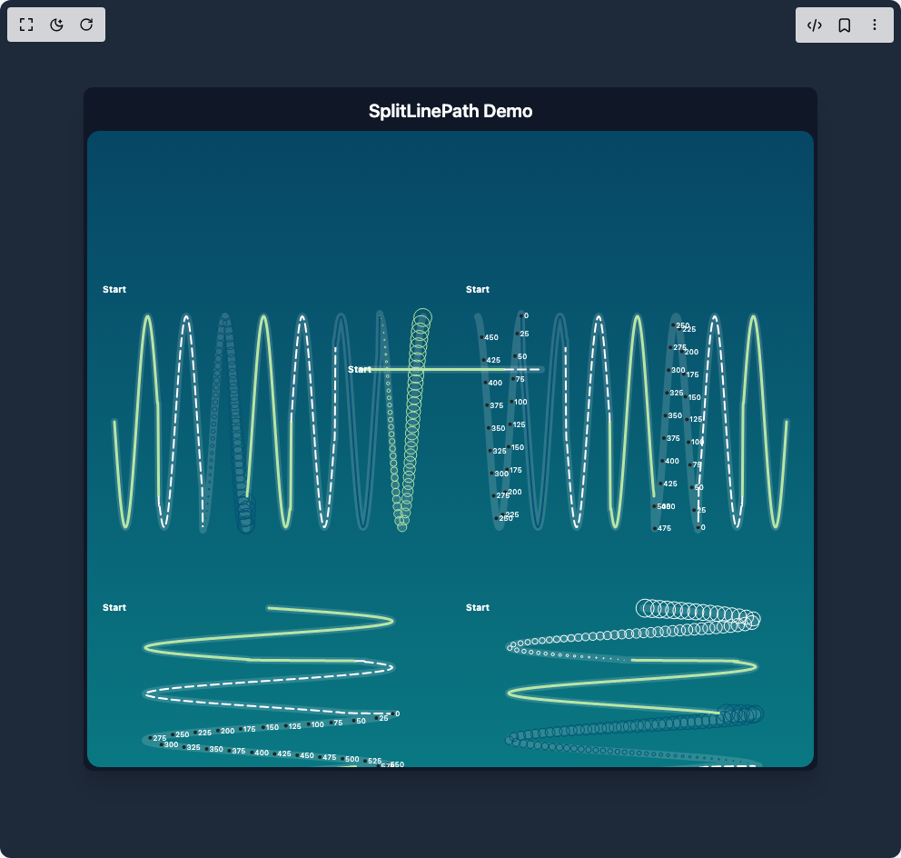

# Build Split Line Path in BuilderStudio

> Build this component in our Agentic IDE: [BuilderStudio](https://builderstudio.dev).
>
> Join the BuilderStudio community on [Discord](https://discord.gg/QdWeSGCqfe) and [Reddit](https://reddit.com/r/builderstudio).



## Component

- Author group: `airbnb`
- Component: `split-line-path`
- Variant: `default`
- Rendered HTML snapshot: [`rendered.html`](rendered.html)

## BuilderStudio prompt

You are implementing a React component based on a component reference.

## Component identity

- Author: airbnb
- Component slug: split-line-path
- Demo slug: default
- Title: split-line-path
- Description: 

## Goal

Recreate this component in a React + TypeScript + Tailwind CSS project. Preserve the visual layout, spacing, colors, border radius, shadows, interaction behavior, animation behavior, responsive behavior, and dark mode behavior shown in the rendered demo.

## Implementation requirements

- Use React and TypeScript.
- Use Tailwind CSS classes whenever possible.
- Keep the component self-contained unless the source files require helper components.
- If the source uses CSS variables, custom CSS, animations, or keyframes, include them.
- If the source uses external packages, list and use the required packages.
- Preserve accessibility attributes, button semantics, links, keyboard behavior, and ARIA attributes when visible in the source.
- Do not replace the component with a simplified placeholder.
- Return complete production-ready code.

## Dependencies

No reference metadata available.

## Rendered DOM snapshot

This is the rendered demo HTML extracted from the live preview. Use it to verify structure, class names, visible content, and layout.

```html
<div id="root"><div class="flex w-full min-h-screen justify-center items-center p-4 bg-gray-800"><div class="bg-gray-900 p-1 rounded-lg shadow-xl"><h1 class="text-center text-white text-xl font-semibold my-2">SplitLinePath Demo</h1><div><svg width="800" height="700"><defs><linearGradient id="visx-splitlinepath-gradient-maincomp" x1="0" y1="0" x2="0" y2="1"><stop offset="0%" stop-color="#045275" stop-opacity="0.8"></stop><stop offset="100%" stop-color="#089099" stop-opacity="0.8"></stop></linearGradient></defs><rect x="0" y="0" width="800" height="700" fill="url(#visx-splitlinepath-gradient-maincomp)" rx="14"></rect><g transform="translate(30, 175)"><path class="visx-linepath" d="M0,145C0,145,0.463531015678255,151.94605986669131,0.6952965235173825,155.39815983279829C0.9270620313565099,158.85025979890526,1.1588275391956375,162.30224742115252,1.390593047034765,165.71259979664185C1.6223585548738924,169.1229521721312,1.8541240627130198,172.51912745293532,2.085889570552147,175.86027408573432C2.3176550783912746,179.2014207185333,2.5494205862304025,182.514439651452,2.78118609406953,185.75947959343574C3.0129516019086573,189.0045195354195,3.2447171097477847,192.20770764002853,3.476482617586912,195.33051373763675C3.7082481254260395,198.45331983524497,3.940013633265167,201.5208869243701,4.171779141104294,204.4963161790851C4.403544648943422,207.47174543380012,4.635310156782549,210.37899326093995,4.867075664621677,213.18308926592687C5.098841172460804,215.98718527091378,5.330606680299932,218.71070638599824,5.56237218813906,221.32089220900667C5.794137695978187,223.9310780320151,6.025903203817315,226.44894424442995,6.257668711656442,228.84420420397743C6.489434219495569,231.2394641635249,6.721199727334697,233.53140309500918,6.952965235173824,235.69245196629146C7.184730743012952,237.85350083757373,7.416496250852079,239.90105914348942,7.6482617586912065,241.8104974316711C7.880027266530334,243.7199357198528,8.11179277436946,245.50662766466542,8.343558282208589,247.1490816953816C8.575323790047717,248.79153572609778,8.807089297886844,250.30297591682557,9.038854805725972,251.66522161596828C9.2706203135651,253.02746731511098,9.502385821404225,254.25148652405062,9.734151329243353,255.32255589023782C9.965916837082482,256.393625256425,10.197682344921608,257.3203684006178,10.429447852760736,258.09163781309155C10.661213360599865,258.8629072255653,10.892978868438991,259.4849127141303,11.12474437627812,259.95017236508045C11.356509884117248,260.4154320160306,11.588275391956376,260.7276918265071,11.820040899795503,260.8831957187925C12.05180640763463,261.03869961107785,12.283571915473757,261.03869961107785,12.515337423312884,260.88319571879254C12.74710293115201,260.7276918265072,12.978868438991139,260.4154320160306,13.210633946830267,259.95017236508045C13.442399454669395,259.4849127141303,13.67416496250852,258.8629072255653,13.905930470347649,258.09163781309155C14.137695978186777,257.3203684006178,14.369461486025905,256.393625256425,14.601226993865032,255.32255589023782C14.832992501704158,254.25148652405062,15.064758009543286,253.02746731511098,15.296523517382413,251.66522161596828C15.52828902522154,250.30297591682557,15.760054533060668,248.79153572609778,15.991820040899796,247.1490816953816C16.223585548738924,245.50662766466542,16.45535105657805,243.7199357198528,16.687116564417177,241.8104974316711C16.918882072256306,239.90105914348942,17.15064758009543,237.85350083757373,17.38241308793456,235.69245196629146C17.614178595773687,233.53140309500918,17.845944103612815,231.2394641635249,18.077709611451944,228.84420420397743C18.309475119291072,226.44894424442995,18.541240627130197,223.93107803201508,18.773006134969325,221.32089220900667C19.004771642808453,218.71070638599826,19.236537150647578,215.98718527091384,19.468302658486706,213.18308926592692C19.700068166325835,210.37899326094,19.931833674164963,207.47174543380015,20.16359918200409,204.4963161790851C20.39536468984322,201.52088692437007,20.627130197682344,198.45331983524497,20.858895705521473,195.33051373763675C21.0906612133606,192.20770764002853,21.322426721199726,189.00451953541952,21.554192229038854,185.75947959343577C21.785957736877982,182.51443965145202,22.01772324471711,179.2014207185333,22.24948875255624,175.86027408573432C22.481254260395367,172.51912745293532,22.713019768234492,169.12295217213122,22.94478527607362,165.71259979664188C23.17655078391275,162.30224742115254,23.408316291751877,158.85025979890526,23.640081799591005,155.39815983279829C23.871847307430134,151.94605986669131,24.103612815269255,148.46605327759943,24.335378323108383,145C24.56714383094751,141.53394672240057,24.79890933878664,138.05394013330874,25.030674846625768,134.60184016720177C25.262440354464896,131.1497402010948,25.49420586230402,127.6977525788475,25.72597137014315,124.28740020335816C25.957736877982278,120.87704782786882,26.189502385821406,117.48087254706473,26.421267893660534,114.13972591426575C26.653033401499663,110.79857928146677,26.884798909338784,107.485560348548,27.116564417177912,104.24052040656426C27.34832992501704,100.99548046458051,27.58009543285617,97.79229235997151,27.811860940695297,94.66948626236328C28.043626448534425,91.54668016475505,28.27539195637355,88.47911307562991,28.50715746421268,85.50368382091489C28.738922972051807,82.52825456619986,28.970688479890935,79.62100673906006,29.202453987730063,76.81691073407313C29.43421949556919,74.0128147290862,29.665985003408313,71.28929361400174,29.89775051124744,68.67910779099331C30.12951601908657,66.06892196798489,30.361281526925698,63.55105575557005,30.593047034764826,61.15579579602259C30.824812542603954,58.76053583647513,31.05657805044308,56.468596904990825,31.288343558282207,54.30754803370854C31.520109066121336,52.14649916242626,31.751874573960464,50.098940856510595,31.983640081799592,48.189502568328905C32.21540558963872,46.280064280147215,32.44717109747784,44.4933723353346,32.67893660531697,42.8509183046184C32.9107021131561,41.20846427390221,33.14246762099523,39.697024083174426,33.374233128834355,38.33477838403172C33.60599863667348,36.97253268488902,33.83776414451261,35.7485134759494,34.06952965235174,34.67744410976219C34.30129516019087,33.60637474357498,34.53306066802999,32.67963159938223,34.76482617586912,31.908362186908462C34.996591683708246,31.13709277443469,35.228357191547374,30.515087285869726,35.4601226993865,30.049827634919566C35.69188820722563,29.584567983969407,35.92365371506476,29.272308173492856,36.15541922290389,29.116804281207507C36.387184730743016,28.961300388922158,36.61895023858214,28.961300388922137,36.850715746421265,29.11680428120748C37.082481254260394,29.27230817349282,37.31424676209952,29.58456798396939,37.54601226993865,30.049827634919552C37.77777777777778,30.515087285869715,38.0095432856169,31.13709277443469,38.24130879345603,31.908362186908462C38.473074301295156,32.67963159938223,38.704839809134285,33.60637474357497,38.93660531697341,34.67744410976218C39.16837082481254,35.74851347594939,39.40013633265167,36.97253268488901,39.6319018404908,38.33477838403171C39.863667348329926,39.697024083174405,40.095432856169055,41.20846427390218,40.32719836400818,42.850918304618375C40.55896387184731,44.49337233533457,40.79072937968644,46.28006428014719,41.02249488752557,48.18950256832888C41.254260395364696,50.098940856510566,41.48602590320382,52.146499162426245,41.717791411042946,54.30754803370853C41.949556918882074,56.46859690499081,42.1813224267212,58.76053583647509,42.41308793456033,61.15579579602256C42.64485344239946,63.551055755570026,42.87661895023858,66.06892196798489,43.10838445807771,68.67910779099331C43.34014996591684,71.28929361400174,43.571915473755965,74.01281472908616,43.80368098159509,76.81691073407309C44.03544648943422,79.62100673906002,44.26721199727335,82.52825456619983,44.49897750511248,85.50368382091486C44.730743012951606,88.47911307562988,44.96250852079073,91.54668016475499,45.194274028629856,94.66948626236322C45.426039536468984,97.79229235997146,45.65780504430811,100.9954804645805,45.88957055214724,104.24052040656423C46.12133605998637,107.48556034854796,46.3531015678255,110.79857928146667,46.584867075664626,114.13972591426565C46.816632583503754,117.48087254706464,47.04839809134288,120.87704782786878,47.28016359918201,124.28740020335812C47.51192910702114,127.69775257884746,47.74369461486025,117.47900909815479,47.97546012269938,134.6018401672017C48.20722563053851,151.72467123624858,48.43899113837764,210.45022833191823,48.670756646216766,227.0243866176395C48.902522154055895,243.59854490336076,49.13428766189502,231.82548085914294,49.36605316973415,234.04678988152926C49.59781867757328,236.2680989039156,49.82958418541241,238.37837715786893,50.061349693251536,240.35224075195748C50.293115201090664,242.32610434604604,50.524880708929786,244.17944566931646,50.756646216768914,245.88997144606066C50.98841172460804,247.60049722280485,51.22017723244717,249.1819796008043,51.4519427402863,250.61539541242263C51.68370824812543,252.04881122404095,51.915473755964555,253.34570149055844,52.147239263803684,254.49046631577062C52.37900477164281,255.6352311409828,52.61077027948194,256.6370874981514,52.84253578732107,257.48398436369564C53.0743012951602,258.3308812292399,53.30606680299931,259.02963731875377,53.53783231083844,259.571847509036C53.76959781867757,260.1140576993182,54.001363326516696,260.50408754800645,54.233128834355824,260.7372455053889C54.46489434219495,260.97040346277134,54.69665985003408,261.04856677962624,54.92842535787321,260.9707952533308C55.16019086571234,260.8930237270353,55.391956373551466,260.65869118698873,55.623721881390594,260.27061634761617C55.85548738922972,259.8825415082436,56.08725289706884,259.3375998191227,56.31901840490797,258.64234621709534C56.5507839127471,257.94709261506796,56.78254942058623,257.09592932693306,57.01431492842536,256.0990947354519C57.246080436264485,255.10226014397077,57.47784594410361,253.95172832314202,57.70961145194274,252.6613386682085C57.94137695978187,251.37094901327495,58.173142467621,249.93031206547187,58.40490797546013,248.35675680585064C58.636673483299255,246.7832015462294,58.86843899113837,245.06405863307506,59.1002044989775,243.22000711048105C59.331970006816626,241.37595558788703,59.563735514655754,239.39214823727815,59.79550102249488,237.29244767028655C60.02726653033401,235.19274710329495,60.25903203817314,232.96024776555913,60.49079754601227,230.62180370853147C60.722563053851395,228.28335965150382,60.954328561690524,225.82014309861998,61.18609406952965,223.2617833281206C61.41785957736878,220.70342355762122,61.64962508520791,218.0293221609255,61.88139059304704,215.27164508553523C62.113156100886165,212.51396801014496,62.344921608725286,209.65051206173698,62.576687116564415,206.715720875779C62.80845262440354,203.78092968982102,63.04021813224267,200.75117405331292,63.2719836400818,197.66289796978737C63.50374914792093,194.5746218862618,63.735514655760056,191.40296037257116,63.967280163599185,188.18606437462557C64.19904567143831,184.96916837668,64.43081117927744,181.68113733940828,64.66257668711657,178.36152198211394C64.8943421949557,175.0419066248196,65.12610770279481,171.66397935654797,65.35787321063394,168.2683722308596C65.58963871847307,164.87276510517123,65.8214042263122,161.4321386900747,66.05316973415133,157.98787922798365C66.28493524199045,154.5436197658926,66.51670074982958,151.06799610481002,66.74846625766871,147.6028154583133C66.98023176550784,144.13763481181658,67.21199727334697,140.65499758283337,67.4437627811861,137.19679534900334C67.67552828902522,133.7385931151733,67.90729379686435,130.27698246549969,68.13905930470348,126.85360205533316C68.37082481254261,123.43022164516664,68.60259032038174,120.01750842835966,68.83435582822086,116.65651288800423C69.06612133606,113.2955173476488,69.29788684389911,109.95917872388733,69.52965235173824,106.68762881320056C69.76141785957736,103.41607890251379,69.99318336741649,100.18297710866102,70.22494887525562,97.02721342388355C70.45671438309475,93.87144973910608,70.68847989093388,90.76761580977305,70.920245398773,87.7530467045357C71.15201090661213,84.73847759929836,71.38377641445126,81.78890178025927,71.61554192229039,78.93979879245951C71.84730743012952,76.09069580465976,72.07907293796865,73.31912634608699,72.31083844580778,70.65842877773714C72.5426039536469,67.9977312093873,72.77436946148603,65.42648315890484,73.00613496932516,62.975613382360436C73.23790047716429,60.52474360581602,73.4696659850034,58.174519140857,73.70143149284253,55.953210118470665C73.93319700068166,53.73190109608433,74.16496250852079,51.62162284213098,74.39672801635992,49.64775924804242C74.62849352419904,47.673895653953856,74.86025903203817,45.82055433068347,75.0920245398773,44.11002855393929C75.32379004771643,42.3995027771951,75.55555555555556,40.81802039919565,75.78732106339469,39.38460458757733C76.01908657123381,37.951188775959004,76.25085207907293,36.654298509441524,76.48261758691206,35.50953368422935C76.71438309475118,34.36476885901718,76.94614860259031,33.36291250184853,77.17791411042944,32.5160156363043C77.40967961826857,31.66911877076008,77.6414451261077,30.97036268124621,77.87321063394683,30.42815249096401C78.10497614178595,29.88594230068181,78.33674164962508,29.49591245199355,78.56850715746421,29.262754494611087C78.80027266530334,29.029596537228624,79.03203817314247,28.951433220373758,79.2638036809816,29.029204746669222C79.49556918882072,29.106976272964687,79.72733469665985,29.3413088130113,79.95910020449898,29.729383652383873C80.19086571233811,30.117458491756448,80.42263122017724,30.66240018087731,80.65439672801637,31.357653782904677C80.8861622358555,32.05290738493204,81.11792774369462,32.90407067306693,81.34969325153375,33.90090526454807C81.58145875937288,34.89773985602921,81.81322426721201,36.04827167685797,82.04498977505114,37.33866133179151C82.27675528289026,38.629050986725055,82.50852079072938,40.069687934528076,82.7402862985685,41.643243194149335C82.97205180640763,43.21679845377059,83.20381731424676,44.93594136692505,83.43558282208589,46.779992889519065C83.66734832992502,48.62404441211308,83.89911383776415,50.60785176272185,84.13087934560328,52.70755232971342C84.3626448534424,54.807252896704995,84.59441036128153,57.03975223444085,84.82617586912066,59.37819629146851C85.05794137695979,61.71664034849618,85.2897068847989,64.17985690138,85.52147239263803,66.73821667187941C85.75323790047716,69.29657644237882,85.98500340831629,71.97067783907468,86.21676891615542,74.72835491446494C86.44853442399454,77.4860319898552,86.68029993183367,80.34948793826305,86.9120654396728,83.284279124221C87.14383094751193,86.21907031017895,87.37559645535106,89.24882594668703,87.60736196319019,92.3371020302126C87.83912747102931,95.42537811373818,88.07089297886844,98.59703962742883,88.30265848670757,101.8139356253744C88.5344239945467,105.03083162331997,88.76618950238583,108.31886266059169,88.99795501022496,111.63847801788603C89.22972051806408,114.95809337518037,89.4614860259032,118.33602064345202,89.69325153374233,121.7316277691404C89.92501704158146,125.12723489482879,90.15678254942058,128.5678613099253,90.38854805725971,132.01212077201635C90.62031356509884,135.4563802341074,90.85207907293797,138.93200389518995,91.0838445807771,142.39718454168667C91.31561008861622,145.8623651881834,91.54737559645535,149.3450024171666,91.77914110429448,152.80320465099663C92.01090661213361,156.26140688482667,92.24267211997274,159.72301753450031,92.47443762781187,163.14639794466683C92.706203135651,166.56977835483335,92.93796864349012,169.9824915716403,93.16973415132925,173.34348711199576C93.40149965916838,176.7044826523512,93.63326516700751,180.04082127611264,93.86503067484664,183.31237118679942C94.09679618268576,186.5839210974862,94.3285616905249,189.81702289133898,94.56032719836402,192.97278657611645C94.79209270620315,196.12855026089392,95.02385821404225,199.23238419022692,95.25562372188138,202.24695329546427C95.4873892297205,205.2615224007016,95.71915473755963,208.2110982197407,95.95092024539876,211.06020120754047C96.18268575323789,213.90930419534024,96.41445126107702,211.0182714235196,96.64621676891615,219.34157122226284C96.87798227675528,227.6648710210061,97.1097477845944,254.13475885313585,97.34151329243353,261C97.57327880027266,267.86524114686415,97.80504430811179,260.8437127238742,98.03680981595092,260.5330181034477C98.26857532379005,260.2223234830212,98.50034083162917,259.75471998789584,98.7321063394683,259.13583227744107C98.96387184730743,258.5169445669863,99.19563735514656,257.7417897212576,99.42740286298569,256.81969184071903C99.65916837082482,255.89759396018044,99.89093387866394,254.8211288548827,100.12269938650307,253.6032449942096C100.3544648943422,252.38536113353652,100.58623040218133,251.01625283274606,100.81799591002046,249.51238867668056C101.04976141785959,248.00852452061505,101.2815269256987,246.3577962793476,101.51329243353783,244.58006005781652C101.74505794137696,242.80232383628544,101.97682344921608,240.8832663477269,102.20858895705521,238.84597134749396C102.44035446489434,236.808676347261,102.67211997273347,234.63674073392184,102.9038854805726,232.3562900564189C103.13565098841173,230.075839378916,103.36741649625085,227.66851278927732,103.59918200408998,225.16326728247634C103.83094751192911,222.65802177567537,104.06271301976824,220.03468658795188,104.29447852760737,217.32481701561315C104.5262440354465,214.61494744327442,104.75800954328562,211.79672520990147,104.98977505112475,208.90404984844395C105.22154055896388,206.01137448698643,105.45330606680301,203.0209558762995,105.68507157464214,199.96876484686808C105.91683708248127,196.91657381743667,106.1486025903204,193.77803592175113,106.38036809815952,190.59090367185541C106.61213360599865,187.4037714219597,106.84389911383775,184.14238390298092,107.07566462167688,180.8459713474938C107.307430129516,177.54955879200665,107.53919563735514,174.19158042437348,107.77096114519426,170.81242833893253C108.00272665303339,167.43327625349158,108.23449216087252,164.00574350456023,108.46625766871165,160.57105883484812C108.69802317655078,157.136374165136,108.9297886843899,153.66688351324444,109.16155419222903,150.2043203206598C109.39331970006816,146.74175712807516,109.62508520790729,143.25824287192498,109.85685071574642,139.79567967934034C110.08861622358555,136.3331164867557,110.32038173142467,132.86362583486414,110.5521472392638,129.42894116515203C110.78391274710293,125.9942564954399,111.01567825494206,122.56672374650854,111.24744376278119,119.1875716610676C111.47920927062032,115.80841957562664,111.71097477845944,112.45044120799349,111.94274028629857,109.15402865250636C112.1745057941377,105.85761609701922,112.40627130197682,102.59622857804045,112.63803680981594,99.40909632814473C112.86980231765507,96.221964078249,113.1015678254942,93.08342618256349,113.33333333333333,90.03123515313203C113.56509884117246,86.97904412370058,113.79686434901159,83.98862551301346,114.02862985685071,81.09595015155598C114.26039536468984,78.2032747900985,114.49216087252897,75.38505255672585,114.7239263803681,72.67518298438712C114.95569188820723,69.96531341204839,115.18745739604636,67.34197822432458,115.41922290388548,64.8367327175236C115.65098841172461,62.331487210722635,115.88275391956374,59.92416062108425,116.11451942740287,57.643709943581314C116.346284935242,55.36325926607838,116.57805044308112,53.19132365273896,116.80981595092025,51.154028652506014C117.04158145875938,49.11673365227307,117.27334696659851,47.197676163714746,117.50511247443764,45.41993994218366C117.73687798227677,43.642203720652574,117.96864349011587,41.99147547938505,118.200408997955,40.48761132331951C118.43217450579412,38.98374716725397,118.66394001363325,37.61463886646353,118.89570552147238,36.39675500579044C119.12747102931151,35.17887114511735,119.35923653715064,34.10240603981954,119.59100204498976,33.18030815928097C119.82276755282889,32.258210278742396,120.05453306066802,31.483055433013774,120.28629856850715,30.86416772255899C120.51806407634628,30.245280012104203,120.7498295841854,29.777676516978755,120.98159509202453,29.466981896552255C121.21336059986366,29.156287276125756,121.44512610770279,28.999999999999996,121.67689161554192,29C121.90865712338105,29.000000000000004,122.14042263122018,29.1562872761258,122.3721881390593,29.466981896552284C122.60395364689843,29.77767651697877,122.83571915473756,30.245280012104125,123.06748466257669,30.864167722558904C123.29925017041582,31.483055433013682,123.53101567825495,32.258210278742375,123.76278118609407,33.180308159280955C123.9945466939332,34.102406039819535,124.22631220177232,35.17887114511729,124.45807770961144,36.39675500579037C124.68984321745057,37.614638866463444,124.9216087252897,38.98374716725392,125.15337423312883,40.48761132331941C125.38513974096796,41.99147547938491,125.61690524880709,43.64220372065224,125.84867075664621,45.41993994218336C126.08043626448534,47.19767616371448,126.31220177232447,49.116733652273226,126.5439672801636,51.154028652506156C126.77573278800273,53.19132365273909,127.00749829584186,55.363259266078,127.23926380368098,57.643709943580944C127.47102931152011,59.924160621083885,127.70279481935924,62.331487210722834,127.93456032719837,64.83673271752379C128.1663258350375,67.34197822432475,128.39809134287663,69.96531341204795,128.62985685071575,72.67518298438668C128.86162235855488,75.38505255672541,129.093387866394,78.20327479009867,129.32515337423314,81.09595015155621C129.55691888207227,83.98862551301374,129.78868438991137,86.97904412370043,130.0204498977505,90.03123515313189C130.25221540558962,93.08342618256334,130.48398091342875,96.22196407824931,130.71574642126788,99.40909632814497C130.947511929107,102.59622857804062,131.17927743694614,105.8576160970187,131.41104294478527,109.15402865250581C131.6428084526244,112.45044120799292,131.87457396046352,115.80841957562667,132.10633946830265,119.18757166106765C132.33810497614178,122.56672374650863,132.5698704839809,125.99425649543956,132.80163599182004,129.42894116515168C133.03340149965916,132.8636258348638,133.2651670074983,136.33311648675578,133.49693251533742,139.7956796793404C133.72869802317655,143.258242871925,133.96046353101568,146.74175712807482,134.1922290388548,150.20432032065943C134.42399454669393,153.66688351324404,134.65576005453306,157.13637416513603,134.8875255623722,160.57105883484815C135.11929107021132,164.00574350456026,135.35105657805045,167.43327625349121,135.58282208588957,170.8124283389322C135.8145875937287,174.19158042437317,136.04635310156783,177.5495587920069,136.27811860940696,180.84597134749401C136.5098841172461,184.14238390298112,136.74164962508522,187.40377142195922,136.97341513292434,190.59090367185487C137.20518064076347,193.77803592175053,137.4369461486026,196.91657381743647,137.66871165644173,199.96876484686794C137.90047716428086,203.0209558762994,138.13224267212,206.0113744869861,138.36400817995911,208.90404984844366C138.59577368779824,211.7967252099012,138.82753919563734,214.61494744327445,139.05930470347647,217.32481701561318C139.2910702113156,220.0346865879519,139.52283571915473,222.65802177567514,139.75460122699386,225.1632672824761C139.98636673483298,227.6685127892771,140.2181322426721,230.07583937891604,140.44989775051124,232.35629005641897C140.68166325835037,234.6367407339219,140.9134287661895,236.8086763472608,141.14519427402863,238.84597134749373C141.37695978186775,240.88326634772665,141.60872528970688,242.8023238362854,141.840490797546,244.58006005781652C142.07225630538514,246.35779627934764,142.30402181322427,248.00852452061497,142.5357873210634,249.51238867668047C142.76755282890252,251.01625283274598,142.99931833674165,252.38536113353646,143.23108384458078,253.60324499420955C143.4628493524199,254.82112885488263,143.69461486025904,255.89759396018033,143.92638036809817,256.8196918407189C144.1581458759373,257.74178972125753,144.38991138377642,258.51694456698624,144.62167689161555,259.13583227744107C144.85344239945468,259.7547199878959,145.0852079072938,265.88492571341465,145.31697341513294,260.5330181034477C145.54873892297206,255.18111049348082,145.7805044308112,233.88962776450379,146.01226993865032,227.02438661763966C146.24403544648945,220.15914547077554,146.47580095432858,222.0022687906128,146.7075664621677,219.34157122226296C146.93933197000683,216.68087365391312,147.17109747784593,213.90930419534038,147.40286298568506,211.06020120754062C147.6346284935242,208.21109821974085,147.86639400136332,205.26152240070175,148.09815950920245,202.2469532954644C148.32992501704157,199.23238419022707,148.5616905248807,196.12855026089406,148.79345603271983,192.9727865761166C149.02522154055896,189.81702289133912,149.2569870483981,186.58392109748635,149.48875255623722,183.31237118679957C149.72051806407634,180.04082127611278,149.95228357191547,176.70448265235132,150.1840490797546,173.3434871119959C150.41581458759373,169.98249157164048,150.64758009543286,166.5697783548335,150.879345603272,163.14639794466697C151.11111111111111,159.72301753450046,151.34287661895024,156.26140688482684,151.57464212678937,152.8032046509968C151.8064076346285,149.34500241716677,152.03817314246763,145.86236518818356,152.26993865030676,142.39718454168684C152.50170415814588,138.93200389519012,152.73346966598498,135.45638023410754,152.9652351738241,132.0121207720165C153.19700068166324,128.56786130992543,153.42876618950237,125.12723489482894,153.6605316973415,121.73162776914056C153.89229720518063,118.33602064345217,154.12406271301975,114.95809337518054,154.35582822085888,111.6384780178862C154.587593728698,108.31886266059186,154.81935923653714,105.03083162332011,155.05112474437627,101.81393562537454C155.2828902522154,98.59703962742897,155.51465576005452,95.42537811373832,155.74642126789365,92.33710203021275C155.97818677573278,89.24882594668718,156.2099522835719,86.21907031017909,156.44171779141104,83.28427912422114C156.67348329925017,80.3494879382632,156.9052488070893,77.48603198985533,157.13701431492842,74.72835491446506C157.36877982276755,71.97067783907478,157.60054533060668,69.29657644237892,157.8323108384458,66.73821667187951C158.06407634628493,64.1798569013801,158.29584185412406,61.71664034849628,158.5276073619632,59.37819629146861C158.75937286980232,57.03975223444095,158.99113837764145,54.8072528967051,159.22290388548058,52.70755232971352C159.4546693933197,50.60785176272194,159.68643490115883,48.62404441211315,159.91820040899796,46.779992889519136C160.1499659168371,44.93594136692512,160.38173142467622,43.216798453770686,160.61349693251535,41.64324319414942C160.84526244035447,40.069687934528154,161.0770279481936,38.629050986725105,161.30879345603273,37.338661331791556C161.54055896387186,36.04827167685801,161.772324471711,34.897739856029254,162.00408997955012,33.900905264548115C162.23585548738924,32.904070673066975,162.46762099522837,32.05290738493209,162.6993865030675,31.35765378290472C162.93115201090663,30.662400180877345,163.16291751874576,30.117458491756455,163.3946830265849,29.729383652383873C163.62644853442401,29.341308813011292,163.85821404226314,29.106976272964687,164.08997955010227,29.029204746669222C164.3217450579414,28.951433220373758,164.5535105657805,29.029596537228624,164.78527607361963,29.262754494611087C165.01704158145876,29.49591245199355,165.24880708929788,29.8859423006818,165.480572597137,30.428152490963996C165.71233810497614,30.97036268124619,165.94410361281527,31.669118770760047,166.1758691206544,32.51601563630426C166.40763462849353,33.36291250184848,166.63940013633265,34.36476885901712,166.87116564417178,35.50953368422928C167.1029311520109,36.654298509441446,167.33469665985004,37.95118877595893,167.56646216768917,39.38460458757726C167.7982276755283,40.81802039919558,168.02999318336742,42.39950277719504,168.26175869120655,44.110028553939216C168.49352419904568,45.82055433068339,168.7252897068848,47.67389565395378,168.95705521472394,49.647759248042334C169.18882072256307,51.62162284213089,169.4205862304022,53.73190109608423,169.65235173824132,55.953210118470565C169.88411724608045,58.1745191408569,170.11588275391958,60.52474360581593,170.3476482617587,62.975613382360336C170.57941376959783,65.42648315890474,170.81117927743693,67.99773120938718,171.04294478527606,70.65842877773703C171.2747102931152,73.31912634608688,171.50647580095435,76.09069580465965,171.73824130879348,78.9397987924594C171.9700068166326,81.78890178025915,172.2017723244717,84.73847759929822,172.43353783231083,87.75304670453556C172.66530334014996,90.7676158097729,172.89706884798906,93.87144973910594,173.1288343558282,97.02721342388341C173.36059986366732,100.18297710866088,173.59236537150647,103.41607890251362,173.8241308793456,106.6876288132004C174.05589638718473,109.95917872388719,174.28766189502383,113.29551734764866,174.51942740286296,116.65651288800409C174.7511929107021,120.01750842835952,174.98295841854124,123.43022164516648,175.21472392638037,126.853602055333C175.4464894342195,130.27698246549951,175.6782549420586,133.73859311517316,175.91002044989773,137.1967953490032C176.14178595773686,140.65499758283323,176.373551465576,144.13763481181644,176.60531697341514,147.60281545831316C176.83708248125427,151.06799610480988,177.06884798909337,154.54361976589243,177.3006134969325,157.98787922798348C177.53237900477163,161.43213869007454,177.76414451261078,164.87276510517103,177.9959100204499,168.26837223085943C178.22767552828904,171.66397935654783,178.45944103612814,175.04190662481946,178.69120654396727,178.3615219821138C178.9229720518064,181.68113733940814,179.15473755964553,184.96916837667987,179.38650306748465,188.18606437462543C179.61826857532378,191.402960372571,179.8500340831629,194.57462188626164,180.08179959100204,197.66289796978722C180.31356509884117,200.7511740533128,180.5453306066803,203.7809296898209,180.77709611451942,206.71572087577886C181.00886162235855,209.6505120617368,181.24062713019768,212.51396801014468,181.4723926380368,215.27164508553494C181.70415814587594,218.0293221609252,181.93592365371507,220.70342355762108,182.1676891615542,223.2617833281205C182.39945466939332,225.8201430986199,182.63122017723245,228.28335965150373,182.86298568507158,230.6218037085314C183.0947511929107,232.96024776555905,183.32651670074983,235.19274710329492,183.55828220858896,237.2924476702865C183.7900477164281,239.39214823727806,184.02181322426722,241.37595558788684,184.25357873210635,243.22000711048085C184.48534423994548,245.06405863307486,184.7171097477846,246.78320154622932,184.94887525562373,248.35675680585058C185.18064076346286,249.93031206547184,185.41240627130196,251.37094901327487,185.6441717791411,252.66133866820843C185.87593728698022,253.951728323142,186.10770279481937,255.10226014397077,186.3394683026585,256.0990947354519C186.57123381049763,257.09592932693306,186.80299931833673,257.9470926150679,187.03476482617586,258.6423462170953C187.266530334015,259.33759981912266,187.49829584185414,259.88254150824355,187.73006134969327,260.2706163476161C187.9618268575324,260.6586911869887,188.1935923653715,260.8930237270353,188.42535787321063,260.9707952533308C188.65712338104976,261.04856677962624,188.8888888888889,260.97040346277134,189.12065439672804,260.7372455053889C189.35241990456717,260.50408754800645,189.58418541240627,260.1140576993182,189.8159509202454,259.571847509036C190.04771642808453,259.02963731875377,190.27948193592363,258.33088122923994,190.51124744376276,257.48398436369575C190.74301295160188,256.6370874981516,190.97477845944104,255.6352311409829,191.20654396728017,254.49046631577073C191.4383094751193,253.34570149055855,191.6700749829584,252.04881122404106,191.90184049079753,250.61539541242274C192.13360599863665,249.18197960080442,192.3653715064758,247.60049722280493,192.59713701431494,245.88997144606077C192.82890252215407,244.1794456693166,193.06066802999317,242.32610434604626,193.2924335378323,240.3522407519577C193.52419904567142,238.37837715786915,193.75596455351058,249.9388300068557,193.9877300613497,234.04678988152943C194.21949556918884,218.15474975620316,194.45126107702794,161.57415828572138,194.68302658486706,145.0000000000001C194.9147920927062,128.42584171427885,195.14655760054535,138.0539401333088,195.37832310838448,134.60184016720183C195.6100886162236,131.14974020109486,195.8418541240627,127.69775257884761,196.07361963190183,124.28740020335827C196.30538513974096,120.87704782786894,196.5371506475801,117.48087254706479,196.76891615541922,114.13972591426581C197.00068166325835,110.79857928146683,197.23244717109748,107.48556034854812,197.4642126789366,104.24052040656437C197.69597818677573,100.99548046458062,197.92774369461486,97.79229235997154,198.159509202454,94.66948626236336C198.39127471029312,91.54668016475519,198.62304021813225,88.47911307563031,198.85480572597137,85.50368382091534C199.0865712338105,82.52825456620037,199.31833674164963,79.62100673906048,199.55010224948876,76.81691073407355C199.7818677573279,74.01281472908661,200.01363326516702,71.28929361400226,200.24539877300614,68.67910779099374C200.47716428084527,66.06892196798522,200.7089297886844,63.551055755569955,200.94069529652353,61.15579579602239C201.17246080436266,58.76053583647482,201.40422631220179,56.46859690499063,201.6359918200409,54.30754803370836C201.86775732788004,52.14649916242608,202.09952283571914,50.09894085651038,202.33128834355827,48.189502568328734C202.5630538513974,46.28006428014709,202.79481935923653,44.49337233533462,203.02658486707566,42.85091830461846C203.25835037491478,41.2084642739023,203.4901158827539,39.69702408317448,203.72188139059304,38.33477838403178C203.95364689843217,36.972532684889075,204.1854124062713,35.74851347594944,204.41717791411043,34.67744410976222C204.64894342194955,33.606374743575,204.88070892978868,32.67963159938226,205.1124744376278,31.90836218690849C205.34423994546694,31.13709277443472,205.57600545330607,30.515087285869757,205.8077709611452,30.049827634919595C206.03953646898432,29.584567983969432,206.27130197682345,29.27230817349286,206.50306748466258,29.116804281207507C206.7348329925017,28.961300388922155,206.96659850034084,28.961300388922137,207.19836400817996,29.11680428120748C207.4301295160191,29.27230817349282,207.6618950238582,29.584567983969396,207.89366053169732,30.049827634919552C208.12542603953645,30.515087285869708,208.3571915473756,31.13709277443466,208.58895705521473,31.90836218690842C208.82072256305386,32.67963159938218,209.05248807089296,33.60637474357491,209.2842535787321,34.67744410976212C209.51601908657122,35.74851347594933,209.74778459441038,36.97253268488897,209.9795501022495,38.334778384031665C210.21131561008863,39.69702408317436,210.44308111792773,41.208464273902166,210.67484662576686,42.85091830461832C210.906612133606,44.49337233533447,211.13837764144515,46.28006428014693,211.37014314928427,48.18950256832858C211.6019086571234,50.098940856510225,211.8336741649625,52.14649916242592,212.06543967280163,54.30754803370819C212.29720518064076,56.468596904990456,212.52897068847992,58.760535836474645,212.76073619631904,61.155795796022204C212.99250170415817,63.55105575556976,213.22426721199727,66.06892196798502,213.4560327198364,68.67910779099354C213.68779822767553,71.28929361400206,213.91956373551463,74.0128147290864,214.15132924335376,76.81691073407333C214.38309475119289,79.62100673906026,214.61486025903204,82.52825456620015,214.84662576687117,85.50368382091511C215.0783912747103,88.47911307563008,215.3101567825494,91.54668016475497,215.54192229038853,94.66948626236314C215.77368779822766,97.7922923599713,216.0054533060668,100.99548046458038,216.23721881390594,104.24052040656412C216.46898432174507,107.48556034854785,216.70074982958417,110.79857928146657,216.9325153374233,114.13972591426555C217.16428084526243,117.48087254706454,217.39604635310158,120.87704782786867,217.6278118609407,124.287400203358C217.85957736877984,127.69775257884734,218.09134287661894,131.1497402010946,218.32310838445807,134.60184016720157C218.5548738922972,138.05394013330854,218.78663940013632,141.53394672240043,219.01840490797545,144.99999999999986C219.25017041581458,148.4660532775993,219.4819359236537,151.94605986669117,219.71370143149284,155.39815983279814C219.94546693933196,158.8502597989051,220.1772324471711,162.30224742115237,220.40899795501022,165.7125997966417C220.64076346284935,169.12295217213105,220.87252897068848,172.51912745293518,221.1042944785276,175.86027408573418C221.33605998636673,179.20142071853317,221.56782549420586,182.51443965145188,221.799591002045,185.75947959343563C222.03135650988412,189.00451953541938,222.26312201772325,192.20770764002845,222.49488752556238,195.3305137376366C222.7266530334015,198.45331983524477,222.95841854124063,201.52088692436965,223.19018404907976,204.49631617908463C223.4219495569189,207.4717454337996,223.65371506475802,210.37899326093955,223.88548057259715,213.18308926592644C224.11724608043627,215.98718527091333,224.3490115882754,218.7107063859974,224.58077709611453,221.32089220900593C224.81254260395366,223.93107803201445,225.04430811179276,226.44894424443004,225.2760736196319,228.8442042039776C225.50783912747102,231.23946416352516,225.73960463531017,233.5314030950091,225.9713701431493,235.69245196629137C226.20313565098843,237.85350083757365,226.43490115882753,239.90105914348956,226.66666666666666,241.81049743167125C226.89843217450579,243.71993571985294,227.13019768234494,245.50662766466536,227.36196319018407,247.14908169538154C227.5937286980232,248.79153572609772,227.8254942058623,250.3029759168257,228.05725971370143,251.6652216159684C228.28902522154056,253.0274673151111,228.5207907293797,254.2514865240506,228.75255623721884,255.32255589023777C228.98432174505797,256.3936252564249,229.21608725289707,257.32036840061767,229.4478527607362,258.09163781309144C229.67961826857533,258.8629072255652,229.91138377641448,259.4849127141302,230.1431492842536,259.9501723650804C230.37491479209274,260.4154320160306,230.60668029993184,260.72769182650717,230.83844580777097,260.88319571879254C231.0702113156101,261.0386996110779,231.3019768234492,261.03869961107785,231.53374233128832,260.88319571879254C231.76550783912745,260.7276918265072,231.9972733469666,260.41543201603065,232.22903885480574,259.9501723650805C232.46080436264486,259.48491271413036,232.69256987048396,258.8629072255653,232.9243353783231,258.09163781309155C233.15610088616222,257.3203684006178,233.38786639400138,256.3936252564249,233.6196319018405,255.32255589023774C233.85139740967963,254.25148652405053,234.08316291751873,253.02746731511098,234.31492842535786,251.66522161596833C234.546693933197,250.3029759168257,234.77845944103615,248.791535726098,235.01022494887528,247.14908169538188C235.2419904567144,245.50662766466576,235.4737559645535,243.71993571985334,235.70552147239263,241.81049743167165C235.93728698023176,239.90105914348996,236.16905248807086,237.85350083757416,236.40081799591,235.6924519662918C236.63258350374912,233.53140309500944,236.86434901158827,231.2394641635251,237.0961145194274,228.84420420397754C237.32788002726653,226.44894424442998,237.55964553510563,223.931078032015,237.79141104294476,221.32089220900647C238.0231765507839,218.71070638599795,238.25494205862304,215.9871852709133,238.48670756646217,213.18308926592636C238.7184730743013,210.3789932609394,238.9502385821404,207.4717454337998,239.18200408997953,204.49631617908489C239.41376959781866,201.52088692436996,239.6455351056578,198.453319835245,239.87730061349694,195.3305137376369C240.10906612133607,192.2077076400288,240.34083162917517,189.00451953542003,240.5725971370143,185.75947959343628C240.80436264485343,182.51443965145253,241.03612815269258,179.20142071853357,241.2678936605317,175.86027408573446C241.49965916837084,172.51912745293535,241.73142467620994,169.12295217213094,241.96319018404907,165.7125997966416C242.1949556918882,162.30224742115226,242.42672119972733,172.5209909018453,242.65848670756645,155.39815983279846C242.89025221540558,138.27532876375162,243.1220177232447,79.54977166808176,243.35378323108384,62.97561338236052C243.58554873892297,46.40145509663928,243.8173142467621,58.17451914085735,244.04907975460122,55.953210118471006C244.28084526244035,53.73190109608466,244.51261077027948,51.621622842131046,244.7443762781186,49.647759248042476C244.97614178595774,47.673895653953906,245.20790729379686,45.820554330683755,245.439672801636,44.11002855393957C245.67143830947512,42.39950277719539,245.90320381731425,40.81802039919572,246.13496932515338,39.38460458757737C246.3667348329925,37.951188775959025,246.59850034083163,36.65429850944165,246.83026584867076,35.50953368422951C247.0620313565099,34.36476885901737,247.29379686434902,33.36291250184877,247.52556237218815,32.51601563630453C247.75732788002728,31.669118770760292,247.9890933878664,30.97036268124632,248.22085889570553,30.42815249096408C248.45262440354466,29.88594230068184,248.68438991138376,29.495912451993565,248.9161554192229,29.262754494611087C249.14792092706202,29.02959653722861,249.37968643490117,28.95143322037376,249.6114519427403,29.029204746669222C249.84321745057943,29.106976272964683,250.07498295841853,29.341308813011256,250.30674846625766,29.729383652383845C250.5385139740968,30.117458491756434,250.77027948193594,30.662400180877384,251.00204498977507,31.357653782904748C251.2338104976142,32.05290738493211,251.4655760054533,32.90407067306689,251.69734151329243,33.90090526454803C251.92910702113156,34.89773985602917,252.1608725289707,36.04827167685806,252.39263803680984,37.3386613317916C252.62440354464897,38.62905098672514,252.85616905248807,40.06968793452802,253.0879345603272,41.64324319414929C253.31970006816633,43.216798453770565,253.55146557600543,44.93594136692521,253.78323108384456,46.77999288951922C254.01499659168368,48.62404441211323,254.24676209952284,50.607851762721765,254.47852760736197,52.70755232971335C254.7102931152011,54.80725289670494,254.9420586230402,57.03975223444106,255.17382413087932,59.378196291468726C255.40558963871845,61.71664034849639,255.6373551465576,64.17985690138003,255.86912065439674,66.73821667187933C256.10088616223584,69.29657644237862,256.33265167007494,71.97067783907424,256.5644171779141,74.7283549144645C256.79618268575325,77.48603198985477,257.02794819359235,80.34948793826297,257.2597137014315,83.2842791242209C257.49147920927066,86.21907031017884,257.72324471710976,89.24882594668658,257.95501022494886,92.33710203021215C258.18677573278796,95.42537811373772,258.4185412406272,98.59703962742873,258.6503067484663,101.8139356253743C258.8820722563054,105.03083162331987,259.11383776414453,108.31886266059121,259.34560327198363,111.63847801788555C259.57736877982273,114.95809337517989,259.8091342876619,118.33602064345192,260.040899795501,121.73162776914029C260.2726653033401,125.12723489482866,260.5044308111793,128.56786130992475,260.7361963190184,132.0121207720158C260.9679618268575,135.45638023410686,261.1997273346966,138.9320038951897,261.43149284253576,142.39718454168656C261.6632583503749,145.86236518818342,261.895023858214,149.3450024171669,262.1267893660532,152.80320465099695C262.35855487389233,156.26140688482698,262.59032038173143,159.7230175345002,262.82208588957053,163.14639794466672C263.05385139740963,166.56977835483323,263.28561690524884,169.9824915716406,263.51738241308794,173.34348711199604C263.74914792092704,176.7044826523515,263.98091342876614,180.04082127611252,264.2126789366053,183.3123711867993C264.44444444444446,186.5839210974861,264.67620995228356,189.81702289133924,264.9079754601227,192.9727865761167C265.13974096796187,196.12855026089417,265.37150647580097,199.23238419022684,265.60327198364007,202.24695329546418C265.83503749147917,205.26152240070152,266.06680299931827,208.21109821974096,266.2985685071574,211.06020120754073C266.5303340149966,213.9093041953405,266.7620995228357,216.680873653913,266.99386503067484,219.34157122226276C267.225630538514,222.0022687906125,267.4573960463531,224.57351684109477,267.6891615541922,227.02438661763918C267.9209270620313,229.4752563941836,268.1526925698705,231.8254808591429,268.3844580777096,234.04678988152926C268.6162235855487,236.26809890391561,268.8479890933878,238.3783771578687,269.07975460122697,240.35224075195725C269.3115201090661,242.3261043460458,269.5432856169052,244.17944566931646,269.7750511247444,245.88997144606066C270.00681663258354,247.60049722280485,270.23858214042264,249.18197960080414,270.47034764826174,250.61539541242246C270.70211315610084,252.04881122404078,270.93387866394005,253.34570149055844,271.16564417177915,254.49046631577062C271.39740967961825,255.6352311409828,271.62917518745735,256.63708749815135,271.8609406952965,257.4839843636956C272.09270620313566,258.3308812292398,272.32447171097476,259.02963731875377,272.5562372188139,259.571847509036C272.7880027266531,260.1140576993182,273.0197682344922,260.50408754800645,273.2515337423313,260.7372455053889C273.4832992501704,260.97040346277134,273.7150647580096,261.04856677962624,273.9468302658487,260.9707952533308C274.1785957736878,260.8930237270353,274.4103612815269,260.6586911869887,274.64212678936605,260.2706163476161C274.8738922972052,259.88254150824355,275.1056578050443,259.3375998191227,275.33742331288346,258.64234621709534C275.5691888207226,257.94709261506796,275.8009543285617,257.09592932693295,276.0327198364008,256.09909473545184C276.2644853442399,255.1022601439707,276.49625085207913,253.9517283231421,276.72801635991823,252.66133866820854C276.95978186775733,251.37094901327498,277.1915473755965,249.93031206547178,277.4233128834356,248.35675680585052C277.6550783912747,246.78320154622926,277.88684389911384,245.06405863307504,278.11860940695294,243.22000711048102C278.35037491479204,241.375955587887,278.58214042263126,239.39214823727795,278.81390593047036,237.29244767028638C279.04567143830945,235.1927471032948,279.27743694614855,232.96024776555913,279.5092024539877,230.62180370853156C279.74096796182687,228.28335965150399,279.97273346966597,225.8201430986204,280.2044989775051,223.261783328121C280.4362644853443,220.7034235576216,280.6680299931834,218.02932216092543,280.8997955010225,215.27164508553517C281.1315610088616,212.5139680101449,281.3633265167008,209.6505120617374,281.5950920245399,206.71572087577945C281.826857532379,203.7809296898215,282.0586230402181,200.75117405331306,282.29038854805725,197.6628979697875C282.5221540558964,194.57462188626195,282.7539195637355,191.40296037257167,282.98568507157466,188.18606437462608C283.2174505794138,184.9691683766805,283.4492160872529,181.68113733940842,283.680981595092,178.36152198211408C283.9127471029311,175.04190662481975,284.14451261077033,171.66397935654848,284.37627811860943,168.2683722308601C284.60804362644853,164.87276510517174,284.83980913428763,161.43213869007485,285.0715746421268,157.9878792279838C285.30334014996595,154.54361976589274,285.53510565780505,151.0679961048106,285.7668711656442,147.60281545831387C285.99863667348336,144.13763481181715,286.23040218132246,140.65499758283363,286.46216768916156,137.19679534900348C286.69393319700066,133.73859311517333,286.9256987048399,130.2769824654994,287.157464212679,126.85360205533289C287.3892297205181,123.43022164516637,287.62099522835723,120.0175084283598,287.85276073619633,116.65651288800437C288.08452624403543,113.29551734764894,288.3162917518746,109.95917872388709,288.5480572597137,106.6876288132003C288.7798227675528,103.41607890251352,289.011588275392,100.18297710866113,289.2433537832311,97.02721342388367C289.4751192910702,93.8714497391062,289.7068847989093,90.76761580977282,289.93865030674846,87.75304670453548C290.1704158145876,84.73847759929814,290.4021813224267,81.78890178025938,290.63394683026587,78.93979879245963C290.865712338105,76.09069580465987,291.0974778459441,78.98172857648021,291.3292433537832,70.65842877773694C291.5610088616223,62.33512897899367,291.79277436946154,35.86524114686413,292.02453987730064,29C292.25630538513974,22.134758853135875,292.48807089297884,29.156287276125706,292.719836400818,29.466981896552184C292.95160190865715,29.777676516978662,293.18336741649625,30.245280012104107,293.4151329243354,30.864167722558875C293.64689843217457,31.483055433013643,293.87866394001367,32.25821027874222,294.11042944785277,33.1803081592808C294.34219495569187,34.10240603981938,294.57396046353097,35.1788711451173,294.8057259713701,36.39675500579034C295.0374914792093,37.61463886646338,295.2692569870484,38.98374716725353,295.50102249488754,40.48761132331903C295.7327880027267,41.991475479384526,295.9645535105658,43.64220372065222,296.1963190184049,45.41993994218332C296.428084526244,47.19767616371442,296.6598500340832,49.11673365227269,296.8916155419223,51.154028652505616C297.1233810497614,53.19132365273854,297.3551465576005,55.36325926607785,297.58691206543966,57.64370994358086C297.8186775732788,59.92416062108387,298.0504430811179,62.33148721072275,298.2822085889571,64.8367327175237C298.51397409679623,67.34197822432466,298.74573960463533,69.96531341204786,298.97750511247443,72.6751829843866C299.20927062031353,75.38505255672533,299.44103612815263,78.20327479009858,299.6728016359918,81.09595015155611C299.90456714383095,83.98862551301364,300.13633265167005,86.97904412370035,300.3680981595092,90.0312351531318C300.59986366734836,93.08342618256326,300.83162917518746,96.22196407824921,301.06339468302656,99.40909632814487C301.29516019086566,102.59622857804052,301.5269256987049,105.8576160970186,301.758691206544,109.15402865250572C301.9904567143831,112.45044120799282,302.2222222222222,115.80841957562656,302.4539877300613,119.18757166106754C302.6857532379005,122.56672374650852,302.9175187457396,125.99425649543944,303.14928425357874,129.42894116515157C303.3810497614179,132.86362583486368,303.612815269257,136.33311648675567,303.8445807770961,139.79567967934028C304.0763462849352,143.2582428719249,304.3081117927744,146.74175712807482,304.5398773006135,150.20432032065932C304.7716428084526,153.66688351324382,305.00340831629177,157.13637416513512,305.23517382413087,160.57105883484724C305.46693933196997,164.00574350455935,305.6987048398091,167.4332762534911,305.9304703476482,170.81242833893208C306.1622358554873,174.19158042437306,306.39400136332654,177.54955879200602,306.62576687116564,180.84597134749313C306.85753237900474,184.14238390298024,307.08929788684384,187.4037714219591,307.321063394683,190.59090367185476C307.55282890252215,193.77803592175042,307.78459441036125,196.91657381743565,308.0163599182004,199.96876484686712C308.24812542603956,203.0209558762986,308.47989093387866,206.011374486986,308.71165644171776,208.90404984844355C308.94342194955686,211.7967252099011,309.1751874573961,214.6149474432737,309.4069529652352,217.32481701561244C309.6387184730743,220.03468658795117,309.8704839809134,222.65802177567494,310.10224948875253,225.163267282476C310.3340149965917,227.66851278927706,310.5657805044308,230.0758393789159,310.79754601226995,232.35629005641886C311.0293115201091,234.6367407339218,311.2610770279482,236.80867634726073,311.4928425357873,238.84597134749367C311.7246080436264,240.88326634772662,311.9563735514655,242.80232383628532,312.18813905930466,244.58006005781647C312.4199045671438,246.3577962793476,312.6516700749829,248.00852452061494,312.8834355828221,249.51238867668044C313.11520109066123,251.01625283274595,313.34696659850033,252.38536113353643,313.57873210633943,253.60324499420952C313.81049761417853,254.8211288548826,314.04226312201774,255.89759396018027,314.27402862985684,256.81969184071886C314.50579413769594,257.7417897212575,314.73755964553504,258.51694456698624,314.9693251533742,259.13583227744107C315.20109066121336,259.7547199878959,315.43285616905246,260.2223234830212,315.6646216768916,260.5330181034477C315.89638718473077,260.8437127238742,316.12815269256987,261,316.35991820040897,261C316.59168370824807,261,316.8234492160873,260.84371272387426,317.0552147239264,260.5330181034478C317.2869802317655,260.2223234830213,317.5187457396046,259.75471998789595,317.75051124744374,259.1358322774412C317.9822767552829,258.5169445669864,318.214042263122,257.74178972125765,318.44580777096115,256.8196918407191C318.6775732788003,255.89759396018053,318.9093387866394,254.8211288548829,319.1411042944785,253.60324499420983C319.3728698023176,252.38536113353678,319.6046353101568,251.01625283274632,319.8364008179959,249.5123886766808C320.068166325835,248.0085245206153,320.2999318336741,246.357796279348,320.5316973415133,244.5800600578169C320.76346284935244,242.80232383628578,320.99522835719154,240.88326634772707,321.2269938650307,238.84597134749416C321.45875937286985,236.80867634726124,321.69052488070895,234.63674073392235,321.92229038854805,232.35629005641943C322.15405589638715,230.0758393789165,322.38582140422636,227.66851278927768,322.61758691206546,225.16326728247662C322.84935241990456,222.65802177567556,323.08111792774366,220.03468658795185,323.3128834355828,217.32481701561312C323.544648943422,214.6149474432744,323.7764144512611,211.79672520990178,324.00817995910023,208.90404984844423C324.2399454669394,206.01137448698668,324.4717109747785,203.0209558762993,324.7034764826176,199.96876484686786C324.9352419904567,196.91657381743642,325.1670074982959,193.77803592175118,325.398773006135,190.59090367185553C325.6305385139741,187.40377142195987,325.8623040218132,184.142383902981,326.09406952965236,180.8459713474939C326.3258350374915,177.5495587920068,326.5576005453306,174.19158042437385,326.7893660531698,170.81242833893288C327.02113156100893,167.4332762534919,327.25289706884803,164.00574350456014,327.4846625766871,160.57105883484803C327.7164280845262,157.13637416513592,327.94819359236544,153.66688351324464,328.17995910020454,150.20432032066014C328.41172460804364,146.74175712807565,328.6434901158828,143.25824287192575,328.8752556237219,139.7956796793411C329.107021131561,136.33311648675647,329.33878663940015,132.86362583486448,329.57055214723925,129.42894116515237C329.80231765507835,125.99425649544024,330.03408316291757,122.56672374650933,330.26584867075667,119.18757166106835C330.49761417859577,115.80841957562737,330.72937968643487,112.45044120799362,330.961145194274,109.1540286525065C331.1929107021132,105.85761609701937,331.4246762099523,102.59622857804129,331.65644171779144,99.40909632814562C331.8882072256306,96.22196407824995,332.1199727334697,93.08342618256398,332.3517382413088,90.03123515313251C332.5835037491479,86.97904412370104,332.8152692569871,83.98862551301434,333.0470347648262,81.09595015155679C333.2788002726653,78.20327479009924,333.51056578050446,75.38505255672598,333.74233128834356,72.67518298438723C333.97409679618266,69.96531341204849,334.2058623040218,67.34197822432527,334.4376278118609,64.8367327175243C334.6693933197,62.33148721072333,334.90115882753923,59.92416062108445,335.13292433537833,57.64370994358141C335.36468984321743,55.36325926607838,335.59645535105653,53.191323652739044,335.8282208588957,51.1540286525061C336.05998636673485,49.116733652273155,336.29175187457395,47.19767616371486,336.5235173824131,45.419939942183746C336.75528289025226,43.64220372065263,336.98704839809136,41.99147547938492,337.21881390593046,40.4876113233194C337.45057941376956,38.98374716725388,337.6823449216088,37.6146388664637,337.9141104294479,36.39675500579064C338.145875937287,35.178871145117576,338.3776414451261,34.10240603981963,338.60940695296523,33.180308159281026C338.8411724608044,32.258210278742425,339.0729379686435,31.483055433013842,339.30470347648264,30.864167722559046C339.5364689843218,30.24528001210425,340,29.466981896552255,340,29.466981896552255" fill="transparent" stroke-linecap="round" stroke-width="8" stroke="#fff" stroke-opacity="0.15"></path><g><path class="visx-linepath" d="M0,145L0.06671798229217529,145.99777221679688L0.13343626260757446,146.99554443359375L0.20015457272529602,147.99331665039062L0.2668728530406952,148.9910888671875L0.33359113335609436,149.98886108398438L0.4003094434738159,150.98663330078125L0.4670277237892151,151.98440551757812L0.5337460041046143,152.982177734375L0.6004642844200134,153.97994995117188L0.6671825647354126,154.97772216796875L0.7342133522033691,155.9754638671875L0.8014706373214722,156.97320556640625L0.86872798204422,157.970947265625L0.9359853267669678,158.9686737060547L1.0032426118850708,159.96641540527344L1.0705000162124634,160.96414184570312L1.1377573013305664,161.96188354492188L1.2050145864486694,162.95962524414062L1.272271990776062,163.9573516845703L1.339529275894165,164.95509338378906L1.406968116760254,165.95281982421875L1.4749794006347656,166.95050048828125L1.5429906845092773,167.94818115234375L1.611001968383789,168.94586181640625L1.6790132522583008,169.9435577392578L1.7471143007278442,170.94122314453125L1.815821647644043,171.93887329101562L1.8845289945602417,172.93650817871094L1.9532363414764404,173.93414306640625L2.0219438076019287,174.93177795410156L2.090710163116455,175.92941284179688L2.160271167755127,176.92698669433594L2.229832172393799,177.924560546875L2.2993931770324707,178.92213439941406L2.3689541816711426,179.9197235107422L2.4385876655578613,180.91729736328125L2.5091640949249268,181.914794921875L2.579740524291992,182.9123077392578L2.6503169536590576,183.90980529785156L2.720893383026123,184.90731811523438L2.7916438579559326,185.90481567382812L2.863415241241455,186.90223693847656L2.9351863861083984,187.899658203125L3.006957530975342,188.89706420898438L3.078728675842285,189.8944854736328L3.150794506072998,190.8918914794922L3.223541259765625,191.88925170898438L3.296287775039673,192.8865966796875L3.3697774410247803,193.88389587402344L3.443338632583618,194.8811798095703L3.517549753189087,195.87841796875L3.5922939777374268,196.87562561035156L3.6670382022857666,197.87283325195312L3.7417821884155273,198.87002563476562L3.816526412963867,199.8672332763672L3.8924338817596436,200.86434936523438L3.968472957611084,201.8614501953125L4.045152187347412,202.85850524902344L4.122236728668213,203.85552978515625L4.199691295623779,204.85252380371094L4.277812957763672,205.84947204589844L4.356070041656494,206.84640502929688L4.435214519500732,207.84326171875L4.514359474182129,208.8401336669922L4.594600677490234,209.8369140625L4.674917221069336,210.83367919921875L4.756259918212891,211.83035278320312L4.837906837463379,212.8270263671875L4.920413017272949,213.8236083984375L5.003396987915039,214.82015991210938L5.0871124267578125,215.816650390625L5.171431064605713,216.81309509277344L5.25648307800293,217.80946350097656L5.342309474945068,218.80577087402344L5.428919792175293,219.80201721191406L5.516445159912109,220.7981719970703L5.604789733886719,221.7942657470703L5.694039344787598,222.790283203125L5.784207820892334,223.78619384765625L5.875199317932129,224.7820587158203L5.9673967361450195,225.7777862548828L6.0603413581848145,226.77346801757812L6.1549177169799805,227.76898193359375L6.250046253204346,228.7644500732422L6.347239971160889,229.75970458984375L6.444923400878906,230.7549285888672L6.544593334197998,231.7499542236328L6.645263671875,232.744873046875L6.747495174407959,233.7396240234375L6.8511834144592285,234.73423767089844L6.956896781921387,235.72862243652344L7.06496000289917,236.7227783203125L7.173996448516846,237.71681213378906L7.285375595092773,238.71058654785156L7.399001598358154,239.7041015625L7.51516056060791,240.6973419189453L7.633799076080322,241.69027709960938L7.755345344543457,242.682861328125L7.8797993659973145,243.67507934570312L8.00733757019043,244.6669158935547L8.13862419128418,245.6582489013672L8.27376651763916,246.64907836914062L8.413430213928223,247.6392822265625L8.557927131652832,248.6287841796875L8.707590103149414,249.61752319335938L8.863349914550781,250.6053009033203L9.0265474319458,251.59190368652344L9.19787883758545,252.5771026611328L9.378562927246094,253.56063842773438L9.570761680603027,254.5419921875L9.777329444885254,255.52040100097656L10.001901626586914,256.4948425292969L10.250042915344238,257.4635314941406L10.53203296661377,258.4228515625L10.865732192993164,259.3653259277344L11.296419143676758,260.2666931152344L11.98416519165039,260.9673156738281L12.829337120056152,260.57684326171875L13.323867797851562,259.7103576660156L13.685925483703613,258.778564453125L13.984408378601074,257.82427978515625L14.243690490722656,256.8585205078125L14.476231575012207,255.88597106933594L14.689143180847168,254.90890502929688L14.886128425598145,253.9285125732422L15.070871353149414,252.94573974609375L15.245532035827637,251.96112060546875L15.411624908447266,250.97500610351562L15.570182800292969,249.9876708984375L15.722166061401367,248.99928283691406L15.868351936340332,248.01004028320312L16.009822845458984,247.0200958251953L16.146650314331055,246.0294952392578L16.27925682067871,245.038330078125L16.408205032348633,244.04669189453125L16.53377914428711,243.05459594726562L16.65632438659668,242.0621337890625L16.776235580444336,241.06935119628906L16.89311408996582,240.07620239257812L17

[TRUNCATED: original length 575714 characters]
```

## Reference source files

No reference source files were available.
