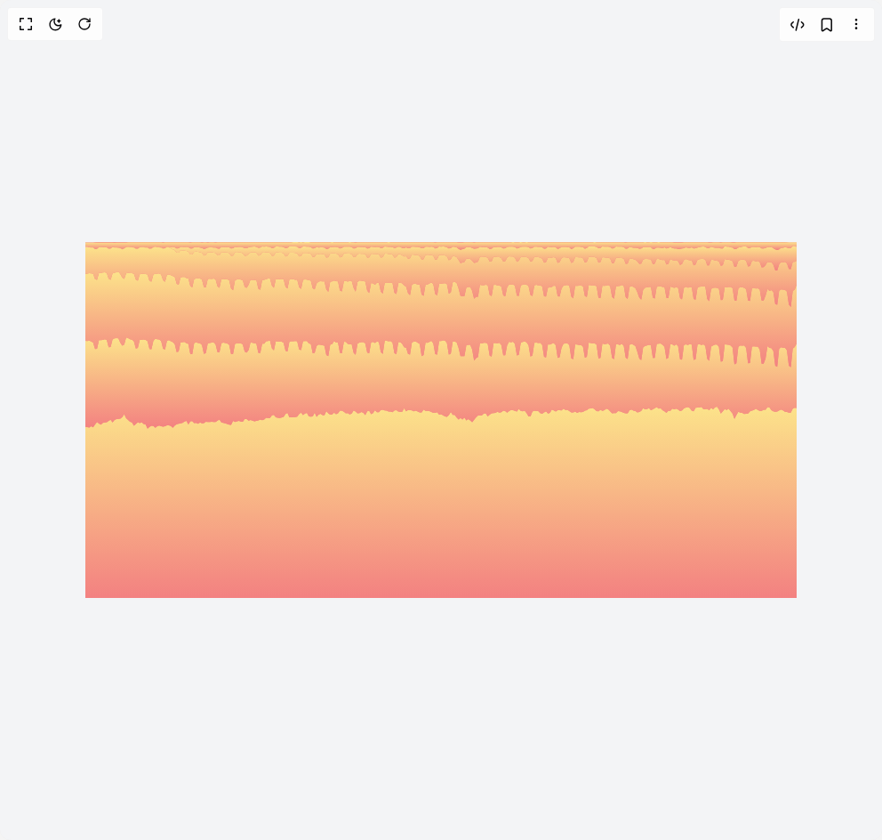

# Build Stacked Areas in BuilderStudio

> Build this component in our Agentic IDE: [BuilderStudio](https://builderstudio.dev).
>
> Join the BuilderStudio community on [Discord](https://discord.gg/QdWeSGCqfe) and [Reddit](https://reddit.com/r/builderstudio).



## Component

- Author group: `airbnb`
- Component: `stacked-areas`
- Variant: `default`
- Rendered HTML snapshot: [`rendered.html`](rendered.html)

## BuilderStudio prompt

You are implementing a React component based on a component reference.

## Component identity

- Author: airbnb
- Component slug: stacked-areas
- Demo slug: default
- Title: stacked-areas
- Description: 

## Goal

Recreate this component in a React + TypeScript + Tailwind CSS project. Preserve the visual layout, spacing, colors, border radius, shadows, interaction behavior, animation behavior, responsive behavior, and dark mode behavior shown in the rendered demo.

## Implementation requirements

- Use React and TypeScript.
- Use Tailwind CSS classes whenever possible.
- Keep the component self-contained unless the source files require helper components.
- If the source uses CSS variables, custom CSS, animations, or keyframes, include them.
- If the source uses external packages, list and use the required packages.
- Preserve accessibility attributes, button semantics, links, keyboard behavior, and ARIA attributes when visible in the source.
- Do not replace the component with a simplified placeholder.
- Return complete production-ready code.

## Dependencies

No reference metadata available.

## Rendered DOM snapshot

This is the rendered demo HTML extracted from the live preview. Use it to verify structure, class names, visible content, and layout.

```html
<div id="root"><div class="flex w-full h-screen justify-center items-center bg-gray-100"><svg width="800" height="400"><defs><linearGradient id="stacked-area-orangered" x1="0" y1="0" x2="0" y2="1"><stop offset="0%" stop-color="#FCE38A" stop-opacity="1"></stop><stop offset="100%" stop-color="#F38181" stop-opacity="1"></stop></linearGradient></defs><rect x="0" y="0" width="800" height="400" fill="#f38181" rx="14"></rect><path d="M0,207.63999999999996L2.185792349726776,208L4.371584699453552,208.52000000000004L6.557377049180328,207.12L8.743169398907105,208.36L10.92896174863388,204.88L13.114754098360656,202.28000000000003L15.300546448087433,204.07999999999998L17.48633879781421,205.24L19.672131147540984,203.32L21.85792349726776,202.71999999999997L24.043715846994534,202.44L26.229508196721312,200.92L28.415300546448087,199.72L30.601092896174865,202.71999999999997L32.78688524590164,200.04L34.97267759562842,199.12L37.15846994535519,198.68L39.34426229508197,198.4L41.53005464480874,196.68L43.71584699453552,193.6L45.90163934426229,197.88000000000002L48.08743169398907,199.96L50.27322404371585,201.91999999999996L52.459016393442624,202.75999999999996L54.644808743169406,206.4L56.830601092896174,204.52000000000004L59.01639344262295,202.4L61.20218579234973,203.52L63.387978142076506,202.55999999999997L65.57377049180327,204.48L67.75956284153006,204.95999999999998L69.94535519125684,209.68L72.1311475409836,207.76L74.31693989071039,206.44L76.50273224043715,206.71999999999997L78.68852459016394,208.76000000000002L80.87431693989072,206.88L83.06010928961749,206.36L85.24590163934425,207.12L87.43169398907104,207.56L89.61748633879782,206.92L91.80327868852459,206L93.98907103825137,206.08000000000004L96.17486338797814,206.67999999999998L98.36065573770492,208.8L100.5464480874317,206.36L102.73224043715847,204.8L104.91803278688525,204.2L107.10382513661203,203.72L109.28961748633881,203.28L111.47540983606557,201.76L113.66120218579235,200.92L115.84699453551912,205.08L118.0327868852459,201.6L120.21857923497268,201.28L122.40437158469946,203.56L124.59016393442623,203.16L126.77595628415301,204.2L128.96174863387978,202.75999999999996L131.14754098360655,203.68000000000004L133.33333333333331,203.6L135.5191256830601,202L137.70491803278688,202.32000000000002L139.89071038251367,202.16000000000003L142.07650273224044,201.96L144.2622950819672,202.28000000000003L146.448087431694,202.24L148.63387978142077,200.84L150.81967213114754,199.52L153.0054644808743,202.64L155.19125683060108,203.16L157.37704918032787,203.76L159.56284153005464,204.44L161.74863387978144,205.24L163.9344262295082,205.44000000000003L166.12021857923497,201.12L168.30601092896177,202.28000000000003L170.4918032786885,201.40000000000003L172.6775956284153,201.08L174.86338797814207,201.64L177.04918032786884,201.91999999999996L179.23497267759564,198.88L181.4207650273224,199.00000000000003L183.60655737704917,200.68L185.79234972677597,200L187.97814207650273,200.76L190.1639344262295,201.40000000000003L192.34972677595627,200.99999999999997L194.53551912568307,200.56000000000003L196.72131147540983,199.6L198.9071038251366,200.36L201.0928961748634,199.6L203.27868852459017,197.6L205.46448087431693,197.64L207.65027322404373,197.71999999999997L209.8360655737705,194.68L212.0218579234973,194.36L214.20765027322406,196.96000000000004L216.39344262295083,197.6L218.57923497267763,197.76L220.76502732240436,197.36L222.95081967213113,196.52000000000004L225.1366120218579,193.36L227.3224043715847,192.04L229.50819672131146,196.92L231.69398907103823,197.00000000000003L233.87978142076503,196.8L236.0655737704918,196.72L238.25136612021856,196.28L240.43715846994536,193.23999999999998L242.62295081967213,191.75999999999996L244.80874316939892,194.4L246.9945355191257,192.76L249.18032786885246,192.08000000000004L251.36612021857925,196.11999999999998L253.55191256830602,196.24L255.73770491803282,195.92000000000002L257.92349726775956,191.71999999999997L260.1092896174863,196.4L262.2950819672131,193.92000000000002L264.4808743169399,193.00000000000003L266.66666666666663,194.52000000000004L268.8524590163934,194.84L271.0382513661202,190.12000000000003L273.22404371584696,192.48L275.40983606557376,194.08000000000004L277.59562841530055,193.67999999999998L279.78142076502735,191.84L281.9672131147541,193.52L284.1530054644809,192.52000000000004L286.3387978142077,189.52L288.5245901639344,189.44L290.8014571948998,190.83999999999997L292.9872495446266,192.48L295.17304189435333,192.32L297.35883424408013,193.76L299.5446265938069,192.79999999999998L301.7304189435337,189.31999999999996L303.91621129326046,190.39999999999998L306.10200364298726,192.4L308.28779599271405,192.19999999999996L310.4735883424408,191L312.6593806921676,192.08000000000004L314.8451730418944,194.48L317.0309653916211,190.19999999999996L319.2167577413479,189.56L321.4025500910747,193.4L323.58834244080145,192.19999999999996L325.7741347905282,189.04000000000002L327.959927140255,191.36L330.1457194899818,191.32L332.3315118397085,188.76L334.5173041894353,188.44L336.7030965391621,189.27999999999997L338.88888888888886,189.6L341.07468123861565,190.60000000000002L343.26047358834245,190.52L345.44626593806925,191.2L347.632058287796,189.2L349.8178506375228,189.12L352.0036429872496,190.60000000000002L354.1894353369763,190.68L356.3752276867031,190.63999999999996L358.5610200364299,186.83999999999997L360.74681238615665,190.16000000000003L362.93260473588344,188.64000000000001L365.1183970856102,188.79999999999998L367.304189435337,189.16L369.4899817850637,190.35999999999999L371.6757741347905,189.44L373.8615664845173,190.52L376.04735883424405,191.4L378.23315118397085,191.4L380.41894353369764,188.32L382.6047358834244,189.64L384.7905282331512,189.71999999999997L386.976320582878,190.12000000000003L389.1621129326047,191.12L391.3479052823315,192.12000000000003L393.5336976320583,191.88L395.7194899817851,191.32L397.90528233151184,194.08000000000004L400.09107468123864,193.44L402.27686703096543,194.72L404.4626593806922,195.88L406.64845173041897,196.4L408.83424408014577,194.56000000000003L411.0200364298725,191.04000000000002L413.2058287795993,194.24L415.3916211293261,194.24L417.57741347905284,197.23999999999998L419.76320582877963,199.47999999999996L421.94899817850643,197.8L424.1347905282331,199.52L426.3205828779599,197.28L428.50637522768665,200.44L430.69216757741344,198.92L432.87795992714024,200.60000000000002L435.063752276867,202.4L437.2495446265938,199.72L439.43533697632057,197.12L441.6211293260473,195.08L443.8069216757741,194.96000000000004L445.9927140255009,194.72L448.1785063752277,192.76L450.36429872495444,192.60000000000002L452.55009107468123,196.04L454.73588342440803,194L456.92167577413477,192.48L459.10746812386157,192.35999999999999L461.29326047358836,192.04L463.4790528233151,190.76L465.6648451730419,191.71999999999997L467.8506375227687,191.16L470.03642987249543,189.4L472.22222222222223,190.08000000000004L474.408014571949,191.71999999999997L476.59380692167576,189.96L478.77959927140256,188.72L480.96539162112936,188.96L483.1511839708561,189.75999999999996L485.3369763205829,190.48L487.5227686703097,187.52L489.7085610200365,189.8L491.8943533697632,190.19999999999996L494.08014571949,189.44L496.2659380692168,192.19999999999996L498.45173041894355,195.88L500.63752276867035,196.11999999999998L502.82331511839715,190.56000000000003L505.00910746812383,189.52L507.19489981785057,190.08000000000004L509.38069216757737,190.12000000000003L511.56648451730416,192.35999999999999L513.7522768670309,192.96L515.9380692167578,191.56L518.1238615664845,190.35999999999999L520.3096539162112,192.68L522.4954462659381,191.96L524.6812386156648,188.32L526.8670309653916,189.16L529.0528233151184,190.52L531.2386156648452,189.08L533.4244080145719,189.08L535.6102003642987,189.27999999999997L537.7959927140255,187.27999999999997L539.9817850637522,188.79999999999998L542.1675774134791,188.60000000000002L544.3533697632058,190L546.5391621129326,191.4L548.7249544626594,191.6L550.9107468123862,190.60000000000002L553.0965391621129,192L555.2823315118397,190.92L557.4681238615665,191.2L559.6539162112933,190.88L561.8397085610201,189.48000000000002L564.0255009107468,189.04000000000002L566.2112932604737,187.2L568.3970856102004,186.92L570.5828779599271,186.52L572.768670309654,187.88L574.9544626593807,190.12000000000003L577.1402550091075,190.28L579.3260473588343,188.56L581.5118397085611,189.64L583.6976320582878,189L585.8834244080145,187.36L588.0692167577413,188.04L590.2550091074681,190.32L592.4408014571949,192.56000000000003L594.6265938069216,192.19999999999996L596.8123861566485,192.24L598.9981785063752,190.04L601.183970856102,190.35999999999999L603.3697632058288,190.96L605.5555555555555,192.08000000000004L607.7413479052823,192.44L609.9271402550091,192.56000000000003L612.1129326047359,189.04000000000002L614.2987249544626,188.28L616.4845173041895,189.4L618.6703096539162,189.88L620.856102003643,191.4L623.0418943533698,191.04000000000002L625.2276867030965,189.75999999999996L627.3224043715846,186.76L629.5081967213115,188.08L631.6939890710382,187.72000000000003L633.879781420765,186.39999999999998L636.0655737704918,189.12L638.2513661202186,188.04L640.4371584699453,186.83999999999997L642.6229508196722,185.4L644.8087431693989,187.16L646.9945355191257,186.83999999999997L649.1803278688525,188.92L651.3661202185792,190.35999999999999L653.5519125683061,191.88L655.7377049180328,189.52L657.9234972677596,189.84L660.1092896174864,187.2L662.2950819672132,187.95999999999998L664.4808743169399,187.2L666.6666666666667,188.16000000000003L668.8524590163935,189.92L671.0382513661202,189.16L673.2240437158471,187.12L675.4098360655738,185.95999999999998L677.5956284153006,185.51999999999998L679.7814207650274,186.39999999999998L681.967213114754,189.52L684.1530054644809,190.32L686.3387978142076,186.28L688.5245901639344,186.08L690.7103825136612,186L692.896174863388,185.28000000000003L695.0819672131147,187.68000000000004L697.2677595628415,187.64L699.4535519125683,187.6L701.639344262295,188.96L703.8251366120219,186.24L706.0109289617486,188.12000000000003L708.1967213114754,185.8L710.3825136612022,184.96L712.568306010929,188.12000000000003L714.7540983606557,192.72L716.9398907103825,190.16000000000003L719.1256830601093,187.8L721.311475409836,188.68L723.4972677595629,187.27999999999997L725.6830601092896,190L727.8688524590164,192.76L730.0546448087432,198.84L732.24043715847,194.56000000000003L734.4262295081967,190.79999999999998L736.6120218579235,191.8L738.7978142076503,192.04L740.983606557377,193.32L743.1693989071039,193.00000000000003L745.3551912568306,192.68L747.5409836065575,190.16000000000003L749.7267759562842,189.6L751.9125683060109,188.68L754.0983606557378,187.36L756.2841530054645,188.76L758.4699453551913,189.84L760.655737704918,189.68000000000004L762.8415300546447,188.60000000000002L765.0273224043715,188.44L767.2131147540983,185.56L769.3989071038251,185.68000000000004L771.5846994535519,188.96L773.7704918032787,190.24L775.9562841530054,190.68L778.1420765027323,190.48L780.327868852459,189.24000000000004L782.5136612021857,188.19999999999996L784.6994535519126,189.27999999999997L786.8852459016393,190.79999999999998L789.0710382513661,191.12L791.2568306010929,191.75999999999996L793.4426229508197,191.64L795.6284153005464,187.27999999999997L797.8142076502733,186.20000000000002L800,186.39999999999998L800,400L797.8142076502733,400L795.6284153005464,400L793.4426229508197,400L791.2568306010929,400L789.0710382513661,400L786.8852459016393,400L784.6994535519126,400L782.5136612021857,400L780.327868852459,400L778.1420765027323,400L775.9562841530054,400L773.7704918032787,400L771.5846994535519,400L769.3989071038251,400L767.2131147540983,400L765.0273224043715,400L762.8415300546447,400L760.655737704918,400L758.4699453551913,400L756.2841530054645,400L754.0983606557378,400L751.9125683060109,400L749.7267759562842,400L747.5409836065575,400L745.3551912568306,400L743.1693989071039,400L740.983606557377,400L738.7978142076503,400L736.6120218579235,400L734.4262295081967,400L732.24043715847,400L730.0546448087432,400L727.8688524590164,400L725.6830601092896,400L723.4972677595629,400L721.311475409836,400L719.1256830601093,400L716.9398907103825,400L714.7540983606557,400L712.568306010929,400L710.3825136612022,400L708.1967213114754,400L706.0109289617486,400L703.8251366120219,400L701.639344262295,400L699.4535519125683,400L697.2677595628415,400L695.0819672131147,400L692.896174863388,400L690.7103825136612,400L688.5245901639344,400L686.3387978142076,400L684.1530054644809,400L681.967213114754,400L679.7814207650274,400L677.5956284153006,400L675.4098360655738,400L673.2240437158471,400L671.0382513661202,400L668.8524590163935,400L666.6666666666667,400L664.4808743169399,400L662.2950819672132,400L660.1092896174864,400L657.9234972677596,400L655.7377049180328,400L653.5519125683061,400L651.3661202185792,400L649.1803278688525,400L646.9945355191257,400L644.8087431693989,400L642.6229508196722,400L640.4371584699453,400L638.2513661202186,400L636.0655737704918,400L633.879781420765,400L631.6939890710382,400L629.5081967213115,400L627.3224043715846,400L625.2276867030965,400L623.0418943533698,400L620.856102003643,400L618.6703096539162,400L616.4845173041895,400L614.2987249544626,400L612.1129326047359,400L609.9271402550091,400L607.7413479052823,400L605.5555555555555,400L603.3697632058288,400L601.183970856102,400L598.9981785063752,400L596.8123861566485,400L594.6265938069216,400L592.4408014571949,400L590.2550091074681,400L588.0692167577413,400L585.8834244080145,400L583.6976320582878,400L581.5118397085611,400L579.3260473588343,400L577.1402550091075,400L574.9544626593807,400L572.768670309654,400L570.5828779599271,400L568.3970856102004,400L566.2112932604737,400L564.0255009107468,400L561.8397085610201,400L559.6539162112933,400L557.4681238615665,400L555.2823315118397,400L553.0965391621129,400L550.9107468123862,400L548.7249544626594,400L546.5391621129326,400L544.3533697632058,400L542.1675774134791,400L539.9817850637522,400L537.7959927140255,400L535.6102003642987,400L533.4244080145719,400L531.2386156648452,400L529.0528233151184,400L526.8670309653916,400L524.6812386156648,400L522.4954462659381,400L520.3096539162112,400L518.1238615664845,400L515.9380692167578,400L513.7522768670309,400L511.56648451730416,400L509.38069216757737,400L507.19489981785057,400L505.00910746812383,400L502.82331511839715,400L500.63752276867035,400L498.45173041894355,400L496.2659380692168,400L494.08014571949,400L491.8943533697632,400L489.7085610200365,400L487.5227686703097,400L485.3369763205829,400L483.1511839708561,400L480.96539162112936,400L478.77959927140256,400L476.59380692167576,400L474.408014571949,400L472.22222222222223,400L470.03642987249543,400L467.8506375227687,400L465.6648451730419,400L463.4790528233151,400L461.29326047358836,400L459.10746812386157,400L456.92167577413477,400L454.73588342440803,400L452.55009107468123,400L450.36429872495444,400L448.1785063752277,400L445.9927140255009,400L443.8069216757741,400L441.6211293260473,400L439.43533697632057,400L437.2495446265938,400L435.063752276867,400L432.87795992714024,400L430.69216757741344,400L428.50637522768665,400L426.3205828779599,400L424.1347905282331,400L421.94899817850643,400L419.76320582877963,400L417.57741347905284,400L415.3916211293261,400L413.2058287795993,400L411.0200364298725,400L408.83424408014577,400L406.64845173041897,400L404.4626593806922,400L402.27686703096543,400L400.09107468123864,400L397.90528233151184,400L395.7194899817851,400L393.5336976320583,400L391.3479052823315,400L389.1621129326047,400L386.976320582878,400L384.7905282331512,400L382.6047358834244,400L380.41894353369764,400L378.23315118397085,400L376.04735883424405,400L373.8615664845173,400L371.6757741347905,400L369.4899817850637,400L367.304189435337,400L365.1183970856102,400L362.93260473588344,400L360.74681238615665,400L358.5610200364299,400L356.3752276867031,400L354.1894353369763,400L352.0036429872496,400L349.8178506375228,400L347.632058287796,400L345.44626593806925,400L343.26047358834245,400L341.07468123861565,400L338.88888888888886,400L336.7030965391621,400L334.5173041894353,400L332.3315118397085,400L330.1457194899818,400L327.959927140255,400L325.7741347905282,400L323.58834244080145,400L321.4025500910747,400L319.2167577413479,400L317.0309653916211,400L314.8451730418944,400L312.6593806921676,400L310.4735883424408,400L308.28779599271405,400L306.10200364298726,400L303.91621129326046,400L301.7304189435337,400L299.5446265938069,400L297.35883424408013,400L295.17304189435333,400L292.9872495446266,400L290.8014571948998,400L288.5245901639344,400L286.3387978142077,400L284.1530054644809,400L281.9672131147541,400L279.78142076502735,400L277.59562841530055,400L275.40983606557376,400L273.22404371584696,400L271.0382513661202,400L268.8524590163934,400L266.66666666666663,400L264.4808743169399,400L262.2950819672131,400L260.1092896174863,400L257.92349726775956,400L255.73770491803282,400L253.55191256830602,400L251.36612021857925,400L249.18032786885246,400L246.9945355191257,400L244.80874316939892,400L242.62295081967213,400L240.43715846994536,400L238.25136612021856,400L236.0655737704918,400L233.87978142076503,400L231.69398907103823,400L229.50819672131146,400L227.3224043715847,400L225.1366120218579,400L222.95081967213113,400L220.76502732240436,400L218.57923497267763,400L216.39344262295083,400L214.20765027322406,400L212.0218579234973,400L209.8360655737705,400L207.65027322404373,400L205.46448087431693,400L203.27868852459017,400L201.0928961748634,400L198.9071038251366,400L196.72131147540983,400L194.53551912568307,400L192.34972677595627,400L190.1639344262295,400L187.97814207650273,400L185.79234972677597,400L183.60655737704917,400L181.4207650273224,400L179.23497267759564,400L177.04918032786884,400L174.86338797814207,400L172.6775956284153,400L170.4918032786885,400L168.30601092896177,400L166.12021857923497,400L163.9344262295082,400L161.74863387978144,400L159.56284153005464,400L157.37704918032787,400L155.19125683060108,400L153.0054644808743,400L150.81967213114754,400L148.63387978142077,400L146.448087431694,400L144.2622950819672,400L142.07650273224044,400L139.89071038251367,400L137.70491803278688,400L135.5191256830601,400L133.33333333333331,400L131.14754098360655,400L128.96174863387978,400L126.77595628415301,400L124.59016393442623,400L122.40437158469946,400L120.21857923497268,400L118.0327868852459,400L115.84699453551912,400L113.66120218579235,400L111.47540983606557,400L109.28961748633881,400L107.10382513661203,400L104.91803278688525,400L102.73224043715847,400L100.5464480874317,400L98.36065573770492,400L96.17486338797814,400L93.98907103825137,400L91.80327868852459,400L89.61748633879782,400L87.43169398907104,400L85.24590163934425,400L83.06010928961749,400L80.87431693989072,400L78.68852459016394,400L76.50273224043715,400L74.31693989071039,400L72.1311475409836,400L69.94535519125684,400L67.75956284153006,400L65.57377049180327,400L63.387978142076506,400L61.20218579234973,400L59.01639344262295,400L56.830601092896174,400L54.644808743169406,400L52.459016393442624,400L50.27322404371585,400L48.08743169398907,400L45.90163934426229,400L43.71584699453552,400L41.53005464480874,400L39.34426229508197,400L37.15846994535519,400L34.97267759562842,400L32.78688524590164,400L30.601092896174865,400L28.415300546448087,400L26.229508196721312,400L24.043715846994534,400L21.85792349726776,400L19.672131147540984,400L17.48633879781421,400L15.300546448087433,400L13.114754098360656,400L10.92896174863388,400L8.743169398907105,400L6.557377049180328,400L4.371584699453552,400L2.185792349726776,400L0,400Z" stroke="transparent" fill="url(#stacked-area-orangered)"></path><path d="M0,111.07999999999998L2.185792349726776,111.24000000000001L4.371584699453552,110.75999999999996L6.557377049180328,111.80000000000004L8.743169398907105,112.92L10.92896174863388,120.31999999999998L13.114754098360656,120.07999999999997L15.300546448087433,110.20000000000003L17.48633879781421,110.19999999999999L19.672131147540984,109.91999999999997L21.85792349726776,109.15999999999997L24.043715846994534,110.00000000000001L26.229508196721312,118.19999999999999L28.415300546448087,118.07999999999996L30.601092896174865,109.51999999999997L32.78688524590164,108.27999999999997L34.97267759562842,107.96000000000005L37.15846994535519,108.31999999999996L39.34426229508197,113.24000000000001L41.53005464480874,116.60000000000004L43.71584699453552,115.19999999999997L45.90163934426229,107.32L48.08743169398907,107.87999999999998L50.27322404371585,109.24000000000001L52.459016393442624,109.80000000000003L54.644808743169406,111.68L56.830601092896174,119.63999999999997L59.01639344262295,118.92L61.20218579234973,110.11999999999999L63.387978142076506,109.75999999999999L65.57377049180327,109.56000000000002L67.75956284153006,109.87999999999998L69.94535519125684,111.51999999999998L72.1311475409836,120.19999999999999L74.31693989071039,120.44000000000001L76.50273224043715,111.07999999999998L78.68852459016394,108.83999999999996L80.87431693989072,109.27999999999996L83.06010928961749,109.56000000000002L85.24590163934425,111.27999999999996L87.43169398907104,120.12L89.61748633879782,120.63999999999999L91.80327868852459,111.12000000000002L93.98907103825137,110.28000000000003L96.17486338797814,111.60000000000001L98.36065573770492,112.55999999999999L100.5464480874317,114.75999999999998L102.73224043715847,123.63999999999997L104.91803278688525,123.11999999999999L107.10382513661203,113.03999999999999L109.28961748633881,112.39999999999996L111.47540983606557,112.27999999999997L113.66120218579235,113.68L115.84699453551912,114.56L118.0327868852459,125.72000000000001L120.21857923497268,125.88L122.40437158469946,113.39999999999999L124.59016393442623,112.80000000000001L126.77595628415301,113.48000000000002L128.96174863387978,113.64000000000001L131.14754098360655,115.75999999999999L133.33333333333331,125.72000000000001L135.5191256830601,124.67999999999999L137.70491803278688,113.83999999999999L139.89071038251367,113.51999999999998L142.07650273224044,113.12000000000002L144.2622950819672,112.75999999999998L146.448087431694,115.08000000000003L148.63387978142077,123.68L150.81967213114754,123.88L153.0054644808743,113.83999999999999L155.19125683060108,113.12000000000002L157.37704918032787,113.43999999999998L159.56284153005464,113.92000000000002L161.74863387978144,115.48000000000003L163.9344262295082,125.95999999999998L166.12021857923497,125.76L168.30601092896177,114.52L170.4918032786885,113.75999999999999L172.6775956284153,113.68L174.86338797814207,113.75999999999999L177.04918032786884,115.36L179.23497267759564,123.15999999999998L181.4207650273224,124.32L183.60655737704917,121.48000000000003L185.79234972677597,112.80000000000001L187.97814207650273,113.19999999999996L190.1639344262295,113.68L192.34972677595627,114.15999999999995L194.53551912568307,124.39999999999998L196.72131147540983,124.75999999999998L198.9071038251366,114.16000000000004L201.0928961748634,114.24000000000004L203.27868852459017,111.48000000000002L205.46448087431693,111.27999999999996L207.65027322404373,110.72000000000001L209.8360655737705,119.60000000000002L212.0218579234973,121.76L214.20765027322406,111.43999999999998L216.39344262295083,111.68L218.57923497267763,111.75999999999999L220.76502732240436,112.00000000000001L222.95081967213113,113.16000000000001L225.1366120218579,122.28000000000003L227.3224043715847,123.07999999999998L229.50819672131146,112.00000000000001L231.69398907103823,111.43999999999998L233.87978142076503,111.43999999999998L236.0655737704918,111.15999999999997L238.25136612021856,111.60000000000001L240.43715846994536,120.75999999999998L242.62295081967213,121.39999999999999L244.80874316939892,111.48000000000002L246.9945355191257,111.35999999999999L249.18032786885246,111.35999999999999L251.36612021857925,113.87999999999998L253.55191256830602,114.56L255.73770491803282,124.95999999999997L257.92349726775956,124.39999999999998L260.1092896174863,116.63999999999999L262.2950819672131,115.27999999999996L264.4808743169399,115.51999999999998L266.66666666666663,115.87999999999998L268.8524590163934,116.60000000000004L271.0382513661202,126.92000000000002L273.22404371584696,128.36000000000004L275.40983606557376,115.32L277.59562841530055,114.75999999999998L279.78142076502735,111.27999999999996L281.9672131147541,113.12000000000002L284.1530054644809,112.99999999999999L286.3387978142077,124.51999999999997L288.5245901639344,125.03999999999995L290.8014571948998,111.96000000000001L292.9872495446266,112.15999999999995L295.17304189435333,114.39999999999996L297.35883424408013,114.80000000000001L299.5446265938069,115.12000000000002L301.7304189435337,124.44000000000001L303.91621129326046,126.72000000000003L306.10200364298726,114.16000000000004L308.28779599271405,112.88L310.4735883424408,112.55999999999999L312.6593806921676,112.48L314.8451730418944,114.12L317.0309653916211,124.36000000000003L319.2167577413479,125.07999999999998L321.4025500910747,112.68000000000002L323.58834244080145,112.24000000000002L325.7741347905282,113.39999999999999L327.959927140255,111.84000000000003L330.1457194899818,112.52L332.3315118397085,123.76L334.5173041894353,125.84L336.7030965391621,110.92L338.88888888888886,111.12000000000002L341.07468123861565,111.43999999999998L343.26047358834245,111.28000000000004L345.44626593806925,112.99999999999999L347.632058287796,125.07999999999998L349.8178506375228,126.12L352.0036429872496,112.48L354.1894353369763,112.55999999999999L356.3752276867031,114.48L358.5610200364299,118.36000000000001L360.74681238615665,118.84000000000002L362.93260473588344,125.68L365.1183970856102,126.51999999999997L367.304189435337,112.84000000000005L369.4899817850637,111.87999999999998L371.6757741347905,111.80000000000004L373.8615664845173,113.32L376.04735883424405,114.60000000000004L378.23315118397085,128.32L380.41894353369764,127L382.6047358834244,113.03999999999999L384.7905282331512,113.24000000000001L386.976320582878,112.24000000000002L389.1621129326047,111.12000000000002L391.3479052823315,113.96000000000002L393.5336976320583,125.92000000000003L395.7194899817851,126.44000000000003L397.90528233151184,111.24000000000001L400.09107468123864,111.27999999999996L402.27686703096543,110.55999999999999L404.4626593806922,110.72000000000001L406.64845173041897,113.56000000000002L408.83424408014577,126.48000000000002L411.0200364298725,125.48000000000003L413.2058287795993,111.75999999999999L415.3916211293261,111.68L417.57741347905284,112.63999999999999L419.76320582877963,118.91999999999996L421.94899817850643,128.20000000000005L424.1347905282331,128.32L426.3205828779599,128.28L428.50637522768665,116.08000000000001L430.69216757741344,115.48000000000003L432.87795992714024,115.48000000000003L435.063752276867,120.75999999999998L437.2495446265938,133.27999999999997L439.43533697632057,130.48000000000002L441.6211293260473,129.24L443.8069216757741,113.51999999999998L445.9927140255009,113.87999999999998L448.1785063752277,113.32L450.36429872495444,113.32L452.55009107468123,114.60000000000004L454.73588342440803,127.68000000000002L456.92167577413477,128.83999999999997L459.10746812386157,113.43999999999998L461.29326047358836,113.51999999999998L463.4790528233151,113.71999999999996L465.6648451730419,113.15999999999997L467.8506375227687,115.84000000000003L470.03642987249543,127.36000000000001L472.22222222222223,127.32000000000001L474.408014571949,116.08000000000001L476.59380692167576,112.04L478.77959927140256,112.68000000000002L480.96539162112936,111.92000000000002L483.1511839708561,114.56L485.3369763205829,127.44L487.5227686703097,126.64L489.7085610200365,113.32L491.8943533697632,112.24000000000002L494.08014571949,111.75999999999999L496.2659380692168,112.71999999999997L498.45173041894355,115.87999999999998L500.63752276867035,128.68L502.82331511839715,127.55999999999999L505.00910746812383,113.16000000000001L507.19489981785057,113.08000000000003L509.38069216757737,113.48000000000002L511.56648451730416,113.28000000000004L513.7522768670309,115.51999999999998L515.9380692167578,128.92000000000002L518.1238615664845,129.8L520.3096539162112,115.08000000000003L522.4954462659381,115.16000000000003L524.6812386156648,114.24000000000004L526.8670309653916,113.56000000000002L529.0528233151184,116.00000000000001L531.2386156648452,130.32L533.4244080145719,129.44L535.6102003642987,118.67999999999998L537.7959927140255,114.31999999999998L539.9817850637522,114.08000000000004L542.1675774134791,113.64000000000001L544.3533697632058,116.04L546.5391621129326,130.84000000000003L548.7249544626594,131.8L550.9107468123862,114.96L553.0965391621129,115.24000000000001L555.2823315118397,115.71999999999996L557.4681238615665,115.83999999999999L559.6539162112933,117.39999999999999L561.8397085610201,129.91999999999996L564.0255009107468,129.12L566.2112932604737,113.07999999999998L568.3970856102004,113.48000000000002L570.5828779599271,113.96000000000002L572.768670309654,113.83999999999999L574.9544626593807,115.60000000000001L577.1402550091075,130.68L579.3260473588343,130.32L581.5118397085611,114.03999999999996L583.6976320582878,114.63999999999999L585.8834244080145,114.52L588.0692167577413,114.08L590.2550091074681,116.48L592.4408014571949,130.36000000000004L594.6265938069216,131.83999999999995L596.8123861566485,114.63999999999999L598.9981785063752,115.12000000000002L601.183970856102,115.72000000000004L603.3697632058288,114.36000000000001L605.5555555555555,116.63999999999999L607.7413479052823,129.99999999999997L609.9271402550091,131.39999999999995L612.1129326047359,115.56000000000002L614.2987249544626,114.44000000000001L616.4845173041895,115.51999999999998L618.6703096539162,116.88000000000001L620.856102003643,123.60000000000002L623.0418943533698,130.87999999999997L625.2276867030965,132.68L627.3224043715846,118.56L629.5081967213115,116.80000000000001L631.6939890710382,116.36000000000001L633.879781420765,115.48000000000003L636.0655737704918,116.08000000000001L638.2513661202186,130.27999999999994L640.4371584699453,130.32L642.6229508196722,114.44000000000001L644.8087431693989,114.15999999999995L646.9945355191257,113.87999999999998L649.1803278688525,115.60000000000001L651.3661202185792,117.75999999999999L653.5519125683061,131.44L655.7377049180328,130.12L657.9234972677596,114.68000000000002L660.1092896174864,115.03999999999994L662.2950819672132,116.39999999999998L664.4808743169399,114.96L666.6666666666667,116.88000000000001L668.8524590163935,131.83999999999995L671.0382513661202,132.15999999999997L673.2240437158471,115.72000000000004L675.4098360655738,114.92L677.5956284153006,115.75999999999999L679.7814207650274,114.63999999999999L681.967213114754,115.24000000000001L684.1530054644809,132.48000000000002L686.3387978142076,131.8L688.5245901639344,115.20000000000006L690.7103825136612,114.75999999999998L692.896174863388,115.68L695.0819672131147,115.04000000000003L697.2677595628415,116.68000000000004L699.4535519125683,131.24L701.639344262295,133.39999999999998L703.8251366120219,117.43999999999998L706.0109289617486,116.27999999999999L708.1967213114754,115.32L710.3825136612022,115.16000000000003L712.568306010929,117.68L714.7540983606557,134.48000000000002L716.9398907103825,133.8L719.1256830601093,114.99999999999999L721.311475409836,115.32L723.4972677595629,115.56000000000002L725.6830601092896,116.15999999999995L727.8688524590164,118.44000000000001L730.0546448087432,137.52L732.24043715847,136.35999999999999L734.4262295081967,117.84000000000003L736.6120218579235,116.28000000000003L738.7978142076503,116.56L740.983606557377,116.31999999999998L743.1693989071039,118.96L745.3551912568306,136.16000000000003L747.5409836065575,136.04000000000002L749.7267759562842,117.43999999999998L751.9125683060109,117.27999999999996L754.0983606557378,117.56000000000002L756.2841530054645,117.56000000000002L758.4699453551913,120.75999999999998L760.655737704918,136.72000000000003L762.8415300546447,136.80000000000004L765.0273224043715,130.87999999999997L767.2131147540983,116.96000000000004L769.3989071038251,119.08000000000003L771.5846994535519,119.36L773.7704918032787,122.39999999999998L775.9562841530054,138.96L778.1420765027323,140.24L780.327868852459,119.96000000000002L782.5136612021857,118.31999999999998L784.6994535519126,118.63999999999999L786.8852459016393,118.72000000000003L789.0710382513661,121.68L791.2568306010929,139L793.4426229508197,140.63999999999996L795.6284153005464,119.8L797.8142076502733,118.07999999999996L800,113.92000000000002L800,186.39999999999998L797.8142076502733,186.20000000000002L795.6284153005464,187.27999999999997L793.4426229508197,191.64L791.2568306010929,191.75999999999996L789.0710382513661,191.12L786.8852459016393,190.79999999999998L784.6994535519126,189.27999999999997L782.5136612021857,188.19999999999996L780.327868852459,189.24000000000004L778.1420765027323,190.48L775.9562841530054,190.68L773.7704918032787,190.24L771.5846994535519,188.96L769.3989071038251,185.68000000000004L767.2131147540983,185.56L765.0273224043715,188.44L762.8415300546447,188.60000000000002L760.655737704918,189.68000000000004L758.4699453551913,189.84L756.2841530054645,188.76L754.0983606557378,187.36L751.9125683060109,188.68L749.7267759562842,189.6L747.5409836065575,190.16000000000003L745.3551912568306,192.68L743.1693989071039,193.00000000000003L740.983606557377,193.32L738.7978142076503,192.04L736.6120218579235,191.8L734.4262295081967,190.79999999999998L732.24043715847,194.56000000000003L730.0546448087432,198.84L727.8688524590164,192.76L725.6830601092896,190L723.4972677595629,187.27999999999997L721.311475409836,188.68L719.1256830601093,187.8L716.9398907103825,190.16000000000003L714.7540983606557,192.72L712.568306010929,188.12000000000003L710.3825136612022,184.96L708.1967213114754,185.8L706.0109289617486,188.12000000000003L703.8251366120219,186.24L701.639344262295,188.96L699.4535519125683,187.6L697.2677595628415,187.64L695.0819672131147,187.68000000000004L692.896174863388,185.28000000000003L690.7103825136612,186L688.5245901639344,186.08L686.3387978142076,186.28L684.1530054644809,190.32L681.967213114754,189.52L679.7814207650274,186.39999999999998L677.5956284153006,185.51999999999998L675.4098360655738,185.95999999999998L673.2240437158471,187.12L671.0382513661202,189.16L668.8524590163935,189.92L666.6666666666667,188.16000000000003L664.4808743169399,187.2L662.2950819672132,187.95999999999998L660.1092896174864,187.2L657.9234972677596,189.84L655.7377049180328,189.52L653.5519125683061,191.88L651.3661202185792,190.35999999999999L649.1803278688525,188.92L646.9945355191257,186.83999999999997L644.8087431693989,187.16L642.6229508196722,185.4L640.4371584699453,186.83999999999997L638.2513661202186,188.04L636.0655737704918,189.12L633.879781420765,186.39999999999998L631.6939890710382,187.72000000000003L629.5081967213115,188.08L627.3224043715846,186.76L625.2276867030965,189.75999999999996L623.0418943533698,191.04000000000002L620.856102003643,191.4L618.6703096539162,189.88L616.4845173041895,189.4L614.2987249544626,188.28L612.1129326047359,189.04000000000002L609.9271402550091,192.56000000000003L607.7413479052823,192.44L605.5555555555555,192.08000000000004L603.3697632058288,190.96L601.183970856102,190.35999999999999L598.9981785063752,190.04L596.8123861566485,192.24L594.6265938069216,192.19999999999996L592.4408014571949,192.56000000000003L590.2550091074681,190.32L588.0692167577413,188.04L585.8834244080145,187.36L583.6976320582878,189L581.5118397085611,189.64L579.3260473588343,188.56L577.1402550091075,190.28L574.9544626593807,190.12000000000003L572.768670309654,187.88L570.5828779599271,186.52L568.3970856102004,186.92L566.2112932604737,187.2L564.0255009107468,189.04000000000002L561.8397085610201,189.48000000000002L559.6539162112933,190.88L557.4681238615665,191.2L555.2823315118397,190.92L553.0965391621129,192L550.9107468123862,190.60000000000002L548.7249544626594,191.6L546.5391621129326,191.4L544.3533697632058,190L542.1675774134791,188.60000000000002L539.9817850637522,188.79999999999998L537.7959927140255,187.27999999999997L535.6102003642987,189.27999999999997L533.4244080145719,189.08L531.2386156648452,189.08L529.0528233151184,190.52L526.8670309653916,189.16L524.6812386156648,188.32L522.4954462659381,191.96L520.3096539162112,192.68L518.1238615664845,190.35999999999999L515.9380692167578,191.56L513.7522768670309,192.96L511.56648451730416,192.35999999999999L509.38069216757737,190.12000000000003L507.19489981785057,190.08000000000004L505.00910746812383,189.52L502.82331511839715,190.56000000000003L500.63752276867035,196.11999999999998L498.45173041894355,195.88L496.2659380692168,192.19999999999996L494.08014571949,189.44L491.8943533697632,190.19999999999996L489.7085610200365,189.8L487.5227686703097,187.52L485.3369763205829,190.48L483.1511839708561,189.75999999999996L480.96539162112936,188.96L478.77959927140256,188.72L476.59380692167576,189.96L474.408014571949,191.71999999999997L472.22222222222223,190.08000000000004L470.03642987249543,189.4L467.8506375227687,191.16L465.6648451730419,191.71999999999997L463.4790528233151,190.76L461.29326047358836,192.04L459.10746812386157,192.35999999999999L456.92167577413477,192.48L454.73588342440803,194L452.55009107468123,196.04L450.36429872495444,192.60000000000002L448.1785063752277,192.76L445.9927140255009,194.72L443.8069216757741,194.96000000000004L441.6211293260473,195.08L439.43533697632057,197.12L437.2495446265938,199.72L435.063752276867,202.4L432.87795992714024,200.60000000000002L430.69216757741344,198.92L428.50637522768665,200.44L426.3205828779599,197.28L424.1347905282331,199.52L421.94899817850643,197.8L419.76320582877963,199.47999999999996L417.57741347905284,197.23999999999998L415.3916211293261,194.24L413.2058287795993,194.24L411.0200364298725,191.04000000000002L408.83424408014577,194.56000000000003L406.64845173041897,196.4L404.4626593806922,195.88L402.27686703096543,194.72L400.09107468123864,193.44L397.90528233151184,194.08000000000004L395.7194899817851,191.32L393.5336976320583,191.88L391.3479052823315,192.12000000000003L389.1621129326047,191.12L386.976320582878,190.12000000000003L384.7905282331512,189.71999999999997L382.6047358834244,189.64L380.41894353369764,188.32L378.23315118397085,191.4L376.04735883424405,191.4L373.8615664845173,190.52L371.6757741347905,189.44L369.4899817850637,190.35999999999999L367.304189435337,189.16L365.1183970856102,188.79999999999998L362.93260473588344,188.64000000000001L360.74681238615665,190.16000000000003L358.5610200364299,186.83999999999997L356.3752276867031,190.63999999999996L354.1894353369763,190.68L352.0036429872496,190.60000000000002L349.8178506375228,189.12L347.632058287796,189.2L345.44626593806925,191.2L343.26047358834245,190.52L341.07468123861565,190.60000000000002L338.88888888888886,189.6L336.7030965391621,189.27999999999997L334.5173041894353,188.44L332.3315118397085,188.76L330.1457194899818,191.32L327.959927140255,191.36L325.7741347905282,189.04000000000002L323.58834244080145,192.19999999999996L321.4025500910747,193.4L319.2167577413479,189.56L317.0309653916211,190.19999999999996L314.8451730418944,194.48L312.6593806921676,192.08000000000004L310.4735883424408,191L308.28779599271405,192.19999999999996L306.10200364298726,192.4L303.91621129326046,190.39999999999998L301.7304189435337,189.31999999999996L299.5446265938069,192.79999999999998L297.35883424408013,193.76L295.17304189435333,192.32L292.9872495446266,192.48L290.8014571948998,190.83999999999997L288.5245901639344,189.44L286.3387978142077,189.52L284.1530054644809,192.52000000000004L281.9672131147541,193.52L279.78142076502735,191.84L277.59562841530055,193.67999999999998L275.40983606557376,194.08000000000004L273.22404371584696,192.48L271.0382513661202,190.12000000000003L268.8524590163934,194.84L266.66666666666663,194.52000000000004L264.4808743169399,193.00000000000003L262.2950819672131,193.92000000000002L260.1092896174863,196.4L257.92349726775956,191.71999999999997L255.73770491803282,195.92000000000002L253.55191256830602,196.24L251.36612021857925,196.11999999999998L249.18032786885246,192.08000000000004L246.9945355191257,192.76L244.80874316939892,194.4L242.62295081967213,191.75999999999996L240.43715846994536,193.23999999999998L238.25136612021856,196.28L236.0655737704918,196.72L233.87978142076503,196.8L231.69398907103823,197.00000000000003L229.50819672131146,196.92L227.3224043715847,192.04L225.1366120218579,193.36L222.95081967213113,196.52000000000004L220.76502732240436,197.36L218.57923497267763,197.76L216.39344262295083,197.6L214.20765027322406,196.96000000000004L212.0218579234973,194.36L209.8360655737705,194.68L207.65027322404373,197.71999999999997L205.46448087431693,197.64L203.27868852459017,197.6L201.0928961748634,199.6L198.9071038251366,200.36L196.72131147540983,199.6L194.53551912568307,200.56000000000003L192.34972677595627,200.99999999999997L190.1639344262295,201.40000000000003L187.97814207650273,200.76L185.79234972677597,200L183.60655737704917,200.68L181.4207650273224,199.00000000000003L179.23497267759564,198.88L177.04918032786884,201.91999999999996L174.86338797814207,201.64L172.6775956284153,201.08L170.4918032786885,201.40000000000003L168.30601092896177,202.28000000000003L166.12021857923497,201.12L163.9344262295082,205.44000000000003L161.74863387978144,205.24L159.56284153005464,204.44L157.37704918032787,203.76L155.19125683060108,203.16L153.0054644808743,202.64L150.81967213114754,199.52L148.63387978142077,200.84L146.448087431694,202.24L144.2622950819672,202.28000000000003L142.07650273224044,201.96L139.89071038251367,202.16000000000003L137.70491803278688,202.32000000000002L135.5191256830601,202L133.33333333333331,203.6L131.14754098360655,203.68000000000004L128.96174863387978,202.75999999999996L126.77595628415301,204.2L124.59016393442623,203.16L122.40437158469946,203.56L120.21857923497268,201.28L118.0327868852459,201.6L115.84699453551912,205.08L113.66120218579235,200.92L111.47540983606557,201.76L109.28961748633881,203.28L107.10382513661203,203.72L104.91803278688525,204.2L102.73224043715847,204.8L100.5464480874317,206.36L98.36065573770492,208.8L96.17486338797814,206.67999999999998L93.98907103825137,206.08000000000004L91.80327868852459,206L89.61748633879782,206.92L87.43169398907104,207.56L85.24590163934425,207.12L83.06010928961749,206.36L80.87431693989072,206.88L78.68852459016394,208.76000000000002L76.50273224043715,206.71999999999997L74.31693989071039,206.44L72.1311475409836,207.76L69.94535519125684,209.68L67.75956284153006,204.95999999999998L65.57377049180327,204.48L63.387978142076506,202.55999999999997L61.20218579234973,203.52L59.01639344262295,202.4L56.830601092896174,204.52000000000004L54.644808743169406,206.4L52.459016393442624,202.75999999999996L50.27322404371585,201.91999999999996L48.08743169398907,199.96L45.90163934426229,197.88000000000002L43.71584699453552,193.6L41.53005464480874,196.68L39.34426229508197,198.4L37.15846994535519,198.68L34.97267759562842,199.12L32.78688524590164,200.04L30.601092896174865,202.71999999999997L28.415300546448087,199.72L26.229508196721312,200.92L24.043715846994534,202.44L21.85792349726776,202.71999999999997L19.672131147540984,203.32L17.48633879781421,205.24L15.300546448087433,204.07999999999998L13.114754098360656,202.28000000000003L10.92896174863388,204.88L8.743169398907105,208.36L6.557377049180328,207.12L4.371584699453552,208.52000000000004L2.185792349726776,208L0,207.63999999999996Z" stroke="transparent" fill="url(#stacked-area-orangered)"></path><path d="M0,35.79999999999997L2.185792349726776,35.39999999999996L4.371584699453552,35.12L6.557377049180328,35.16000000000004L8.743169398907105,35.519999999999996L10.92896174863388,41.68000000000003L13.114754098360656,42.39999999999999L15.300546448087433,34.840000000000025L17.48633879781421,34.64L19.672131147540984,34.27999999999996L21.85792349726776,34.119999999999926L24.043715846994534,34.64L26.229508196721312,41.27999999999999L28.415300546448087,42.43999999999999L30.601092896174865,35.360000000000014L32.78688524590164,34.479999999999976L34.97267759562842,34.12000000000002L37.15846994535519,33.360000000000014L39.34426229508197,36.12000000000002L41.53005464480874,40.12000000000002L43.71584699453552,41.480000000000004L45.90163934426229,35.15999999999995L48.08743169398907,34.60000000000001L50.27322404371585,35.040000000000006L52.459016393442624,35.00000000000001L54.644808743169406,35.80000000000001L56.830601092896174,42.32L59.01639344262295,43.56L61.20218579234973,36.16000000000001L63.387978142076506,35.83999999999996L65.57377049180327,35.72000000000002L67.75956284153006,35.88L69.94535519125684,36.479999999999976L72.1311475409836,43.639999999999986L74.31693989071039,44.43999999999999L76.50273224043715,36.599999999999966L78.68852459016394,35.479999999999954L80.87431693989072,35.479999999999954L83.06010928961749,35.27999999999998L85.24590163934425,36.599999999999966L87.43169398907104,43.000000000000014L89.61748633879782,44.63999999999997L91.80327868852459,36.75999999999999L93.98907103825137,36.44000000000007L96.17486338797814,37.360000000000014L98.36065573770492,38.15999999999997L100.5464480874317,39.24000000000003L102.73224043715847,47.00000000000002L104.91803278688525,47.88000000000001L107.10382513661203,39.639999999999986L109.28961748633881,39.159999999999954L111.47540983606557,39.159999999999954L113.66120218579235,40.56000000000002L115.84699453551912,40.87999999999998L118.0327868852459,49.28000000000004L120.21857923497268,51.03999999999998L122.40437158469946,41.52L124.59016393442623,40.96000000000002L126.77595628415301,40.639999999999965L128.96174863387978,40.87999999999998L131.14754098360655,42.24000000000001L133.33333333333331,50.640000000000065L135.5191256830601,50.99999999999998L137.70491803278688,41.59999999999995L139.89071038251367,41.31999999999998L142.07650273224044,41.39999999999997L144.2622950819672,41.120000000000005L146.448087431694,41.88000000000005L148.63387978142077,49.63999999999999L150.81967213114754,51.48000000000002L153.0054644808743,41.79999999999997L155.19125683060108,41.480000000000004L157.37704918032787,41.75999999999998L159.56284153005464,41.99999999999999L161.74863387978144,42.68000000000001L163.9344262295082,52.24000000000002L166.12021857923497,54.24000000000002L168.30601092896177,43.23999999999999L170.4918032786885,41.959999999999994L172.6775956284153,41.60000000000004L174.86338797814207,42.24000000000001L177.04918032786884,43.120000000000005L179.23497267759564,50.399999999999956L181.4207650273224,51.51999999999997L183.60655737704917,47.92000000000001L185.79234972677597,42.32L187.97814207650273,42.87999999999998L190.1639344262295,42.72000000000005L192.34972677595627,42.639999999999965L194.53551912568307,52.55999999999994L196.72131147540983,53.71999999999999L198.9071038251366,42.68000000000001L201.0928961748634,42.39999999999999L203.27868852459017,41.72000000000003L205.46448087431693,41.080000000000005L207.65027322404373,41.000000000000014L209.8360655737705,49.080000000000055L212.0218579234973,51.56L214.20765027322406,41.80000000000001L216.39344262295083,41.480000000000004L218.57923497267763,41.68000000000003L220.76502732240436,41.92L222.95081967213113,41.80000000000001L225.1366120218579,50.240000000000016L227.3224043715847,52.24000000000002L229.50819672131146,41.92L231.69398907103823,41.559999999999995L233.87978142076503,41.84000000000001L236.0655737704918,42.39999999999999L238.25136612021856,42.32000000000005L240.43715846994536,50.71999999999996L242.62295081967213,52.67999999999997L244.80874316939892,42.520000000000024L246.9945355191257,42.120000000000026L249.18032786885246,42.20000000000006L251.36612021857925,43.000000000000014L253.55191256830602,43.36000000000002L255.73770491803282,51.919999999999966L257.92349726775956,53.31999999999999L260.1092896174863,46.43999999999999L262.2950819672131,44.43999999999995L264.4808743169399,44.120000000000026L266.66666666666663,44.199999999999974L268.8524590163934,44.36L271.0382513661202,53.36000000000003L273.22404371584696,56.08000000000004L275.40983606557376,44.600000000000016L277.59562841530055,44.24000000000001L279.78142076502735,43.31999999999998L281.9672131147541,43.99999999999999L284.1530054644809,44.32000000000001L286.3387978142077,54.44L288.5245901639344,55.439999999999934L290.8014571948998,43.96000000000004L292.9872495446266,43.75999999999998L295.17304189435333,44.43999999999999L297.35883424408013,43.480000000000004L299.5446265938069,43.679999999999986L301.7304189435337,51.56L303.91621129326046,55.64000000000004L306.10200364298726,45.120000000000005L308.28779599271405,43.23999999999999L310.4735883424408,43.60000000000004L312.6593806921676,43.679999999999986L314.8451730418944,44.560000000000024L317.0309653916211,54.840000000000046L319.2167577413479,57.2L321.4025500910747,46L323.58834244080145,46.4L325.7741347905282,47.88000000000001L327.959927140255,45.68000000000008L330.1457194899818,45.91999999999996L332.3315118397085,55.67999999999999L334.5173041894353,57.959999999999965L336.7030965391621,46L338.88888888888886,45.60000000000004L341.07468123861565,45.88000000000001L343.26047358834245,45.440000000000055L345.44626593806925,46.040000000000035L347.632058287796,56.919999999999945L349.8178506375228,58.519999999999996L352.0036429872496,46.36L354.1894353369763,45.56L356.3752276867031,46.40000000000004L358.5610200364299,48.680000000000014L360.74681238615665,50.36000000000001L362.93260473588344,57.56000000000001L365.1183970856102,59.64L367.304189435337,48L369.4899817850637,46.760000000000005L371.6757741347905,47.080000000000055L373.8615664845173,47.72000000000003L376.04735883424405,47.72000000000003L378.23315118397085,58.999999999999986L380.41894353369764,60.39999999999996L382.6047358834244,48.03999999999995L384.7905282331512,47.72000000000003L386.976320582878,46.60000000000002L389.1621129326047,45.51999999999996L391.3479052823315,47.200000000000045L393.5336976320583,58.55999999999999L395.7194899817851,60.00000000000001L397.90528233151184,47.080000000000055L400.09107468123864,46.83999999999999L402.27686703096543,46.4L404.4626593806922,46.20000000000006L406.64845173041897,47.199999999999996L408.83424408014577,57.96000000000006L411.0200364298725,56.76000000000001L413.2058287795993,45.199999999999996L415.3916211293261,44.8L417.57741347905284,45.88000000000001L419.76320582877963,52.19999999999993L421.94899817850643,60.52000000000004L424.1347905282331,60.639999999999986L426.3205828779599,60.71999999999997L428.50637522768665,51.2L430.69216757741344,50.48000000000003L432.87795992714024,50.44L435.063752276867,55.03999999999998L437.2495446265938,63.83999999999999L439.43533697632057,61.60000000000001L441.6211293260473,61.43999999999998L443.8069216757741,48.11999999999998L445.9927140255009,48.48000000000003L448.1785063752277,48.51999999999998L450.36429872495444,48.07999999999999L452.55009107468123,48.40000000000004L454.73588342440803,59.56000000000002L456.92167577413477,60.83999999999996L459.10746812386157,48.240000000000016L461.29326047358836,48.11999999999998L463.4790528233151,48.71999999999996L465.6648451730419,48.760000000000005L467.8506375227687,50.160000000000025L470.03642987249543,59.920000000000016L472.22222222222223,60.88L474.408014571949,50.839999999999996L476.59380692167576,47.72000000000003L478.77959927140256,48.11999999999998L480.96539162112936,47.44000000000001L483.1511839708561,49.239999999999995L485.3369763205829,60.27999999999998L487.5227686703097,60.440000000000005L489.7085610200365,48.720000000000006L491.8943533697632,48.11999999999998L494.08014571949,47.51999999999996L496.2659380692168,48.11999999999998L498.45173041894355,49.48000000000001L500.63752276867035,59.56000000000002L502.82331511839715,60.72000000000002L505.00910746812383,48.760000000000005L507.19489981785057,48.080000000000034L509.38069216757737,48.84000000000004L511.56648451730416,48.8L513.7522768670309,49.759999999999984L515.9380692167578,60.960000000000036L518.1238615664845,61.31999999999999L520.3096539162112,51.36000000000003L522.4954462659381,51.12000000000001L524.6812386156648,50.48000000000003L526.8670309653916,48.87999999999999L529.0528233151184,49.39999999999998L531.2386156648452,60.999999999999986L533.4244080145719,61.20000000000001L535.6102003642987,52.36000000000001L537.7959927140255,49.03999999999997L539.9817850637522,48.60000000000002L542.1675774134791,48.36L544.3533697632058,49.239999999999995L546.5391621129326,61.24000000000001L548.7249544626594,63.24000000000001L550.9107468123862,49.319999999999986L553.0965391621129,49.319999999999986L555.2823315118397,48.87999999999999L557.4681238615665,49.00000000000002L559.6539162112933,49.59999999999995L561.8397085610201,60.75999999999997L564.0255009107468,61.80000000000003L566.2112932604737,48.36L568.3970856102004,48.55999999999998L570.5828779599271,49.120000000000005L572.768670309654,48.799999999999955L574.9544626593807,49.67999999999999L577.1402550091075,62.559999999999995L579.3260473588343,62.91999999999995L581.5118397085611,49.03999999999997L583.6976320582878,49.2L585.8834244080145,48.95999999999998L588.0692167577413,48.279999999999966L590.2550091074681,49.759999999999984L592.4408014571949,61.84000000000003L594.6265938069216,63.719999999999956L596.8123861566485,49.719999999999985L598.9981785063752,49.44000000000002L601.183970856102,49.28000000000004L603.3697632058288,48.240000000000016L605.5555555555555,49.59999999999995L607.7413479052823,62.000000000000014L609.9271402550091,63.91999999999997L612.1129326047359,50.44L614.2987249544626,49.56L616.4845173041895,50.399999999999956L618.6703096539162,52.03999999999995L620.856102003643,56.60000000000003L623.0418943533698,62.60000000000004L625.2276867030965,64.75999999999998L627.3224043715846,53.759999999999984L629.5081967213115,51.319999999999986L631.6939890710382,50.879999999999995L633.879781420765,50.52000000000003L636.0655737704918,50.48000000000003L638.2513661202186,62.43999999999996L640.4371584699453,63.519999999999975L642.6229508196722,50.199999999999974L644.8087431693989,49.95999999999996L646.9945355191257,49.800000000000026L649.1803278688525,50.55999999999998L651.3661202185792,50.48000000000003L653.5519125683061,62.68000000000002L655.7377049180328,62.999999999999986L657.9234972677596,50L660.1092896174864,50.63999999999997L662.2950819672132,51.51999999999997L664.4808743169399,50.63999999999997L666.6666666666667,51.6L668.8524590163935,62.91999999999995L671.0382513661202,64.39999999999996L673.2240437158471,51.40000000000002L675.4098360655738,50.160000000000025L677.5956284153006,51.279999999999994L679.7814207650274,50.879999999999995L681.967213114754,50.72000000000001L684.1530054644809,64.00000000000001L686.3387978142076,64.63999999999999L688.5245901639344,51.28000000000004L690.7103825136612,50.240000000000016L692.896174863388,50.11999999999999L695.0819672131147,49.800000000000026L697.2677595628415,50.080000000000034L699.4535519125683,63.960000000000015L701.639344262295,66.52L703.8251366120219,52.760000000000005L706.0109289617486,51.43999999999993L708.1967213114754,51.279999999999994L710.3825136612022,51.48000000000002L712.568306010929,52.55999999999999L714.7540983606557,65.36L716.9398907103825,65.12000000000002L719.1256830601093,50.60000000000002L721.311475409836,50.760000000000005L723.4972677595629,50.44L725.6830601092896,50.51999999999999L727.8688524590164,51.800000000000026L730.0546448087432,65.56000000000002L732.24043715847,66.12L734.4262295081967,52.200000000000024L736.6120218579235,50.60000000000002L738.7978142076503,50.84000000000004L740.983606557377,51.6L743.1693989071039,52.879999999999995L745.3551912568306,65.75999999999999L747.5409836065575,66.28000000000003L749.7267759562842,51.959999999999965L751.9125683060109,51.43999999999993L754.0983606557378,52.15999999999998L756.2841530054645,52.04000000000004L758.4699453551913,53.31999999999999L760.655737704918,65.68L762.8415300546447,65.68L765.0273224043715,60.19999999999999L767.2131147540983,52.640000000000065L769.3989071038251,55.04000000000002L771.5846994535519,53.96000000000005L773.7704918032787,56.320000000000014L775.9562841530054,69.76000000000005L778.1420765027323,70.56L780.327868852459,54.72000000000001L782.5136612021857,53.2L784.6994535519126,53.439999999999976L786.8852459016393,53.720000000000034L789.0710382513661,55.840000000000025L791.2568306010929,70.15999999999995L793.4426229508197,73.07999999999998L795.6284153005464,54.96000000000003L797.8142076502733,53.48000000000002L800,47.88000000000001L800,113.92000000000002L797.8142076502733,118.07999999999996L795.6284153005464,119.8L793.4426229508197,140.63999999999996L791.2568306010929,139L789.0710382513661,121.68L786.8852459016393,118.72000000000003L784.6994535519126,118.63999999999999L782.5136612021857,118.31999999999998L780.327868852459,119.96000000000002L778.1420765027323,140.24L775.9562841530054,138.96L773.7704918032787,122.39999999999998L771.5846994535519,119.36L769.3989071038251,119.08000000000003L767.2131147540983,116.96000000000004L765.0273224043715,130.87999999999997L762.8415300546447,136.80000000000004L760.655737704918,136.72000000000003L758.4699453551913,120.75999999999998L756.2841530054645,117.56000000000002L754.0983606557378,117.56000000000002L751.9125683060109,117.27999999999996L749.7267759562842,117.43999999999998L747.5409836065575,136.04000000000002L745.3551912568306,136.16000000000003L743.1693989071039,118.96L740.983606557377,116.31999999999998L738.7978142076503,116.56L736.6120218579235,116.28000000000003L734.4262295081967,117.84000000000003L732.24043715847,136.35999999999999L730.0546448087432,137.52L727.8688524590164,118.44000000000001L725.6830601092896,116.15999999999995L723.4972677595629,115.56000000000002L721.311475409836,115.32L719.1256830601093,114.99999999999999L716.9398907103825,133.8L714.7540983606557,134.48000000000002L712.568306010929,117.68L710.3825136612022,115.16000000000003L708.1967213114754,115.32L706.0109289617486,116.27999999999999L703.8251366120219,117.43999999999998L701.639344262295,133.39999999999998L699.4535519125683,131.24L697.2677595628415,116.68000000000004L695.0819672131147,115.04000000000003L692.896174863388,115.68L690.7103825136612,114.75999999999998L688.5245901639344,115.20000000000006L686.3387978142076,131.8L684.1530054644809,132.48000000000002L681.967213114754,115.24000000000001L679.7814207650274,114.63999999999999L677.5956284153006,115.75999999999999L675.4098360655738,114.92L673.2240437158471,115.72000000000004L671.0382513661202,132.15999999999997L668.8524590163935,131.83999999999995L666.6666666666667,116.88000000000001L664.4808743169399,114.96L662.2950819672132,116.39999999999998L660.1092896174864,115.03999999999994L657.9234972677596,114.68000000000002L655.7377049180328,130.12L653.5519125683061,131.44L651.3661202185792,117.75999999999999L649.1803278688525,115.60000000000001L646.9945355191257,113.87999999999998L644.8087431693989,114.15999999999995L642.6229508196722,114.44000000000001L640.4371584699453,130.32L638.2513661202186,130.27999999999994L636.0655737704918,116.08000000000001L633.879781420765,115.48000000000003L631.6939890710382,116.36000000000001L629.5081967213115,116.80000000000001L627.3224043715846,118.56L625.2276867030965,132.68L623.0418943533698,130.87999999999997L620.856102003643,123.60000000000002L618.6703096539162,116.88000000000001L616.4845173041895,115.51999999999998L614.2987249544626,114.44000000000001L612.1129326047359,115.56000000000002L609.9271402550091,131.39999999999995L607.7413479052823,129.99999999999997L605.5555555555555,116.63999999999999L603.3697632058288,114.36000000000001L601.183970856102,115.72000000000004L598.9981785063752,115.12000000000002L596.8123861566485,114.63999999999999L594.6265938069216,131.83999999999995L592.4408014571949,130.36000000000004L590.2550091074681,116.48L588.0692167577413,114.08L585.8834244080145,114.52L583.6976320582878,114.63999999999999L581.5118397085611,114.03999999999996L579.3260473588343,130.32L577.1402550091075,130.68L574.9544626593807,115.60000000000001L572.768670309654,113.83999999999999L570.5828779599271,113.96000000000002L568.3970856102004,113.48000000000002L566.2112932604737,113.07999999999998L564.0255009107468,129.12L561.8397085610201,129.91999999999996L559.6539162112933,117.39999999999999L557.4681238615665,115.83999999999999L555.2823315118397,115.71999999999996L553.0965391621129,115.24000000000001L550.9107468123862,114.96L548.7249544626594,131.8L546.5391621129326,130.84000000000003L544.3533697632058,116.04L542.1675774134791,113.64000000000001L539.9817850637522,114.08000000000004L537.7959927140255,114.31999999999998L535.6102003642987,118.67999999999998L533.4244080145719,129.44L531.2386156648452,130.32L529.0528233151184,116.00000000000001L526.8670309653916,113.56000000000002L524.68123

[TRUNCATED: original length 200991 characters]
```

## Reference source files

No reference source files were available.
