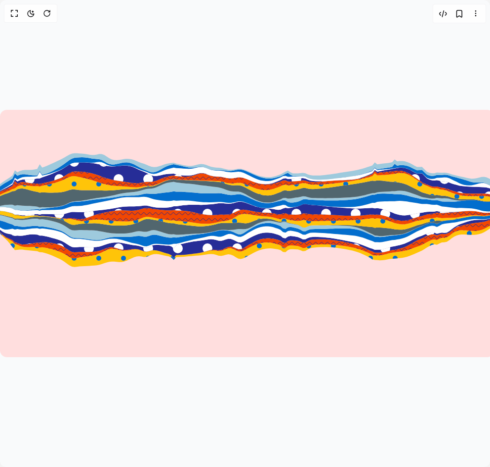

# Build Streamgraph in BuilderStudio

> Build this component in our Agentic IDE: [BuilderStudio](https://builderstudio.dev).
>
> Join the BuilderStudio community on [Discord](https://discord.gg/QdWeSGCqfe) and [Reddit](https://reddit.com/r/builderstudio).



## Component

- Author group: `airbnb`
- Component: `streamgraph`
- Variant: `default`
- Rendered HTML snapshot: [`rendered.html`](rendered.html)

## BuilderStudio prompt

You are implementing a React component based on a component reference.

## Component identity

- Author: airbnb
- Component slug: streamgraph
- Demo slug: default
- Title: streamgraph
- Description: 

## Goal

Recreate this component in a React + TypeScript + Tailwind CSS project. Preserve the visual layout, spacing, colors, border radius, shadows, interaction behavior, animation behavior, responsive behavior, and dark mode behavior shown in the rendered demo.

## Implementation requirements

- Use React and TypeScript.
- Use Tailwind CSS classes whenever possible.
- Keep the component self-contained unless the source files require helper components.
- If the source uses CSS variables, custom CSS, animations, or keyframes, include them.
- If the source uses external packages, list and use the required packages.
- Preserve accessibility attributes, button semantics, links, keyboard behavior, and ARIA attributes when visible in the source.
- Do not replace the component with a simplified placeholder.
- Return complete production-ready code.

## Dependencies

No reference metadata available.

## Rendered DOM snapshot

This is the rendered demo HTML extracted from the live preview. Use it to verify structure, class names, visible content, and layout.

```html
<div id="root"><div class="flex w-full h-screen justify-center items-center bg-gray-50"><svg width="1000" height="500"><defs><pattern id="mustard" width="50" height="50" patternUnits="userSpaceOnUse"><circle class="visx-pattern-circle" cx="25" cy="25" r="5" fill="#036ecf"></circle><circle class="visx-pattern-circle visx-pattern-circle-complement" cx="0" cy="0" r="5" fill="#036ecf"></circle><circle class="visx-pattern-circle visx-pattern-circle-complement" cx="0" cy="50" r="5" fill="#036ecf"></circle><circle class="visx-pattern-circle visx-pattern-circle-complement" cx="50" cy="0" r="5" fill="#036ecf"></circle><circle class="visx-pattern-circle visx-pattern-circle-complement" cx="50" cy="50" r="5" fill="#036ecf"></circle></pattern></defs><defs><pattern id="cherry" width="12" height="12" patternUnits="userSpaceOnUse"><path class="visx-pattern-path visx-pattern-wave" d="M 0 6 c 1.5 -3 , 4.5 -3 , 6 0
             c 1.5 3 , 4.5 3 , 6 0 M -6 6
             c 1.5 3 , 4.5 3 , 6 0 M 12 6
             c 1.5 -3 , 4.5 -3 , 6 0" fill="transparent" stroke="#232493" stroke-width="1" stroke-linecap="square" shape-rendering="auto"></path></pattern></defs><defs><pattern id="navy" width="60" height="70" patternUnits="userSpaceOnUse"><circle class="visx-pattern-circle" cx="30" cy="35" r="10" fill="white"></circle><circle class="visx-pattern-circle visx-pattern-circle-complement" cx="0" cy="0" r="10" fill="white"></circle><circle class="visx-pattern-circle visx-pattern-circle-complement" cx="0" cy="70" r="10" fill="white"></circle><circle class="visx-pattern-circle visx-pattern-circle-complement" cx="60" cy="0" r="10" fill="white"></circle><circle class="visx-pattern-circle visx-pattern-circle-complement" cx="60" cy="70" r="10" fill="white"></circle></pattern></defs><defs><pattern id="circles" width="60" height="60" patternUnits="userSpaceOnUse"><circle class="visx-pattern-circle" cx="30" cy="30" r="10" fill="transparent"></circle><circle class="visx-pattern-circle visx-pattern-circle-complement" cx="0" cy="0" r="10" fill="transparent"></circle><circle class="visx-pattern-circle visx-pattern-circle-complement" cx="0" cy="60" r="10" fill="transparent"></circle><circle class="visx-pattern-circle visx-pattern-circle-complement" cx="60" cy="0" r="10" fill="transparent"></circle><circle class="visx-pattern-circle visx-pattern-circle-complement" cx="60" cy="60" r="10" fill="transparent"></circle></pattern></defs><g><rect x="0" y="0" width="1000" height="500" fill="#ffdede" rx="14"></rect><g><path d="M0,248.20444251908086L5.025125628140704,253.30656364299853L10.050251256281408,257.3752098410501L15.07537688442211,260.45855244097226L20.100502512562816,263.1172797944714L25.12562814070352,265.88688484777043L30.15075376884422,270.6974585769636L35.175879396984925,272.4273289931071L40.20100502512563,274.95898594949716L45.22613065326633,276.55967787518347L50.25125628140704,277.2999672857699L55.276381909547744,277.46979909729396L60.30150753768844,277.3752284323917L65.32663316582915,277.22434320374737L70.35175879396985,277.12175020493027L75.37688442211055,277.12192258855447L80.40201005025126,278.48654322801383L85.42713567839195,277.86604986735824L90.45226130653266,278.47410696090145L95.47738693467336,279.35346482171815L100.50251256281408,280.4901953254466L105.52763819095478,281.8441360966353L110.55276381909549,283.3641784174118L115.57788944723619,285.01387000507935L120.60301507537687,286.8198546890818L125.62814070351757,288.93627484679905L130.6532663316583,291.6078033067088L135.678391959799,294.84407469023773L140.7035175879397,297.99955697290255L145.7286432160804,299.998625949902L150.7537688442211,300.32179607817153L155.77889447236183,299.51997056298865L160.80402010050253,298.5107683067466L165.82914572864323,297.71514270941907L170.8542713567839,297.0480204310459L175.87939698492463,296.3472417864669L180.90452261306532,295.56246272179067L185.92964824120602,294.6815544584468L190.95477386934672,293.63805511942684L195.97989949748742,292.30205645964537L201.00502512562815,290.531747081605L206.03015075376885,288.27836339973754L211.05527638190955,285.7326623021851L216.08040201005025,283.3365023961594L221.10552763819098,281.57583726094805L226.13065326633168,280.7675040896119L231.15577889447238,280.96538127535786L236.18090452261305,281.934937708752L241.20603015075375,283.19882027703846L246.23115577889448,284.20322848175647L251.25628140703515,284.5628775373674L256.2814070351759,284.2324775168327L261.3065326633166,283.47514818207173L266.3316582914573,282.6615993622836L271.356783919598,282.090595711705L276.38190954773864,282.01133639494424L281.4070351758794,282.753011770212L286.4321608040201,284.4627536919949L291.4572864321608,286.3889505956472L296.4824120603015,287.0832184310446L301.5075376884422,286.07038861520937L306.5326633165829,284.5430563222931L311.55778894472365,283.84924690002435L316.5829145728643,284.2649856921765L321.60804020100505,285.4015583920645L326.63316582914575,286.8805569386467L331.65829145728645,288.46797119802903L336.68341708542715,289.99245039491746L341.7085427135678,291.3167587209714L346.73366834170855,293.87122605279967L351.75879396984925,298.9466838231665L356.78391959798995,293.55644705030295L361.80904522613065,293.539555727439L366.83417085427135,293.4391471047577L371.85929648241205,293.1637029505458L376.8844221105528,292.7501476085232L381.90954773869345,292.23636415467064L386.9346733668342,291.66464004383306L391.95979899497485,291.0711103110266L396.9849246231156,290.4592442273435L402.0100502512563,289.7759717511377L407.03517587939695,288.92843405372605L412.0603015075377,287.85460230228864L417.08542713567834,286.5952503839779L422.1105527638191,285.3185904195282L427.1356783919598,284.32963678890326L432.1608040201005,284.02677467232064L437.1859296482412,284.56921940045913L442.21105527638196,285.35326914179984L447.2361809045226,285.2016217778502L452.26130653266335,283.5749540888747L457.286432160804,281.28814889462484L462.31155778894475,279.68113556431473L467.33668341708545,279.56784841249623L472.3618090452261,281.0901933016369L477.38693467336685,283.6985261535563L482.4120603015075,285.9971355689287L487.43718592964825,286.490103293088L492.46231155778895,284.9059031665076L497.48743718592965,282.2475010363159L502.5125628140703,279.5106364407425L507.53768844221105,276.9741863857565L512.5628140703518,274.5923293558911L517.5879396984925,272.42764111345883L522.6130653266332,270.63974778017774L527.6381909547738,269.3317505736875L532.6633165829146,268.5002611968236L537.6884422110553,268.08875782810105L542.713567839196,268.0696931124199L547.7386934673367,268.4858849549662L552.7638190954773,269.39140671578394L557.7889447236181,270.6965746795414L562.8140703517588,272.11540516507534L567.8391959798995,274.04734991327564L572.8643216080402,278.108343020305L577.8894472361809,279.0589876635677L582.9145728643216,275.3315614048479L587.9396984924623,273.93288537557305L592.964824120603,274.1788908134932L597.9899497487438,274.64744637756127L603.0150753768844,275.317204296288L608.0402010050251,277.02062042213873L613.0653266331658,279.3023646653333L618.0904522613065,279.01246865805933L623.1155778894473,276.1043367936916L628.140703517588,273.8909674581177L633.1658291457286,273.01692913862604L638.1909547738693,272.5998175739527L643.2160804020101,272.2927257004807L648.2412060301508,272.0693324220483L653.2663316582915,271.9473997866672L658.2914572864321,271.9411946859116L663.3165829145729,272.0565644237517L668.3417085427136,272.29086040434504L673.3668341708543,272.63474875583694L678.391959798995,273.0749469427292L683.4170854271356,273.5971428491548L688.4422110552764,274.1887374345567L693.4673366834171,274.84139854483664L698.4924623115578,275.55356985511213L703.5175879396985,276.33297874699736L708.5427135678392,277.1988139902376L713.5678391959799,278.1826390848756L718.5929648241206,279.32643461472406L723.6180904522613,280.6758021444945L728.6432160804021,282.26690261445987L733.6683417085427,284.1076845269823L738.6934673366834,286.1573249886131L743.7185929648241,288.31137610224187L748.7437185929648,290.4016702319934L753.7688442211056,293.79238692357626L758.7939698492462,294.4568528140851L763.8190954773869,294.29192977118913L768.8442211055276,294.2630187995245L773.8693467336684,293.5998717975045L778.8944723618091,292.47077984830486L783.9195979899497,291.12087479541225L788.9447236180904,289.79746668250414L793.9698492462312,288.68098107259397L798.9949748743719,288.20968242066533L804.0201005025126,287.2897225779488L809.0452261306532,286.7139792206951L814.0703517587939,286.01753945384525L819.0954773869347,285.0635073368606L824.1206030150754,283.79850191732885L829.1457286432161,282.251288634228L834.1708542713567,280.49658706758026L839.1959798994975,278.61081297019547L844.2211055276382,276.68040598679795L849.2462311557789,274.9200222971817L854.2713567839196,273.0815597556985L859.2964824120603,270.3560315048917L864.321608040201,267.5605836608436L869.3467336683417,265.08949787743774L874.3718592964824,262.867766407151L879.3969849246231,262.1234667979354L884.4221105527639,263.27269427395356L889.4472361809045,260.8290754251761L894.4723618090452,258.85916634007657L899.4974874371859,258.832937067367L904.5226130653267,257.73400195140715L909.5477386934674,254.69494307993835L914.572864321608,250.6695781913102L919.5979899497487,247.3466953597909L924.6231155778895,245.16809455667405L929.6482412060302,243.73803273201966L934.6733668341709,243.35522235505823L939.6984924623115,243.4652718193905L944.7236180904522,243.86841460137666L949.748743718593,244.37607526142446L954.7738693467337,244.79647553536466L959.7989949748744,244.95290777043337L964.824120603015,244.70600703751165L969.8492462311558,243.95665528513084L974.8743718592965,242.6326873844508L979.8994974874372,240.6937088605622L984.9246231155779,238.17346442086586L989.9497487437186,235.22456134506086L994.9748743718593,232.1074543005167L1000,229.11007009113948L1000,234.38917398861253L994.9748743718593,237.7531270339982L989.9497487437186,241.2306713271828L984.9246231155779,244.52979869368352L979.8994974874372,247.38599822708335L974.8743718592965,249.6427583886895L969.8492462311558,251.26272201418132L964.824120603015,252.28311323978681L959.7989949748744,252.77352631945516L954.7738693467337,252.8312675621812L949.748743718593,252.59480505490328L944.7236180904522,252.24100838626134L939.6984924623115,251.96299861789072L934.6733668341709,251.95196335912286L929.6482412060302,252.41159229075143L924.6231155778895,253.90149173126292L919.5979899497487,256.12936118050766L914.572864321608,259.49837188893355L909.5477386934674,263.5748926643053L904.5226130653267,266.6786727932148L899.4974874371859,267.8643387656592L894.4723618090452,268.00712486480717L889.4472361809045,270.13002522046185L884.4221105527639,272.767883382216L879.3969849246231,271.8566152928863L874.3718592964824,272.8822710476241L869.3467336683417,275.42532895383385L864.321608040201,278.2510674465879L859.2964824120603,281.4247470769938L854.2713567839196,284.53959620879647L849.2462311557789,286.7638369745312L844.2211055276382,288.8904940429867L839.1959798994975,291.151344087216L834.1708542713567,293.3160904161605L829.1457286432161,295.2843791482286L824.1206030150754,296.9685488394139L819.0954773869347,298.2860601277927L814.0703517587939,299.20425658438353L809.0452261306532,299.7767604187914L804.0201005025126,300.1447301794986L798.9949748743719,300.7809542191068L793.9698492462312,300.90338314319143L788.9447236180904,301.6188041089719L783.9195979899497,302.50306236749265L778.8944723618091,303.39006351246013L773.8693467336684,304.04617482269344L768.8442211055276,304.2385555330405L763.8190954773869,303.8092782142847L758.7939698492462,303.53670181948536L753.7688442211056,302.4611745730469L748.7437185929648,298.68930969895837L743.7185929648241,296.2492289760412L738.6934673366834,293.7765357708516L733.6683417085427,291.43794018498147L728.6432160804021,289.33563346201L723.6180904522613,287.50779945146695L718.5929648241206,285.9438291792897L713.5678391959799,284.60516484231584L708.5427135678392,283.4442714098313L703.5175879396985,282.4178129667146L698.4924623115578,281.4934861726565L693.4673366834171,280.65195065354555L688.4422110552764,279.8858393322915L683.4170854271356,279.1974716272566L678.391959798995,278.5962191076304L673.3668341708543,278.0958662885394L668.3417085427136,277.71193385097683L663.3165829145729,277.45882876843194L658.2914572864321,277.3468397147284L653.2663316582915,277.37934041381595L648.2412060301508,277.55094638568033L643.2160804020101,277.84758648845894L638.1909547738693,278.25144965497316L633.1658291457286,278.7886106625117L628.140703517588,279.80560251287466L623.1155778894473,282.1844148972865L618.0904522613065,285.28012316648903L613.0653266331658,285.77953393322923L608.0402010050251,283.7293056882034L603.0150753768844,282.279806424905L597.9899497487438,281.8871501447396L592.964824120603,281.7200511914548L587.9396984924623,281.80135655258925L582.9145728643216,283.5548978620668L577.8894472361809,287.66643967075584L572.8643216080402,287.1305686984563L567.8391959798995,283.51577463885883L562.8140703517588,282.0611780450634L557.7889447236181,281.14910155274845L552.7638190954773,280.37647865873686L547.7386934673367,280.02346796170247L542.713567839196,280.17149419516136L537.6884422110553,280.7557295997344L532.6633165829146,281.7202446168921L527.6381909547738,283.077477603073L522.6130653266332,284.86742689324177L517.5879396984925,287.07632570901836L512.5628140703518,289.58422169174094L507.53768844221105,292.21596062848414L502.5125628140703,294.89577990578044L497.48743718592965,297.65958147468996L492.46231155778895,300.2225823896642L487.43718592964825,301.587644029046L482.4120603015075,300.755098356544L477.38693467336685,298.00433270306723L472.3618090452261,294.84324473857015L467.33668341708545,292.68292968497167L462.31155778894475,292.09090561490314L457.286432160804,292.9446014750497L452.26130653266335,294.44982602980133L447.2361809045226,295.28581353269226L442.21105527638196,294.6554171080215L437.1859296482412,293.1136138745019L432.1608040201005,291.85084743345067L427.1356783919598,291.4812476890141L422.1105527638191,291.8533254696297L417.08542713567834,292.57390948565313L412.0603015075377,293.34100915480946L407.03517587939695,293.9876504132014L402.0100502512563,294.47294911997665L396.9849246231156,294.8579029867016L391.95979899497485,295.2338024592439L386.9346733668342,295.6519285831538L381.90954773869345,296.1070397948341L376.8844221105528,296.5614007056726L371.85929648241205,296.97137365538873L366.83417085427135,297.2979875079812L361.80904522613065,297.5034525145969L356.78391959798995,297.6785705154624L351.75879396984925,303.27954853890594L346.73366834170855,298.46667043025406L341.7085427135678,296.2258761888038L336.68341708542715,295.26553513064226L331.65829145728645,294.154576250015L326.63316582914575,293.0297990649428L321.60804020100505,292.06283336900213L316.5829145728643,291.4892640014979L311.55778894472365,291.69107875679566L306.5326633165829,293.06329956144424L301.5075376884422,295.33946198111965L296.4824120603015,297.1843772943695L291.4572864321608,297.4207226635926L286.4321608040201,296.53935062729676L281.4070351758794,296.00138631169585L276.38190954773864,296.56373586146276L271.356783919598,298.07208192401384L266.3316582914573,300.1730617448228L261.3065326633166,302.57366814271063L256.2814070351759,304.91217999888045L251.25628140703515,306.7402057237183L246.23115577889448,307.71051456712763L241.20603015075375,307.788911412488L236.18090452261305,307.29759967470557L231.15577889447238,306.75370077286965L226.13065326633168,306.6302149847352L221.10552763819098,307.1900757746649L216.08040201005025,308.4353827882012L211.05527638190955,310.1232940639251L206.03015075376885,311.8481302166636L201.00502512562815,313.24319174042773L195.97989949748742,314.17887623193474L190.95477386934672,314.74600330931435L185.92964824120602,315.10827931752937L180.90452261306532,315.3996351394919L175.87939698492463,315.6770911426797L170.8542713567839,315.93504250808553L165.82914572864323,316.2026163249589L160.80402010050253,316.621011363828L155.77889447236183,317.2570071382686L150.7537688442211,317.67519817806783L145.7286432160804,316.9475874075667L140.7035175879397,314.51661011260967L135.678391959799,310.89817274003326L130.6532663316583,307.1667146269414L125.62814070351757,303.9683626099834L120.60301507537687,301.29536641777486L115.57788944723619,298.905862699887L110.55276381909549,296.64918189338664L105.52763819095478,294.5026273001824L100.50251256281408,292.50692972870894L95.47738693467336,290.7176913807003L90.45226130653266,289.17968082579574L85.42713567839195,287.9114506220362L80.40201005025126,287.87480407157545L75.37688442211055,285.8604759497688L70.35175879396985,285.22219761818354L65.32663316582915,284.7021953295758L60.30150753768844,284.25040673272616L55.276381909547744,283.7773878694108L50.25125628140704,283.17307983778016L45.22613065326633,282.55401181357377L40.20100502512563,282.5031823229239L35.175879396984925,283.07680392296754L30.15075376884422,283.5863601821447L25.12562814070352,277.3612281162476L20.100502512562816,270.6379919067L15.07537688442211,264.6975629148264L10.050251256281408,260.06307628616366L5.025125628140704,255.40651866052576L0,250Z" fill="#ffc409"></path><path d="M0,248.20444251908086L5.025125628140704,253.30656364299853L10.050251256281408,257.3752098410501L15.07537688442211,260.45855244097226L20.100502512562816,263.1172797944714L25.12562814070352,265.88688484777043L30.15075376884422,270.6974585769636L35.175879396984925,272.4273289931071L40.20100502512563,274.95898594949716L45.22613065326633,276.55967787518347L50.25125628140704,277.2999672857699L55.276381909547744,277.46979909729396L60.30150753768844,277.3752284323917L65.32663316582915,277.22434320374737L70.35175879396985,277.12175020493027L75.37688442211055,277.12192258855447L80.40201005025126,278.48654322801383L85.42713567839195,277.86604986735824L90.45226130653266,278.47410696090145L95.47738693467336,279.35346482171815L100.50251256281408,280.4901953254466L105.52763819095478,281.8441360966353L110.55276381909549,283.3641784174118L115.57788944723619,285.01387000507935L120.60301507537687,286.8198546890818L125.62814070351757,288.93627484679905L130.6532663316583,291.6078033067088L135.678391959799,294.84407469023773L140.7035175879397,297.99955697290255L145.7286432160804,299.998625949902L150.7537688442211,300.32179607817153L155.77889447236183,299.51997056298865L160.80402010050253,298.5107683067466L165.82914572864323,297.71514270941907L170.8542713567839,297.0480204310459L175.87939698492463,296.3472417864669L180.90452261306532,295.56246272179067L185.92964824120602,294.6815544584468L190.95477386934672,293.63805511942684L195.97989949748742,292.30205645964537L201.00502512562815,290.531747081605L206.03015075376885,288.27836339973754L211.05527638190955,285.7326623021851L216.08040201005025,283.3365023961594L221.10552763819098,281.57583726094805L226.13065326633168,280.7675040896119L231.15577889447238,280.96538127535786L236.18090452261305,281.934937708752L241.20603015075375,283.19882027703846L246.23115577889448,284.20322848175647L251.25628140703515,284.5628775373674L256.2814070351759,284.2324775168327L261.3065326633166,283.47514818207173L266.3316582914573,282.6615993622836L271.356783919598,282.090595711705L276.38190954773864,282.01133639494424L281.4070351758794,282.753011770212L286.4321608040201,284.4627536919949L291.4572864321608,286.3889505956472L296.4824120603015,287.0832184310446L301.5075376884422,286.07038861520937L306.5326633165829,284.5430563222931L311.55778894472365,283.84924690002435L316.5829145728643,284.2649856921765L321.60804020100505,285.4015583920645L326.63316582914575,286.8805569386467L331.65829145728645,288.46797119802903L336.68341708542715,289.99245039491746L341.7085427135678,291.3167587209714L346.73366834170855,293.87122605279967L351.75879396984925,298.9466838231665L356.78391959798995,293.55644705030295L361.80904522613065,293.539555727439L366.83417085427135,293.4391471047577L371.85929648241205,293.1637029505458L376.8844221105528,292.7501476085232L381.90954773869345,292.23636415467064L386.9346733668342,291.66464004383306L391.95979899497485,291.0711103110266L396.9849246231156,290.4592442273435L402.0100502512563,289.7759717511377L407.03517587939695,288.92843405372605L412.0603015075377,287.85460230228864L417.08542713567834,286.5952503839779L422.1105527638191,285.3185904195282L427.1356783919598,284.32963678890326L432.1608040201005,284.02677467232064L437.1859296482412,284.56921940045913L442.21105527638196,285.35326914179984L447.2361809045226,285.2016217778502L452.26130653266335,283.5749540888747L457.286432160804,281.28814889462484L462.31155778894475,279.68113556431473L467.33668341708545,279.56784841249623L472.3618090452261,281.0901933016369L477.38693467336685,283.6985261535563L482.4120603015075,285.9971355689287L487.43718592964825,286.490103293088L492.46231155778895,284.9059031665076L497.48743718592965,282.2475010363159L502.5125628140703,279.5106364407425L507.53768844221105,276.9741863857565L512.5628140703518,274.5923293558911L517.5879396984925,272.42764111345883L522.6130653266332,270.63974778017774L527.6381909547738,269.3317505736875L532.6633165829146,268.5002611968236L537.6884422110553,268.08875782810105L542.713567839196,268.0696931124199L547.7386934673367,268.4858849549662L552.7638190954773,269.39140671578394L557.7889447236181,270.6965746795414L562.8140703517588,272.11540516507534L567.8391959798995,274.04734991327564L572.8643216080402,278.108343020305L577.8894472361809,279.0589876635677L582.9145728643216,275.3315614048479L587.9396984924623,273.93288537557305L592.964824120603,274.1788908134932L597.9899497487438,274.64744637756127L603.0150753768844,275.317204296288L608.0402010050251,277.02062042213873L613.0653266331658,279.3023646653333L618.0904522613065,279.01246865805933L623.1155778894473,276.1043367936916L628.140703517588,273.8909674581177L633.1658291457286,273.01692913862604L638.1909547738693,272.5998175739527L643.2160804020101,272.2927257004807L648.2412060301508,272.0693324220483L653.2663316582915,271.9473997866672L658.2914572864321,271.9411946859116L663.3165829145729,272.0565644237517L668.3417085427136,272.29086040434504L673.3668341708543,272.63474875583694L678.391959798995,273.0749469427292L683.4170854271356,273.5971428491548L688.4422110552764,274.1887374345567L693.4673366834171,274.84139854483664L698.4924623115578,275.55356985511213L703.5175879396985,276.33297874699736L708.5427135678392,277.1988139902376L713.5678391959799,278.1826390848756L718.5929648241206,279.32643461472406L723.6180904522613,280.6758021444945L728.6432160804021,282.26690261445987L733.6683417085427,284.1076845269823L738.6934673366834,286.1573249886131L743.7185929648241,288.31137610224187L748.7437185929648,290.4016702319934L753.7688442211056,293.79238692357626L758.7939698492462,294.4568528140851L763.8190954773869,294.29192977118913L768.8442211055276,294.2630187995245L773.8693467336684,293.5998717975045L778.8944723618091,292.47077984830486L783.9195979899497,291.12087479541225L788.9447236180904,289.79746668250414L793.9698492462312,288.68098107259397L798.9949748743719,288.20968242066533L804.0201005025126,287.2897225779488L809.0452261306532,286.7139792206951L814.0703517587939,286.01753945384525L819.0954773869347,285.0635073368606L824.1206030150754,283.79850191732885L829.1457286432161,282.251288634228L834.1708542713567,280.49658706758026L839.1959798994975,278.61081297019547L844.2211055276382,276.68040598679795L849.2462311557789,274.9200222971817L854.2713567839196,273.0815597556985L859.2964824120603,270.3560315048917L864.321608040201,267.5605836608436L869.3467336683417,265.08949787743774L874.3718592964824,262.867766407151L879.3969849246231,262.1234667979354L884.4221105527639,263.27269427395356L889.4472361809045,260.8290754251761L894.4723618090452,258.85916634007657L899.4974874371859,258.832937067367L904.5226130653267,257.73400195140715L909.5477386934674,254.69494307993835L914.572864321608,250.6695781913102L919.5979899497487,247.3466953597909L924.6231155778895,245.16809455667405L929.6482412060302,243.73803273201966L934.6733668341709,243.35522235505823L939.6984924623115,243.4652718193905L944.7236180904522,243.86841460137666L949.748743718593,244.37607526142446L954.7738693467337,244.79647553536466L959.7989949748744,244.95290777043337L964.824120603015,244.70600703751165L969.8492462311558,243.95665528513084L974.8743718592965,242.6326873844508L979.8994974874372,240.6937088605622L984.9246231155779,238.17346442086586L989.9497487437186,235.22456134506086L994.9748743718593,232.1074543005167L1000,229.11007009113948L1000,234.38917398861253L994.9748743718593,237.7531270339982L989.9497487437186,241.2306713271828L984.9246231155779,244.52979869368352L979.8994974874372,247.38599822708335L974.8743718592965,249.6427583886895L969.8492462311558,251.26272201418132L964.824120603015,252.28311323978681L959.7989949748744,252.77352631945516L954.7738693467337,252.8312675621812L949.748743718593,252.59480505490328L944.7236180904522,252.24100838626134L939.6984924623115,251.96299861789072L934.6733668341709,251.95196335912286L929.6482412060302,252.41159229075143L924.6231155778895,253.90149173126292L919.5979899497487,256.12936118050766L914.572864321608,259.49837188893355L909.5477386934674,263.5748926643053L904.5226130653267,266.6786727932148L899.4974874371859,267.8643387656592L894.4723618090452,268.00712486480717L889.4472361809045,270.13002522046185L884.4221105527639,272.767883382216L879.3969849246231,271.8566152928863L874.3718592964824,272.8822710476241L869.3467336683417,275.42532895383385L864.321608040201,278.2510674465879L859.2964824120603,281.4247470769938L854.2713567839196,284.53959620879647L849.2462311557789,286.7638369745312L844.2211055276382,288.8904940429867L839.1959798994975,291.151344087216L834.1708542713567,293.3160904161605L829.1457286432161,295.2843791482286L824.1206030150754,296.9685488394139L819.0954773869347,298.2860601277927L814.0703517587939,299.20425658438353L809.0452261306532,299.7767604187914L804.0201005025126,300.1447301794986L798.9949748743719,300.7809542191068L793.9698492462312,300.90338314319143L788.9447236180904,301.6188041089719L783.9195979899497,302.50306236749265L778.8944723618091,303.39006351246013L773.8693467336684,304.04617482269344L768.8442211055276,304.2385555330405L763.8190954773869,303.8092782142847L758.7939698492462,303.53670181948536L753.7688442211056,302.4611745730469L748.7437185929648,298.68930969895837L743.7185929648241,296.2492289760412L738.6934673366834,293.7765357708516L733.6683417085427,291.43794018498147L728.6432160804021,289.33563346201L723.6180904522613,287.50779945146695L718.5929648241206,285.9438291792897L713.5678391959799,284.60516484231584L708.5427135678392,283.4442714098313L703.5175879396985,282.4178129667146L698.4924623115578,281.4934861726565L693.4673366834171,280.65195065354555L688.4422110552764,279.8858393322915L683.4170854271356,279.1974716272566L678.391959798995,278.5962191076304L673.3668341708543,278.0958662885394L668.3417085427136,277.71193385097683L663.3165829145729,277.45882876843194L658.2914572864321,277.3468397147284L653.2663316582915,277.37934041381595L648.2412060301508,277.55094638568033L643.2160804020101,277.84758648845894L638.1909547738693,278.25144965497316L633.1658291457286,278.7886106625117L628.140703517588,279.80560251287466L623.1155778894473,282.1844148972865L618.0904522613065,285.28012316648903L613.0653266331658,285.77953393322923L608.0402010050251,283.7293056882034L603.0150753768844,282.279806424905L597.9899497487438,281.8871501447396L592.964824120603,281.7200511914548L587.9396984924623,281.80135655258925L582.9145728643216,283.5548978620668L577.8894472361809,287.66643967075584L572.8643216080402,287.1305686984563L567.8391959798995,283.51577463885883L562.8140703517588,282.0611780450634L557.7889447236181,281.14910155274845L552.7638190954773,280.37647865873686L547.7386934673367,280.02346796170247L542.713567839196,280.17149419516136L537.6884422110553,280.7557295997344L532.6633165829146,281.7202446168921L527.6381909547738,283.077477603073L522.6130653266332,284.86742689324177L517.5879396984925,287.07632570901836L512.5628140703518,289.58422169174094L507.53768844221105,292.21596062848414L502.5125628140703,294.89577990578044L497.48743718592965,297.65958147468996L492.46231155778895,300.2225823896642L487.43718592964825,301.587644029046L482.4120603015075,300.755098356544L477.38693467336685,298.00433270306723L472.3618090452261,294.84324473857015L467.33668341708545,292.68292968497167L462.31155778894475,292.09090561490314L457.286432160804,292.9446014750497L452.26130653266335,294.44982602980133L447.2361809045226,295.28581353269226L442.21105527638196,294.6554171080215L437.1859296482412,293.1136138745019L432.1608040201005,291.85084743345067L427.1356783919598,291.4812476890141L422.1105527638191,291.8533254696297L417.08542713567834,292.57390948565313L412.0603015075377,293.34100915480946L407.03517587939695,293.9876504132014L402.0100502512563,294.47294911997665L396.9849246231156,294.8579029867016L391.95979899497485,295.2338024592439L386.9346733668342,295.6519285831538L381.90954773869345,296.1070397948341L376.8844221105528,296.5614007056726L371.85929648241205,296.97137365538873L366.83417085427135,297.2979875079812L361.80904522613065,297.5034525145969L356.78391959798995,297.6785705154624L351.75879396984925,303.27954853890594L346.73366834170855,298.46667043025406L341.7085427135678,296.2258761888038L336.68341708542715,295.26553513064226L331.65829145728645,294.154576250015L326.63316582914575,293.0297990649428L321.60804020100505,292.06283336900213L316.5829145728643,291.4892640014979L311.55778894472365,291.69107875679566L306.5326633165829,293.06329956144424L301.5075376884422,295.33946198111965L296.4824120603015,297.1843772943695L291.4572864321608,297.4207226635926L286.4321608040201,296.53935062729676L281.4070351758794,296.00138631169585L276.38190954773864,296.56373586146276L271.356783919598,298.07208192401384L266.3316582914573,300.1730617448228L261.3065326633166,302.57366814271063L256.2814070351759,304.91217999888045L251.25628140703515,306.7402057237183L246.23115577889448,307.71051456712763L241.20603015075375,307.788911412488L236.18090452261305,307.29759967470557L231.15577889447238,306.75370077286965L226.13065326633168,306.6302149847352L221.10552763819098,307.1900757746649L216.08040201005025,308.4353827882012L211.05527638190955,310.1232940639251L206.03015075376885,311.8481302166636L201.00502512562815,313.24319174042773L195.97989949748742,314.17887623193474L190.95477386934672,314.74600330931435L185.92964824120602,315.10827931752937L180.90452261306532,315.3996351394919L175.87939698492463,315.6770911426797L170.8542713567839,315.93504250808553L165.82914572864323,316.2026163249589L160.80402010050253,316.621011363828L155.77889447236183,317.2570071382686L150.7537688442211,317.67519817806783L145.7286432160804,316.9475874075667L140.7035175879397,314.51661011260967L135.678391959799,310.89817274003326L130.6532663316583,307.1667146269414L125.62814070351757,303.9683626099834L120.60301507537687,301.29536641777486L115.57788944723619,298.905862699887L110.55276381909549,296.64918189338664L105.52763819095478,294.5026273001824L100.50251256281408,292.50692972870894L95.47738693467336,290.7176913807003L90.45226130653266,289.17968082579574L85.42713567839195,287.9114506220362L80.40201005025126,287.87480407157545L75.37688442211055,285.8604759497688L70.35175879396985,285.22219761818354L65.32663316582915,284.7021953295758L60.30150753768844,284.25040673272616L55.276381909547744,283.7773878694108L50.25125628140704,283.17307983778016L45.22613065326633,282.55401181357377L40.20100502512563,282.5031823229239L35.175879396984925,283.07680392296754L30.15075376884422,283.5863601821447L25.12562814070352,277.3612281162476L20.100502512562816,270.6379919067L15.07537688442211,264.6975629148264L10.050251256281408,260.06307628616366L5.025125628140704,255.40651866052576L0,250Z" fill="url(#mustard)"></path></g><g><path d="M0,247.13773228679457L5.025125628140704,252.0253288784609L10.050251256281408,255.84406422435146L15.07537688442211,258.6382829545499L20.100502512562816,260.96499403623045L25.12562814070352,263.3563498156134L30.15075376884422,267.73966655577783L35.175879396984925,268.9913203054085L40.20100502512563,270.99294817019734L45.22613065326633,272.012326485605L50.25125628140704,272.12219395153176L55.276381909547744,271.616551657043L60.30150753768844,270.80756272271765L65.32663316582915,269.91156299787997L70.35175879396985,269.0435301843838L75.37688442211055,268.2702929496011L80.40201005025126,268.867605689321L85.42713567839195,267.5012954980677L90.45226130653266,267.4012176480427L95.47738693467336,267.626502593314L100.50251256281408,268.17911622915716L105.52763819095478,269.03360581064675L110.55276381909549,270.15171210522664L115.57788944723619,271.50736522996885L120.60301507537687,273.1346292450173L125.62814070351757,275.19175704620415L130.6532663316583,277.924047121379L135.678391959799,281.3382837481277L140.7035175879397,284.7827986942516L145.7286432160804,287.1729004605399L150.7537688442211,287.97759578097555L155.77889447236183,287.73442837372687L160.80402010050253,287.34644935969027L165.82914572864323,287.2194899360322L170.8542713567839,287.25342278665244L175.87939698492463,287.2716584356153L180.90452261306532,287.21050966942073L185.92964824120602,287.0459433038223L190.95477386934672,286.7012670468293L195.97989949748742,286.0381374654143L201.00502512562815,284.9081211596839L206.03015075376885,283.2575768318073L211.05527638190955,281.2739919750591L216.08040201005025,279.3973819257853L221.10552763819098,278.1130746753618L226.13065326633168,277.73828241307L231.15577889447238,278.3280475989639L236.18090452261305,279.64959679531205L241.20603015075375,281.22775545792956L246.23115577889448,282.51117594407464L251.25628140703515,283.1171806825079L256.2814070351759,283.0031466151889L261.3065326633166,282.4348477719852L266.3316582914573,281.7855823864631L271.356783919598,281.3565997668014L276.38190954773864,281.39945405933014L281.4070351758794,282.2455439976262L286.4321608040201,284.04405281704715L291.4572864321608,286.0452575983514L296.4824120603015,286.8024976945522L301.5075376884422,285.8421623918583L306.5326633165829,284.3582403952961L311.55778894472365,283.69998839567484L316.5829145728643,284.1445035821233L321.60804020100505,285.3039868715625L326.63316582914575,286.8007915427978L331.65829145728645,288.40151721306944L336.68341708542715,289.93527284195466L341.7085427135678,291.2651329540832L346.73366834170855,293.82158784892636L351.75879396984925,298.89547777840824L356.78391959798995,293.4999721669945L361.80904522613065,293.4738073067248L366.83417085427135,293.3596544726688L371.85929648241205,293.0653631557039L376.8844221105528,292.627056039468L381.90954773869345,292.08164402364093L386.9346733668342,291.470273844661L391.95979899497485,290.8277776363882L396.9849246231156,290.15617165999134L402.0100502512563,289.40080184005996L407.03517587939695,288.46712154596116L412.0603015075377,287.2913467056999L417.08542713567834,285.91247445737696L422.1105527638191,284.4969741943933L427.1356783919598,283.34821610071606L432.1608040201005,282.8631118196371L437.1859296482412,283.19965139133467L442.21105527638196,283.7532360135614L447.2361809045226,283.3460737317029L452.26130653266335,281.43883178024305L457.286432160804,278.84692635424085L462.31155778894475,276.9114101602417L467.33668341708545,276.44795733401776L472.3618090452261,277.6008316394556L477.38693467336685,279.8233381835592L482.4120603015075,281.723248733828L487.43718592964825,281.8085739941143L492.46231155778895,279.8120451240547L497.48743718592965,276.74107083321707L502.5125628140703,273.5958569486863L507.53768844221105,270.6595969350118L512.5628140703518,267.8904613832843L517.5879396984925,265.35452905852895L522.6130653266332,263.21429646333723L527.6381909547738,261.57499131681254L532.6633165829146,260.43453859614783L537.6884422110553,259.7368964261428L542.713567839196,259.4541973979284L547.7386934673367,259.6282264911852L552.7638190954773,260.3114483729189L557.7889447236181,261.41217388315204L562.8140703517588,262.6422261074192L567.8391959798995,264.39889953940275L572.8643216080402,268.2962283828918L577.8894472361809,269.09337431162237L582.9145728643216,265.2217953744844L587.9396984924623,263.68822665914007L592.964824120603,263.80929534272326L597.9899497487438,264.1643277303819L603.0150753768844,264.7341062689926L608.0402010050251,266.3537375221085L613.0653266331658,268.57085912835447L618.0904522613065,268.23854887369953L623.1155778894473,265.31308164140506L628.140703517588,263.10990226817387L633.1658291457286,262.2753798639522L638.1909547738693,261.9280883729028L643.2160804020101,261.72115977971663L648.2412060301508,261.6273253557087L653.2663316582915,261.6624378191525L658.2914572864321,261.83798754712654L663.3165829145729,262.15633335253557L668.3417085427136,262.61082835401976L673.3668341708543,263.1878625456061L678.391959798995,263.86984209508233L683.4170854271356,264.6383427836755L688.4422110552764,265.4770612486876L693.4673366834171,266.3745372240198L698.4924623115578,267.32678045950337L703.5175879396985,268.33984050106113L708.5427135678392,269.4319893465164L713.5678391959799,270.63458635783064L718.5929648241206,271.9900258587857L723.6180904522613,273.5448093580388L728.6432160804021,275.3363254863466L733.6683417085427,277.3739018122814L738.6934673366834,279.61805679863784L743.7185929648241,281.96544315283586L748.7437185929648,284.2485255985387L753.7688442211056,286.1680877234606L758.7939698492462,288.6819691854309L763.8190954773869,288.70683249575524L768.8442211055276,288.85399515554093L773.8693467336684,288.3494780370072L778.8944723618091,287.3499472835777L783.9195979899497,286.0844427227652L788.9447236180904,284.7794046322259L793.9698492462312,283.5901113799772L798.9949748743719,282.9271531011098L804.0201005025126,281.6698084929527L809.0452261306532,280.58981385580705L814.0703517587939,279.212915229368L819.0954773869347,277.41083837261874L824.1206030150754,275.1615110355815L829.1457286432161,272.5492787947427L834.1708542713567,269.7257915708245L839.1959798994975,266.8578394543912L844.2211055276382,264.1235849042215L849.2462311557789,261.81657076418077L854.2713567839196,259.7414574186609L859.2964824120603,257.1065900813437L864.321608040201,254.70796784742745L869.3467336683417,252.88421401647275L874.3718592964824,251.4801331839518L879.3969849246231,251.63263152646354L884.4221105527639,253.6696015238859L889.4472361809045,252.03081839479592L894.4723618090452,250.7300672047049L899.4974874371859,251.20683902628542L904.5226130653267,250.43255546753497L909.5477386934674,247.5378914012701L914.572864321608,243.47505529904927L919.5979899497487,239.9224448704741L924.6231155778895,237.298381999144L929.6482412060302,235.1752335221462L934.6733668341709,233.82764893365498L939.6984924623115,232.71071844135892L944.7236180904522,231.69393987949243L949.748743718593,230.73016711211048L954.7738693467337,229.82650241596087L959.7989949748744,229.01783760002138L964.824120603015,228.32740479682008L969.8492462311558,227.7162949116479L974.8743718592965,227.049938884201L979.8994974874372,226.12581245170986L984.9246231155779,224.77084301213372L989.9497487437186,222.9481213957748L994.9748743718593,220.78991989908974L1000,218.53118749165262L1000,229.11007009113948L994.9748743718593,232.1074543005167L989.9497487437186,235.22456134506086L984.9246231155779,238.17346442086586L979.8994974874372,240.6937088605622L974.8743718592965,242.6326873844508L969.8492462311558,243.95665528513084L964.824120603015,244.70600703751165L959.7989949748744,244.95290777043337L954.7738693467337,244.79647553536466L949.748743718593,244.37607526142446L944.7236180904522,243.86841460137666L939.6984924623115,243.4652718193905L934.6733668341709,243.35522235505823L929.6482412060302,243.73803273201966L924.6231155778895,245.16809455667405L919.5979899497487,247.3466953597909L914.572864321608,250.6695781913102L909.5477386934674,254.69494307993835L904.5226130653267,257.73400195140715L899.4974874371859,258.832937067367L894.4723618090452,258.85916634007657L889.4472361809045,260.8290754251761L884.4221105527639,263.27269427395356L879.3969849246231,262.1234667979354L874.3718592964824,262.867766407151L869.3467336683417,265.08949787743774L864.321608040201,267.5605836608436L859.2964824120603,270.3560315048917L854.2713567839196,273.0815597556985L849.2462311557789,274.9200222971817L844.2211055276382,276.68040598679795L839.1959798994975,278.61081297019547L834.1708542713567,280.49658706758026L829.1457286432161,282.251288634228L824.1206030150754,283.79850191732885L819.0954773869347,285.0635073368606L814.0703517587939,286.01753945384525L809.0452261306532,286.7139792206951L804.0201005025126,287.2897225779488L798.9949748743719,288.20968242066533L793.9698492462312,288.68098107259397L788.9447236180904,289.79746668250414L783.9195979899497,291.12087479541225L778.8944723618091,292.47077984830486L773.8693467336684,293.5998717975045L768.8442211055276,294.2630187995245L763.8190954773869,294.29192977118913L758.7939698492462,294.4568528140851L753.7688442211056,293.79238692357626L748.7437185929648,290.4016702319934L743.7185929648241,288.31137610224187L738.6934673366834,286.1573249886131L733.6683417085427,284.1076845269823L728.6432160804021,282.26690261445987L723.6180904522613,280.6758021444945L718.5929648241206,279.32643461472406L713.5678391959799,278.1826390848756L708.5427135678392,277.1988139902376L703.5175879396985,276.33297874699736L698.4924623115578,275.55356985511213L693.4673366834171,274.84139854483664L688.4422110552764,274.1887374345567L683.4170854271356,273.5971428491548L678.391959798995,273.0749469427292L673.3668341708543,272.63474875583694L668.3417085427136,272.29086040434504L663.3165829145729,272.0565644237517L658.2914572864321,271.9411946859116L653.2663316582915,271.9473997866672L648.2412060301508,272.0693324220483L643.2160804020101,272.2927257004807L638.1909547738693,272.5998175739527L633.1658291457286,273.01692913862604L628.140703517588,273.8909674581177L623.1155778894473,276.1043367936916L618.0904522613065,279.01246865805933L613.0653266331658,279.3023646653333L608.0402010050251,277.02062042213873L603.0150753768844,275.317204296288L597.9899497487438,274.64744637756127L592.964824120603,274.1788908134932L587.9396984924623,273.93288537557305L582.9145728643216,275.3315614048479L577.8894472361809,279.0589876635677L572.8643216080402,278.108343020305L567.8391959798995,274.04734991327564L562.8140703517588,272.11540516507534L557.7889447236181,270.6965746795414L552.7638190954773,269.39140671578394L547.7386934673367,268.4858849549662L542.713567839196,268.0696931124199L537.6884422110553,268.08875782810105L532.6633165829146,268.5002611968236L527.6381909547738,269.3317505736875L522.6130653266332,270.63974778017774L517.5879396984925,272.42764111345883L512.5628140703518,274.5923293558911L507.53768844221105,276.9741863857565L502.5125628140703,279.5106364407425L497.48743718592965,282.2475010363159L492.46231155778895,284.9059031665076L487.43718592964825,286.490103293088L482.4120603015075,285.9971355689287L477.38693467336685,283.6985261535563L472.3618090452261,281.0901933016369L467.33668341708545,279.56784841249623L462.31155778894475,279.68113556431473L457.286432160804,281.28814889462484L452.26130653266335,283.5749540888747L447.2361809045226,285.2016217778502L442.21105527638196,285.35326914179984L437.1859296482412,284.56921940045913L432.1608040201005,284.02677467232064L427.1356783919598,284.32963678890326L422.1105527638191,285.3185904195282L417.08542713567834,286.5952503839779L412.0603015075377,287.85460230228864L407.03517587939695,288.92843405372605L402.0100502512563,289.7759717511377L396.9849246231156,290.4592442273435L391.95979899497485,291.0711103110266L386.9346733668342,291.66464004383306L381.90954773869345,292.23636415467064L376.8844221105528,292.7501476085232L371.85929648241205,293.1637029505458L366.83417085427135,293.4391471047577L361.80904522613065,293.539555727439L356.78391959798995,293.55644705030295L351.75879396984925,298.9466838231665L346.73366834170855,293.87122605279967L341.7085427135678,291.3167587209714L336.68341708542715,289.99245039491746L331.65829145728645,288.46797119802903L326.63316582914575,286.8805569386467L321.60804020100505,285.4015583920645L316.5829145728643,284.2649856921765L311.55778894472365,283.84924690002435L306.5326633165829,284.5430563222931L301.5075376884422,286.07038861520937L296.4824120603015,287.0832184310446L291.4572864321608,286.3889505956472L286.4321608040201,284.4627536919949L281.4070351758794,282.753011770212L276.38190954773864,282.01133639494424L271.356783919598,282.090595711705L266.3316582914573,282.6615993622836L261.3065326633166,283.47514818207173L256.2814070351759,284.2324775168327L251.25628140703515,284.5628775373674L246.23115577889448,284.20322848175647L241.20603015075375,283.19882027703846L236.18090452261305,281.934937708752L231.15577889447238,280.96538127535786L226.13065326633168,280.7675040896119L221.10552763819098,281.57583726094805L216.08040201005025,283.3365023961594L211.05527638190955,285.7326623021851L206.03015075376885,288.27836339973754L201.00502512562815,290.531747081605L195.97989949748742,292.30205645964537L190.95477386934672,293.63805511942684L185.92964824120602,294.6815544584468L180.90452261306532,295.56246272179067L175.87939698492463,296.3472417864669L170.8542713567839,297.0480204310459L165.82914572864323,297.71514270941907L160.80402010050253,298.5107683067466L155.77889447236183,299.51997056298865L150.7537688442211,300.32179607817153L145.7286432160804,299.998625949902L140.7035175879397,297.99955697290255L135.678391959799,294.84407469023773L130.6532663316583,291.6078033067088L125.62814070351757,288.93627484679905L120.60301507537687,286.8198546890818L115.57788944723619,285.01387000507935L110.55276381909549,283.3641784174118L105.52763819095478,281.8441360966353L100.50251256281408,280.4901953254466L95.47738693467336,279.35346482171815L90.45226130653266,278.47410696090145L85.42713567839195,277.86604986735824L80.40201005025126,278.48654322801383L75.37688442211055,277.12192258855447L70.35175879396985,277.12175020493027L65.32663316582915,277.22434320374737L60.30150753768844,277.3752284323917L55.276381909547744,277.46979909729396L50.25125628140704,277.2999672857699L45.22613065326633,276.55967787518347L40.20100502512563,274.95898594949716L35.175879396984925,272.4273289931071L30.15075376884422,270.6974585769636L25.12562814070352,265.88688484777043L20.100502512562816,263.1172797944714L15.07537688442211,260.45855244097226L10.050251256281408,257.3752098410501L5.025125628140704,253.30656364299853L0,248.20444251908086Z" fill="#f14702"></path><path d="M0,247.13773228679457L5.025125628140704,252.0253288784609L10.050251256281408,255.84406422435146L15.07537688442211,258.6382829545499L20.100502512562816,260.96499403623045L25.12562814070352,263.3563498156134L30.15075376884422,267.73966655577783L35.175879396984925,268.9913203054085L40.20100502512563,270.99294817019734L45.22613065326633,272.012326485605L50.25125628140704,272.12219395153176L55.276381909547744,271.616551657043L60.30150753768844,270.80756272271765L65.32663316582915,269.91156299787997L70.35175879396985,269.0435301843838L75.37688442211055,268.2702929496011L80.40201005025126,268.867605689321L85.42713567839195,267.5012954980677L90.45226130653266,267.4012176480427L95.47738693467336,267.626502593314L100.50251256281408,268.17911622915716L105.52763819095478,269.03360581064675L110.55276381909549,270.15171210522664L115.57788944723619,271.50736522996885L120.60301507537687,273.1346292450173L125.62814070351757,275.19175704620415L130.6532663316583,277.924047121379L135.678391959799,281.3382837481277L140.7035175879397,284.7827986942516L145.7286432160804,287.1729004605399L150.7537688442211,287.97759578097555L155.77889447236183,287.73442837372687L160.80402010050253,287.34644935969027L165.82914572864323,287.2194899360322L170.8542713567839,287.25342278665244L175.87939698492463,287.2716584356153L180.90452261306532,287.21050966942073L185.92964824120602,287.0459433038223L190.95477386934672,286.7012670468293L195.97989949748742,286.0381374654143L201.00502512562815,284.9081211596839L206.03015075376885,283.2575768318073L211.05527638190955,281.2739919750591L216.08040201005025,279.3973819257853L221.10552763819098,278.1130746753618L226.13065326633168,277.73828241307L231.15577889447238,278.3280475989639L236.18090452261305,279.64959679531205L241.20603015075375,281.22775545792956L246.23115577889448,282.51117594407464L251.25628140703515,283.1171806825079L256.2814070351759,283.0031466151889L261.3065326633166,282.4348477719852L266.3316582914573,281.7855823864631L271.356783919598,281.3565997668014L276.38190954773864,281.39945405933014L281.4070351758794,282.2455439976262L286.4321608040201,284.04405281704715L291.4572864321608,286.0452575983514L296.4824120603015,286.8024976945522L301.5075376884422,285.8421623918583L306.5326633165829,284.3582403952961L311.55778894472365,283.69998839567484L316.5829145728643,284.1445035821233L321.60804020100505,285.3039868715625L326.63316582914575,286.8007915427978L331.65829145728645,288.40151721306944L336.68341708542715,289.93527284195466L341.7085427135678,291.2651329540832L346.73366834170855,293.82158784892636L351.75879396984925,298.89547777840824L356.78391959798995,293.4999721669945L361.80904522613065,293.4738073067248L366.83417085427135,293.3596544726688L371.85929648241205,293.0653631557039L376.8844221105528,292.627056039468L381.90954773869345,292.08164402364093L386.9346733668342,291.470273844661L391.95979899497485,290.8277776363882L396.9849246231156,290.15617165999134L402.0100502512563,289.40080184005996L407.03517587939695,288.46712154596116L412.0603015075377,287.2913467056999L417.08542713567834,285.91247445737696L422.1105527638191,284.4969741943933L427.1356783919598,283.34821610071606L432.1608040201005,282.8631118196371L437.1859296482412,283.19965139133467L442.21105527638196,283.7532360135614L447.2361809045226,283.3460737317029L452.26130653266335,281.43883178024305L457.286432160804,278.84692635424085L462.31155778894475,276.9114101602417L467.33668341708545,276.44795733401776L472.3618090452261,277.6008316394556L477.38693467336685,279.8233381835592L482.4120603015075,281.723248733828L487.43718592964825,281.8085739941143L492.46231155778895,279.8120451240547L497.48743718592965,276.74107083321707L502.5125628140703,273.5958569486863L507.53768844221105,270.6595969350118L512.5628140703518,267.8904613832843L517.5879396984925,265.35452905852895L522.6130653266332,263.21429646333723L527.6381909547738,261.57499131681254L532.6633165829146,260.43453859614783L537.6884422110553,259.7368964261428L542.713567839196,259.4541973979284L547.7386934673367,259.6282264911852L552.7638190954773,260.3114483729189L557.7889447236181,261.41217388315204L562.8140703517588,262.6422261074192L567.8391959798995,264.39889953940275L572.8643216080402,268.2962283828918L577.8894472361809,269.09337431162237L582.9145728643216,265.2217953744844L587.9396984924623,263.68822665914007L592.964824120603,263.80929534272326L597.9899497487438,264.1643277303819L603.0150753768844,264.7341062689926L608.0402010050251,266.3537375221085L613.0653266331658,268.57085912835447L618.0904522613065,268.23854887369953L623.1155778894473,265.31308164140506L628.140703517588,263.10990226817387L633.1658291457286,262.2753798639522L638.1909547738693,261.9280883729028L643.2160804020101,261.72115977971663L648.2412060301508,261.6273253557087L653.2663316582915,261.6624378191525L658.2914572864321,261.83798754712654L663.3165829145729,262.15633335253557L668.3417085427136,262.61082835401976L673.3668341708543,263.1878625456061L678.391959798995,263.86984209508233L683.4170854271356,264.6383427836755L688.4422110552764,265.4770612486876L693.4673366834171,266.3745372240198L698.4924623115578,267.32678045950337L703.5175879396985,268.33984050106113L708.5427135678392,269.4319893465164L713.5678391959799,270.63458635783064L718.5929648241206,271.9900258587857L723.6180904522613,273.5448093580388L728.6432160804021,275.3363254863466L733.6683417085427,277.3739018122814L738.6934673366834,279.61805679863784L743.7185929648241,281.96544315283586L748.7437185929648,284.2485255985387L753.7688442211056,286.1680877234606L758.7939698492462,288.6819691854309L763.8190954773869,288.70683249575524L768.8442211055276,288.85399515554093L773.8693467336684,288.3494780370072L778.8944723618091,287.3499472835777L783.9195979899497,286.0844427227652L788.9447236180904,284.7794046322259L793.9698492462312,283.5901113799772L798.9949748743719,282.9271531011098L804.0201005025126,281.6698084929527L809.0452261306532,280.58981385580705L814.0703517587939,279.212915229368L819.0954773869347,277.41083837261874L824.1206030150754,275.1615110355815L829.1457286432161,272.5492787947427L834.1708542713567,269.7257915708245L839.1959798994975,266.8578394543912L844.2211055276382,264.1235849042215L849.2462311557789,261.81657076418077L854.2713567839196,259.7414574186609L859.2964824120603,257.1065900813437L864.321608040201,254.70796784742745L869.3467336683417,252.88421401647275L874.3718592964824,251.4801331839518L879.3969849246231,251.63263152646354L884.4221105527639,253.6696015238859L889.4472361809045,252.03081839479592L894.4723618090452,250.7300672047049L899.4974874371859,251.20683902628542L904.5226130653267,250.43255546753497L909.5477386934674,247.5378914012701L914.572864321608,243.47505529904927L919.5979899497487,239.9224448704741L924.6231155778895,237.298381999144L929.6482412060302,235.1752335221462L934.6733668341709,233.82764893365498L939.6984924623115,232.71071844135892L944.7236180904522,231.69393987949243L949.748743718593,230.73016711211048L954.7738693467337,229.82650241596087L959.7989949748744,229.01783760002138L964.824120603015,228.32740479682008L969.8492462311558,227.7162949116479L974.8743718592965,227.049938884201L979.8994974874372,226.12581245170986L984.9246231155779,224.77084301213372L989.9497487437186,222.9481213957748L994.9748743718593,220.78991989908974L1000,218.53118749165262L1000,229.11007009113948L994.9748743718593,232.1074543005167L989.9497487437186,235.22456134506086L984.9246231155779,238.17346442086586L979.8994974874372,240.6937088605622L974.8743718592965,242.6326873844508L969.8492462311558,243.95665528513084L964.824120603015,244.70600703751165L959.7989949748744,244.95290777043337L954.7738693467337,244.79647553536466L949.748743718593,244.37607526142446L944.7236180904522,243.86841460137666L939.6984924623115,243.4652718193905L934.6733668341709,243.35522235505823L929.6482412060302,243.73803273201966L924.6231155778895,245.16809455667405L919.5979899497487,247.3466953597909L914.572864321608,250.6695781913102L909.5477386934674,254.69494307993835L904.5226130653267,257.73400195140715L899.4974874371859,258.832937067367L894.4723618090452,258.85916634007657L889.4472361809045,260.8290754251761L884.4221105527639,263.27269427395356L879.3969849246231,262.1234667979354L874.3718592964824,262.867766407151L869.3467336683417,265.08949787743774L864.321608040201,267.5605836608436L859.2964824120603,270.3560315048917L854.2713567839196,273.0815597556985L849.2462311557789,274.9200222971817L844.2211055276382,276.68040598679795L839.1959798994975,278.61081297019547L834.1708542713567,280.49658706758026L829.1457286432161,282.251288634228L824.1206030150754,283.79850191732885L819.0954773869347,285.0635073368606L814.0703517587939,286.01753945384525L809.0452261306532,286.7139792206951L804.0201005025126,287.2897225779488L798.9949748743719,288.20968242066533L793.9698492462312,288.68098107259397L788.9447236180904,289.79746668250414L783.9195979899497,291.12087479541225L778.8944723618091,292.47077984830486L773.8693467336684,293.5998717975045L768.8442211055276,294.2630187995245L763.8190954773869,294.29192977118913L758.7939698492462,294.4568528140851L753.7688442211056,293.79238692357626L748.7437185929648,290.4016702319934L743.7185929648241,288.31137610224187L738.6934673366834,286.1573249886131L733.6683417085427,284.1076845269823L728.6432160804021,282.26690261445987L723.6180904522613,280.6758021444945L718.5929648241206,279.32643461472406L713.5678391959799,278.1826390848756L708.5427135678392,277.1988139902376L703.5175879396985,276.33297874699736L698.4924623115578,275.55356985511213L693.4673366834171,274.84139854483664L688.4422110552764,274.1887374345567L683.4170854271356,273.5971428491548L678.391959798995,273.0749469427292L673.3668341708543,272.63474875583694L668.3417085427136,272.29086040434504L663.3165829145729,272.0565644237517L658.2914572864321,271.9411946859116L653.2663316582915,271.9473997866672L648.2412060301508,272.0693324220483L643.2160804020101,272.2927257004807L638.1909547738693,272.5998175739527L633.1658291457286,273.01692913862604L628.140703517588,273.8909674581177L623.1155778894473,276.1043367936916L618.0904522613065,279.01246865805933L613.0653266331658,279.3023646653333L608.0402010050251,277.02062042213873L603.0150753768844,275.317204296288L597.9899497487438,274.64744637756127L592.964824120603,274.1788908134932L587.9396984924623,273.93288537557305L582.9145728643216,275.3315614048479L577.8894472361809,279.0589876635677L572.8643216080402,278.108343020305L567.8391959798995,274.04734991327564L562.8140703517588,272.11540516507534L557.7889447236181,270.6965746795414L552.7638190954773,269.39140671578394L547.7386934673367,268.4858849549662L542.713567839196,268.0696931124199L537.6884422110553,268.08875782810105L532.6633165829146,268.5002611968236L527.6381909547738,269.3317505736875L522.6130653266332,270.63974778017774L517.5879396984925,272.42764111345883L512.5628140703518,274.5923293558911L507.53768844221105,276.9741863857565L502.5125628140703,279.5106364407425L497.48743718592965,282.2475010363159L492.46231155778895,284.9059031665076L487.43718592964825,286.490103293088L482.4120603015075,285.9971355689287L477.38693467336685,283.6985261535563L472.3618090452261,281.0901933016369L467.33668341708545,279.56784841249623L462.31155778894475,279.68113556431473L457.286432160804,281.28814889462484L452.26130653266335,283.5749540888747L447.2361809045226,285.2016217778502L442.21105527638196,285.35326914179984L437.1859296482412,284.56921940045913L432.1608040201005,284.02677467232064L427.1356783919598,284.32963678890326L422.1105527638191,285.3185904195282L417.08542713567834,286.5952503839779L412.0603015075377,287.85460230228864L407.03517587939695,288.92843405372605L402.0100502512563,289.7759717511377L396.9849246231156,290.4592442273435L391.95979899497485,291.0711103110266L386.9346733668342,291.66464004383306L381.90954773869345,292.23636415467064L376.8844221105528,292.7501476085232L371.85929648241205,293.1637029505458L366.83417085427135,293.4391471047577L361.80904522613065,293.539555727439L356.78391959798995,293.55644705030295L351.75879396984925,298.9466838231665L346.73366834170855,293.87122605279967L341.7085427135678,291.3167587209714L336.68341708542715,289.99245039491746L331.65829145728645,288.46797119802903L326.63316582914575,286.8805569386467L321.60804020100505,285.4015583920645L316.5829145728643,284.2649856921765L311.55778894472365,283.84924690002435L306.5326633165829,284.5430563222931L301.5075376884422,286.07038861520937L296.4824120603015,287.0832184310446L291.4572864321608,286.3889505956472L286.4321608040201,284.4627536919949L281.4070351758794,282.753011770212L276.38190954773864,282.01133639494424L271.356783919598,282.090595711705L266.3316582914573,282.6615993622836L261.3065326633166,283.47514818207173L256.2814070351759,284.2324775168327L251.25628140703515,284.5628775373674L246.23115577889448,284.20322848175647L241.20603015075375,283.19882027703846L236.18090452261305,281.934937708752L231.15577889447238,280.96538127535786L226.13065326633168,280.7675040896119L221.10552763819098,281.57583726094805L216.08040201005025,283.3365023961594L211.05527638190955,285.7326623021851L206.03015075376885,288.27836339973754L201.00502512562815,290.531747081605L195.97989949748742,292.30205645964537L190.95477386934672,293.63805511942684L185.92964824120602,294.6815544584468L180.90452261306532,295.56246272179067L175.87939698492463,296.3472417864669L170.8542713567839,297.0480204310459L165.82914572864323,297.71514270941907L160.80402010050253,298.5107683067466L155.77889447236183,299.51997056298865L150.7537688442211,300.32179607817153L145.7286432160804,299.998625949902L140.7035175879397,297.99955697290255L135.678391959799,294.84407469023773L130.6532663316583,

[TRUNCATED: original length 591340 characters]
```

## Reference source files

No reference source files were available.
