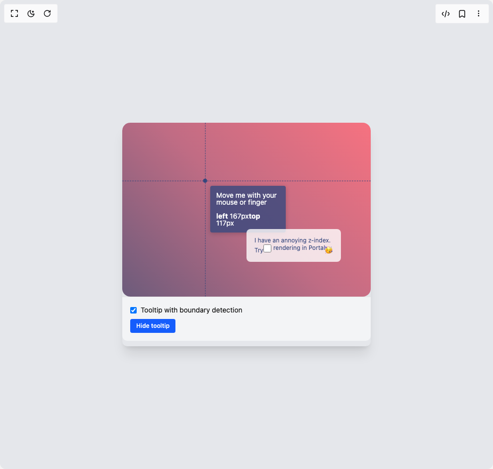

# Build Tooltip in BuilderStudio

> Build this component in our Agentic IDE: [BuilderStudio](https://builderstudio.dev).
>
> Join the BuilderStudio community on [Discord](https://discord.gg/QdWeSGCqfe) and [Reddit](https://reddit.com/r/builderstudio).



## Component

- Author group: `airbnb`
- Component: `tooltip`
- Variant: `default`
- Rendered HTML snapshot: [`rendered.html`](rendered.html)

## BuilderStudio prompt

You are implementing a React component based on a component reference.

## Component identity

- Author: airbnb
- Component slug: tooltip
- Demo slug: default
- Title: tooltip
- Description: 

## Goal

Recreate this component in a React + TypeScript + Tailwind CSS project. Preserve the visual layout, spacing, colors, border radius, shadows, interaction behavior, animation behavior, responsive behavior, and dark mode behavior shown in the rendered demo.

## Implementation requirements

- Use React and TypeScript.
- Use Tailwind CSS classes whenever possible.
- Keep the component self-contained unless the source files require helper components.
- If the source uses CSS variables, custom CSS, animations, or keyframes, include them.
- If the source uses external packages, list and use the required packages.
- Preserve accessibility attributes, button semantics, links, keyboard behavior, and ARIA attributes when visible in the source.
- Do not replace the component with a simplified placeholder.
- Return complete production-ready code.

## Dependencies

No reference metadata available.

## Rendered DOM snapshot

This is the rendered demo HTML extracted from the live preview. Use it to verify structure, class names, visible content, and layout.

```html
<div id="root"><div class="flex w-full min-h-screen justify-center items-center p-4 bg-gray-200"><div class="rounded-lg shadow-xl overflow-hidden w-[500px] h-[450px] flex flex-col"><div class="flex-grow"><style>
    .tooltip-interactive-container {
      z-index: 0;
      position: relative;
      overflow: hidden; /* Important for non-portal, non-bounds-detecting tooltip clipping */
      border-radius: 16px;
      background: linear-gradient(45deg, #6c5b7b, #c06c84, #f67280);
      font-size: 14px;
      color: white;
      width: 100%;
      height: 100%;
      cursor: crosshair;
    }
    .tooltip-position-indicator {
      width: 8px;
      height: 8px;
      border-radius: 50%;
      background: #35477d;
      position: absolute;
      pointer-events: none; /* So it doesn't interfere with pointer move */
    }
    .tooltip-crosshair {
      position: absolute;
      top: 0;
      left: 0;
      pointer-events: none;
    }
    .tooltip-crosshair.horizontal {
      width: 100%;
      height: 1px;
      border-top: 1px dashed #35477d;
    }
    .tooltip-crosshair.vertical {
      height: 100%;
      width: 1px;
      border-left: 1px dashed #35477d;
    }
    .tooltip-no-tooltip-message {
      position: absolute;
      left: 50%;
      top: 50%;
      transform: translate(-50%, -50%);
      pointer-events: none;
    }
    .tooltip-z-index-bummer {
      position: absolute;
      right: 12%;
      bottom: 20%;
      max-width: 190px;
      z-index: 2000; /* Higher than tooltip without portal */
      background: rgba(255, 255, 255, 0.8);
      color: #35477d;
      border-radius: 8px;
      padding: 16px;
      line-height: 1.2em;
      font-size: 12px;
    }
  </style><div class="tooltip-interactive-container" style="width: 500px; height: 350px;"><div class="tooltip-position-indicator" style="transform: translate(162.667px, 112.667px);"></div><div class="tooltip-crosshair horizontal" style="transform: translateY(116.667px);"></div><div class="tooltip-crosshair vertical" style="transform: translateX(166.667px);"></div><div class="visx-tooltip" style="top: 0px; left: 0px; position: absolute; background-color: rgba(53, 71, 125, 0.8); color: white; padding: 12px; border-radius: 4px; font-size: 14px; box-shadow: rgba(0, 0, 0, 0.2) 0px 2px 10px; line-height: 1em; pointer-events: none; width: 152px; height: auto; min-height: 72px; transform: translate(177px, 127px);">Move me with your mouse or finger<br><br><strong>left</strong> 167px<strong>top</strong> 117px</div><div class="tooltip-z-index-bummer">I have an annoying z-index. Try<label class="inline-flex items-center"><input class="form-checkbox h-4 w-4" type="checkbox"><span class="ml-1">rendering in Portal</span></label><span role="img" aria-label="yay">🥳</span></div></div><div class="p-4 space-y-2 bg-gray-100 text-sm rounded-b-lg border-t"><label class="flex items-center space-x-2"><input class="form-checkbox" type="checkbox" checked=""><span>Tooltip with boundary detection</span></label><button class="px-3 py-1.5 text-xs font-medium text-white bg-blue-600 rounded hover:bg-blue-700 focus:outline-none focus:ring-2 focus:ring-opacity-50">Hide tooltip</button></div></div></div></div></div>
```

## Reference source files

No reference source files were available.
