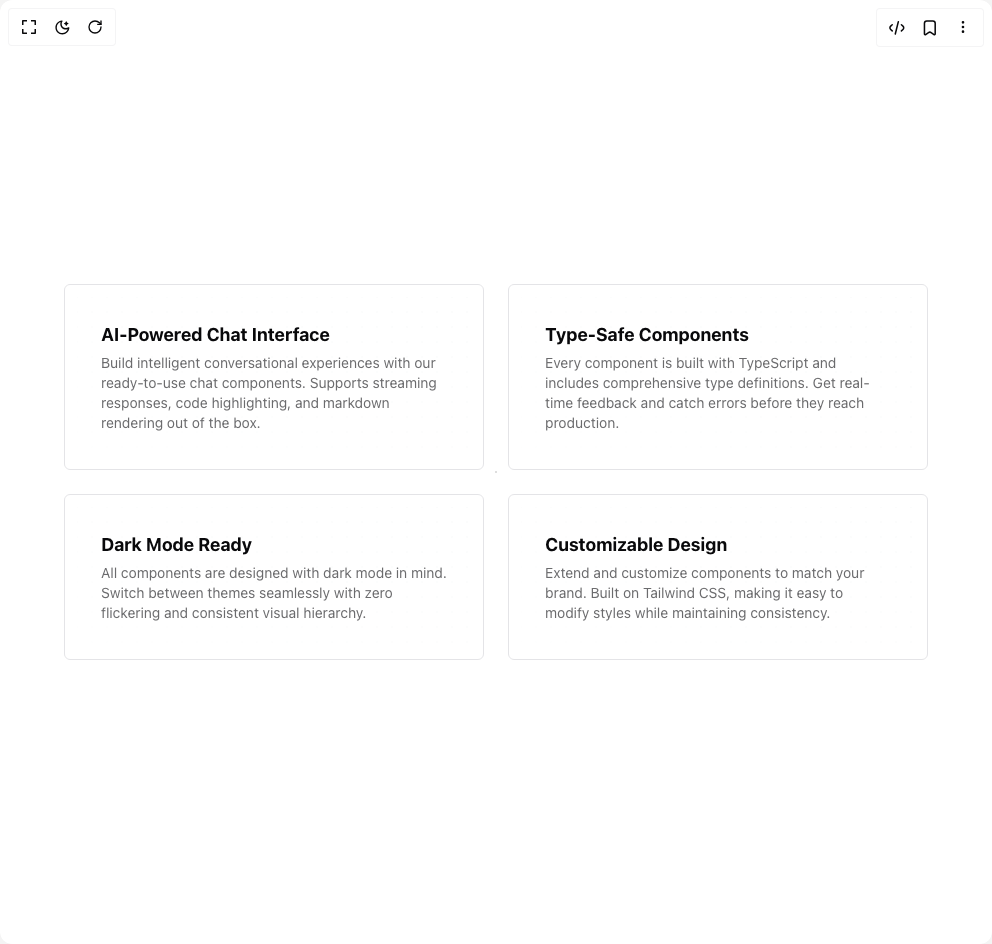
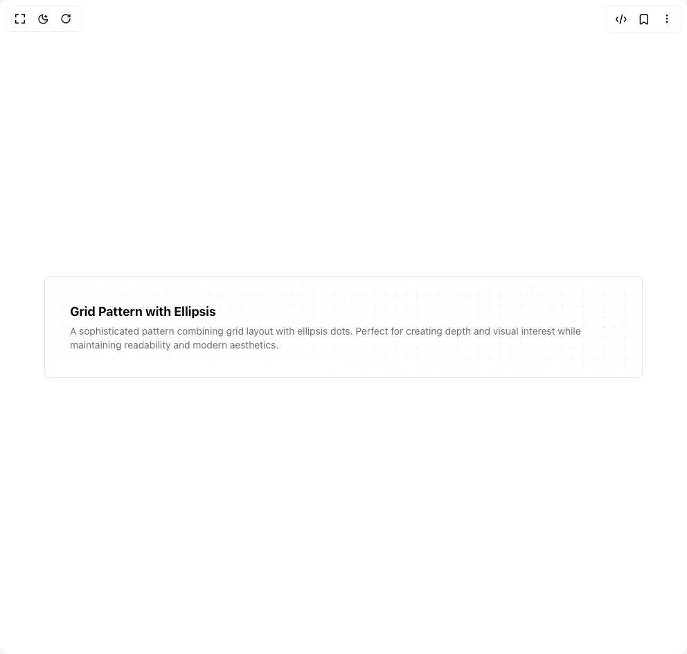
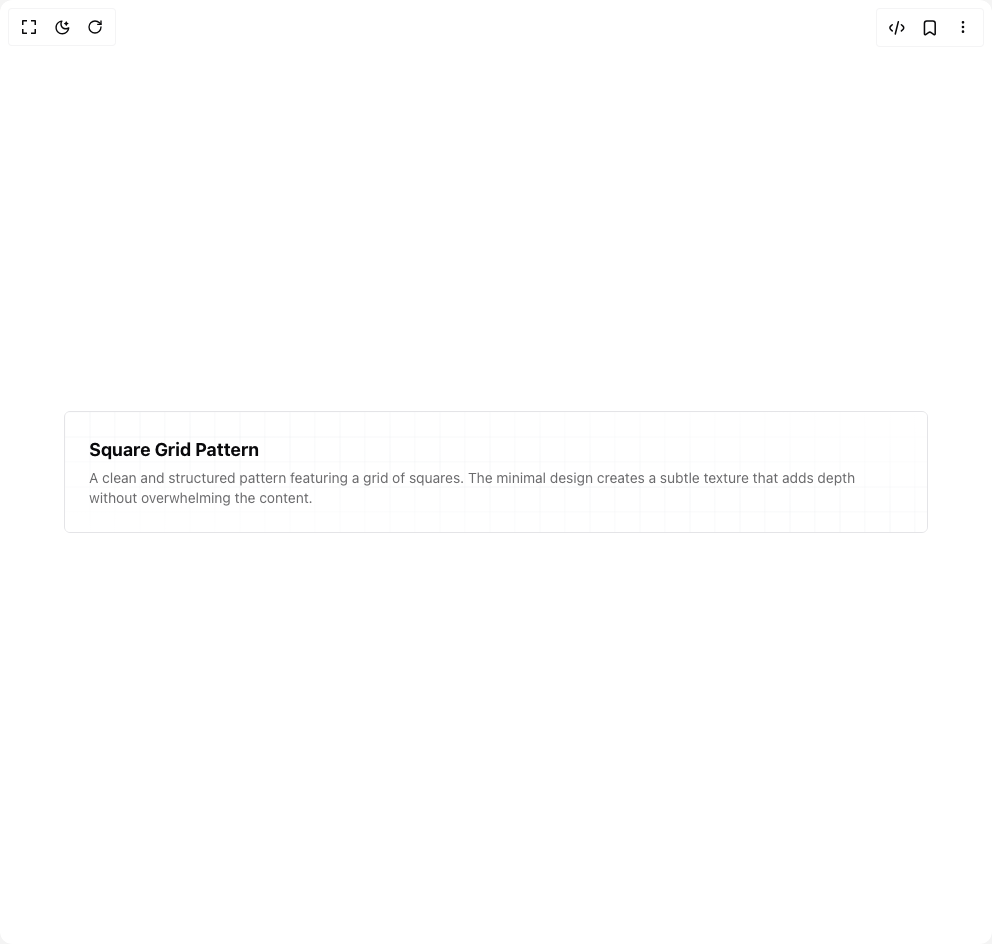
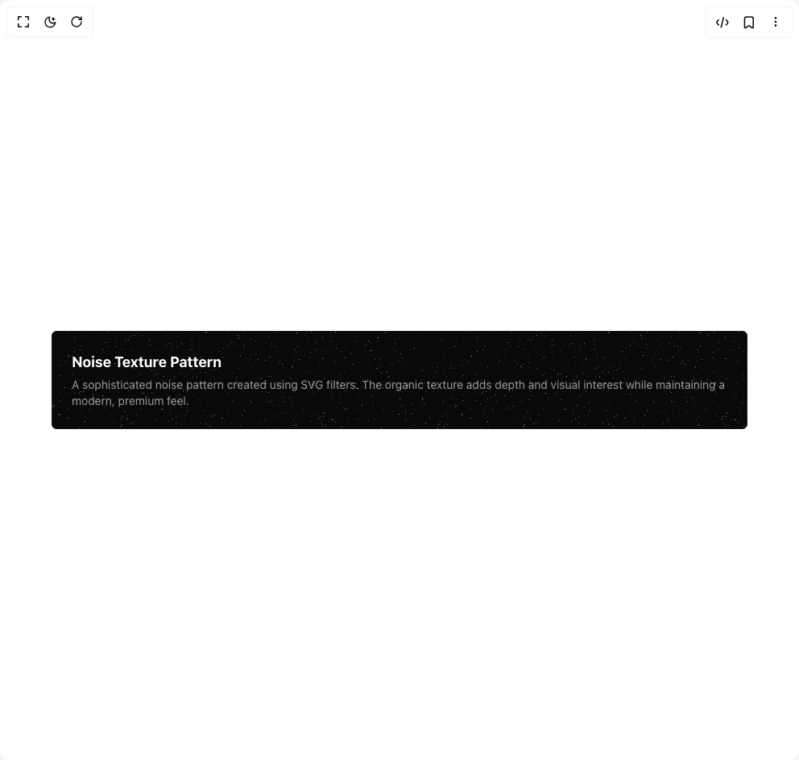
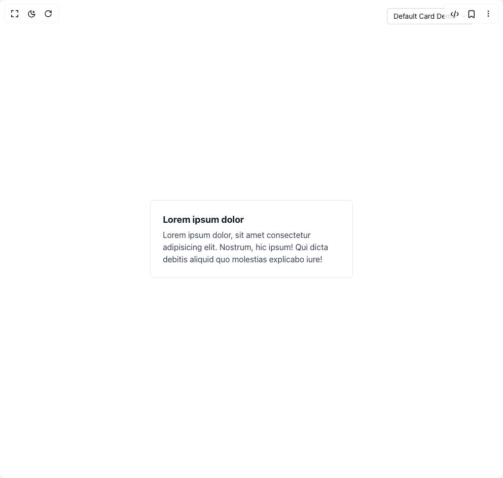

# Ali Hussein Dev Components

7 components are available in this author group.

> Build any component in [BuilderStudio](https://builderstudio.dev), then share improvements with the community on [Discord](https://discord.gg/QdWeSGCqfe) or [Reddit](https://reddit.com/r/builderstudio).

| Preview | Component | Variant |
| --- | --- | --- |
|  | [Card With Cross Patter](card-with-cross-patter/default/README.md) | `default` |
|  | [Card With Ellipsis Pattern](card-with-ellipsis-pattern/default/README.md) | `default` |
|  | [Card With Grid Ellipsis Pattern](card-with-grid-ellipsis-pattern/default/README.md) | `default` |
|  | [Card With Grid Pattern](card-with-grid-pattern/default/README.md) | `default` |
|  | [Card With Lines Patter](card-with-lines-patter/default/README.md) | `default` |
|  | [Card With Noise Patter](card-with-noise-patter/default/README.md) | `default` |
|  | [Card](card/default/README.md) | `default` |
