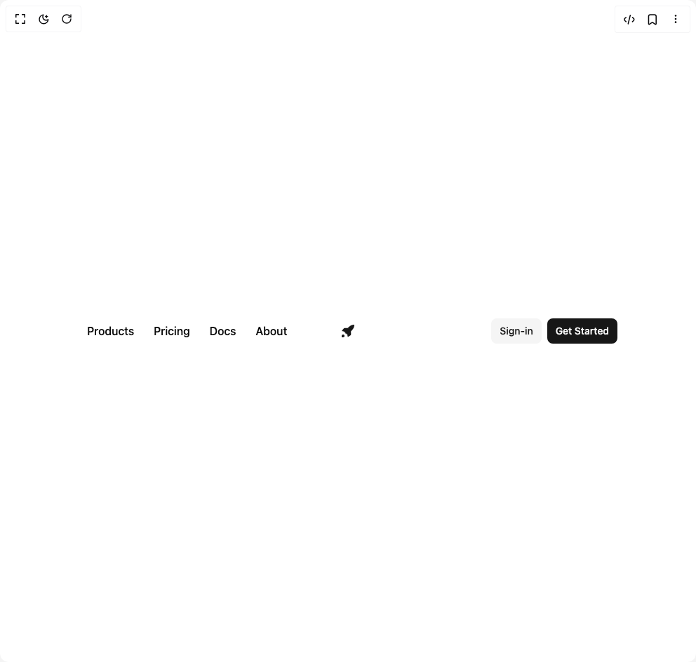
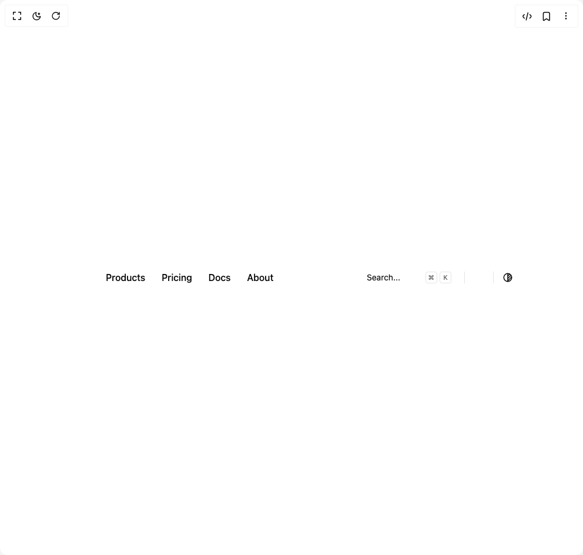
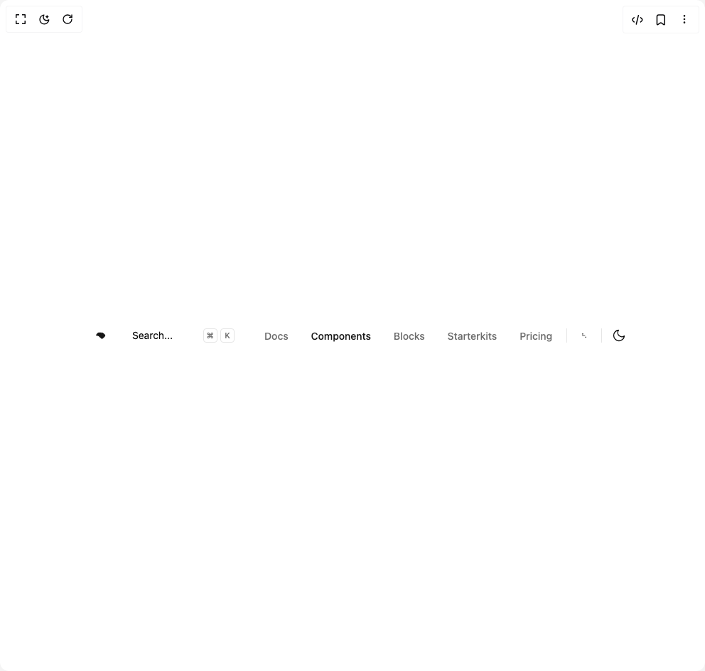
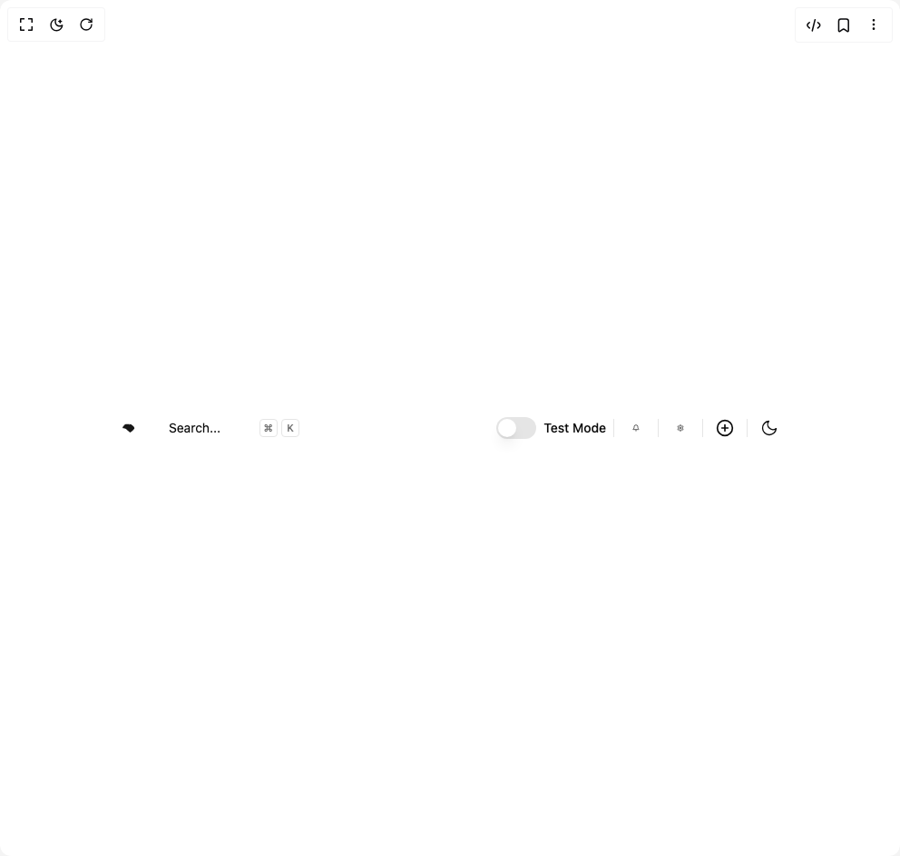

# Alifarooqdev Components

8 components are available in this author group.

> Build any component in [BuilderStudio](https://builderstudio.dev), then share improvements with the community on [Discord](https://discord.gg/QdWeSGCqfe) or [Reddit](https://reddit.com/r/builderstudio).

| Preview | Component | Variant |
| --- | --- | --- |
|  | [Navbar](navbar/default/README.md) | `default` |
|  | [Navbar](navbar/navbar-advanced/README.md) | `navbar-advanced` |
|  | [Navbar](navbar/navbar-dropdown/README.md) | `navbar-dropdown` |
|  | [Navbar](navbar/navbar-edges/README.md) | `navbar-edges` |
|  | [Navbar](navbar/navbar-login/README.md) | `navbar-login` |
|  | [Navbar](navbar/navbar-search/README.md) | `navbar-search` |
|  | [Navbar](navbar/navbar-sections/README.md) | `navbar-sections` |
|  | [Navbar](navbar/navbar-switcher/README.md) | `navbar-switcher` |
