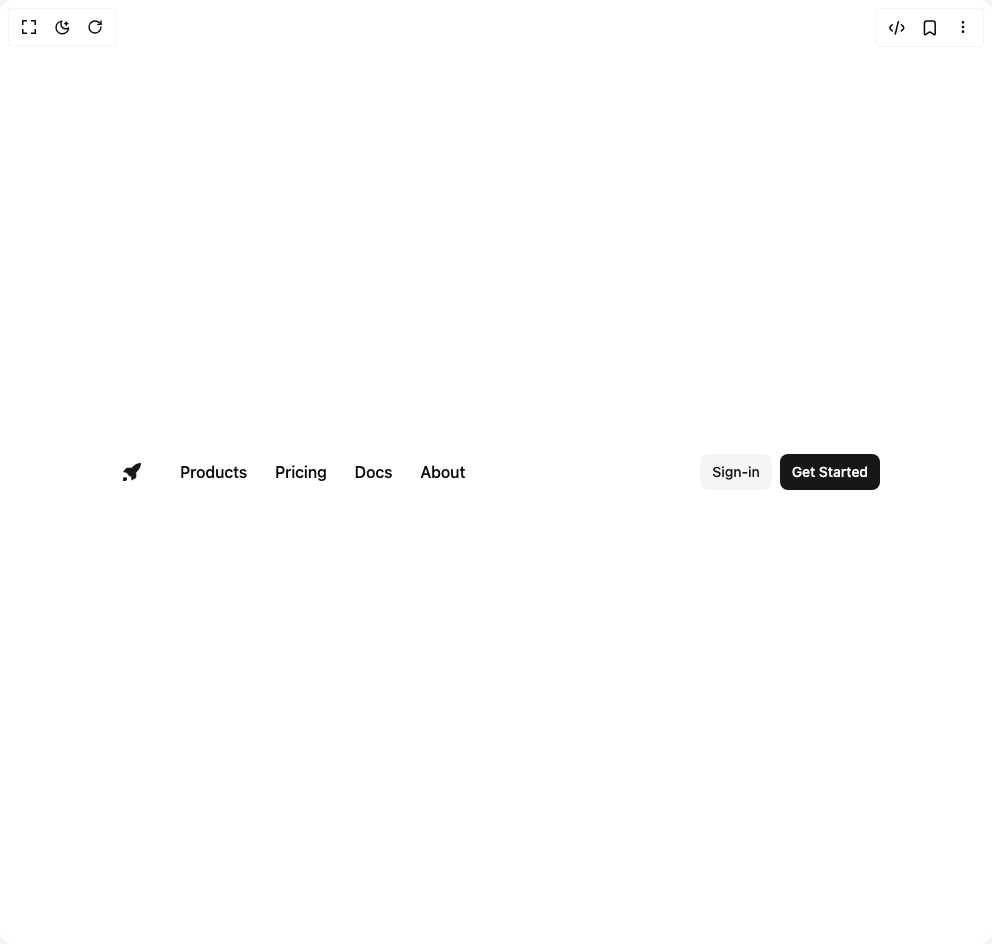

# Build Navbar in BuilderStudio

> Build this component in our Agentic IDE: [BuilderStudio](https://builderstudio.dev).
>
> Join the BuilderStudio community on [Discord](https://discord.gg/QdWeSGCqfe) and [Reddit](https://reddit.com/r/builderstudio).



## Component

- Author group: `alifarooqdev`
- Component: `navbar`
- Variant: `navbar-edges`
- Rendered HTML snapshot: [`rendered.html`](rendered.html)

## BuilderStudio prompt

You are implementing a React component based on a component reference.

## Component identity

- Author: alifarooqdev
- Component slug: navbar
- Demo slug: navbar-edges
- Title: navbar
- Description: 

## Goal

Recreate this component in a React + TypeScript + Tailwind CSS project. Preserve the visual layout, spacing, colors, border radius, shadows, interaction behavior, animation behavior, responsive behavior, and dark mode behavior shown in the rendered demo.

## Implementation requirements

- Use React and TypeScript.
- Use Tailwind CSS classes whenever possible.
- Keep the component self-contained unless the source files require helper components.
- If the source uses CSS variables, custom CSS, animations, or keyframes, include them.
- If the source uses external packages, list and use the required packages.
- Preserve accessibility attributes, button semantics, links, keyboard behavior, and ARIA attributes when visible in the source.
- Do not replace the component with a simplified placeholder.
- Return complete production-ready code.

## Dependencies

No reference metadata available.

## Rendered DOM snapshot

This is the rendered demo HTML extracted from the live preview. Use it to verify structure, class names, visible content, and layout.

```html
<div id="root"><div class="w-screen min-h-screen flex justify-center items-center"><div class="w-screen min-h-screen flex justify-center items-center"><header class="container mx-auto flex h-14 items-center justify-between gap-4"><div class="flex items-center justify-start gap-2"><button class="whitespace-nowrap rounded-md text-sm font-medium ring-offset-background transition-colors focus-visible:outline-none focus-visible:ring-ring focus-visible:ring-offset-2 disabled:pointer-events-none disabled:opacity-50 hover:text-accent-foreground extend-touch-target block size-8 touch-manipulation items-center justify-start gap-2.5 hover:bg-transparent focus-visible:bg-transparent focus-visible:ring-0 active:bg-transparent md:hidden dark:hover:bg-transparent" type="button" aria-haspopup="dialog" aria-expanded="false" aria-controls="radix-«r0»" data-state="closed"><div class="relative flex items-center justify-center"><div class="relative size-4"><span class="bg-foreground absolute left-0 block h-0.5 w-4 transition-all duration-100 top-1"></span><span class="bg-foreground absolute left-0 block h-0.5 w-4 transition-all duration-100 top-2.5"></span></div><span class="sr-only">Toggle Menu</span></div></button><a href="#" class="inline-flex items-center justify-center whitespace-nowrap rounded-md text-sm font-medium ring-offset-background transition-colors focus-visible:outline-none focus-visible:ring-2 focus-visible:ring-ring focus-visible:ring-offset-2 disabled:pointer-events-none disabled:opacity-50 hover:bg-accent hover:text-accent-foreground h-10 w-10 dark:hover:bg-accent text-accent-foreground [&amp;_svg:not([class*='size-'])]:size-6"><svg viewBox="0 0 40 40" fill="none" xmlns="http://www.w3.org/2000/svg"><path d="M11.7699 21.8258L7.42207 20.485C5 19.9996 5 20 6.6277 17.875L9.77497 13.9892C10.4003 13.2172 11.3407 12.7687 12.3342 12.7687L19.2668 13.0726M11.7699 21.8258C11.7699 21.8258 12.8773 24.5436 14.1667 25.833C15.4561 27.1223 18.1738 28.2296 18.1738 28.2296M18.1738 28.2296L19.0938 32.0266C19.5 34.5 19.5 34.5 21.6117 33.0063L25.7725 30.2146C26.684 29.603 27.2308 28.5775 27.2308 27.4798L26.927 20.733M26.927 20.733C31.5822 16.4657 34.5802 12.4926 34.9962 6.59335C35.1164 4.8888 35.1377 4.88137 33.4062 5.00345C27.507 5.41937 23.534 8.4174 19.2668 13.0726M11.7699 31.6146C11.7699 33.4841 10.2544 34.9996 8.38495 34.9996H5V31.6146C5 29.7453 6.5155 28.2298 8.38495 28.2298C10.2544 28.2298 11.7699 29.7453 11.7699 31.6146Z" fill="currentColor"></path><path d="M12.5 22.9996L11 20.4996C11 20.0996 16 12.9996 20 12.9996C22.1667 14.8329 26.1172 16.4682 27 19.9996C27.5 21.9996 21.5 26.1663 18.5 28.4996L12.5 22.9996Z" fill="currentColor"></path></svg></a></div><nav aria-label="Main" data-orientation="horizontal" dir="ltr" class="relative z-10 flex max-w-max flex-1 items-center justify-center max-md:hidden"><div style="position: relative;"><ul data-orientation="horizontal" class="group flex flex-1 list-none items-center justify-center space-x-1" dir="ltr"><li><a data-active="true" href="#" class="rounded-md px-3 py-1.5 font-medium" data-radix-collection-item="">Products</a></li><li><a href="#" class="rounded-md px-3 py-1.5 font-medium" data-radix-collection-item="">Pricing</a></li><li><a href="#" class="rounded-md px-3 py-1.5 font-medium" data-radix-collection-item="">Docs</a></li><li><a href="#" class="rounded-md px-3 py-1.5 font-medium" data-radix-collection-item="">About</a></li></ul></div><div class="absolute left-0 top-full flex justify-center"></div></nav><div class="flex flex-1 items-center justify-end gap-2"><a href="#" class="inline-flex items-center justify-center whitespace-nowrap text-sm font-medium ring-offset-background transition-colors focus-visible:outline-none focus-visible:ring-2 focus-visible:ring-ring focus-visible:ring-offset-2 disabled:pointer-events-none disabled:opacity-50 bg-secondary text-secondary-foreground hover:bg-secondary/80 h-9 rounded-md px-3">Sign-in</a><a href="#" class="inline-flex items-center justify-center whitespace-nowrap text-sm font-medium ring-offset-background transition-colors focus-visible:outline-none focus-visible:ring-2 focus-visible:ring-ring focus-visible:ring-offset-2 disabled:pointer-events-none disabled:opacity-50 bg-primary text-primary-foreground hover:bg-primary/90 h-9 rounded-md px-3">Get Started</a></div></header></div></div></div>
```

## Reference source files

No reference source files were available.
