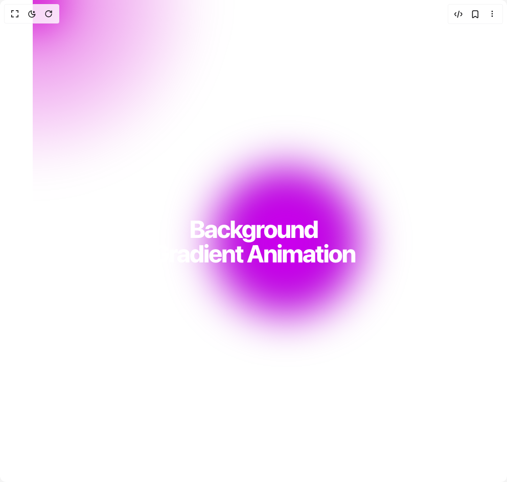

# Build Background Gradient Animation in BuilderStudio

> Build this component in our Agentic IDE: [BuilderStudio](https://builderstudio.dev).
>
> Join the BuilderStudio community on [Discord](https://discord.gg/QdWeSGCqfe) and [Reddit](https://reddit.com/r/builderstudio).



## Component

- Author group: `aliimam`
- Component: `background-gradient-animation`
- Variant: `background-gradient-animation`
- Rendered HTML snapshot: [`rendered.html`](rendered.html)

## BuilderStudio prompt

You are implementing a React component based on a component reference.

## Component identity

- Author: aliimam
- Component slug: background-gradient-animation
- Demo slug: background-gradient-animation
- Title: background-gradient-animation
- Description: 

## Goal

Recreate this component in a React + TypeScript + Tailwind CSS project. Preserve the visual layout, spacing, colors, border radius, shadows, interaction behavior, animation behavior, responsive behavior, and dark mode behavior shown in the rendered demo.

## Implementation requirements

- Use React and TypeScript.
- Use Tailwind CSS classes whenever possible.
- Keep the component self-contained unless the source files require helper components.
- If the source uses CSS variables, custom CSS, animations, or keyframes, include them.
- If the source uses external packages, list and use the required packages.
- Preserve accessibility attributes, button semantics, links, keyboard behavior, and ARIA attributes when visible in the source.
- Do not replace the component with a simplified placeholder.
- Return complete production-ready code.

## Dependencies

No reference metadata available.

## Rendered DOM snapshot

This is the rendered demo HTML extracted from the live preview. Use it to verify structure, class names, visible content, and layout.

```html
<div id="root"><div class="relative flex items-center justify-center h-screen w-full m-auto p-16 bg-background text-foreground"><div class="absolute lab-bg inset-0 size-full"><div class="absolute inset-0 bg-[radial-gradient(#00000021_1px,transparent_1px)] dark:bg-[radial-gradient(#ffffff22_1px,transparent_1px)]"></div></div><div class="flex w-full justify-center relative"><main class="relative min-h-svh w-screen overflow-hidden"><h1 class="absolute text-center font-extrabold tracking-tighter z-10 top-1/2 left-1/2 -translate-x-1/2 -translate-y-1/2 text-white dark:text-black text-3xl md:text-5xl">Background Gradient Animation</h1><div class="h-screen w-screen relative overflow-hidden top-0 left-0 bg-[linear-gradient(40deg,var(--gradient-background-start),var(--gradient-background-end))]"><svg class="hidden"><defs><filter id="blurMe"><feGaussianBlur in="SourceGraphic" stdDeviation="10" result="blur"></feGaussianBlur><feColorMatrix in="blur" mode="matrix" values="1 0 0 0 0  0 1 0 0 0  0 0 1 0 0  0 0 0 18 -8" result="goo"></feColorMatrix><feBlend in="SourceGraphic" in2="goo"></feBlend></filter></defs></svg><div class=""></div><div class="gradients-container h-full w-full blur-lg [filter:url(#blurMe)_blur(40px)]"><div class="absolute [background:radial-gradient(circle_at_center,_var(--first-color)_0,_var(--first-color)_50%)_no-repeat] [mix-blend-mode:var(--blending-value)] w-[var(--size)] h-[var(--size)] top-[calc(50%-var(--size)/2)] left-[calc(50%-var(--size)/2)] [transform-origin:center_center] animate-first opacity-100"></div><div class="absolute [background:radial-gradient(circle_at_center,_rgba(var(--second-color),_0.8)_0,_rgba(var(--second-color),_0)_50%)_no-repeat] [mix-blend-mode:var(--blending-value)] w-[var(--size)] h-[var(--size)] top-[calc(50%-var(--size)/2)] left-[calc(50%-var(--size)/2)] [transform-origin:calc(50%-400px)] animate-second opacity-100"></div><div class="absolute [background:radial-gradient(circle_at_center,_rgba(var(--third-color),_0.8)_0,_rgba(var(--third-color),_0)_50%)_no-repeat] [mix-blend-mode:var(--blending-value)] w-[var(--size)] h-[var(--size)] top-[calc(50%-var(--size)/2)] left-[calc(50%-var(--size)/2)] [transform-origin:calc(50%+400px)] animate-third opacity-100"></div><div class="absolute [background:radial-gradient(circle_at_center,_rgba(var(--fourth-color),_0.8)_0,_rgba(var(--fourth-color),_0)_50%)_no-repeat] [mix-blend-mode:var(--blending-value)] w-[var(--size)] h-[var(--size)] top-[calc(50%-var(--size)/2)] left-[calc(50%-var(--size)/2)] [transform-origin:calc(50%-200px)] animate-fourth opacity-70"></div><div class="absolute [background:radial-gradient(circle_at_center,_rgba(var(--fifth-color),_0.8)_0,_rgba(var(--fifth-color),_0)_50%)_no-repeat] [mix-blend-mode:var(--blending-value)] w-[var(--size)] h-[var(--size)] top-[calc(50%-var(--size)/2)] left-[calc(50%-var(--size)/2)] [transform-origin:calc(50%-800px)_calc(50%+800px)] animate-fifth opacity-100"></div><div class="absolute [background:radial-gradient(circle_at_center,_rgba(var(--pointer-color),_0.8)_0,_rgba(var(--pointer-color),_0)_50%)_no-repeat] [mix-blend-mode:var(--blending-value)] w-full h-full -top-1/2 -left-1/2 opacity-70" style="transform: translate(0px, 0px);"></div></div></div></main></div></div></div>
```

## Reference source files

No reference source files were available.
