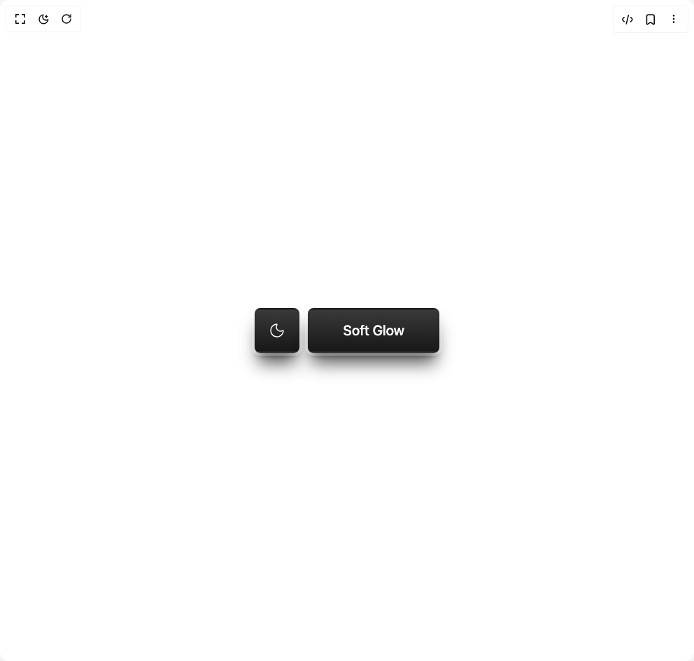

# Build Button Soft Glow in BuilderStudio

> Build this component in our Agentic IDE: [BuilderStudio](https://builderstudio.dev).
>
> Join the BuilderStudio community on [Discord](https://discord.gg/QdWeSGCqfe) and [Reddit](https://reddit.com/r/builderstudio).



## Component

- Author group: `aliimam`
- Component: `button-soft-glow`
- Variant: `default`
- Rendered HTML snapshot: [`rendered.html`](rendered.html)

## BuilderStudio prompt

You are implementing a React component based on a component reference.

## Component identity

- Author: aliimam
- Component slug: button-soft-glow
- Demo slug: default
- Title: button-soft-glow
- Description: 

## Goal

Recreate this component in a React + TypeScript + Tailwind CSS project. Preserve the visual layout, spacing, colors, border radius, shadows, interaction behavior, animation behavior, responsive behavior, and dark mode behavior shown in the rendered demo.

## Implementation requirements

- Use React and TypeScript.
- Use Tailwind CSS classes whenever possible.
- Keep the component self-contained unless the source files require helper components.
- If the source uses CSS variables, custom CSS, animations, or keyframes, include them.
- If the source uses external packages, list and use the required packages.
- Preserve accessibility attributes, button semantics, links, keyboard behavior, and ARIA attributes when visible in the source.
- Do not replace the component with a simplified placeholder.
- Return complete production-ready code.

## Dependencies

No reference metadata available.

## Rendered DOM snapshot

This is the rendered demo HTML extracted from the live preview. Use it to verify structure, class names, visible content, and layout.

```html
<div id="root"><div class="w-screen min-h-screen flex justify-center items-center"><div class="w-screen min-h-screen flex justify-center items-center"><div class="flex gap-3"><button class="inline-flex items-center justify-center whitespace-nowrap rounded-md font-medium ring-offset-background focus-visible:outline-none focus-visible:ring-2 focus-visible:ring-ring focus-visible:ring-offset-2 disabled:pointer-events-none disabled:opacity-50 hover:bg-primary/90 h-16 text-xl w-16 from-primary to-primary/85 text-primary-foreground border-2 border-foreground/10 bg-gradient-to-t shadow-xl shadow-primary/70 ring-4 ring-background/30 transition-[filter] duration-200 hover:brightness-120 active:brightness-100"><svg width="24" height="24" viewBox="0 0 24 24" fill="none" xmlns="http://www.w3.org/2000/svg" class="size-6" stroke-width="1.5"><path d="M20.985 12.4859C20.8913 14.2221 20.2967 15.8939 19.2731 17.2993C18.2495 18.7047 16.8407 19.7836 15.217 20.4054C13.5934 21.0273 11.8243 21.1655 10.1238 20.8034C8.42322 20.4414 6.86396 19.5944 5.63446 18.3651C4.40497 17.1357 3.55789 15.5765 3.19562 13.876C2.83335 12.1755 2.9714 10.4065 3.59308 8.78273C4.21476 7.159 5.29346 5.7501 6.69878 4.72635C8.10409 3.70259 9.77587 3.10782 11.512 3.01391C11.917 2.99191 12.129 3.47391 11.914 3.81691C11.1949 4.96746 10.887 6.32778 11.0405 7.67586C11.194 9.02394 11.7999 10.2802 12.7593 11.2396C13.7187 12.199 14.975 12.8049 16.3231 12.9584C17.6711 13.1119 19.0314 12.804 20.182 12.0849C20.526 11.8699 21.007 12.0809 20.985 12.4859Z" stroke="currentColor" stroke-linecap="round" stroke-linejoin="round"></path></svg></button><button class="inline-flex items-center justify-center whitespace-nowrap rounded-md font-medium ring-offset-background focus-visible:outline-none focus-visible:ring-2 focus-visible:ring-ring focus-visible:ring-offset-2 disabled:pointer-events-none disabled:opacity-50 hover:bg-primary/90 py-2 h-16 text-xl px-12 from-primary to-primary/85 text-primary-foreground border-2 border-foreground/10 bg-gradient-to-t shadow-xl shadow-primary/70 ring-4 ring-background/30 transition-[filter] duration-200 hover:brightness-120 active:brightness-100">Soft Glow</button></div></div></div></div>
```

## Reference source files

No reference source files were available.
