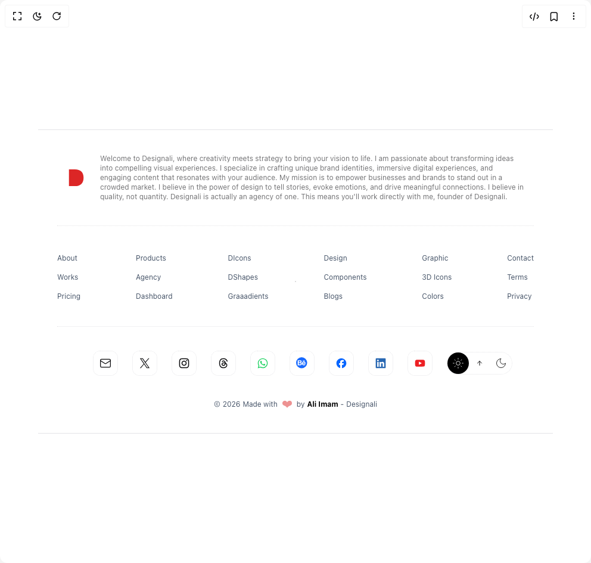

# Build Footer in BuilderStudio

> Build this component in our Agentic IDE: [BuilderStudio](https://builderstudio.dev).
>
> Join the BuilderStudio community on [Discord](https://discord.gg/QdWeSGCqfe) and [Reddit](https://reddit.com/r/builderstudio).



## Component

- Author group: `aliimam`
- Component: `footer`
- Variant: `footer`
- Rendered HTML snapshot: [`rendered.html`](rendered.html)

## BuilderStudio prompt

You are implementing a React component based on a component reference.

## Component identity

- Author: aliimam
- Component slug: footer
- Demo slug: footer
- Title: footer
- Description: 

## Goal

Recreate this component in a React + TypeScript + Tailwind CSS project. Preserve the visual layout, spacing, colors, border radius, shadows, interaction behavior, animation behavior, responsive behavior, and dark mode behavior shown in the rendered demo.

## Implementation requirements

- Use React and TypeScript.
- Use Tailwind CSS classes whenever possible.
- Keep the component self-contained unless the source files require helper components.
- If the source uses CSS variables, custom CSS, animations, or keyframes, include them.
- If the source uses external packages, list and use the required packages.
- Preserve accessibility attributes, button semantics, links, keyboard behavior, and ARIA attributes when visible in the source.
- Do not replace the component with a simplified placeholder.
- Return complete production-ready code.

## Dependencies

No reference metadata available.

## Rendered DOM snapshot

This is the rendered demo HTML extracted from the live preview. Use it to verify structure, class names, visible content, and layout.

```html
<div id="root"><div class="relative flex items-center justify-center h-screen w-full m-auto p-16 bg-background text-foreground"><div class="absolute lab-bg inset-0 size-full"><div class="absolute inset-0 bg-[radial-gradient(#00000021_1px,transparent_1px)] dark:bg-[radial-gradient(#ffffff22_1px,transparent_1px)]"></div></div><div class="flex w-full justify-center relative"><footer class="border-ali/20 :px-4 mx-auto w-full border-b   border-t  px-2"><div class="relative mx-auto grid  max-w-7xl items-center justify-center gap-6 p-10 pb-0 md:flex "><a href="/"><p class="flex items-center justify-center rounded-full  "><svg aria-hidden="true" focusable="false" data-prefix="fab" data-icon="heart" role="img" xmlns="http://www.w3.org/2000/svg" viewBox="0 0 24 24" class="w-8 text-red-600"><path stroke-width="0" fill="currentColor" d="M2.8,1.43h7.53c3.47,0,6.15.92,8.04,2.75,1.89,1.84,2.83,4.45,2.83,7.85s-.92,5.98-2.77,7.8c-1.85,1.83-4.49,2.74-7.92,2.74H2.8V1.43Z"></path></svg></p></a><p class="bg-transparent text-center text-xs leading-4 text-primary/60 md:text-left">Welcome to Designali, where creativity meets strategy to bring your vision to life. I am passionate about transforming ideas into compelling visual experiences. I specialize in crafting unique brand identities, immersive digital experiences, and engaging content that resonates with your audience. My mission is to empower businesses and brands to stand out in a crowded market. I believe in the power of design to tell stories, evoke emotions, and drive meaningful connections. I believe in quality, not quantity. Designali is actually an agency of one. This means you'll work directly with me, founder of Designali.</p></div><div class="mx-auto max-w-7xl px-6 py-10"><div class="border-b border-dotted"> </div><div class="py-10"><div class="grid grid-cols-3 flex-row justify-between gap-6 leading-6 md:flex"><div><ul role="list" aria-labelledby="women-about-heading-mobile" class="flex flex-col space-y-2"><li class="flow-root"><a href="/about" class="text-sm text-slate-600 hover:text-black dark:text-slate-400 hover:dark:text-white md:text-xs">About</a></li><li class="flow-root"><a href="/agency/works" class="text-sm text-slate-600 hover:text-black dark:text-slate-400 hover:dark:text-white md:text-xs">Works</a></li><li class="flow-root"><a href="/pricing" class="text-sm text-slate-600 hover:text-black dark:text-slate-400 hover:dark:text-white md:text-xs">Pricing</a></li></ul></div><div><ul role="list" aria-labelledby="women-features-heading-mobile" class="flex flex-col space-y-2"><li class="flow-root"><a href="/products" class="text-sm text-slate-600 hover:text-black dark:text-slate-400 hover:dark:text-white md:text-xs">Products</a></li><li class="flow-root"><a href="/agency" class="text-sm text-slate-600 hover:text-black dark:text-slate-400 hover:dark:text-white md:text-xs">Agency</a></li><li class="flow-root"><a href="/dashboard" class="text-sm text-slate-600 hover:text-black dark:text-slate-400 hover:dark:text-white md:text-xs">Dashboard</a></li></ul></div><div><ul role="list" aria-labelledby="women-products-heading-mobile" class="flex flex-col space-y-2"><li class="flow-root"><a href="/products/dicons" class="text-sm text-slate-600 hover:text-black dark:text-slate-400 hover:dark:text-white md:text-xs">DIcons</a></li><li class="flow-root"><a href="/products/dshapes" class="text-sm text-slate-600 hover:text-black dark:text-slate-400 hover:dark:text-white md:text-xs">DShapes</a></li><li class="flow-root"><a href="/products/graaadients" class="text-sm text-slate-600 hover:text-black dark:text-slate-400 hover:dark:text-white md:text-xs">Graaadients</a></li></ul></div><div><ul role="list" aria-labelledby="women-designs-heading-mobile" class="flex flex-col space-y-2"><li class="flow-root"><a href="/designs" class="text-sm text-slate-600 hover:text-black dark:text-slate-400 hover:dark:text-white md:text-xs">Design</a></li><li class="flow-root"><a href="/components" class="text-sm text-slate-600 hover:text-black dark:text-slate-400 hover:dark:text-white md:text-xs">Components</a></li><li class="flow-root"><a href="/blogs" class="text-sm text-slate-600 hover:text-black dark:text-slate-400 hover:dark:text-white md:text-xs">Blogs</a></li></ul></div><div><ul role="list" aria-labelledby="women-other-heading-mobile" class="flex flex-col space-y-2"><li class="flow-root"><a href="/graphic" class="text-sm text-slate-600 hover:text-black dark:text-slate-400 hover:dark:text-white md:text-xs">Graphic</a></li><li class="flow-root"><a href="/products/3dicons" class="text-sm text-slate-600 hover:text-black dark:text-slate-400 hover:dark:text-white md:text-xs">3D Icons</a></li><li class="flow-root"><a href="/products/colors/generate" class="text-sm text-slate-600 hover:text-black dark:text-slate-400 hover:dark:text-white md:text-xs">Colors</a></li></ul></div><div><ul role="list" aria-labelledby="women-company-heading-mobile" class="flex flex-col space-y-2"><li class="flow-root"><a href="/contact" class="text-sm text-slate-600 hover:text-black dark:text-slate-400 hover:dark:text-white md:text-xs">Contact</a></li><li class="flow-root"><a href="/terms" class="text-sm text-slate-600 hover:text-black dark:text-slate-400 hover:dark:text-white md:text-xs">Terms</a></li><li class="flow-root"><a href="/privacy" class="text-sm text-slate-600 hover:text-black dark:text-slate-400 hover:dark:text-white md:text-xs">Privacy</a></li></ul></div></div></div><div class="border-b border-dotted"> </div></div><div class="flex flex-wrap justify-center gap-y-6"><div class="flex flex-wrap items-center justify-center gap-6 gap-y-4 px-6"><a href="mailto:contact@designali.in" aria-label="Logo" rel="noreferrer" target="_blank" class="hover:-translate-y-1 border border-dotted rounded-xl p-2.5 transition-transform "><svg xmlns="http://www.w3.org/2000/svg" width="24" height="24" viewBox="0 0 24 24" fill="none" stroke="currentColor" stroke-width="1.5" stroke-linecap="round" stroke-linejoin="round" class="h-5 w-5"><rect width="20" height="16" x="2" y="4" rx="2"></rect><path d="m22 7-8.97 5.7a1.94 1.94 0 0 1-2.06 0L2 7"></path></svg></a><a href="https://x.com/designali_in" aria-label="Logo" rel="noreferrer" target="_blank" class="hover:-translate-y-1 border border-dotted rounded-xl p-2.5 transition-transform "><svg xmlns="http://www.w3.org/2000/svg" width="24" height="24" viewBox="0 0 24 24" class="h-5 w-5"><path fill="currentColor" stroke-width="0" d="M13.85,10.47l7.26-8.43h-1.72l-6.3,7.32-5.03-7.32H2.25l7.61,11.07-7.61,8.84h1.72l6.65-7.73,5.31,7.73h5.8l-7.89-11.48h0ZM11.5,13.21l-.77-1.1L4.59,3.34h2.64l4.95,7.08.77,1.1,6.44,9.2h-2.64l-5.25-7.51h0Z"></path></svg></a><a href="https://www.instagram.com/designali.in/" aria-label="Logo" rel="noreferrer" target="_blank" class="hover:-translate-y-1 border border-dotted rounded-xl p-2.5 transition-transform "><svg xmlns="http://www.w3.org/2000/svg" width="24" height="24" fill="currentColor" viewBox="0 0 24 24" class="h-5 w-5"><path stroke-width="0" d="M12,3.8c2.67,0,2.99.01,4.04.06.98.04,1.5.21,1.86.34.47.18.8.4,1.15.75.35.35.57.68.75,1.15.14.35.3.88.34,1.86.05,1.05.06,1.37.06,4.04s-.01,2.99-.06,4.04c-.04.98-.21,1.5-.34,1.86-.18.47-.4.8-.75,1.15-.35.35-.68.57-1.15.75-.35.14-.88.3-1.86.34-1.05.05-1.37.06-4.04.06s-2.99-.01-4.04-.06c-.98-.04-1.5-.21-1.86-.34-.47-.18-.8-.4-1.15-.75-.35-.35-.57-.68-.75-1.15-.14-.35-.3-.88-.34-1.86-.05-1.05-.06-1.37-.06-4.04s.01-2.99.06-4.04c.04-.98.21-1.5.34-1.86.18-.47.4-.8.75-1.15.35-.35.68-.57,1.15-.75.35-.14.88-.3,1.86-.34,1.05-.05,1.37-.06,4.04-.06ZM12,2c-2.72,0-3.06.01-4.12.06-1.06.05-1.79.22-2.43.46-.66.26-1.22.6-1.77,1.15-.56.56-.9,1.11-1.15,1.77-.25.64-.42,1.36-.46,2.43-.05,1.07-.06,1.41-.06,4.12s.01,3.06.06,4.12c.05,1.06.22,1.79.46,2.43.26.66.6,1.22,1.15,1.77.56.56,1.11.9,1.77,1.15.64.25,1.36.42,2.43.46,1.07.05,1.41.06,4.12.06s3.06-.01,4.12-.06c1.06-.05,1.79-.22,2.43-.46.66-.26,1.22-.6,1.77-1.15.56-.56.9-1.11,1.15-1.77.25-.64.42-1.36.46-2.43.05-1.07.06-1.41.06-4.12s-.01-3.06-.06-4.12c-.05-1.06-.22-1.79-.46-2.43-.26-.66-.6-1.22-1.15-1.77-.56-.56-1.11-.9-1.77-1.15-.64-.25-1.36-.42-2.43-.46-1.07-.05-1.41-.06-4.12-.06ZM12,6.86c-2.84,0-5.14,2.3-5.14,5.14s2.3,5.14,5.14,5.14,5.14-2.3,5.14-5.14-2.3-5.14-5.14-5.14ZM12,15.33c-1.84,0-3.33-1.49-3.33-3.33s1.49-3.33,3.33-3.33,3.33,1.49,3.33,3.33-1.49,3.33-3.33,3.33ZM17.34,5.46c-.66,0-1.2.54-1.2,1.2s.54,1.2,1.2,1.2,1.2-.54,1.2-1.2-.54-1.2-1.2-1.2Z"></path></svg></a><a href="https://www.threads.net/designali.in" aria-label="Logo" rel="noreferrer" target="_blank" class="hover:-translate-y-1 border border-dotted rounded-xl p-2.5 transition-transform "><svg xmlns="http://www.w3.org/2000/svg" width="24" height="24" fill="currentColor" viewBox="0 0 24 24" class="h-5 w-5"><path stroke-width="0" d="M16.45,13.08c-.07.49-.17.95-.33,1.4-.22.62-.54,1.18-1.01,1.64-.48.48-1.06.8-1.72.97-.91.23-1.82.23-2.72-.06-.84-.28-1.53-.76-1.98-1.54-.32-.56-.44-1.17-.39-1.81.06-.78.36-1.44.92-1.98.48-.47,1.05-.76,1.68-.95.54-.16,1.09-.23,1.65-.25.45-.01.91-.01,1.36.03.25.02.49.06.73.09.02,0,.05,0,.09.01-.04-.17-.07-.32-.11-.48-.1-.36-.25-.69-.5-.97-.3-.35-.7-.56-1.15-.66-.66-.14-1.32-.13-1.96.13-.42.17-.75.44-1.02.8-.02.03-.04.05-.06.08-.48-.33-.96-.66-1.45-.99.12-.16.24-.31.36-.46.66-.75,1.5-1.19,2.48-1.35.81-.13,1.62-.09,2.41.17,1.14.37,1.9,1.14,2.35,2.23.2.49.32,1.01.38,1.54.02.15.02.3.04.44,0,.02.03.05.05.06.32.14.62.3.91.49.96.63,1.67,1.45,2.02,2.56.5,1.61.3,3.15-.61,4.58-.65,1.01-1.54,1.76-2.6,2.32-.77.4-1.59.63-2.44.76-.69.1-1.38.14-2.08.12-1.23-.04-2.42-.26-3.56-.76-.78-.35-1.48-.82-2.09-1.41-.8-.77-1.39-1.69-1.81-2.71-.35-.83-.57-1.69-.72-2.58-.11-.7-.18-1.41-.19-2.12-.03-1.31.08-2.61.38-3.88.29-1.22.76-2.36,1.5-3.38.91-1.25,2.11-2.12,3.57-2.63.78-.27,1.59-.42,2.41-.48.93-.07,1.85-.03,2.77.12,1.27.22,2.46.67,3.5,1.44.98.72,1.73,1.64,2.29,2.71.32.62.57,1.27.76,1.94,0,.02.01.04.02.07-.56.15-1.12.3-1.68.45-.02-.06-.04-.12-.05-.18-.25-.84-.6-1.63-1.12-2.33-.72-.98-1.67-1.65-2.81-2.05-.6-.21-1.22-.33-1.85-.39-.71-.07-1.42-.06-2.12.03-1.03.13-2.01.43-2.88,1.01-.81.54-1.42,1.26-1.88,2.11-.4.75-.66,1.56-.82,2.4-.16.81-.24,1.64-.25,2.47-.01,1.07.08,2.13.33,3.17.22.95.57,1.85,1.13,2.67.71,1.02,1.66,1.72,2.83,2.13.67.23,1.36.35,2.06.41.76.05,1.51.02,2.25-.1,1.15-.18,2.16-.64,3.01-1.44.57-.54,1-1.17,1.18-1.94.2-.81.14-1.61-.24-2.36-.24-.49-.61-.86-1.06-1.16-.06-.04-.12-.08-.18-.12ZM14.77,12.43c-.25-.04-.49-.08-.74-.11-.45-.06-.91-.07-1.37-.06-.44.01-.88.05-1.31.18-.38.12-.72.29-.99.59-.44.49-.46,1.23-.06,1.74.24.3.56.48.92.59.56.17,1.12.17,1.68.04.57-.13,1.01-.46,1.31-.96.15-.24.25-.5.33-.77.12-.4.18-.8.21-1.24Z"></path></svg></a><a href="https://chat.whatsapp.com/LWsNPcz5BlWDVOha41vzuh" aria-label="Logo" rel="noreferrer" target="_blank" class="hover:-translate-y-1 border border-dotted rounded-xl p-2.5 transition-transform "><svg xmlns="http://www.w3.org/2000/svg" width="24" height="24" viewBox="0 0 24 24" class="h-5 w-5"><path stroke-width="0" fill="#25d366" d="M19.09,4.87c-1.88-1.88-4.38-2.92-7.04-2.92C6.55,1.95,2.09,6.42,2.08,11.91c0,1.76.46,3.47,1.33,4.98l-1.41,5.16,5.28-1.38c1.45.79,3.09,1.21,4.76,1.21h0c5.49,0,9.96-4.47,9.96-9.96,0-2.66-1.03-5.16-2.91-7.04h0ZM12.04,20.19h0c-1.48,0-2.94-.4-4.21-1.15l-.3-.18-3.13.82.84-3.05-.2-.31c-.83-1.32-1.27-2.84-1.27-4.4,0-4.56,3.71-8.28,8.28-8.28,2.21,0,4.29.86,5.85,2.43,1.56,1.56,2.42,3.64,2.42,5.86,0,4.56-3.71,8.28-8.28,8.28h0ZM16.58,13.99c-.25-.12-1.47-.73-1.7-.81-.23-.08-.39-.12-.56.12-.17.25-.64.81-.79.98-.15.17-.29.19-.54.06-.25-.12-1.05-.39-2-1.23-.74-.66-1.24-1.47-1.38-1.72-.15-.25-.02-.38.11-.51.11-.11.25-.29.37-.44.12-.15.17-.25.25-.41.08-.17.04-.31-.02-.44-.06-.12-.56-1.35-.77-1.85-.2-.49-.41-.42-.56-.43-.15,0-.31,0-.48,0s-.44.06-.66.31c-.23.25-.87.85-.87,2.08s.89,2.41,1.02,2.57c.12.17,1.75,2.68,4.25,3.76.59.26,1.06.41,1.42.52.6.19,1.14.16,1.57.1.48-.07,1.47-.6,1.68-1.18.21-.58.21-1.08.15-1.18s-.23-.17-.48-.29h0Z"></path></svg></a><a href="https://www.behance.net/designali-in" aria-label="Logo" rel="noreferrer" target="_blank" class="hover:-translate-y-1 border border-dotted rounded-xl p-2.5 transition-transform "><svg xmlns="http://www.w3.org/2000/svg" width="24" height="24" viewBox="0 0 24 24" class="h-5 w-5"><circle stroke-width="0" fill="#1769ff" cx="11.15" cy="11.15" r="11.15"></circle><path stroke-width="0" fill="#fff" d="M15.53,7.79c-.63,0-1.27,0-1.9,0-.02,0-.05,0-.07,0-.03,0-.05-.01-.05-.05,0-.34,0-.69,0-1.03,0-.04.02-.05.05-.04.02,0,.04,0,.06,0,1.27,0,2.54,0,3.81,0,.12,0,.11-.02.11.11,0,.3,0,.6,0,.91,0,.02,0,.04,0,.06,0,.03-.02.05-.05.05-.02,0-.05,0-.07,0-.63,0-1.26,0-1.89,0Z"></path><path stroke-width="0" fill="#fff" d="M11.45,12.31c-.13-.43-.36-.8-.71-1.09-.26-.22-.56-.36-.88-.47-.03,0-.05-.02-.09-.03.02-.03.05-.04.08-.05.15-.08.29-.16.42-.26.39-.29.67-.67.77-1.16.11-.5.09-1-.05-1.49-.12-.42-.37-.76-.72-1.02-.28-.2-.6-.33-.94-.42-.48-.12-.97-.15-1.46-.15-1.51,0-3.01,0-4.52,0-.13,0-.11,0-.11.11,0,3.25,0,6.5,0,9.75,0,.12-.01.11.11.11,1.54,0,3.07,0,4.61,0,.36,0,.71-.02,1.06-.09.47-.09.92-.24,1.33-.5.59-.36.98-.87,1.15-1.55.14-.57.12-1.13-.05-1.69ZM5.43,7.96s0-.03,0-.04c0-.03.01-.05.05-.05.02,0,.04,0,.05,0,.64,0,1.28,0,1.92,0,.23,0,.45.02.67.07.12.03.24.07.35.13.25.14.41.34.47.62.05.24.05.47,0,.71-.08.34-.3.55-.61.68-.21.08-.42.12-.64.12-.35,0-.7,0-1.05,0h0c-.36,0-.73,0-1.09,0-.02,0-.05,0-.07,0-.03,0-.04-.02-.04-.04,0-.02,0-.04,0-.05,0-.71,0-1.43,0-2.14ZM9.36,13.47c-.08.39-.31.65-.67.8-.18.08-.37.11-.57.14-.12.01-.24.02-.36.02-.74,0-1.49,0-2.23,0-.11,0-.1.01-.1-.1,0-.42,0-.84,0-1.27,0-.42,0-.83,0-1.25,0-.02,0-.04,0-.06,0-.05.02-.06.06-.06.08,0,.16,0,.25,0,.68,0,1.37,0,2.05,0,.26,0,.52.03.77.11.09.03.17.07.25.11.27.15.44.37.52.67.08.29.09.58.03.88Z"></path><path stroke-width="0" fill="#fff" d="M18.99,11.58c-.09-.53-.26-1.03-.55-1.48-.45-.72-1.07-1.21-1.89-1.43-.6-.16-1.22-.17-1.83-.04-.71.15-1.33.49-1.83,1.01-.43.45-.72.99-.88,1.59-.13.48-.16.97-.13,1.46.03.46.12.91.3,1.34.24.58.6,1.07,1.12,1.44.5.36,1.07.55,1.68.63.37.04.74.05,1.11,0,.37-.04.74-.13,1.08-.28.49-.21.9-.53,1.21-.97.23-.33.4-.7.53-1.09,0-.01,0-.02,0-.03-.03-.01-.07,0-.1,0-.28,0-.56,0-.84,0-.24,0-.48,0-.72,0-.05,0-.08.01-.1.06-.04.11-.1.2-.18.29-.18.2-.39.35-.63.45-.52.2-1.04.18-1.55,0-.36-.14-.61-.4-.76-.76-.11-.26-.15-.53-.17-.81,0-.13-.01-.11.1-.11,1.48,0,2.95,0,4.43,0,.2,0,.39,0,.59,0,.07,0,.07,0,.08-.07.02-.39,0-.78-.07-1.17ZM16.98,11.57c-1.01,0-2.02,0-3.03,0-.01,0-.02,0-.04,0-.06,0-.06,0-.05-.06.07-.63.36-1.11.97-1.36.26-.1.53-.12.8-.1.13,0,.25.02.37.05.31.08.55.26.73.53.15.24.25.51.31.79.01.05.03.09.03.14-.03.02-.06.01-.09.01Z"></path></svg></a><a href="https://www.facebook.com/designali.agency" aria-label="Logo" rel="noreferrer" target="_blank" class="hover:-translate-y-1 border border-dotted rounded-xl p-2.5 transition-transform "><svg xmlns="http://www.w3.org/2000/svg" width="24" height="24" viewBox="0 0 24 24" class="h-5 w-5"><path stroke-width="0" id="Initiator" fill="#0866ff" d="M22,12c0-5.52-4.48-10-10-10S2,6.48,2,12c0,4.69,3.23,8.62,7.58,9.71v-6.65h-2.06v-3.06h2.06v-1.32c0-3.4,1.54-4.98,4.88-4.98.63,0,1.73.12,2.17.25v2.77c-.24-.02-.65-.04-1.16-.04-1.64,0-2.27.62-2.27,2.24v1.08h3.27l-.56,3.06h-2.71v6.87c4.95-.6,8.79-4.81,8.79-9.93Z"></path><path stroke-width="0" id="F" fill="#fff" d="M15.92,15.06l.56-3.06h-3.27v-1.08c0-1.61.63-2.24,2.27-2.24.51,0,.92.01,1.16.04v-2.77c-.45-.12-1.54-.25-2.17-.25-3.34,0-4.88,1.58-4.88,4.98v1.32h-2.06v3.06h2.06v6.65c.77.19,1.58.29,2.42.29.41,0,.81-.03,1.21-.07v-6.87h2.71Z"></path></svg></a><a href="https://www.linkedin.com/company/designali" aria-label="Logo" rel="noreferrer" target="_blank" class="hover:-translate-y-1 border border-dotted rounded-xl p-2.5 transition-transform "><svg xmlns="http://www.w3.org/2000/svg" width="24" height="24" viewBox="0 0 24 24" class="h-5 w-5"><rect stroke-width="0" fill="#ffffff" x="2.96" y="3.11" width="18.09" height="17.79"></rect><path stroke-width="0" fill="#2867b2" d="M12,2.01c2.84,0,5.68,0,8.52,0,.76,0,1.37.54,1.47,1.2.01.07.02.15.02.22v17.14c0,.76-.6,1.38-1.36,1.42-.05,0-.1,0-.15,0H3.5c-.71,0-1.25-.38-1.44-1.03-.04-.14-.06-.28-.06-.42,0-5.69,0-11.39,0-17.08,0-.81.61-1.44,1.42-1.45.69,0,1.37,0,2.06,0h6.51ZM12.67,10.79c0-.4,0-.74,0-1.08,0-.17-.04-.23-.22-.22-.82,0-1.63.01-2.45,0-.19,0-.24.06-.24.25,0,3.04,0,6.07,0,9.11,0,.19.05.25.24.25.85,0,1.7,0,2.54,0,.19,0,.24-.05.24-.25,0-1.53,0-3.06,0-4.58,0-.32.02-.64.08-.95.12-.65.41-1.17,1.1-1.34.21-.05.44-.06.67-.06.69,0,1.14.34,1.3,1.01.09.39.12.8.13,1.2.01,1.57,0,3.14,0,4.71,0,.18.05.25.24.25.85,0,1.7,0,2.54,0,.18,0,.23-.06.23-.24,0-1.69,0-3.38,0-5.07,0-.69-.03-1.38-.19-2.06-.22-.92-.64-1.71-1.55-2.12-.9-.4-1.85-.48-2.81-.23-.79.21-1.39.69-1.85,1.42h0ZM7.95,14.27c0-1.52,0-3.04,0-4.56,0-.17-.05-.22-.22-.22-.86,0-1.72,0-2.58,0-.17,0-.22.04-.22.22,0,3.05,0,6.11,0,9.16,0,.18.07.22.23.22.85,0,1.7,0,2.54,0q.25,0,.25-.25v-4.56h0ZM6.44,8.2c.96,0,1.73-.77,1.73-1.73s-.77-1.74-1.74-1.74-1.73.77-1.73,1.75c0,.96.77,1.72,1.74,1.72h0Z"></path></svg></a><a href="https://www.youtube.com/@designali-in" aria-label="Logo" rel="noreferrer" target="_blank" class="hover:-translate-y-1 border border-dotted rounded-xl p-2.5 transition-transform "><svg xmlns="http://www.w3.org/2000/svg" width="24" height="24" viewBox="0 0 24 24" class="h-5 w-5"><path stroke-width="0" fill="#ed2024" d="M10.39,19.04c-.8-.02-1.73-.05-2.66-.09-.77-.03-1.54-.08-2.31-.14-.47-.04-.95-.08-1.4-.24-.86-.31-1.4-.91-1.62-1.79-.19-.76-.26-1.54-.31-2.32-.04-.65-.07-1.31-.08-1.96-.03-1.13.03-2.25.12-3.38.05-.65.11-1.29.28-1.92.26-.99.9-1.63,1.91-1.86.48-.11.97-.15,1.46-.19.79-.06,1.59-.1,2.39-.14.41-.02.83-.02,1.24-.03.67-.01,1.35-.03,2.02-.03.91,0,1.81,0,2.72.02.55,0,1.1.02,1.66.04.66.03,1.32.05,1.98.1.55.04,1.1.09,1.65.17.99.14,1.7.66,2.08,1.6.15.37.21.78.26,1.17.12.83.18,1.66.2,2.49.02.56.05,1.12.04,1.68-.02.87-.06,1.74-.13,2.61-.04.57-.12,1.13-.22,1.69-.17.96-.69,1.65-1.61,2.01-.32.13-.66.18-1.01.21-.76.07-1.51.13-2.27.17-.76.04-1.52.06-2.28.08-.61.02-1.23.02-1.84.03-.7,0-1.41,0-2.24,0h0ZM15.2,12c-1.76-1-3.49-1.99-5.24-2.98v5.96c1.74-.99,3.48-1.98,5.24-2.98h0Z"></path><path stroke-width="0" fill="#fff" d="M15.2,12c-1.76,1-3.49,1.99-5.24,2.98v-5.96c1.74.99,3.48,1.98,5.24,2.98h0Z"></path></svg></a></div><div class="flex items-center justify-center"><div class="flex items-center rounded-full border border-dotted"><button class="bg-black mr-3 rounded-full p-2 text-white dark:bg-background dark:text-white"><svg xmlns="http://www.w3.org/2000/svg" width="24" height="24" viewBox="0 0 24 24" fill="none" stroke="currentColor" stroke-width="1" stroke-linecap="round" stroke-linejoin="round" class="h-5 w-5"><circle cx="12" cy="12" r="4"></circle><path fill="none" d="M12 2v2"></path><path fill="none" d="M12 20v2"></path><path fill="none" d="m4.93 4.93 1.41 1.41"></path><path fill="none" d="m17.66 17.66 1.41 1.41"></path><path fill="none" d="M2 12h2"></path><path fill="none" d="M20 12h2"></path><path fill="none" d="m6.34 17.66-1.41 1.41"></path><path fill="none" d="m19.07 4.93-1.41 1.41"></path></svg><span class="sr-only">T</span></button><button type="button"><svg xmlns="http://www.w3.org/2000/svg" width="24" height="24" viewBox="0 0 24 24" fill="none" stroke="currentColor" stroke-width="2" stroke-linecap="round" stroke-linejoin="round" class="h-3 w-3"><path d="m5 12 7-7 7 7"></path><path d="M12 19V5"></path></svg><span class="sr-only">Top</span></button><button class="dark:bg-black ml-3 rounded-full p-2 text-black dark:text-white"><svg xmlns="http://www.w3.org/2000/svg" width="24" height="24" viewBox="0 0 24 24" fill="none" stroke="currentColor" stroke-width="1" stroke-linecap="round" stroke-linejoin="round" class="h-5 w-5"><path fill="none" d="M12 3a6 6 0 0 0 9 9 9 9 0 1 1-9-9Z"></path></svg><span class="sr-only">T</span></button></div></div></div><div class="mx-auto mb-10 mt-10 flex flex-col justify-between text-center text-xs md:max-w-7xl"><div class="flex flex-row items-center justify-center gap-1 text-slate-600 dark:text-slate-400"><span> © </span><span>2026</span><span>Made with</span><svg aria-hidden="true" focusable="false" data-prefix="fab" data-icon="heart" role="img" xmlns="http://www.w3.org/2000/svg" viewBox="0 0 205.18 156.34" class="text-red-600 mx-1 h-4 w-4 animate-pulse"><path fill="currentColor" d="M102.38,33.66c3.14-4.85,5.82-9.75,9.22-14.1,7.83-10.01,18.16-16.19,30.73-18.32,12.49-2.12,24.76-1.29,36.21,4.51,13.93,7.06,22.26,18.56,25.34,33.85,1.9,9.41,1.69,18.82-.42,28.18-2.51,11.12-8.64,19.81-17.73,26.55-8.89,6.59-18.89,11.1-28.91,15.58-10.02,4.47-19.96,9.09-29.11,15.24-11.03,7.42-19.98,16.48-24.22,29.46-.15,.47-.39,.91-.75,1.74-.56-1.16-1.09-2.03-1.41-2.97-4.17-12.37-12.98-20.86-23.41-27.98-10.7-7.31-22.46-12.53-34.3-17.65-9.47-4.09-18.57-8.88-26.76-15.31C7.56,85.11,2.78,75.33,.98,63.98c-1.6-10.1-1.38-20.19,1.8-30.06C7.47,19.38,16.95,9.11,31.15,3.8c13.86-5.18,28.06-5.05,41.92,.32,12.14,4.7,20.75,13.52,26.93,24.82,.87,1.59,1.64,3.23,2.39,4.72Z"></path></svg><span> by </span><span class="hover:text-ali dark:hover:text-ali cursor-pointer text-black dark:text-white"><a href="https://www.instagram.com/aliimam.in/" aria-label="Logo" class="font-bold" target="_blank">Ali Imam </a></span>-<span class="hover:text-ali dark:hover:text-red-600 cursor-pointer text-slate-600 dark:text-slate-400"><a href="/" aria-label="Logo" class="">Designali</a></span></div></div></footer></div></div></div>
```

## Reference source files

No reference source files were available.
