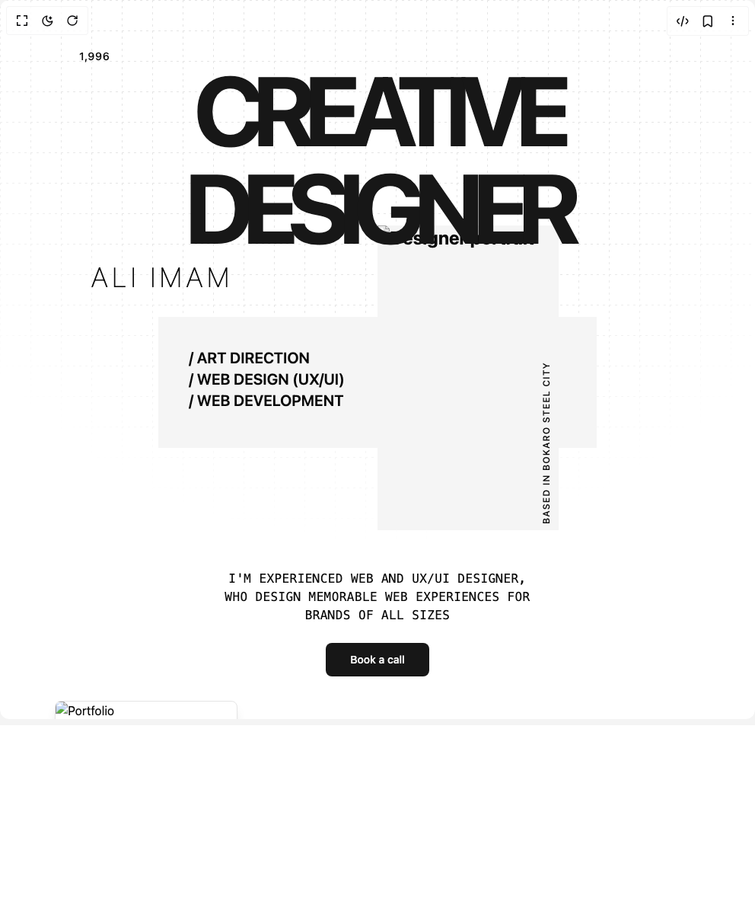

# Build Hero 04 in BuilderStudio

> Build this component in our Agentic IDE: [BuilderStudio](https://builderstudio.dev).
>
> Join the BuilderStudio community on [Discord](https://discord.gg/QdWeSGCqfe) and [Reddit](https://reddit.com/r/builderstudio).



## Component

- Author group: `aliimam`
- Component: `hero-04`
- Variant: `default`
- Rendered HTML snapshot: [`rendered.html`](rendered.html)

## BuilderStudio prompt

You are implementing a React component based on a component reference.

## Component identity

- Author: aliimam
- Component slug: hero-04
- Demo slug: default
- Title: hero-04
- Description: 

## Goal

Recreate this component in a React + TypeScript + Tailwind CSS project. Preserve the visual layout, spacing, colors, border radius, shadows, interaction behavior, animation behavior, responsive behavior, and dark mode behavior shown in the rendered demo.

## Implementation requirements

- Use React and TypeScript.
- Use Tailwind CSS classes whenever possible.
- Keep the component self-contained unless the source files require helper components.
- If the source uses CSS variables, custom CSS, animations, or keyframes, include them.
- If the source uses external packages, list and use the required packages.
- Preserve accessibility attributes, button semantics, links, keyboard behavior, and ARIA attributes when visible in the source.
- Do not replace the component with a simplified placeholder.
- Return complete production-ready code.

## Dependencies

No reference metadata available.

## Rendered DOM snapshot

This is the rendered demo HTML extracted from the live preview. Use it to verify structure, class names, visible content, and layout.

```html
<div id="root"><div class="w-screen min-h-screen flex justify-center items-center"><div class="w-screen min-h-screen flex justify-center items-center"><section class="min-h-screen overflow-hidden relative py-20"><div class="mx-auto max-w-7xl relative z-20 px-6"><div class="relative "><p class="text-sm absolute -top-4 left-20 font-medium tracking-wider">1,996</p><h1 class="z-20 text-primary relative font-bold text-center tracking-[-7px] text-7xl md:text-9xl xl:tracking-[-1rem] md:tracking-[-14px] xl:text-[10rem]">CREATIVE DESIGNER</h1><p class="text-4xl hidden xl:block absolute -bottom-12 right-24 font-thin tracking-[6px]">ALI IMAM</p><p class="text-4xl absolute xl:hidden -bottom-12 left-24 font-thin tracking-[6px]">ALI IMAM</p></div><div class="grid relative"><div class="space-y-8 pt-20 flex gap-6 justify-center"><div class="flex gap-6 bg-secondary w-full max-w-xl h-fit p-10 items-end space-y-2 text-xl font-bold md:text-2xl lg:text-3xl"><div class="font-semibold text-xl"><div>/ ART DIRECTION</div><div>/ WEB DESIGN (UX/UI)</div><div>/ WEB DEVELOPMENT</div></div><div class="absolute hidden  md:flex left-1/2 -top-10 w-fit overflow-hidden bg-secondary"><div class="text-left p-2 rotate-180 [writing-mode:vertical-rl] text-xs font-medium tracking-widest">BASED IN BOKARO STEEL CITY</div></div></div></div><div class="flex md:hidden left-1/2 -top-10 w-full md:w-fit overflow-hidden bg-secondary"><div class="text-left p-2 rotate-180 [writing-mode:vertical-rl] text-xs font-medium tracking-widest">BASED IN BOKARO STEEL CITY</div></div></div><div class="md:mt-40 mt-10"><p class="mx-auto max-w-2xl font-mono text-center text-sm font-medium tracking-wide md:text-base">I'M EXPERIENCED WEB AND UX/UI DESIGNER,<br>WHO DESIGN MEMORABLE WEB EXPERIENCES FOR<br>BRANDS OF ALL SIZES</p></div><div class="flex justify-center pt-6"><button class="inline-flex items-center justify-center whitespace-nowrap text-sm font-medium ring-offset-background transition-colors focus-visible:outline-none focus-visible:ring-2 focus-visible:ring-ring focus-visible:ring-offset-2 disabled:pointer-events-none disabled:opacity-50 bg-primary text-primary-foreground hover:bg-primary/90 h-11 rounded-md px-8">Book a call</button></div><div class="md:flex mt-20 items-end justify-between"><div class="relative"><div class="w-60 h-36 shadow-lg border rounded-md overflow-hidden mb-8 md:mb-0"></div><div class="w-60 h-36 absolute left-6 -top-6  shadow-lg border rounded-md overflow-hidden mb-8 md:mb-0"></div><div class="w-60 h-36 absolute left-12 -top-12  shadow-lg border rounded-md overflow-hidden mb-8 md:mb-0"></div></div><div><div class="flex items-center md:justify-end gap-2"><span class="text-lg font-medium tracking-wider">RECENT WORK</span><svg width="24" height="24" viewBox="0 0 24 24" fill="none" xmlns="http://www.w3.org/2000/svg" class="size-6"><path d="M7 7 17 17M17 7V17H7" stroke="currentColor" stroke-linecap="round" stroke-linejoin="round"></path></svg></div><div class="mt-3 md:text-right"><h2 class="text-5xl uppercase tracking-[-4px]">Design without Limits</h2></div></div></div></div><div class="absolute block dark:hidden inset-0 z-0" style="background-image: linear-gradient(to right, rgb(229, 229, 229) 1px, transparent 1px), linear-gradient(rgb(229, 229, 229) 1px, transparent 1px); background-size: 20px 20px; background-position: 0px 0px, 0px 0px; mask-image: repeating-linear-gradient(to right, black 0px, black 3px, transparent 3px, transparent 8px), repeating-linear-gradient(black 0px, black 3px, transparent 3px, transparent 8px), radial-gradient(70% 60% at 50% 0%, rgb(0, 0, 0) 60%, transparent 100%); mask-composite: source-in;"></div><div class="absolute hidden dark:block inset-0 z-0" style="background-image: linear-gradient(to right, rgb(64, 64, 64) 1px, transparent 1px), linear-gradient(rgb(64, 64, 64) 1px, transparent 1px); background-size: 20px 20px; background-position: 0px 0px, 0px 0px; mask-image: repeating-linear-gradient(to right, black 0px, black 3px, transparent 3px, transparent 8px), repeating-linear-gradient(black 0px, black 3px, transparent 3px, transparent 8px), radial-gradient(70% 60% at 50% 0%, rgb(0, 0, 0) 60%, transparent 100%); mask-composite: source-in;"></div></section></div></div></div>
```

## Reference source files

No reference source files were available.
