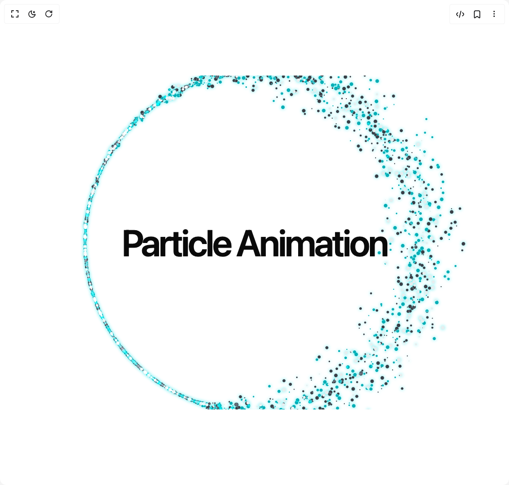

# Build Particle Animation in BuilderStudio

> Build this component in our Agentic IDE: [BuilderStudio](https://builderstudio.dev).
>
> Join the BuilderStudio community on [Discord](https://discord.gg/QdWeSGCqfe) and [Reddit](https://reddit.com/r/builderstudio).



## Component

- Author group: `aliimam`
- Component: `particle-animation`
- Variant: `default`
- Rendered HTML snapshot: [`rendered.html`](rendered.html)

## BuilderStudio prompt

You are implementing a React component based on a component reference.

## Component identity

- Author: aliimam
- Component slug: particle-animation
- Demo slug: default
- Title: particle-animation
- Description: 

## Goal

Recreate this component in a React + TypeScript + Tailwind CSS project. Preserve the visual layout, spacing, colors, border radius, shadows, interaction behavior, animation behavior, responsive behavior, and dark mode behavior shown in the rendered demo.

## Implementation requirements

- Use React and TypeScript.
- Use Tailwind CSS classes whenever possible.
- Keep the component self-contained unless the source files require helper components.
- If the source uses CSS variables, custom CSS, animations, or keyframes, include them.
- If the source uses external packages, list and use the required packages.
- Preserve accessibility attributes, button semantics, links, keyboard behavior, and ARIA attributes when visible in the source.
- Do not replace the component with a simplified placeholder.
- Return complete production-ready code.

## Dependencies

No reference metadata available.

## Rendered DOM snapshot

This is the rendered demo HTML extracted from the live preview. Use it to verify structure, class names, visible content, and layout.

```html
<div id="root"><div class="w-screen min-h-screen flex justify-center items-center"><div class="w-screen min-h-screen flex justify-center items-center"><div class="relative flex h-[650px] w-full flex-col items-center justify-center overflow-hidden"><span class="pointer-events-none z-10 whitespace-pre-wrap absolute text-center text-7xl font-semibold leading-none tracking-tighter">Particle Animation</span><div class="particle-container"><style>
        .particle-container canvas {
          margin: auto;
          touch-action: none;
          filter: drop-shadow(0px 0px 3px rgba(0, 228, 233, 0.7));
        }
      </style><canvas id="defaultCanvas0" class="p5Canvas" width="944" height="944" style="width: 944px; height: 944px;"></canvas></div></div></div></div></div>
```

## Reference source files

No reference source files were available.
