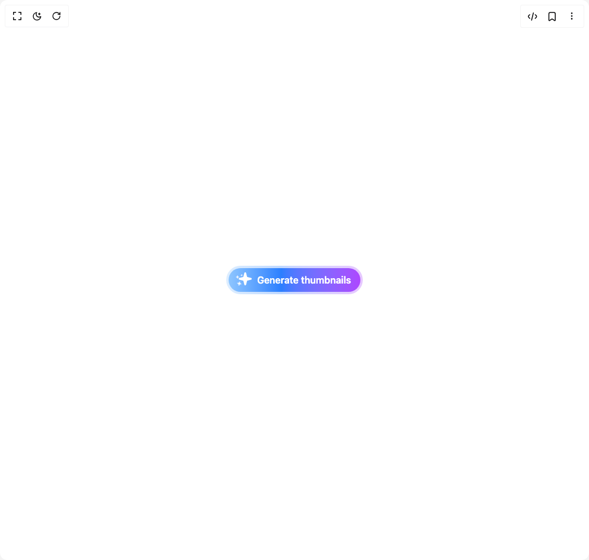
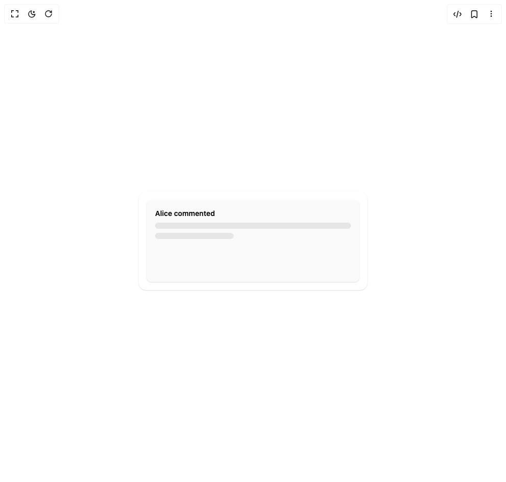
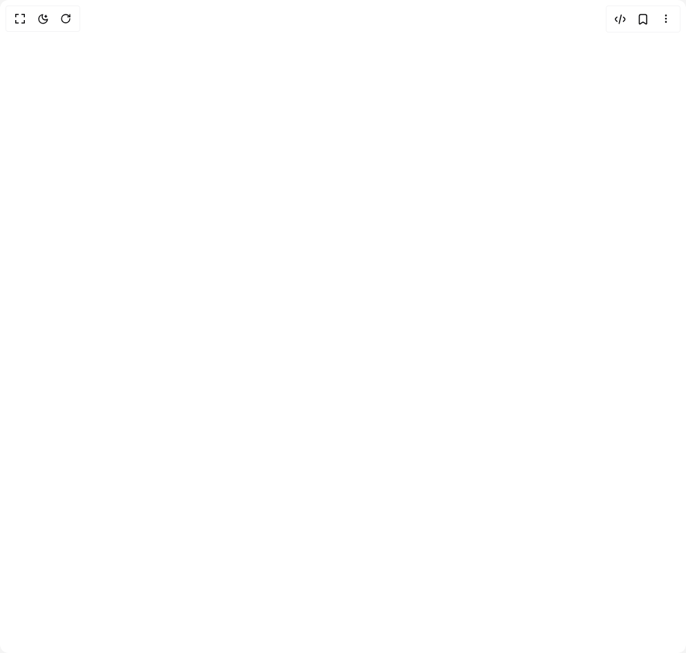
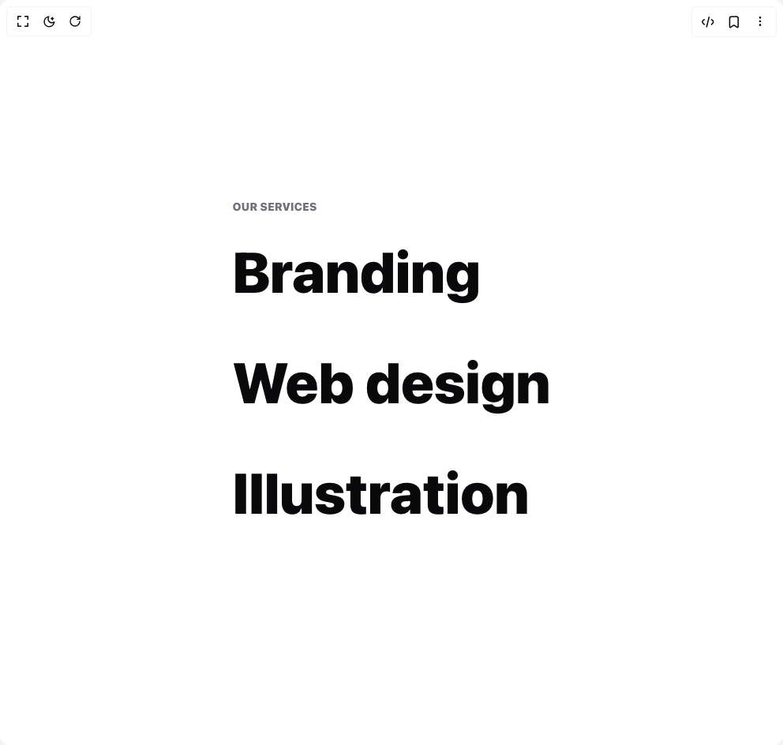
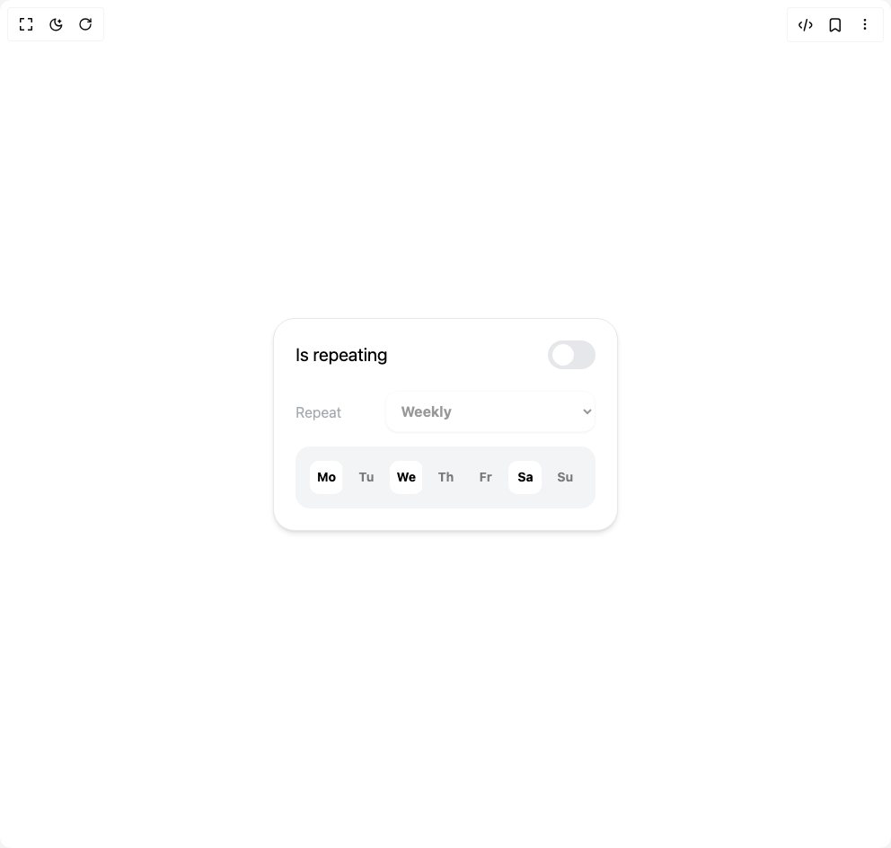

# Animata Components

6 components are available in this author group.

> Build any component in [BuilderStudio](https://builderstudio.dev), then share improvements with the community on [Discord](https://discord.gg/QdWeSGCqfe) or [Reddit](https://reddit.com/r/builderstudio).

| Preview | Component | Variant |
| --- | --- | --- |
|  | [Button 8](button-8/default/README.md) | `default` |
|  | [Card Comment](card-comment/default/README.md) | `default` |
|  | [Flower Menu](flower-menu/default/README.md) | `default` |
|  | [Notification](notification/default/README.md) | `default` |
|  | [Reveal Images](reveal-images/default/README.md) | `default` |
|  | [Scheduler](scheduler/default/README.md) | `default` |
