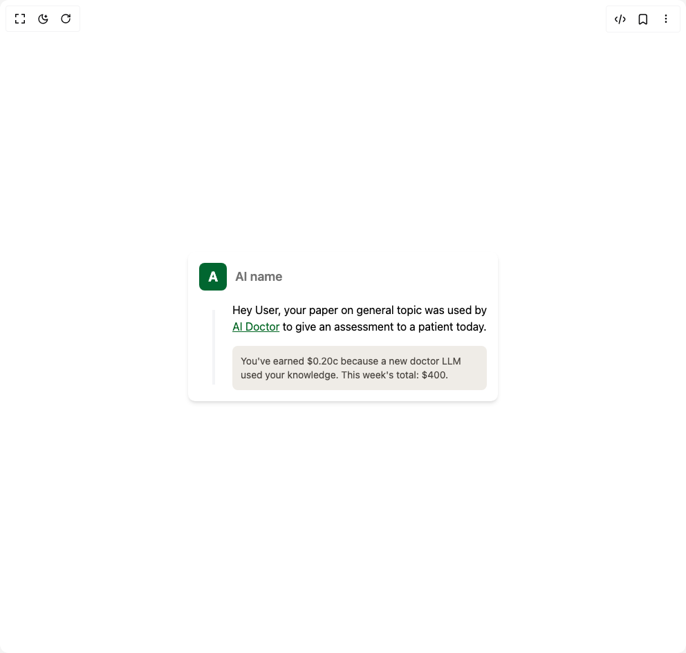

# Build Notification in BuilderStudio

> Build this component in our Agentic IDE: [BuilderStudio](https://builderstudio.dev).
>
> Join the BuilderStudio community on [Discord](https://discord.gg/QdWeSGCqfe) and [Reddit](https://reddit.com/r/builderstudio).



## Component

- Author group: `animata`
- Component: `notification`
- Variant: `default`
- Rendered HTML snapshot: [`rendered.html`](rendered.html)

## BuilderStudio prompt

You are implementing a React component based on a component reference.

## Component identity

- Author: animata
- Component slug: notification
- Demo slug: default
- Title: notification
- Description: 

## Goal

Recreate this component in a React + TypeScript + Tailwind CSS project. Preserve the visual layout, spacing, colors, border radius, shadows, interaction behavior, animation behavior, responsive behavior, and dark mode behavior shown in the rendered demo.

## Implementation requirements

- Use React and TypeScript.
- Use Tailwind CSS classes whenever possible.
- Keep the component self-contained unless the source files require helper components.
- If the source uses CSS variables, custom CSS, animations, or keyframes, include them.
- If the source uses external packages, list and use the required packages.
- Preserve accessibility attributes, button semantics, links, keyboard behavior, and ARIA attributes when visible in the source.
- Do not replace the component with a simplified placeholder.
- Return complete production-ready code.

## Dependencies

No reference metadata available.

## Rendered DOM snapshot

This is the rendered demo HTML extracted from the live preview. Use it to verify structure, class names, visible content, and layout.

```html
<div id="root"><div class="w-screen min-h-screen flex justify-center items-center"><div class="w-screen min-h-screen flex justify-center items-center"><div class="flex w-full h-screen justify-center items-center"><div class="relative mx-auto max-w-md overflow-hidden rounded-lg bg-white shadow-md" role="alert" aria-live="polite" style="opacity: 1; transform: none;"><div class="p-4"><div class="relative mb-4 flex items-center" style="opacity: 1;"><div class="relative mr-3"><div class="flex h-10 w-10 items-center justify-center rounded-md bg-green-800 text-xl font-bold text-white">A</div></div><span class="text-lg font-semibold text-muted-foreground">AI name</span></div><div class="relative"><div class="absolute left-[19px] top-0 mt-3 w-1 bg-gray-100" style="height: calc(100% - 20px);"></div><div style="overflow: hidden; opacity: 1; height: auto;"><div class="mb-4 pl-12 text-gray-700 dark:text-gray-300" style="opacity: 1; transform: none;"><p class="text-black">Hey User, your paper on general topic was used by <span class="underline" style="color: rgb(0, 102, 34);">AI Doctor</span> to give an assessment to a patient today.</p></div><div class="ml-12 rounded-md p-3" style="background-color: rgb(239, 236, 231); opacity: 1; transform: none;"><div class="flex items-start"><p class="text-sm" style="color: rgb(76, 72, 67);">You've earned $0.20c because a new doctor LLM used your knowledge. This week's total: $400.</p></div></div></div></div></div></div></div></div></div></div>
```

## Reference source files

No reference source files were available.
