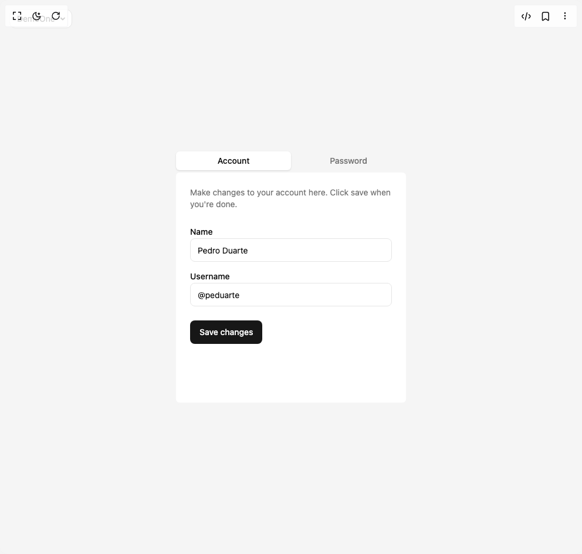
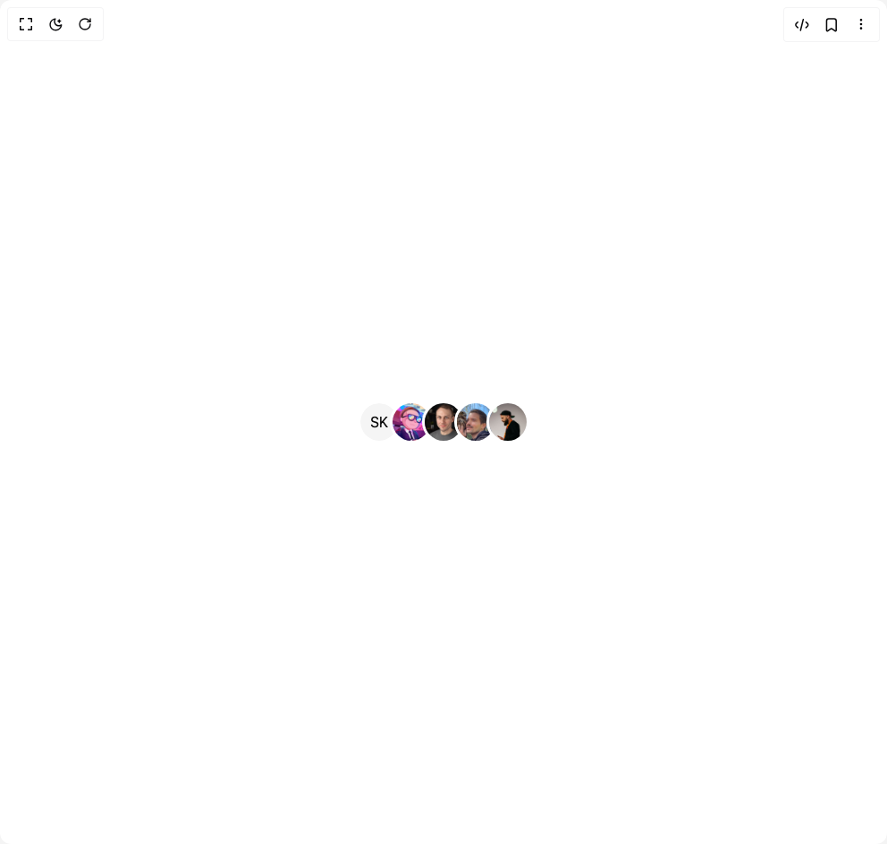
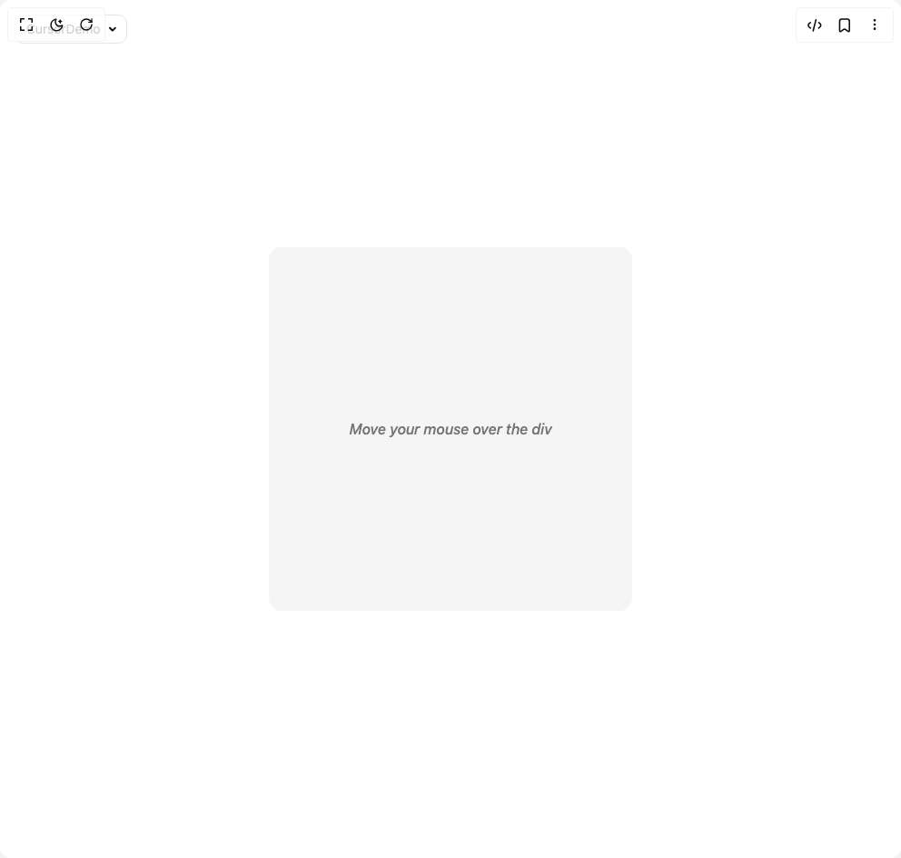
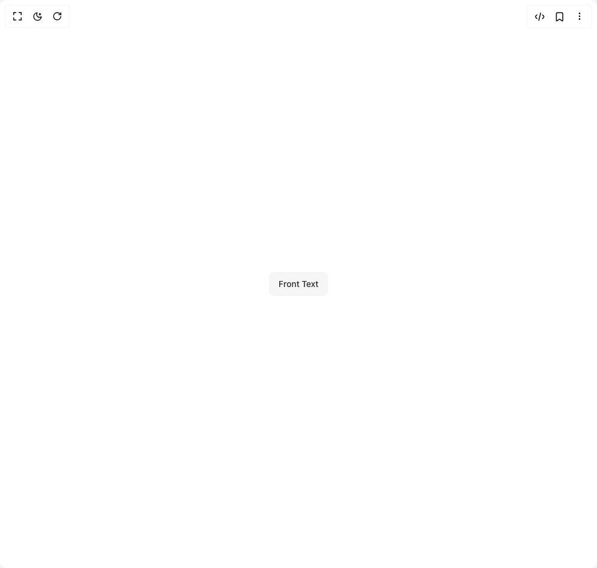
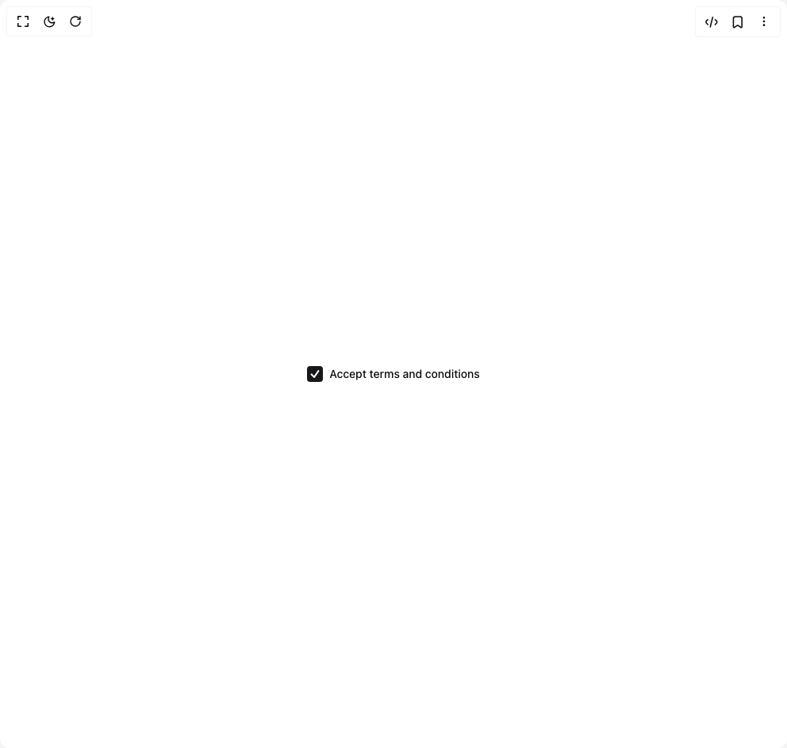
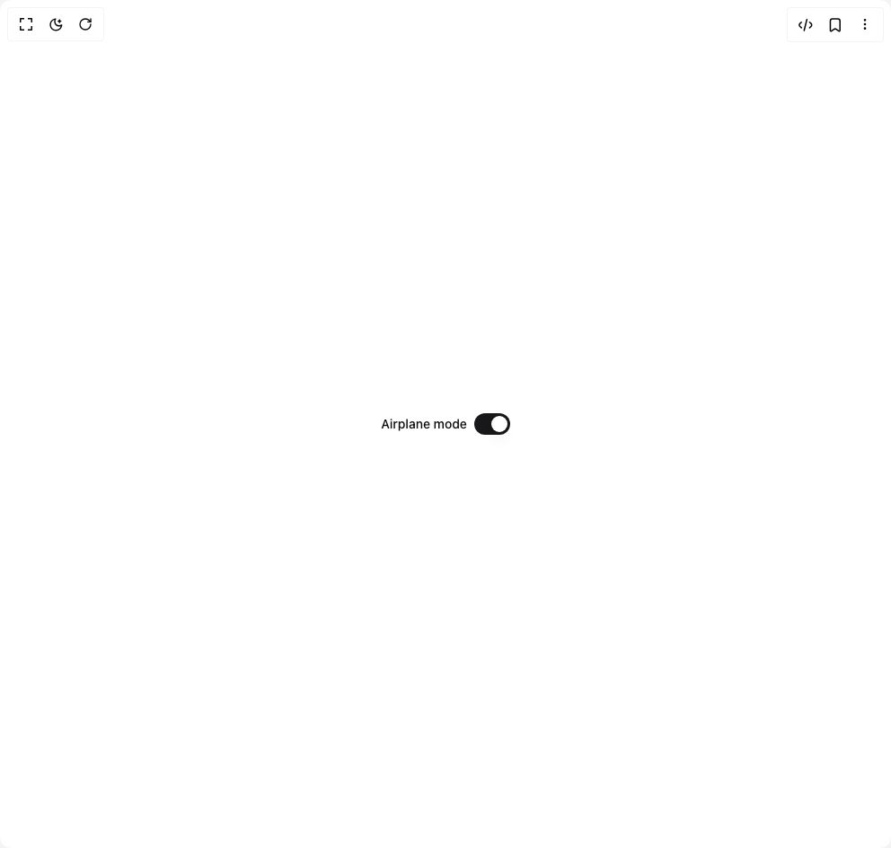
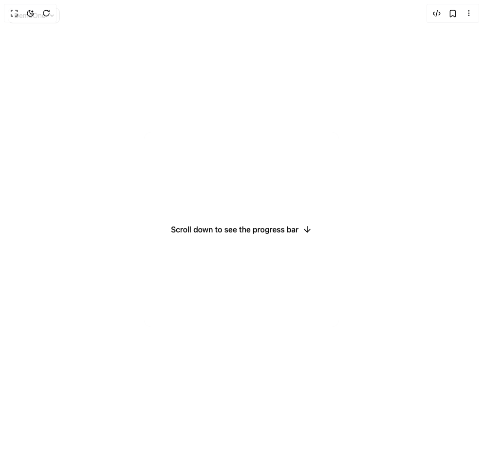
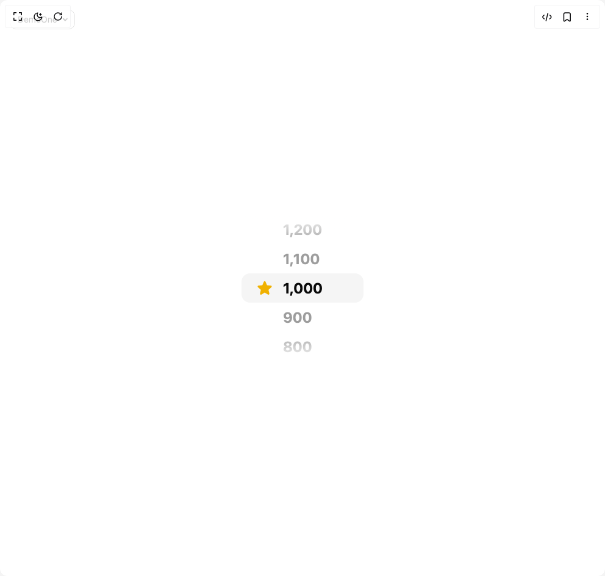
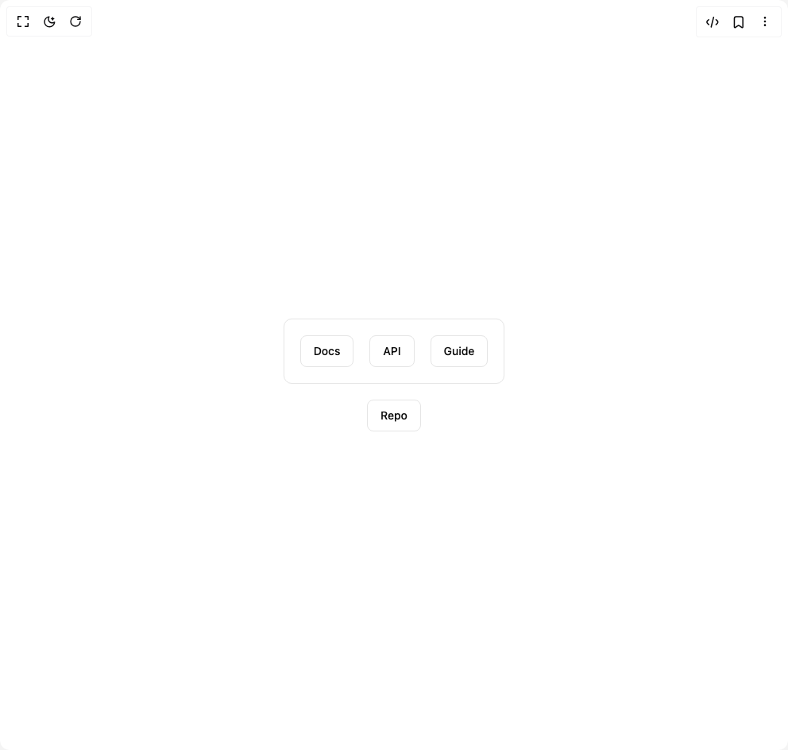

# Animate Ui Components

12 components are available in this author group.

> Build any component in [BuilderStudio](https://builderstudio.dev), then share improvements with the community on [Discord](https://discord.gg/QdWeSGCqfe) or [Reddit](https://reddit.com/r/builderstudio).

| Preview | Component | Variant |
| --- | --- | --- |
|  | [Animated Tabs](animated-tabs/default/README.md) | `default` |
|  | [Avatar Group](avatar-group/default/README.md) | `default` |
|  | [Cursor](cursor/default/README.md) | `default` |
|  | [Flip Button](flip-button/flip-button-demo/README.md) | `flip-button-demo` |
|  | [Pin List](pin-list/default/README.md) | `default` |
|  | [Radix Checkbox](radix-checkbox/radix-checkbox-demo/README.md) | `radix-checkbox-demo` |
|  | [Radix Dropdown Menu](radix-dropdown-menu/default/README.md) | `default` |
|  | [Radix Switch](radix-switch/radix-switch-demo/README.md) | `radix-switch-demo` |
|  | [Scroll Progress](scroll-progress/default/README.md) | `default` |
|  | [Spring Element](spring-element/default/README.md) | `default` |
|  | [Stars Scrolling Wheel](stars-scrolling-wheel/default/README.md) | `default` |
|  | [Tooltip 1](tooltip-1/default/README.md) | `default` |
