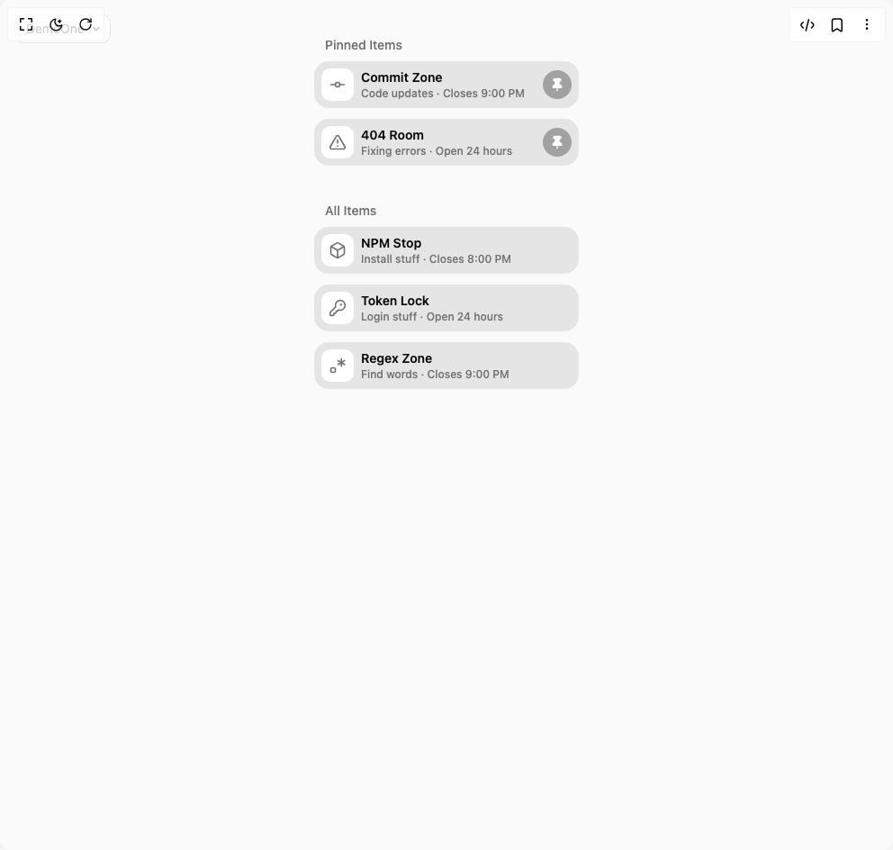

# Build Pin List in BuilderStudio

> Build this component in our Agentic IDE: [BuilderStudio](https://builderstudio.dev).
>
> Join the BuilderStudio community on [Discord](https://discord.gg/QdWeSGCqfe) and [Reddit](https://reddit.com/r/builderstudio).



## Component

- Author group: `animate-ui`
- Component: `pin-list`
- Variant: `default`
- Rendered HTML snapshot: [`rendered.html`](rendered.html)

## BuilderStudio prompt

You are implementing a React component based on a component reference.

## Component identity

- Author: animate-ui
- Component slug: pin-list
- Demo slug: default
- Title: pin-list
- Description: 

## Goal

Recreate this component in a React + TypeScript + Tailwind CSS project. Preserve the visual layout, spacing, colors, border radius, shadows, interaction behavior, animation behavior, responsive behavior, and dark mode behavior shown in the rendered demo.

## Implementation requirements

- Use React and TypeScript.
- Use Tailwind CSS classes whenever possible.
- Keep the component self-contained unless the source files require helper components.
- If the source uses CSS variables, custom CSS, animations, or keyframes, include them.
- If the source uses external packages, list and use the required packages.
- Preserve accessibility attributes, button semantics, links, keyboard behavior, and ARIA attributes when visible in the source.
- Do not replace the component with a simplified placeholder.
- Return complete production-ready code.

## Dependencies

No reference metadata available.

## Rendered DOM snapshot

This is the rendered demo HTML extracted from the live preview. Use it to verify structure, class names, visible content, and layout.

```html
<div id="root"><div class="fixed top-4 left-4 z-10"><select class="appearance-none h-8 max-w-[200px] text-sm leading-tight rounded-lg pl-3 pr-7 py-0 border bg-background focus:outline-none focus:ring-0"><option value="default_DemoOne">DemoOne</option></select><div class="absolute top-1/2 transform -translate-y-1/2 right-2 pointer-events-none"><svg class="w-4 h-4 fill-current" viewBox="0 0 20 20"><path d="M5.516 7.548c.436-.446 1.043-.48 1.576 0L10 10.405l2.908-2.857c.533-.48 1.14-.446 1.576 0 .436.445.408 1.197 0 1.615l-3.734 3.705c-.533.534-1.39.534-1.923 0l-3.734-3.705c-.408-.418-.436-1.17 0-1.615z"></path></svg></div></div><div class="w-screen min-h-screen flex justify-center items-center"><div class="flex w-full min-h-screen justify-center items-start pt-10 bg-neutral-50 dark:bg-neutral-900"><div class="space-y-10"><div><p class="font-medium px-3 text-neutral-500 dark:text-neutral-300 text-sm mb-2" style="opacity: 1;">Pinned Items</p><div class="space-y-3 relative z-10"><div class="flex items-center justify-between gap-5 rounded-2xl bg-neutral-200 dark:bg-neutral-800 p-2" style="opacity: 1;"><div class="flex items-center gap-2"><div class="rounded-lg bg-background p-2"><svg xmlns="http://www.w3.org/2000/svg" width="24" height="24" viewBox="0 0 24 24" fill="none" stroke="currentColor" stroke-width="2" stroke-linecap="round" stroke-linejoin="round" class="lucide lucide-git-commit-horizontal size-5 text-neutral-500 dark:text-neutral-400" aria-hidden="true"><circle cx="12" cy="12" r="3"></circle><line x1="3" x2="9" y1="12" y2="12"></line><line x1="15" x2="21" y1="12" y2="12"></line></svg></div><div><div class="text-sm font-semibold">Commit Zone</div><div class="text-xs text-neutral-500 dark:text-neutral-400 font-medium">Code updates · Closes 9:00 PM</div></div></div><div class="flex items-center justify-center size-8 rounded-full bg-neutral-400 dark:bg-neutral-600"><svg xmlns="http://www.w3.org/2000/svg" width="24" height="24" viewBox="0 0 24 24" fill="none" stroke="currentColor" stroke-width="2" stroke-linecap="round" stroke-linejoin="round" class="lucide lucide-pin size-4 text-white fill-white" aria-hidden="true"><path d="M12 17v5"></path><path d="M9 10.76a2 2 0 0 1-1.11 1.79l-1.78.9A2 2 0 0 0 5 15.24V16a1 1 0 0 0 1 1h12a1 1 0 0 0 1-1v-.76a2 2 0 0 0-1.11-1.79l-1.78-.9A2 2 0 0 1 15 10.76V7a1 1 0 0 1 1-1 2 2 0 0 0 0-4H8a2 2 0 0 0 0 4 1 1 0 0 1 1 1z"></path></svg></div></div><div class="flex items-center justify-between gap-5 rounded-2xl bg-neutral-200 dark:bg-neutral-800 p-2" style="opacity: 1;"><div class="flex items-center gap-2"><div class="rounded-lg bg-background p-2"><svg xmlns="http://www.w3.org/2000/svg" width="24" height="24" viewBox="0 0 24 24" fill="none" stroke="currentColor" stroke-width="2" stroke-linecap="round" stroke-linejoin="round" class="lucide lucide-triangle-alert size-5 text-neutral-500 dark:text-neutral-400" aria-hidden="true"><path d="m21.73 18-8-14a2 2 0 0 0-3.48 0l-8 14A2 2 0 0 0 4 21h16a2 2 0 0 0 1.73-3"></path><path d="M12 9v4"></path><path d="M12 17h.01"></path></svg></div><div><div class="text-sm font-semibold">404 Room</div><div class="text-xs text-neutral-500 dark:text-neutral-400 font-medium">Fixing errors · Open 24 hours</div></div></div><div class="flex items-center justify-center size-8 rounded-full bg-neutral-400 dark:bg-neutral-600"><svg xmlns="http://www.w3.org/2000/svg" width="24" height="24" viewBox="0 0 24 24" fill="none" stroke="currentColor" stroke-width="2" stroke-linecap="round" stroke-linejoin="round" class="lucide lucide-pin size-4 text-white fill-white" aria-hidden="true"><path d="M12 17v5"></path><path d="M9 10.76a2 2 0 0 1-1.11 1.79l-1.78.9A2 2 0 0 0 5 15.24V16a1 1 0 0 0 1 1h12a1 1 0 0 0 1-1v-.76a2 2 0 0 0-1.11-1.79l-1.78-.9A2 2 0 0 1 15 10.76V7a1 1 0 0 1 1-1 2 2 0 0 0 0-4H8a2 2 0 0 0 0 4 1 1 0 0 1 1 1z"></path></svg></div></div></div></div><div><p class="font-medium px-3 text-neutral-500 dark:text-neutral-300 text-sm mb-2" style="opacity: 1;">All Items</p><div class="space-y-3 relative z-10"><div class="flex items-center justify-between gap-5 rounded-2xl bg-neutral-200 dark:bg-neutral-800 p-2 group" style="opacity: 1;"><div class="flex items-center gap-2"><div class="rounded-lg bg-background p-2"><svg xmlns="http://www.w3.org/2000/svg" width="24" height="24" viewBox="0 0 24 24" fill="none" stroke="currentColor" stroke-width="2" stroke-linecap="round" stroke-linejoin="round" class="lucide lucide-box size-5 text-neutral-500 dark:text-neutral-400" aria-hidden="true"><path d="M21 8a2 2 0 0 0-1-1.73l-7-4a2 2 0 0 0-2 0l-7 4A2 2 0 0 0 3 8v8a2 2 0 0 0 1 1.73l7 4a2 2 0 0 0 2 0l7-4A2 2 0 0 0 21 16Z"></path><path d="m3.3 7 8.7 5 8.7-5"></path><path d="M12 22V12"></path></svg></div><div><div class="text-sm font-semibold">NPM Stop</div><div class="text-xs text-neutral-500 dark:text-neutral-400 font-medium">Install stuff · Closes 8:00 PM</div></div></div><div class="flex items-center justify-center size-8 rounded-full bg-neutral-400 dark:bg-neutral-600 opacity-0 group-hover:opacity-100 transition-opacity duration-250"><svg xmlns="http://www.w3.org/2000/svg" width="24" height="24" viewBox="0 0 24 24" fill="none" stroke="currentColor" stroke-width="2" stroke-linecap="round" stroke-linejoin="round" class="lucide lucide-pin size-4 text-white" aria-hidden="true"><path d="M12 17v5"></path><path d="M9 10.76a2 2 0 0 1-1.11 1.79l-1.78.9A2 2 0 0 0 5 15.24V16a1 1 0 0 0 1 1h12a1 1 0 0 0 1-1v-.76a2 2 0 0 0-1.11-1.79l-1.78-.9A2 2 0 0 1 15 10.76V7a1 1 0 0 1 1-1 2 2 0 0 0 0-4H8a2 2 0 0 0 0 4 1 1 0 0 1 1 1z"></path></svg></div></div><div class="flex items-center justify-between gap-5 rounded-2xl bg-neutral-200 dark:bg-neutral-800 p-2 group" style="opacity: 1;"><div class="flex items-center gap-2"><div class="rounded-lg bg-background p-2"><svg xmlns="http://www.w3.org/2000/svg" width="24" height="24" viewBox="0 0 24 24" fill="none" stroke="currentColor" stroke-width="2" stroke-linecap="round" stroke-linejoin="round" class="lucide lucide-key-round size-5 text-neutral-500 dark:text-neutral-400" aria-hidden="true"><path d="M2.586 17.414A2 2 0 0 0 2 18.828V21a1 1 0 0 0 1 1h3a1 1 0 0 0 1-1v-1a1 1 0 0 1 1-1h1a1 1 0 0 0 1-1v-1a1 1 0 0 1 1-1h.172a2 2 0 0 0 1.414-.586l.814-.814a6.5 6.5 0 1 0-4-4z"></path><circle cx="16.5" cy="7.5" r=".5" fill="currentColor"></circle></svg></div><div><div class="text-sm font-semibold">Token Lock</div><div class="text-xs text-neutral-500 dark:text-neutral-400 font-medium">Login stuff · Open 24 hours</div></div></div><div class="flex items-center justify-center size-8 rounded-full bg-neutral-400 dark:bg-neutral-600 opacity-0 group-hover:opacity-100 transition-opacity duration-250"><svg xmlns="http://www.w3.org/2000/svg" width="24" height="24" viewBox="0 0 24 24" fill="none" stroke="currentColor" stroke-width="2" stroke-linecap="round" stroke-linejoin="round" class="lucide lucide-pin size-4 text-white" aria-hidden="true"><path d="M12 17v5"></path><path d="M9 10.76a2 2 0 0 1-1.11 1.79l-1.78.9A2 2 0 0 0 5 15.24V16a1 1 0 0 0 1 1h12a1 1 0 0 0 1-1v-.76a2 2 0 0 0-1.11-1.79l-1.78-.9A2 2 0 0 1 15 10.76V7a1 1 0 0 1 1-1 2 2 0 0 0 0-4H8a2 2 0 0 0 0 4 1 1 0 0 1 1 1z"></path></svg></div></div><div class="flex items-center justify-between gap-5 rounded-2xl bg-neutral-200 dark:bg-neutral-800 p-2 group" style="opacity: 1;"><div class="flex items-center gap-2"><div class="rounded-lg bg-background p-2"><svg xmlns="http://www.w3.org/2000/svg" width="24" height="24" viewBox="0 0 24 24" fill="none" stroke="currentColor" stroke-width="2" stroke-linecap="round" stroke-linejoin="round" class="lucide lucide-regex size-5 text-neutral-500 dark:text-neutral-400" aria-hidden="true"><path d="M17 3v10"></path><path d="m12.67 5.5 8.66 5"></path><path d="m12.67 10.5 8.66-5"></path><path d="M9 17a2 2 0 0 0-2-2H5a2 2 0 0 0-2 2v2a2 2 0 0 0 2 2h2a2 2 0 0 0 2-2v-2z"></path></svg></div><div><div class="text-sm font-semibold">Regex Zone</div><div class="text-xs text-neutral-500 dark:text-neutral-400 font-medium">Find words · Closes 9:00 PM</div></div></div><div class="flex items-center justify-center size-8 rounded-full bg-neutral-400 dark:bg-neutral-600 opacity-0 group-hover:opacity-100 transition-opacity duration-250"><svg xmlns="http://www.w3.org/2000/svg" width="24" height="24" viewBox="0 0 24 24" fill="none" stroke="currentColor" stroke-width="2" stroke-linecap="round" stroke-linejoin="round" class="lucide lucide-pin size-4 text-white" aria-hidden="true"><path d="M12 17v5"></path><path d="M9 10.76a2 2 0 0 1-1.11 1.79l-1.78.9A2 2 0 0 0 5 15.24V16a1 1 0 0 0 1 1h12a1 1 0 0 0 1-1v-.76a2 2 0 0 0-1.11-1.79l-1.78-.9A2 2 0 0 1 15 10.76V7a1 1 0 0 1 1-1 2 2 0 0 0 0-4H8a2 2 0 0 0 0 4 1 1 0 0 1 1 1z"></path></svg></div></div></div></div></div></div></div></div>
```

## Reference source files

No reference source files were available.
