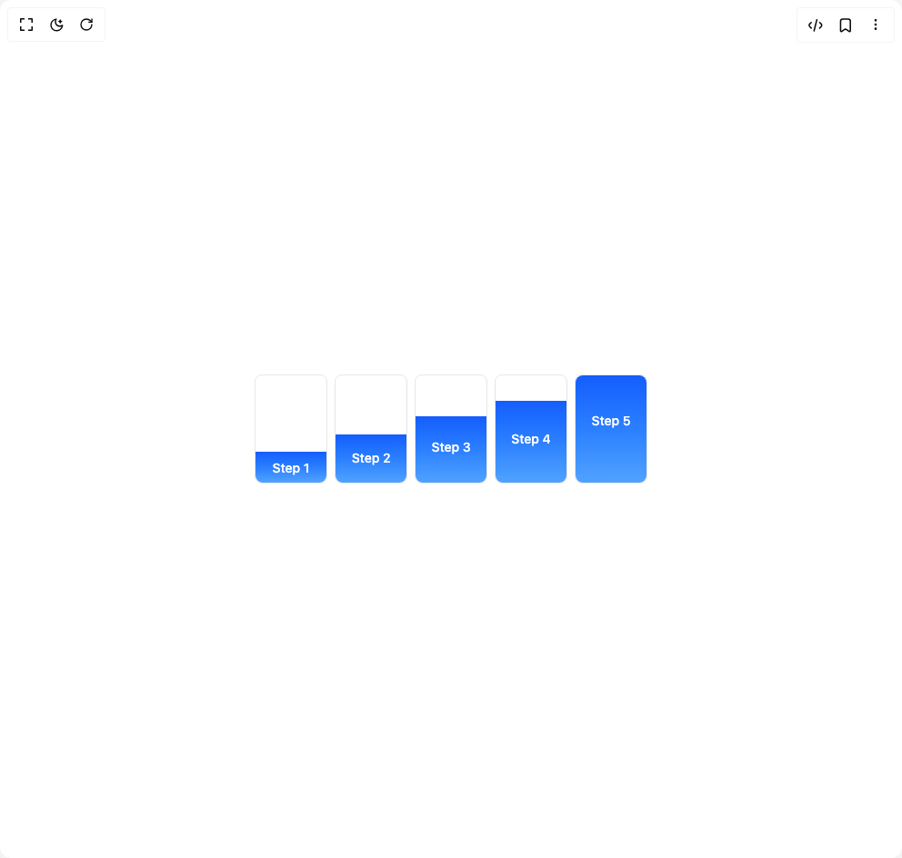

# Build Process Pillars in BuilderStudio

> Build this component in our Agentic IDE: [BuilderStudio](https://builderstudio.dev).
>
> Join the BuilderStudio community on [Discord](https://discord.gg/QdWeSGCqfe) and [Reddit](https://reddit.com/r/builderstudio).



## Component

- Author group: `ankit-2145`
- Component: `process-pillars`
- Variant: `default`
- Rendered HTML snapshot: [`rendered.html`](rendered.html)

## BuilderStudio prompt

You are implementing a React component based on a component reference.

## Component identity

- Author: Ankit-2145
- Component slug: process-pillars
- Demo slug: default
- Title: process-pillars
- Description: 

## Goal

Recreate this component in a React + TypeScript + Tailwind CSS project. Preserve the visual layout, spacing, colors, border radius, shadows, interaction behavior, animation behavior, responsive behavior, and dark mode behavior shown in the rendered demo.

## Implementation requirements

- Use React and TypeScript.
- Use Tailwind CSS classes whenever possible.
- Keep the component self-contained unless the source files require helper components.
- If the source uses CSS variables, custom CSS, animations, or keyframes, include them.
- If the source uses external packages, list and use the required packages.
- Preserve accessibility attributes, button semantics, links, keyboard behavior, and ARIA attributes when visible in the source.
- Do not replace the component with a simplified placeholder.
- Return complete production-ready code.

## Dependencies

No reference metadata available.

## Rendered DOM snapshot

This is the rendered demo HTML extracted from the live preview. Use it to verify structure, class names, visible content, and layout.

```html
<div id="root"><div class="w-screen min-h-screen flex justify-center items-center"><div class="w-screen min-h-screen flex justify-center items-center"><div class="flex items-end gap-2 pointer-events-none"><div class="flex flex-col border border-gray-950/[.1] dark:border-gray-50/[.1] rounded-md h-30 w-20"><div class="h-full rounded-md"></div><div class="bg-gradient-to-t from-blue-400 via-blue-500 to-blue-600 rounded-b-md h-12" style="transform-origin: center bottom; transform: none;"><p class="text-center text-sm text-white font-medium pt-2" style="opacity: 1;">Step 1</p></div></div><div class="flex flex-col border border-gray-950/[.1] dark:border-gray-50/[.1] rounded-md h-30 w-20"><div class="h-full rounded-md"></div><div class="bg-gradient-to-t from-blue-400 via-blue-500 to-blue-600 rounded-b-md h-24" style="transform-origin: center bottom; transform: none;"><p class="text-center text-sm text-white font-medium pt-4" style="opacity: 1;">Step 2</p></div></div><div class="flex flex-col border border-gray-950/[.1] dark:border-gray-50/[.1] rounded-md h-30 w-20"><div class="h-full rounded-md"></div><div class="bg-gradient-to-t from-blue-400 via-blue-500 to-blue-600 rounded-b-md h-48" style="transform-origin: center bottom; transform: none;"><p class="text-center text-sm text-white font-medium pt-6" style="opacity: 1;">Step 3</p></div></div><div class="flex flex-col border border-gray-950/[.1] dark:border-gray-50/[.1] rounded-md h-30 w-20"><div class="h-full rounded-md"></div><div class="bg-gradient-to-t from-blue-400 via-blue-500 to-blue-600 rounded-b-md h-96" style="transform-origin: center bottom; transform: none;"><p class="text-center text-sm text-white font-medium pt-8" style="opacity: 1;">Step 4</p></div></div><div class="flex flex-col border border-gray-950/[.1] dark:border-gray-50/[.1] rounded-md h-30 w-20"><div class="bg-gradient-to-t from-blue-400 via-blue-500 to-blue-600 rounded-md h-full h-full" style="transform-origin: center bottom; transform: none;"><p class="text-center text-sm text-white font-medium pt-10" style="opacity: 1;">Step 5</p></div></div></div></div></div></div>
```

## Reference source files

No reference source files were available.
