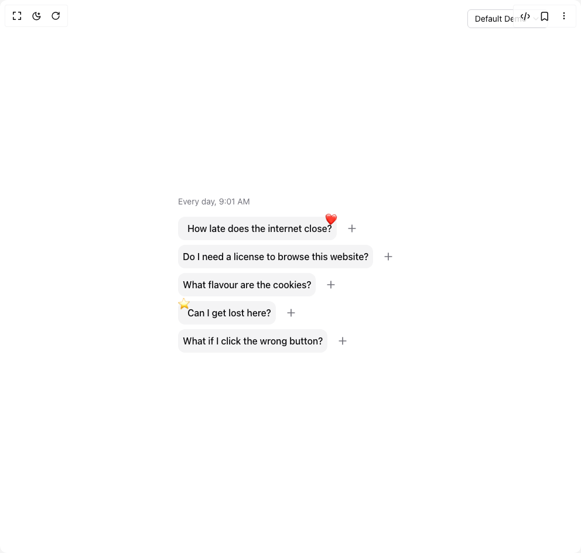

# Build Faq Chat Accordion in BuilderStudio

> Build this component in our Agentic IDE: [BuilderStudio](https://builderstudio.dev).
>
> Join the BuilderStudio community on [Discord](https://discord.gg/QdWeSGCqfe) and [Reddit](https://reddit.com/r/builderstudio).



## Component

- Author group: `anshuman008`
- Component: `faq-chat-accordion`
- Variant: `default`
- Rendered HTML snapshot: [`rendered.html`](rendered.html)

## BuilderStudio prompt

You are implementing a React component based on a component reference.

## Component identity

- Author: anshuman008
- Component slug: faq-chat-accordion
- Demo slug: default
- Title: faq-chat-accordion
- Description: 

## Goal

Recreate this component in a React + TypeScript + Tailwind CSS project. Preserve the visual layout, spacing, colors, border radius, shadows, interaction behavior, animation behavior, responsive behavior, and dark mode behavior shown in the rendered demo.

## Implementation requirements

- Use React and TypeScript.
- Use Tailwind CSS classes whenever possible.
- Keep the component self-contained unless the source files require helper components.
- If the source uses CSS variables, custom CSS, animations, or keyframes, include them.
- If the source uses external packages, list and use the required packages.
- Preserve accessibility attributes, button semantics, links, keyboard behavior, and ARIA attributes when visible in the source.
- Do not replace the component with a simplified placeholder.
- Return complete production-ready code.

## Dependencies

No reference metadata available.

## Rendered DOM snapshot

This is the rendered demo HTML extracted from the live preview. Use it to verify structure, class names, visible content, and layout.

```html
<div id="root"><div class="relative flex items-center justify-center h-screen w-full m-auto p-16 bg-background text-foreground"><div class="absolute lab-bg inset-0 size-full"><div class="absolute inset-0 bg-[radial-gradient(#00000021_1px,transparent_1px)] dark:bg-[radial-gradient(#ffffff22_1px,transparent_1px)]"></div></div><div class="absolute z-10 top-4 right-14 flex flex-col items-end gap-1"><button type="button" role="combobox" aria-controls="radix-«r0»" aria-expanded="false" aria-autocomplete="none" dir="ltr" data-state="closed" class="flex w-full items-center justify-between rounded-md border border-input bg-background px-3 py-2 text-sm ring-offset-background placeholder:text-muted-foreground focus:outline-none focus:ring-2 focus:ring-ring focus:ring-offset-2 disabled:cursor-not-allowed disabled:opacity-50 [&amp;&gt;span]:line-clamp-1 gap-2 h-8"><span style="pointer-events: none;">Default Demo</span><svg xmlns="http://www.w3.org/2000/svg" width="24" height="24" viewBox="0 0 24 24" fill="none" stroke="currentColor" stroke-width="2" stroke-linecap="round" stroke-linejoin="round" class="lucide lucide-chevron-down h-4 w-4 opacity-50" aria-hidden="true"><path d="m6 9 6 6 6-6"></path></svg></button></div><div class="flex w-full justify-center relative"><div class="p-4 max-w-[700px]"><div class="mb-4 text-sm text-muted-foreground">Every day, 9:01 AM</div><div data-orientation="vertical"><div data-state="closed" data-orientation="vertical" class="mb-2"><h3 data-orientation="vertical" data-state="closed"><button type="button" aria-controls="radix-«r2»" aria-expanded="false" data-state="closed" data-orientation="vertical" id="radix-«r1»" class="flex w-full items-center justify-start gap-x-4" data-radix-collection-item=""><div class="relative flex items-center space-x-2 rounded-xl p-2 transition-colors bg-muted hover:bg-primary/10"><span class="absolute bottom-6 right-0" style="transform: rotate(7deg);">❤️</span><span class="font-medium">How late does the internet close?</span></div><span class="text-muted-foreground"><svg xmlns="http://www.w3.org/2000/svg" width="24" height="24" viewBox="0 0 24 24" fill="none" stroke="currentColor" stroke-width="2" stroke-linecap="round" stroke-linejoin="round" class="lucide lucide-plus h-5 w-5" aria-hidden="true"><path d="M5 12h14"></path><path d="M12 5v14"></path></svg></span></button></h3><div class="overflow-hidden" data-state="closed" id="radix-«r2»" role="region" aria-labelledby="radix-«r1»" data-orientation="vertical" style="--radix-accordion-content-height: var(--radix-collapsible-content-height); --radix-accordion-content-width: var(--radix-collapsible-content-width); opacity: 0; height: 0px; transition-duration: 0s; animation-name: none; --radix-collapsible-content-width: 384px;"><div class="ml-7 mt-1 md:ml-16"><div class="relative max-w-xs rounded-2xl bg-primary px-4 py-2 text-primary-foreground">The internet doesn't close. It's available 24/7.</div></div></div></div><div data-state="closed" data-orientation="vertical" class="mb-2"><h3 data-orientation="vertical" data-state="closed"><button type="button" aria-controls="radix-«r4»" aria-expanded="false" data-state="closed" data-orientation="vertical" id="radix-«r3»" class="flex w-full items-center justify-start gap-x-4" data-radix-collection-item=""><div class="relative flex items-center space-x-2 rounded-xl p-2 transition-colors bg-muted hover:bg-primary/10"><span class="font-medium">Do I need a license to browse this website?</span></div><span class="text-muted-foreground"><svg xmlns="http://www.w3.org/2000/svg" width="24" height="24" viewBox="0 0 24 24" fill="none" stroke="currentColor" stroke-width="2" stroke-linecap="round" stroke-linejoin="round" class="lucide lucide-plus h-5 w-5" aria-hidden="true"><path d="M5 12h14"></path><path d="M12 5v14"></path></svg></span></button></h3><div class="overflow-hidden" data-state="closed" id="radix-«r4»" role="region" aria-labelledby="radix-«r3»" data-orientation="vertical" style="--radix-accordion-content-height: var(--radix-collapsible-content-height); --radix-accordion-content-width: var(--radix-collapsible-content-width); opacity: 0; height: 0px; transition-duration: 0s; animation-name: none; --radix-collapsible-content-width: 384px;"><div class="ml-7 mt-1 md:ml-16"><div class="relative max-w-xs rounded-2xl bg-primary px-4 py-2 text-primary-foreground">No, you don't need a license to browse this website.</div></div></div></div><div data-state="closed" data-orientation="vertical" class="mb-2"><h3 data-orientation="vertical" data-state="closed"><button type="button" aria-controls="radix-«r6»" aria-expanded="false" data-state="closed" data-orientation="vertical" id="radix-«r5»" class="flex w-full items-center justify-start gap-x-4" data-radix-collection-item=""><div class="relative flex items-center space-x-2 rounded-xl p-2 transition-colors bg-muted hover:bg-primary/10"><span class="font-medium">What flavour are the cookies?</span></div><span class="text-muted-foreground"><svg xmlns="http://www.w3.org/2000/svg" width="24" height="24" viewBox="0 0 24 24" fill="none" stroke="currentColor" stroke-width="2" stroke-linecap="round" stroke-linejoin="round" class="lucide lucide-plus h-5 w-5" aria-hidden="true"><path d="M5 12h14"></path><path d="M12 5v14"></path></svg></span></button></h3><div class="overflow-hidden" data-state="closed" id="radix-«r6»" role="region" aria-labelledby="radix-«r5»" data-orientation="vertical" style="--radix-accordion-content-height: var(--radix-collapsible-content-height); --radix-accordion-content-width: var(--radix-collapsible-content-width); opacity: 0; height: 0px; transition-duration: 0s; animation-name: none; --radix-collapsible-content-width: 384px;"><div class="ml-7 mt-1 md:ml-16"><div class="relative max-w-xs rounded-2xl bg-primary px-4 py-2 text-primary-foreground">Our cookies are digital, not edible. They're used for website functionality.</div></div></div></div><div data-state="closed" data-orientation="vertical" class="mb-2"><h3 data-orientation="vertical" data-state="closed"><button type="button" aria-controls="radix-«r8»" aria-expanded="false" data-state="closed" data-orientation="vertical" id="radix-«r7»" class="flex w-full items-center justify-start gap-x-4" data-radix-collection-item=""><div class="relative flex items-center space-x-2 rounded-xl p-2 transition-colors bg-muted hover:bg-primary/10"><span class="absolute bottom-6 left-0" style="transform: rotate(-4deg);">⭐</span><span class="font-medium">Can I get lost here?</span></div><span class="text-muted-foreground"><svg xmlns="http://www.w3.org/2000/svg" width="24" height="24" viewBox="0 0 24 24" fill="none" stroke="currentColor" stroke-width="2" stroke-linecap="round" stroke-linejoin="round" class="lucide lucide-plus h-5 w-5" aria-hidden="true"><path d="M5 12h14"></path><path d="M12 5v14"></path></svg></span></button></h3><div class="overflow-hidden" data-state="closed" id="radix-«r8»" role="region" aria-labelledby="radix-«r7»" data-orientation="vertical" style="--radix-accordion-content-height: var(--radix-collapsible-content-height); --radix-accordion-content-width: var(--radix-collapsible-content-width); opacity: 0; height: 0px; transition-duration: 0s; animation-name: none; --radix-collapsible-content-width: 384px;"><div class="ml-7 mt-1 md:ml-16"><div class="relative max-w-xs rounded-2xl bg-primary px-4 py-2 text-primary-foreground">Yes, but we do have a return policy</div></div></div></div><div data-state="closed" data-orientation="vertical" class="mb-2"><h3 data-orientation="vertical" data-state="closed"><button type="button" aria-controls="radix-«ra»" aria-expanded="false" data-state="closed" data-orientation="vertical" id="radix-«r9»" class="flex w-full items-center justify-start gap-x-4" data-radix-collection-item=""><div class="relative flex items-center space-x-2 rounded-xl p-2 transition-colors bg-muted hover:bg-primary/10"><span class="font-medium">What if I click the wrong button?</span></div><span class="text-muted-foreground"><svg xmlns="http://www.w3.org/2000/svg" width="24" height="24" viewBox="0 0 24 24" fill="none" stroke="currentColor" stroke-width="2" stroke-linecap="round" stroke-linejoin="round" class="lucide lucide-plus h-5 w-5" aria-hidden="true"><path d="M5 12h14"></path><path d="M12 5v14"></path></svg></span></button></h3><div class="overflow-hidden" data-state="closed" id="radix-«ra»" role="region" aria-labelledby="radix-«r9»" data-orientation="vertical" style="--radix-accordion-content-height: var(--radix-collapsible-content-height); --radix-accordion-content-width: var(--radix-collapsible-content-width); opacity: 0; height: 0px; transition-duration: 0s; animation-name: none; --radix-collapsible-content-width: 384px;"><div class="ml-7 mt-1 md:ml-16"><div class="relative max-w-xs rounded-2xl bg-primary px-4 py-2 text-primary-foreground">Don't worry, you can always go back or refresh the page.</div></div></div></div></div></div></div></div></div>
```

## Reference source files

No reference source files were available.
