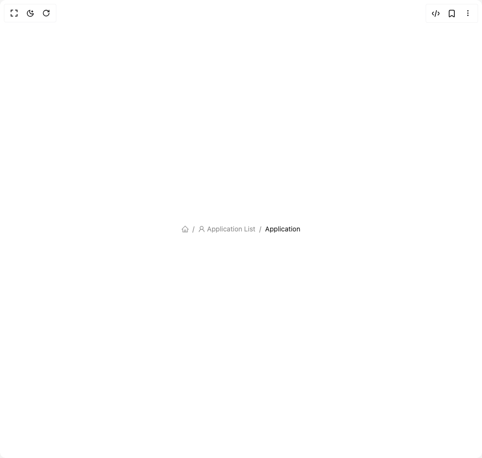

# Build Breadcrumb in BuilderStudio

> Build this component in our Agentic IDE: [BuilderStudio](https://builderstudio.dev).
>
> Join the BuilderStudio community on [Discord](https://discord.gg/QdWeSGCqfe) and [Reddit](https://reddit.com/r/builderstudio).



## Component

- Author group: `antdesign`
- Component: `breadcrumb`
- Variant: `breadcrumb-with-icon`
- Rendered HTML snapshot: [`rendered.html`](rendered.html)

## BuilderStudio prompt

You are implementing a React component based on a component reference.

## Component identity

- Author: antdesign
- Component slug: breadcrumb
- Demo slug: breadcrumb-with-icon
- Title: breadcrumb
- Description: 

## Goal

Recreate this component in a React + TypeScript + Tailwind CSS project. Preserve the visual layout, spacing, colors, border radius, shadows, interaction behavior, animation behavior, responsive behavior, and dark mode behavior shown in the rendered demo.

## Implementation requirements

- Use React and TypeScript.
- Use Tailwind CSS classes whenever possible.
- Keep the component self-contained unless the source files require helper components.
- If the source uses CSS variables, custom CSS, animations, or keyframes, include them.
- If the source uses external packages, list and use the required packages.
- Preserve accessibility attributes, button semantics, links, keyboard behavior, and ARIA attributes when visible in the source.
- Do not replace the component with a simplified placeholder.
- Return complete production-ready code.

## Dependencies

No reference metadata available.

## Rendered DOM snapshot

This is the rendered demo HTML extracted from the live preview. Use it to verify structure, class names, visible content, and layout.

```html
<div id="root"><div class="w-screen min-h-screen flex justify-center items-center"><div class="w-screen min-h-screen flex justify-center items-center"><nav class="ant-breadcrumb css-xepvsj"><ol><li><a class="ant-breadcrumb-link" href=""><span role="img" aria-label="home" class="anticon anticon-home"><svg viewBox="64 64 896 896" focusable="false" data-icon="home" width="1em" height="1em" fill="currentColor" aria-hidden="true"><path d="M946.5 505L560.1 118.8l-25.9-25.9a31.5 31.5 0 00-44.4 0L77.5 505a63.9 63.9 0 00-18.8 46c.4 35.2 29.7 63.3 64.9 63.3h42.5V940h691.8V614.3h43.4c17.1 0 33.2-6.7 45.3-18.8a63.6 63.6 0 0018.7-45.3c0-17-6.7-33.1-18.8-45.2zM568 868H456V664h112v204zm217.9-325.7V868H632V640c0-22.1-17.9-40-40-40H432c-22.1 0-40 17.9-40 40v228H238.1V542.3h-96l370-369.7 23.1 23.1L882 542.3h-96.1z"></path></svg></span></a></li><li class="ant-breadcrumb-separator" aria-hidden="true">/</li><li><a class="ant-breadcrumb-link" href=""><span role="img" aria-label="user" class="anticon anticon-user"><svg viewBox="64 64 896 896" focusable="false" data-icon="user" width="1em" height="1em" fill="currentColor" aria-hidden="true"><path d="M858.5 763.6a374 374 0 00-80.6-119.5 375.63 375.63 0 00-119.5-80.6c-.4-.2-.8-.3-1.2-.5C719.5 518 760 444.7 760 362c0-137-111-248-248-248S264 225 264 362c0 82.7 40.5 156 102.8 201.1-.4.2-.8.3-1.2.5-44.8 18.9-85 46-119.5 80.6a375.63 375.63 0 00-80.6 119.5A371.7 371.7 0 00136 901.8a8 8 0 008 8.2h60c4.4 0 7.9-3.5 8-7.8 2-77.2 33-149.5 87.8-204.3 56.7-56.7 132-87.9 212.2-87.9s155.5 31.2 212.2 87.9C779 752.7 810 825 812 902.2c.1 4.4 3.6 7.8 8 7.8h60a8 8 0 008-8.2c-1-47.8-10.9-94.3-29.5-138.2zM512 534c-45.9 0-89.1-17.9-121.6-50.4S340 407.9 340 362c0-45.9 17.9-89.1 50.4-121.6S466.1 190 512 190s89.1 17.9 121.6 50.4S684 316.1 684 362c0 45.9-17.9 89.1-50.4 121.6S557.9 534 512 534z"></path></svg></span><span>Application List</span></a></li><li class="ant-breadcrumb-separator" aria-hidden="true">/</li><li><span class="ant-breadcrumb-link">Application</span></li></ol></nav></div></div></div>
```

## Reference source files

No reference source files were available.
