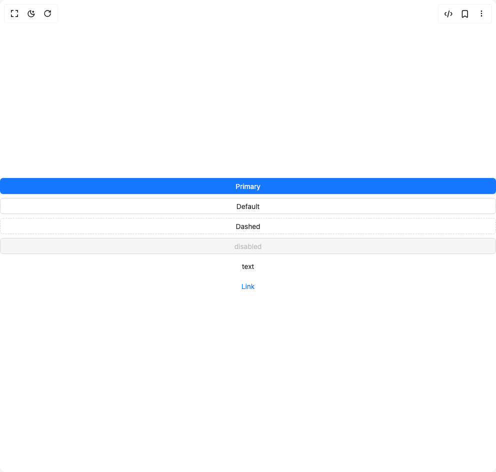

# Build Button Ant in BuilderStudio

> Build this component in our Agentic IDE: [BuilderStudio](https://builderstudio.dev).
>
> Join the BuilderStudio community on [Discord](https://discord.gg/QdWeSGCqfe) and [Reddit](https://reddit.com/r/builderstudio).



## Component

- Author group: `antdesign`
- Component: `button-ant`
- Variant: `block-button`
- Rendered HTML snapshot: [`rendered.html`](rendered.html)

## BuilderStudio prompt

You are implementing a React component based on a component reference.

## Component identity

- Author: antdesign
- Component slug: button-ant
- Demo slug: block-button
- Title: button-ant
- Description: 

## Goal

Recreate this component in a React + TypeScript + Tailwind CSS project. Preserve the visual layout, spacing, colors, border radius, shadows, interaction behavior, animation behavior, responsive behavior, and dark mode behavior shown in the rendered demo.

## Implementation requirements

- Use React and TypeScript.
- Use Tailwind CSS classes whenever possible.
- Keep the component self-contained unless the source files require helper components.
- If the source uses CSS variables, custom CSS, animations, or keyframes, include them.
- If the source uses external packages, list and use the required packages.
- Preserve accessibility attributes, button semantics, links, keyboard behavior, and ARIA attributes when visible in the source.
- Do not replace the component with a simplified placeholder.
- Return complete production-ready code.

## Dependencies

No reference metadata available.

## Rendered DOM snapshot

This is the rendered demo HTML extracted from the live preview. Use it to verify structure, class names, visible content, and layout.

```html
<div id="root"><div class="w-screen min-h-screen flex justify-center items-center"><div class="w-screen min-h-screen flex justify-center items-center"><div class="ant-flex css-xepvsj ant-flex-align-stretch ant-flex-gap-small ant-flex-vertical" style="width: 100%;"><button type="button" class="ant-btn css-xepvsj ant-btn-primary ant-btn-color-primary ant-btn-variant-solid ant-btn-block"><span>Primary</span></button><button type="button" class="ant-btn css-xepvsj ant-btn-default ant-btn-color-default ant-btn-variant-outlined ant-btn-block"><span>Default</span></button><button type="button" class="ant-btn css-xepvsj ant-btn-dashed ant-btn-color-default ant-btn-variant-dashed ant-btn-block"><span>Dashed</span></button><button type="button" class="ant-btn css-xepvsj ant-btn-default ant-btn-color-default ant-btn-variant-outlined ant-btn-block" disabled=""><span>disabled</span></button><button type="button" class="ant-btn css-xepvsj ant-btn-text ant-btn-color-default ant-btn-variant-text ant-btn-block"><span>text</span></button><button type="button" class="ant-btn css-xepvsj ant-btn-link ant-btn-color-link ant-btn-variant-link ant-btn-block"><span>Link</span></button></div></div></div></div>
```

## Reference source files

No reference source files were available.
