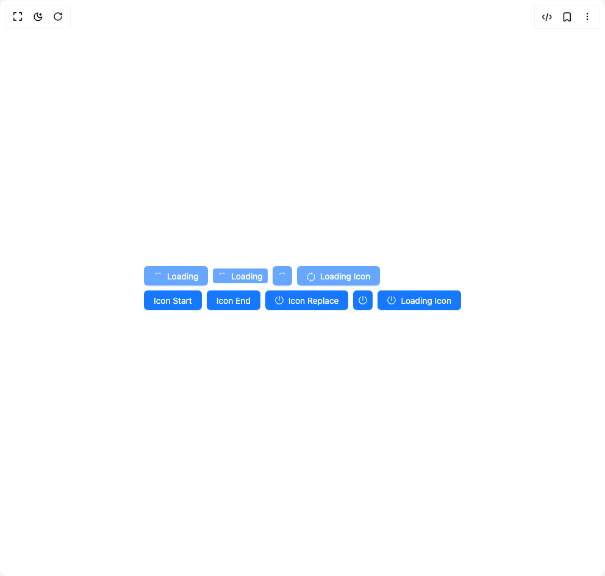

# Build Button Ant in BuilderStudio

> Build this component in our Agentic IDE: [BuilderStudio](https://builderstudio.dev).
>
> Join the BuilderStudio community on [Discord](https://discord.gg/QdWeSGCqfe) and [Reddit](https://reddit.com/r/builderstudio).



## Component

- Author group: `antdesign`
- Component: `button-ant`
- Variant: `button-loading`
- Rendered HTML snapshot: [`rendered.html`](rendered.html)

## BuilderStudio prompt

You are implementing a React component based on a component reference.

## Component identity

- Author: antdesign
- Component slug: button-ant
- Demo slug: button-loading
- Title: button-ant
- Description: 

## Goal

Recreate this component in a React + TypeScript + Tailwind CSS project. Preserve the visual layout, spacing, colors, border radius, shadows, interaction behavior, animation behavior, responsive behavior, and dark mode behavior shown in the rendered demo.

## Implementation requirements

- Use React and TypeScript.
- Use Tailwind CSS classes whenever possible.
- Keep the component self-contained unless the source files require helper components.
- If the source uses CSS variables, custom CSS, animations, or keyframes, include them.
- If the source uses external packages, list and use the required packages.
- Preserve accessibility attributes, button semantics, links, keyboard behavior, and ARIA attributes when visible in the source.
- Do not replace the component with a simplified placeholder.
- Return complete production-ready code.

## Dependencies

No reference metadata available.

## Rendered DOM snapshot

This is the rendered demo HTML extracted from the live preview. Use it to verify structure, class names, visible content, and layout.

```html
<div id="root"><div class="w-screen min-h-screen flex justify-center items-center"><div class="w-screen min-h-screen flex justify-center items-center"><div class="ant-flex css-xepvsj ant-flex-align-stretch ant-flex-gap-small ant-flex-vertical"><div class="ant-flex css-xepvsj ant-flex-wrap-wrap ant-flex-align-center ant-flex-gap-small"><button type="button" class="ant-btn css-xepvsj ant-btn-primary ant-btn-color-primary ant-btn-variant-solid ant-btn-loading"><span class="ant-btn-icon ant-btn-loading-icon"><span role="img" aria-label="loading" class="anticon anticon-loading anticon-spin"><svg viewBox="0 0 1024 1024" focusable="false" data-icon="loading" width="1em" height="1em" fill="currentColor" aria-hidden="true"><path d="M988 548c-19.9 0-36-16.1-36-36 0-59.4-11.6-117-34.6-171.3a440.45 440.45 0 00-94.3-139.9 437.71 437.71 0 00-139.9-94.3C629 83.6 571.4 72 512 72c-19.9 0-36-16.1-36-36s16.1-36 36-36c69.1 0 136.2 13.5 199.3 40.3C772.3 66 827 103 874 150c47 47 83.9 101.8 109.7 162.7 26.7 63.1 40.2 130.2 40.2 199.3.1 19.9-16 36-35.9 36z"></path></svg></span></span><span>Loading</span></button><button type="button" class="ant-btn css-xepvsj ant-btn-primary ant-btn-color-primary ant-btn-variant-solid ant-btn-sm ant-btn-loading"><span class="ant-btn-icon ant-btn-loading-icon"><span role="img" aria-label="loading" class="anticon anticon-loading anticon-spin"><svg viewBox="0 0 1024 1024" focusable="false" data-icon="loading" width="1em" height="1em" fill="currentColor" aria-hidden="true"><path d="M988 548c-19.9 0-36-16.1-36-36 0-59.4-11.6-117-34.6-171.3a440.45 440.45 0 00-94.3-139.9 437.71 437.71 0 00-139.9-94.3C629 83.6 571.4 72 512 72c-19.9 0-36-16.1-36-36s16.1-36 36-36c69.1 0 136.2 13.5 199.3 40.3C772.3 66 827 103 874 150c47 47 83.9 101.8 109.7 162.7 26.7 63.1 40.2 130.2 40.2 199.3.1 19.9-16 36-35.9 36z"></path></svg></span></span><span>Loading</span></button><button type="button" class="ant-btn css-xepvsj ant-btn-primary ant-btn-color-primary ant-btn-variant-solid ant-btn-icon-only ant-btn-loading"><span class="ant-btn-icon ant-btn-loading-icon"><span role="img" aria-label="loading" class="anticon anticon-loading anticon-spin"><svg viewBox="0 0 1024 1024" focusable="false" data-icon="loading" width="1em" height="1em" fill="currentColor" aria-hidden="true"><path d="M988 548c-19.9 0-36-16.1-36-36 0-59.4-11.6-117-34.6-171.3a440.45 440.45 0 00-94.3-139.9 437.71 437.71 0 00-139.9-94.3C629 83.6 571.4 72 512 72c-19.9 0-36-16.1-36-36s16.1-36 36-36c69.1 0 136.2 13.5 199.3 40.3C772.3 66 827 103 874 150c47 47 83.9 101.8 109.7 162.7 26.7 63.1 40.2 130.2 40.2 199.3.1 19.9-16 36-35.9 36z"></path></svg></span></span></button><button type="button" class="ant-btn css-xepvsj ant-btn-primary ant-btn-color-primary ant-btn-variant-solid ant-btn-loading"><span class="ant-btn-icon"><span role="img" aria-label="sync" class="anticon anticon-sync anticon-spin"><svg viewBox="64 64 896 896" focusable="false" data-icon="sync" width="1em" height="1em" fill="currentColor" aria-hidden="true"><path d="M168 504.2c1-43.7 10-86.1 26.9-126 17.3-41 42.1-77.7 73.7-109.4S337 212.3 378 195c42.4-17.9 87.4-27 133.9-27s91.5 9.1 133.8 27A341.5 341.5 0 01755 268.8c9.9 9.9 19.2 20.4 27.8 31.4l-60.2 47a8 8 0 003 14.1l175.7 43c5 1.2 9.9-2.6 9.9-7.7l.8-180.9c0-6.7-7.7-10.5-12.9-6.3l-56.4 44.1C765.8 155.1 646.2 92 511.8 92 282.7 92 96.3 275.6 92 503.8a8 8 0 008 8.2h60c4.4 0 7.9-3.5 8-7.8zm756 7.8h-60c-4.4 0-7.9 3.5-8 7.8-1 43.7-10 86.1-26.9 126-17.3 41-42.1 77.8-73.7 109.4A342.45 342.45 0 01512.1 856a342.24 342.24 0 01-243.2-100.8c-9.9-9.9-19.2-20.4-27.8-31.4l60.2-47a8 8 0 00-3-14.1l-175.7-43c-5-1.2-9.9 2.6-9.9 7.7l-.7 181c0 6.7 7.7 10.5 12.9 6.3l56.4-44.1C258.2 868.9 377.8 932 512.2 932c229.2 0 415.5-183.7 419.8-411.8a8 8 0 00-8-8.2z"></path></svg></span></span><span>Loading Icon</span></button></div><div class="ant-flex css-xepvsj ant-flex-wrap-wrap ant-flex-gap-small"><button type="button" class="ant-btn css-xepvsj ant-btn-primary ant-btn-color-primary ant-btn-variant-solid"><span>Icon Start</span></button><button type="button" class="ant-btn css-xepvsj ant-btn-primary ant-btn-color-primary ant-btn-variant-solid ant-btn-icon-end"><span>Icon End</span></button><button type="button" class="ant-btn css-xepvsj ant-btn-primary ant-btn-color-primary ant-btn-variant-solid"><span class="ant-btn-icon"><span role="img" aria-label="poweroff" class="anticon anticon-poweroff"><svg viewBox="64 64 896 896" focusable="false" data-icon="poweroff" width="1em" height="1em" fill="currentColor" aria-hidden="true"><path d="M705.6 124.9a8 8 0 00-11.6 7.2v64.2c0 5.5 2.9 10.6 7.5 13.6a352.2 352.2 0 0162.2 49.8c32.7 32.8 58.4 70.9 76.3 113.3a355 355 0 0127.9 138.7c0 48.1-9.4 94.8-27.9 138.7a355.92 355.92 0 01-76.3 113.3 353.06 353.06 0 01-113.2 76.4c-43.8 18.6-90.5 28-138.5 28s-94.7-9.4-138.5-28a353.06 353.06 0 01-113.2-76.4A355.92 355.92 0 01184 650.4a355 355 0 01-27.9-138.7c0-48.1 9.4-94.8 27.9-138.7 17.9-42.4 43.6-80.5 76.3-113.3 19-19 39.8-35.6 62.2-49.8 4.7-2.9 7.5-8.1 7.5-13.6V132c0-6-6.3-9.8-11.6-7.2C178.5 195.2 82 339.3 80 506.3 77.2 745.1 272.5 943.5 511.2 944c239 .5 432.8-193.3 432.8-432.4 0-169.2-97-315.7-238.4-386.7zM480 560h64c4.4 0 8-3.6 8-8V88c0-4.4-3.6-8-8-8h-64c-4.4 0-8 3.6-8 8v464c0 4.4 3.6 8 8 8z"></path></svg></span></span><span>Icon Replace</span></button><button type="button" class="ant-btn css-xepvsj ant-btn-primary ant-btn-color-primary ant-btn-variant-solid ant-btn-icon-only"><span class="ant-btn-icon"><span role="img" aria-label="poweroff" class="anticon anticon-poweroff"><svg viewBox="64 64 896 896" focusable="false" data-icon="poweroff" width="1em" height="1em" fill="currentColor" aria-hidden="true"><path d="M705.6 124.9a8 8 0 00-11.6 7.2v64.2c0 5.5 2.9 10.6 7.5 13.6a352.2 352.2 0 0162.2 49.8c32.7 32.8 58.4 70.9 76.3 113.3a355 355 0 0127.9 138.7c0 48.1-9.4 94.8-27.9 138.7a355.92 355.92 0 01-76.3 113.3 353.06 353.06 0 01-113.2 76.4c-43.8 18.6-90.5 28-138.5 28s-94.7-9.4-138.5-28a353.06 353.06 0 01-113.2-76.4A355.92 355.92 0 01184 650.4a355 355 0 01-27.9-138.7c0-48.1 9.4-94.8 27.9-138.7 17.9-42.4 43.6-80.5 76.3-113.3 19-19 39.8-35.6 62.2-49.8 4.7-2.9 7.5-8.1 7.5-13.6V132c0-6-6.3-9.8-11.6-7.2C178.5 195.2 82 339.3 80 506.3 77.2 745.1 272.5 943.5 511.2 944c239 .5 432.8-193.3 432.8-432.4 0-169.2-97-315.7-238.4-386.7zM480 560h64c4.4 0 8-3.6 8-8V88c0-4.4-3.6-8-8-8h-64c-4.4 0-8 3.6-8 8v464c0 4.4 3.6 8 8 8z"></path></svg></span></span></button><button type="button" class="ant-btn css-xepvsj ant-btn-primary ant-btn-color-primary ant-btn-variant-solid"><span class="ant-btn-icon"><span role="img" aria-label="poweroff" class="anticon anticon-poweroff"><svg viewBox="64 64 896 896" focusable="false" data-icon="poweroff" width="1em" height="1em" fill="currentColor" aria-hidden="true"><path d="M705.6 124.9a8 8 0 00-11.6 7.2v64.2c0 5.5 2.9 10.6 7.5 13.6a352.2 352.2 0 0162.2 49.8c32.7 32.8 58.4 70.9 76.3 113.3a355 355 0 0127.9 138.7c0 48.1-9.4 94.8-27.9 138.7a355.92 355.92 0 01-76.3 113.3 353.06 353.06 0 01-113.2 76.4c-43.8 18.6-90.5 28-138.5 28s-94.7-9.4-138.5-28a353.06 353.06 0 01-113.2-76.4A355.92 355.92 0 01184 650.4a355 355 0 01-27.9-138.7c0-48.1 9.4-94.8 27.9-138.7 17.9-42.4 43.6-80.5 76.3-113.3 19-19 39.8-35.6 62.2-49.8 4.7-2.9 7.5-8.1 7.5-13.6V132c0-6-6.3-9.8-11.6-7.2C178.5 195.2 82 339.3 80 506.3 77.2 745.1 272.5 943.5 511.2 944c239 .5 432.8-193.3 432.8-432.4 0-169.2-97-315.7-238.4-386.7zM480 560h64c4.4 0 8-3.6 8-8V88c0-4.4-3.6-8-8-8h-64c-4.4 0-8 3.6-8 8v464c0 4.4 3.6 8 8 8z"></path></svg></span></span><span>Loading Icon</span></button></div></div></div></div></div>
```

## Reference source files

No reference source files were available.
