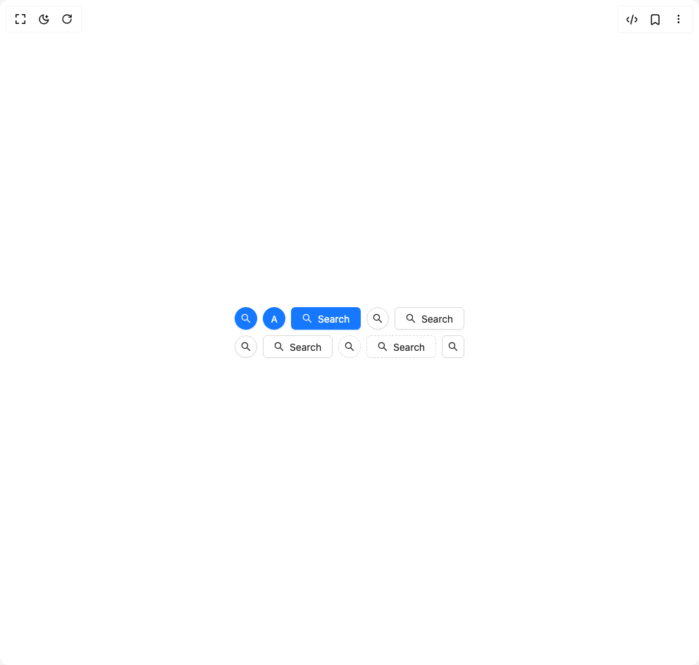

# Build Button Ant in BuilderStudio

> Build this component in our Agentic IDE: [BuilderStudio](https://builderstudio.dev).
>
> Join the BuilderStudio community on [Discord](https://discord.gg/QdWeSGCqfe) and [Reddit](https://reddit.com/r/builderstudio).



## Component

- Author group: `antdesign`
- Component: `button-ant`
- Variant: `button-with-icon`
- Rendered HTML snapshot: [`rendered.html`](rendered.html)

## BuilderStudio prompt

You are implementing a React component based on a component reference.

## Component identity

- Author: antdesign
- Component slug: button-ant
- Demo slug: button-with-icon
- Title: button-ant
- Description: 

## Goal

Recreate this component in a React + TypeScript + Tailwind CSS project. Preserve the visual layout, spacing, colors, border radius, shadows, interaction behavior, animation behavior, responsive behavior, and dark mode behavior shown in the rendered demo.

## Implementation requirements

- Use React and TypeScript.
- Use Tailwind CSS classes whenever possible.
- Keep the component self-contained unless the source files require helper components.
- If the source uses CSS variables, custom CSS, animations, or keyframes, include them.
- If the source uses external packages, list and use the required packages.
- Preserve accessibility attributes, button semantics, links, keyboard behavior, and ARIA attributes when visible in the source.
- Do not replace the component with a simplified placeholder.
- Return complete production-ready code.

## Dependencies

No reference metadata available.

## Rendered DOM snapshot

This is the rendered demo HTML extracted from the live preview. Use it to verify structure, class names, visible content, and layout.

```html
<div id="root"><div class="w-screen min-h-screen flex justify-center items-center"><div class="w-screen min-h-screen flex justify-center items-center"><div class="ant-flex css-xepvsj ant-flex-align-stretch ant-flex-gap-small ant-flex-vertical"><div class="ant-flex css-xepvsj ant-flex-wrap-wrap ant-flex-gap-small"><button aria-describedby="«r0»" type="button" class="ant-btn css-xepvsj ant-btn-circle ant-btn-primary ant-btn-color-primary ant-btn-variant-solid ant-btn-icon-only"><span class="ant-btn-icon"><span role="img" aria-label="search" class="anticon anticon-search"><svg viewBox="64 64 896 896" focusable="false" data-icon="search" width="1em" height="1em" fill="currentColor" aria-hidden="true"><path d="M909.6 854.5L649.9 594.8C690.2 542.7 712 479 712 412c0-80.2-31.3-155.4-87.9-212.1-56.6-56.7-132-87.9-212.1-87.9s-155.5 31.3-212.1 87.9C143.2 256.5 112 331.8 112 412c0 80.1 31.3 155.5 87.9 212.1C256.5 680.8 331.8 712 412 712c67 0 130.6-21.8 182.7-62l259.7 259.6a8.2 8.2 0 0011.6 0l43.6-43.5a8.2 8.2 0 000-11.6zM570.4 570.4C528 612.7 471.8 636 412 636s-116-23.3-158.4-65.6C211.3 528 188 471.8 188 412s23.3-116.1 65.6-158.4C296 211.3 352.2 188 412 188s116.1 23.2 158.4 65.6S636 352.2 636 412s-23.3 116.1-65.6 158.4z"></path></svg></span></span></button><button type="button" class="ant-btn css-xepvsj ant-btn-circle ant-btn-primary ant-btn-color-primary ant-btn-variant-solid"><span>A</span></button><button type="button" class="ant-btn css-xepvsj ant-btn-primary ant-btn-color-primary ant-btn-variant-solid"><span class="ant-btn-icon"><span role="img" aria-label="search" class="anticon anticon-search"><svg viewBox="64 64 896 896" focusable="false" data-icon="search" width="1em" height="1em" fill="currentColor" aria-hidden="true"><path d="M909.6 854.5L649.9 594.8C690.2 542.7 712 479 712 412c0-80.2-31.3-155.4-87.9-212.1-56.6-56.7-132-87.9-212.1-87.9s-155.5 31.3-212.1 87.9C143.2 256.5 112 331.8 112 412c0 80.1 31.3 155.5 87.9 212.1C256.5 680.8 331.8 712 412 712c67 0 130.6-21.8 182.7-62l259.7 259.6a8.2 8.2 0 0011.6 0l43.6-43.5a8.2 8.2 0 000-11.6zM570.4 570.4C528 612.7 471.8 636 412 636s-116-23.3-158.4-65.6C211.3 528 188 471.8 188 412s23.3-116.1 65.6-158.4C296 211.3 352.2 188 412 188s116.1 23.2 158.4 65.6S636 352.2 636 412s-23.3 116.1-65.6 158.4z"></path></svg></span></span><span>Search</span></button><button aria-describedby="«r2»" type="button" class="ant-btn css-xepvsj ant-btn-circle ant-btn-default ant-btn-color-default ant-btn-variant-outlined ant-btn-icon-only"><span class="ant-btn-icon"><span role="img" aria-label="search" class="anticon anticon-search"><svg viewBox="64 64 896 896" focusable="false" data-icon="search" width="1em" height="1em" fill="currentColor" aria-hidden="true"><path d="M909.6 854.5L649.9 594.8C690.2 542.7 712 479 712 412c0-80.2-31.3-155.4-87.9-212.1-56.6-56.7-132-87.9-212.1-87.9s-155.5 31.3-212.1 87.9C143.2 256.5 112 331.8 112 412c0 80.1 31.3 155.5 87.9 212.1C256.5 680.8 331.8 712 412 712c67 0 130.6-21.8 182.7-62l259.7 259.6a8.2 8.2 0 0011.6 0l43.6-43.5a8.2 8.2 0 000-11.6zM570.4 570.4C528 612.7 471.8 636 412 636s-116-23.3-158.4-65.6C211.3 528 188 471.8 188 412s23.3-116.1 65.6-158.4C296 211.3 352.2 188 412 188s116.1 23.2 158.4 65.6S636 352.2 636 412s-23.3 116.1-65.6 158.4z"></path></svg></span></span></button><button type="button" class="ant-btn css-xepvsj ant-btn-default ant-btn-color-default ant-btn-variant-outlined"><span class="ant-btn-icon"><span role="img" aria-label="search" class="anticon anticon-search"><svg viewBox="64 64 896 896" focusable="false" data-icon="search" width="1em" height="1em" fill="currentColor" aria-hidden="true"><path d="M909.6 854.5L649.9 594.8C690.2 542.7 712 479 712 412c0-80.2-31.3-155.4-87.9-212.1-56.6-56.7-132-87.9-212.1-87.9s-155.5 31.3-212.1 87.9C143.2 256.5 112 331.8 112 412c0 80.1 31.3 155.5 87.9 212.1C256.5 680.8 331.8 712 412 712c67 0 130.6-21.8 182.7-62l259.7 259.6a8.2 8.2 0 0011.6 0l43.6-43.5a8.2 8.2 0 000-11.6zM570.4 570.4C528 612.7 471.8 636 412 636s-116-23.3-158.4-65.6C211.3 528 188 471.8 188 412s23.3-116.1 65.6-158.4C296 211.3 352.2 188 412 188s116.1 23.2 158.4 65.6S636 352.2 636 412s-23.3 116.1-65.6 158.4z"></path></svg></span></span><span>Search</span></button></div><div class="ant-flex css-xepvsj ant-flex-wrap-wrap ant-flex-gap-small"><button aria-describedby="«r4»" type="button" class="ant-btn css-xepvsj ant-btn-circle ant-btn-default ant-btn-color-default ant-btn-variant-outlined ant-btn-icon-only"><span class="ant-btn-icon"><span role="img" aria-label="search" class="anticon anticon-search"><svg viewBox="64 64 896 896" focusable="false" data-icon="search" width="1em" height="1em" fill="currentColor" aria-hidden="true"><path d="M909.6 854.5L649.9 594.8C690.2 542.7 712 479 712 412c0-80.2-31.3-155.4-87.9-212.1-56.6-56.7-132-87.9-212.1-87.9s-155.5 31.3-212.1 87.9C143.2 256.5 112 331.8 112 412c0 80.1 31.3 155.5 87.9 212.1C256.5 680.8 331.8 712 412 712c67 0 130.6-21.8 182.7-62l259.7 259.6a8.2 8.2 0 0011.6 0l43.6-43.5a8.2 8.2 0 000-11.6zM570.4 570.4C528 612.7 471.8 636 412 636s-116-23.3-158.4-65.6C211.3 528 188 471.8 188 412s23.3-116.1 65.6-158.4C296 211.3 352.2 188 412 188s116.1 23.2 158.4 65.6S636 352.2 636 412s-23.3 116.1-65.6 158.4z"></path></svg></span></span></button><button type="button" class="ant-btn css-xepvsj ant-btn-default ant-btn-color-default ant-btn-variant-outlined"><span class="ant-btn-icon"><span role="img" aria-label="search" class="anticon anticon-search"><svg viewBox="64 64 896 896" focusable="false" data-icon="search" width="1em" height="1em" fill="currentColor" aria-hidden="true"><path d="M909.6 854.5L649.9 594.8C690.2 542.7 712 479 712 412c0-80.2-31.3-155.4-87.9-212.1-56.6-56.7-132-87.9-212.1-87.9s-155.5 31.3-212.1 87.9C143.2 256.5 112 331.8 112 412c0 80.1 31.3 155.5 87.9 212.1C256.5 680.8 331.8 712 412 712c67 0 130.6-21.8 182.7-62l259.7 259.6a8.2 8.2 0 0011.6 0l43.6-43.5a8.2 8.2 0 000-11.6zM570.4 570.4C528 612.7 471.8 636 412 636s-116-23.3-158.4-65.6C211.3 528 188 471.8 188 412s23.3-116.1 65.6-158.4C296 211.3 352.2 188 412 188s116.1 23.2 158.4 65.6S636 352.2 636 412s-23.3 116.1-65.6 158.4z"></path></svg></span></span><span>Search</span></button><button aria-describedby="«r6»" type="button" class="ant-btn css-xepvsj ant-btn-circle ant-btn-dashed ant-btn-color-default ant-btn-variant-dashed ant-btn-icon-only"><span class="ant-btn-icon"><span role="img" aria-label="search" class="anticon anticon-search"><svg viewBox="64 64 896 896" focusable="false" data-icon="search" width="1em" height="1em" fill="currentColor" aria-hidden="true"><path d="M909.6 854.5L649.9 594.8C690.2 542.7 712 479 712 412c0-80.2-31.3-155.4-87.9-212.1-56.6-56.7-132-87.9-212.1-87.9s-155.5 31.3-212.1 87.9C143.2 256.5 112 331.8 112 412c0 80.1 31.3 155.5 87.9 212.1C256.5 680.8 331.8 712 412 712c67 0 130.6-21.8 182.7-62l259.7 259.6a8.2 8.2 0 0011.6 0l43.6-43.5a8.2 8.2 0 000-11.6zM570.4 570.4C528 612.7 471.8 636 412 636s-116-23.3-158.4-65.6C211.3 528 188 471.8 188 412s23.3-116.1 65.6-158.4C296 211.3 352.2 188 412 188s116.1 23.2 158.4 65.6S636 352.2 636 412s-23.3 116.1-65.6 158.4z"></path></svg></span></span></button><button type="button" class="ant-btn css-xepvsj ant-btn-dashed ant-btn-color-default ant-btn-variant-dashed"><span class="ant-btn-icon"><span role="img" aria-label="search" class="anticon anticon-search"><svg viewBox="64 64 896 896" focusable="false" data-icon="search" width="1em" height="1em" fill="currentColor" aria-hidden="true"><path d="M909.6 854.5L649.9 594.8C690.2 542.7 712 479 712 412c0-80.2-31.3-155.4-87.9-212.1-56.6-56.7-132-87.9-212.1-87.9s-155.5 31.3-212.1 87.9C143.2 256.5 112 331.8 112 412c0 80.1 31.3 155.5 87.9 212.1C256.5 680.8 331.8 712 412 712c67 0 130.6-21.8 182.7-62l259.7 259.6a8.2 8.2 0 0011.6 0l43.6-43.5a8.2 8.2 0 000-11.6zM570.4 570.4C528 612.7 471.8 636 412 636s-116-23.3-158.4-65.6C211.3 528 188 471.8 188 412s23.3-116.1 65.6-158.4C296 211.3 352.2 188 412 188s116.1 23.2 158.4 65.6S636 352.2 636 412s-23.3 116.1-65.6 158.4z"></path></svg></span></span><span>Search</span></button><a href="https://www.google.com" target="_blank" class="ant-btn css-xepvsj ant-btn-default ant-btn-color-default ant-btn-variant-outlined ant-btn-icon-only" tabindex="0" aria-disabled="false"><span class="ant-btn-icon"><span role="img" aria-label="search" class="anticon anticon-search"><svg viewBox="64 64 896 896" focusable="false" data-icon="search" width="1em" height="1em" fill="currentColor" aria-hidden="true"><path d="M909.6 854.5L649.9 594.8C690.2 542.7 712 479 712 412c0-80.2-31.3-155.4-87.9-212.1-56.6-56.7-132-87.9-212.1-87.9s-155.5 31.3-212.1 87.9C143.2 256.5 112 331.8 112 412c0 80.1 31.3 155.5 87.9 212.1C256.5 680.8 331.8 712 412 712c67 0 130.6-21.8 182.7-62l259.7 259.6a8.2 8.2 0 0011.6 0l43.6-43.5a8.2 8.2 0 000-11.6zM570.4 570.4C528 612.7 471.8 636 412 636s-116-23.3-158.4-65.6C211.3 528 188 471.8 188 412s23.3-116.1 65.6-158.4C296 211.3 352.2 188 412 188s116.1 23.2 158.4 65.6S636 352.2 636 412s-23.3 116.1-65.6 158.4z"></path></svg></span></span></a></div></div></div></div></div>
```

## Reference source files

No reference source files were available.
