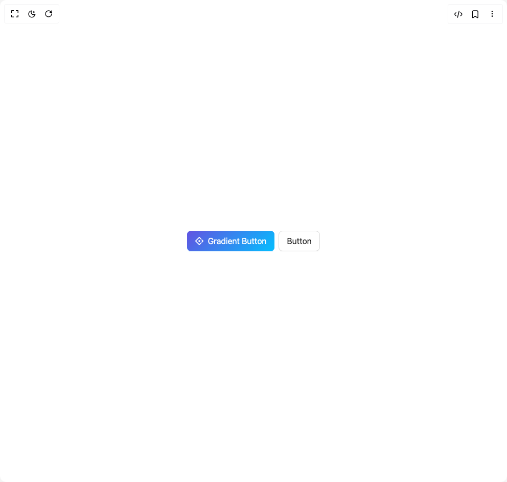

# Build Button Ant in BuilderStudio

> Build this component in our Agentic IDE: [BuilderStudio](https://builderstudio.dev).
>
> Join the BuilderStudio community on [Discord](https://discord.gg/QdWeSGCqfe) and [Reddit](https://reddit.com/r/builderstudio).



## Component

- Author group: `antdesign`
- Component: `button-ant`
- Variant: `gradient-button`
- Rendered HTML snapshot: [`rendered.html`](rendered.html)

## BuilderStudio prompt

You are implementing a React component based on a component reference.

## Component identity

- Author: antdesign
- Component slug: button-ant
- Demo slug: gradient-button
- Title: button-ant
- Description: 

## Goal

Recreate this component in a React + TypeScript + Tailwind CSS project. Preserve the visual layout, spacing, colors, border radius, shadows, interaction behavior, animation behavior, responsive behavior, and dark mode behavior shown in the rendered demo.

## Implementation requirements

- Use React and TypeScript.
- Use Tailwind CSS classes whenever possible.
- Keep the component self-contained unless the source files require helper components.
- If the source uses CSS variables, custom CSS, animations, or keyframes, include them.
- If the source uses external packages, list and use the required packages.
- Preserve accessibility attributes, button semantics, links, keyboard behavior, and ARIA attributes when visible in the source.
- Do not replace the component with a simplified placeholder.
- Return complete production-ready code.

## Dependencies

No reference metadata available.

## Rendered DOM snapshot

This is the rendered demo HTML extracted from the live preview. Use it to verify structure, class names, visible content, and layout.

```html
<div id="root"><div class="w-screen min-h-screen flex justify-center items-center"><div class="w-screen min-h-screen flex justify-center items-center"><div class="ant-space css-xepvsj ant-space-horizontal ant-space-align-center ant-space-gap-row-small ant-space-gap-col-small"><div class="ant-space-item"><button type="button" class="ant-btn css-xepvsj ant-btn-primary ant-btn-color-primary ant-btn-variant-solid ant-btn-lg acss-wkbm77"><span class="ant-btn-icon"><span role="img" aria-label="ant-design" class="anticon anticon-ant-design"><svg viewBox="64 64 896 896" focusable="false" data-icon="ant-design" width="1em" height="1em" fill="currentColor" aria-hidden="true"><path d="M716.3 313.8c19-18.9 19-49.7 0-68.6l-69.9-69.9.1.1c-18.5-18.5-50.3-50.3-95.3-95.2-21.2-20.7-55.5-20.5-76.5.5L80.9 474.2a53.84 53.84 0 000 76.4L474.6 944a54.14 54.14 0 0076.5 0l165.1-165c19-18.9 19-49.7 0-68.6a48.7 48.7 0 00-68.7 0l-125 125.2c-5.2 5.2-13.3 5.2-18.5 0L189.5 521.4c-5.2-5.2-5.2-13.3 0-18.5l314.4-314.2c.4-.4.9-.7 1.3-1.1 5.2-4.1 12.4-3.7 17.2 1.1l125.2 125.1c19 19 49.8 19 68.7 0zM408.6 514.4a106.3 106.2 0 10212.6 0 106.3 106.2 0 10-212.6 0zm536.2-38.6L821.9 353.5c-19-18.9-49.8-18.9-68.7.1a48.4 48.4 0 000 68.6l83 82.9c5.2 5.2 5.2 13.3 0 18.5l-81.8 81.7a48.4 48.4 0 000 68.6 48.7 48.7 0 0068.7 0l121.8-121.7a53.93 53.93 0 00-.1-76.4z"></path></svg></span></span><span>Gradient Button</span></button></div><div class="ant-space-item"><button type="button" class="ant-btn css-xepvsj ant-btn-default ant-btn-color-default ant-btn-variant-outlined ant-btn-lg acss-wkbm77"><span>Button</span></button></div></div></div></div></div>
```

## Reference source files

No reference source files were available.
