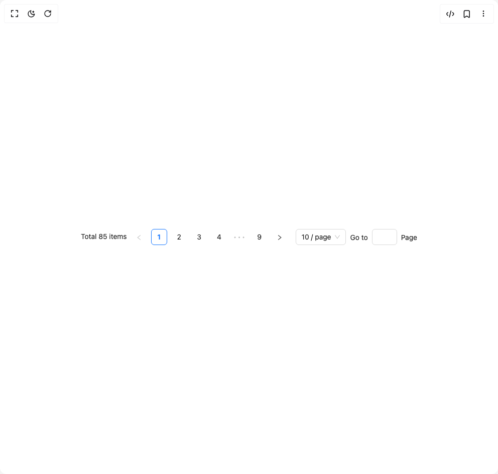

# Build Pagination Ant in BuilderStudio

> Build this component in our Agentic IDE: [BuilderStudio](https://builderstudio.dev).
>
> Join the BuilderStudio community on [Discord](https://discord.gg/QdWeSGCqfe) and [Reddit](https://reddit.com/r/builderstudio).



## Component

- Author group: `antdesign`
- Component: `pagination-ant`
- Variant: `show-all`
- Rendered HTML snapshot: [`rendered.html`](rendered.html)

## BuilderStudio prompt

You are implementing a React component based on a component reference.

## Component identity

- Author: antdesign
- Component slug: pagination-ant
- Demo slug: show-all
- Title: pagination-ant
- Description: 

## Goal

Recreate this component in a React + TypeScript + Tailwind CSS project. Preserve the visual layout, spacing, colors, border radius, shadows, interaction behavior, animation behavior, responsive behavior, and dark mode behavior shown in the rendered demo.

## Implementation requirements

- Use React and TypeScript.
- Use Tailwind CSS classes whenever possible.
- Keep the component self-contained unless the source files require helper components.
- If the source uses CSS variables, custom CSS, animations, or keyframes, include them.
- If the source uses external packages, list and use the required packages.
- Preserve accessibility attributes, button semantics, links, keyboard behavior, and ARIA attributes when visible in the source.
- Do not replace the component with a simplified placeholder.
- Return complete production-ready code.

## Dependencies

No reference metadata available.

## Rendered DOM snapshot

This is the rendered demo HTML extracted from the live preview. Use it to verify structure, class names, visible content, and layout.

```html
<div id="root"><div class="w-screen min-h-screen flex justify-center items-center"><div class="w-screen min-h-screen flex justify-center items-center"><ul class="ant-pagination css-xepvsj"><li class="ant-pagination-total-text">Total 85 items</li><li title="Previous Page" class="ant-pagination-prev ant-pagination-disabled" aria-disabled="true"><button class="ant-pagination-item-link" type="button" tabindex="-1" disabled=""><span role="img" aria-label="left" class="anticon anticon-left"><svg viewBox="64 64 896 896" focusable="false" data-icon="left" width="1em" height="1em" fill="currentColor" aria-hidden="true"><path d="M724 218.3V141c0-6.7-7.7-10.4-12.9-6.3L260.3 486.8a31.86 31.86 0 000 50.3l450.8 352.1c5.3 4.1 12.9.4 12.9-6.3v-77.3c0-4.9-2.3-9.6-6.1-12.6l-360-281 360-281.1c3.8-3 6.1-7.7 6.1-12.6z"></path></svg></span></button></li><li title="1" class="ant-pagination-item ant-pagination-item-1 ant-pagination-item-active" tabindex="0"><a rel="nofollow">1</a></li><li title="2" class="ant-pagination-item ant-pagination-item-2" tabindex="0"><a rel="nofollow">2</a></li><li title="3" class="ant-pagination-item ant-pagination-item-3" tabindex="0"><a rel="nofollow">3</a></li><li title="4" class="ant-pagination-item ant-pagination-item-4" tabindex="0"><a rel="nofollow">4</a></li><li title="5" class="ant-pagination-item ant-pagination-item-5 ant-pagination-item-before-jump-next" tabindex="0"><a rel="nofollow">5</a></li><li title="Next 5 Pages" tabindex="0" class="ant-pagination-jump-next ant-pagination-jump-next-custom-icon"><a class="ant-pagination-item-link"><div class="ant-pagination-item-container"><span role="img" aria-label="double-right" class="anticon anticon-double-right ant-pagination-item-link-icon"><svg viewBox="64 64 896 896" focusable="false" data-icon="double-right" width="1em" height="1em" fill="currentColor" aria-hidden="true"><path d="M533.2 492.3L277.9 166.1c-3-3.9-7.7-6.1-12.6-6.1H188c-6.7 0-10.4 7.7-6.3 12.9L447.1 512 181.7 851.1A7.98 7.98 0 00188 864h77.3c4.9 0 9.6-2.3 12.6-6.1l255.3-326.1c9.1-11.7 9.1-27.9 0-39.5zm304 0L581.9 166.1c-3-3.9-7.7-6.1-12.6-6.1H492c-6.7 0-10.4 7.7-6.3 12.9L751.1 512 485.7 851.1A7.98 7.98 0 00492 864h77.3c4.9 0 9.6-2.3 12.6-6.1l255.3-326.1c9.1-11.7 9.1-27.9 0-39.5z"></path></svg></span><span class="ant-pagination-item-ellipsis">•••</span></div></a></li><li title="9" class="ant-pagination-item ant-pagination-item-9" tabindex="0"><a rel="nofollow">9</a></li><li title="Next Page" tabindex="0" class="ant-pagination-next" aria-disabled="false"><button class="ant-pagination-item-link" type="button" tabindex="-1"><span role="img" aria-label="right" class="anticon anticon-right"><svg viewBox="64 64 896 896" focusable="false" data-icon="right" width="1em" height="1em" fill="currentColor" aria-hidden="true"><path d="M765.7 486.8L314.9 134.7A7.97 7.97 0 00302 141v77.3c0 4.9 2.3 9.6 6.1 12.6l360 281.1-360 281.1c-3.9 3-6.1 7.7-6.1 12.6V883c0 6.7 7.7 10.4 12.9 6.3l450.8-352.1a31.96 31.96 0 000-50.4z"></path></svg></span></button></li><li class="ant-pagination-options"><div class="ant-select ant-select-outlined ant-pagination-options-size-changer css-xepvsj ant-select-single ant-select-show-arrow ant-select-show-search" aria-label="Page Size"><div class="ant-select-selector"><span class="ant-select-selection-wrap"><span class="ant-select-selection-search"><input autocomplete="off" class="ant-select-selection-search-input" role="combobox" aria-expanded="false" aria-haspopup="listbox" aria-owns="rc_select_0_list" aria-autocomplete="list" aria-controls="rc_select_0_list" aria-label="Page Size" type="search" value="" id="rc_select_0"></span><span class="ant-select-selection-item" title="10 / page">10 / page</span></span></div><span class="ant-select-arrow" unselectable="on" aria-hidden="true" style="user-select: none;"><span role="img" aria-label="down" class="anticon anticon-down ant-select-suffix"><svg viewBox="64 64 896 896" focusable="false" data-icon="down" width="1em" height="1em" fill="currentColor" aria-hidden="true"><path d="M884 256h-75c-5.1 0-9.9 2.5-12.9 6.6L512 654.2 227.9 262.6c-3-4.1-7.8-6.6-12.9-6.6h-75c-6.5 0-10.3 7.4-6.5 12.7l352.6 486.1c12.8 17.6 39 17.6 51.7 0l352.6-486.1c3.9-5.3.1-12.7-6.4-12.7z"></path></svg></span></span></div><div class="ant-pagination-options-quick-jumper">Go to<input aria-label="Page" type="text" value="">Page</div></li></ul></div></div></div>
```

## Reference source files

No reference source files were available.
