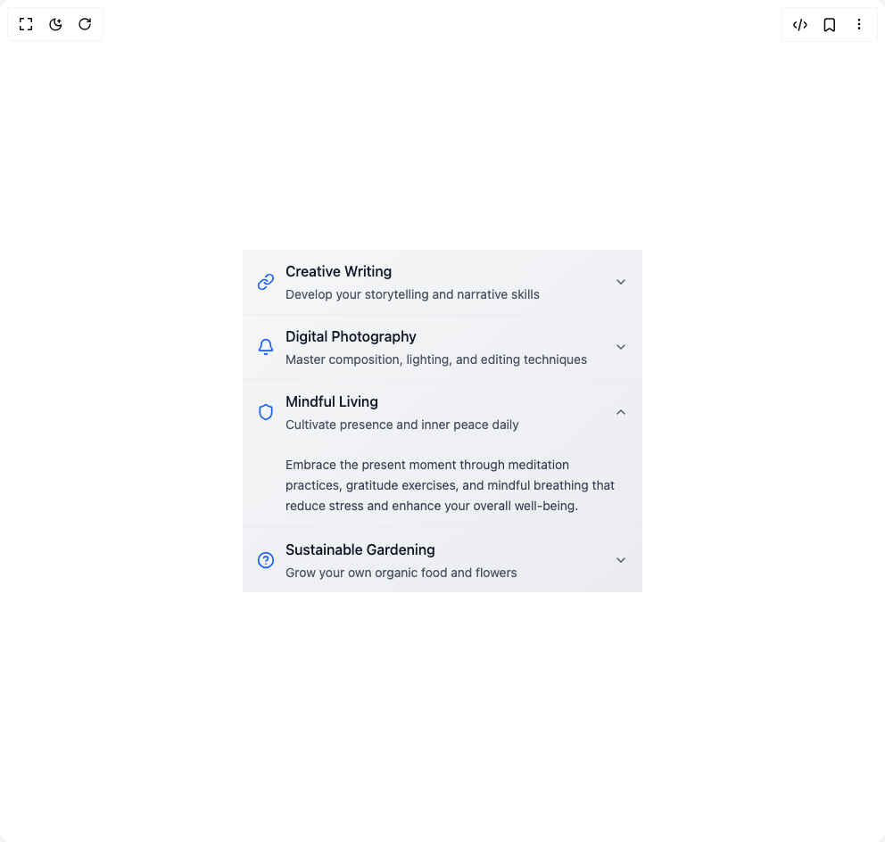

# Build Accordion 1 in BuilderStudio

> Build this component in our Agentic IDE: [BuilderStudio](https://builderstudio.dev).
>
> Join the BuilderStudio community on [Discord](https://discord.gg/QdWeSGCqfe) and [Reddit](https://reddit.com/r/builderstudio).



## Component

- Author group: `anubra266`
- Component: `accordion-1`
- Variant: `accoridon-icon-sub-header-and-chevron`
- Rendered HTML snapshot: [`rendered.html`](rendered.html)

## BuilderStudio prompt

You are implementing a React component based on a component reference.

## Component identity

- Author: anubra266
- Component slug: accordion-1
- Demo slug: accoridon-icon-sub-header-and-chevron
- Title: accordion-1
- Description: 

## Goal

Recreate this component in a React + TypeScript + Tailwind CSS project. Preserve the visual layout, spacing, colors, border radius, shadows, interaction behavior, animation behavior, responsive behavior, and dark mode behavior shown in the rendered demo.

## Implementation requirements

- Use React and TypeScript.
- Use Tailwind CSS classes whenever possible.
- Keep the component self-contained unless the source files require helper components.
- If the source uses CSS variables, custom CSS, animations, or keyframes, include them.
- If the source uses external packages, list and use the required packages.
- Preserve accessibility attributes, button semantics, links, keyboard behavior, and ARIA attributes when visible in the source.
- Do not replace the component with a simplified placeholder.
- Return complete production-ready code.

## Dependencies

No reference metadata available.

## Rendered DOM snapshot

This is the rendered demo HTML extracted from the live preview. Use it to verify structure, class names, visible content, and layout.

```html
<div id="root"><div class="w-screen min-h-screen flex justify-center items-center"><div class="w-screen min-h-screen flex justify-center items-center"><div data-scope="accordion" data-part="root" dir="ltr" id="accordion:«r0»" data-orientation="vertical" class="w-full max-w-md mx-auto bg-linear-to-br from-gray-100/80 to-gray-200/80 dark:from-gray-900/80 dark:to-gray-800/80 backdrop-blur-xs"><div data-scope="accordion" data-part="item" data-state="closed" dir="ltr" id="collapsible:accordion:«r0»:item:creative-writing" data-orientation="vertical" class="group border-b border-gray-200/50 dark:border-gray-700/50 last:border-b-0"><button data-scope="accordion" data-part="item-trigger" type="button" dir="ltr" id="accordion:«r0»:trigger:creative-writing" aria-controls="accordion:«r0»:content:creative-writing" aria-expanded="false" data-orientation="vertical" aria-disabled="false" data-state="closed" data-ownedby="accordion:«r0»" class="w-full px-4 py-3 flex items-center justify-between text-left hover:bg-linear-to-r hover:from-blue-500/5 hover:to-purple-500/5 transition-all duration-200"><div class="flex items-center flex-1"><svg xmlns="http://www.w3.org/2000/svg" width="24" height="24" viewBox="0 0 24 24" fill="none" stroke="currentColor" stroke-width="2" stroke-linecap="round" stroke-linejoin="round" class="lucide lucide-link w-5 h-5 text-blue-600 dark:text-blue-400 mr-3 shrink-0" aria-hidden="true"><path d="M10 13a5 5 0 0 0 7.54.54l3-3a5 5 0 0 0-7.07-7.07l-1.72 1.71"></path><path d="M14 11a5 5 0 0 0-7.54-.54l-3 3a5 5 0 0 0 7.07 7.07l1.71-1.71"></path></svg><div class="flex-1"><div class="font-medium text-gray-900 dark:text-white">Creative Writing</div><div class="text-sm text-gray-600 dark:text-gray-400 mt-1">Develop your storytelling and narrative skills</div></div></div><div data-scope="accordion" data-part="item-indicator" dir="ltr" aria-hidden="true" data-state="closed" data-orientation="vertical" class="ml-4 transition-transform duration-200 data-[state=open]:rotate-180"><svg xmlns="http://www.w3.org/2000/svg" width="24" height="24" viewBox="0 0 24 24" fill="none" stroke="currentColor" stroke-width="2" stroke-linecap="round" stroke-linejoin="round" class="lucide lucide-chevron-down w-4 h-4 text-gray-600 dark:text-gray-400" aria-hidden="true"><path d="m6 9 6 6 6-6"></path></svg></div></button><div data-scope="accordion" data-part="item-content" data-collapsible="" data-state="closed" id="accordion:«r0»:content:creative-writing" hidden="" dir="ltr" role="region" aria-labelledby="accordion:«r0»:trigger:creative-writing" data-orientation="vertical" class="px-4 pb-3 text-sm text-gray-700 dark:text-gray-300 leading-relaxed" style="--height: 0px; --width: 0px;"><div class="pt-3 pl-8">Transform your thoughts into compelling stories through character development, plot structure, and vivid descriptions that captivate readers and express your unique voice.</div></div></div><div data-scope="accordion" data-part="item" data-state="closed" dir="ltr" id="collapsible:accordion:«r0»:item:digital-photography" data-orientation="vertical" class="group border-b border-gray-200/50 dark:border-gray-700/50 last:border-b-0"><button data-scope="accordion" data-part="item-trigger" type="button" dir="ltr" id="accordion:«r0»:trigger:digital-photography" aria-controls="accordion:«r0»:content:digital-photography" aria-expanded="false" data-orientation="vertical" aria-disabled="false" data-state="closed" data-ownedby="accordion:«r0»" class="w-full px-4 py-3 flex items-center justify-between text-left hover:bg-linear-to-r hover:from-blue-500/5 hover:to-purple-500/5 transition-all duration-200"><div class="flex items-center flex-1"><svg xmlns="http://www.w3.org/2000/svg" width="24" height="24" viewBox="0 0 24 24" fill="none" stroke="currentColor" stroke-width="2" stroke-linecap="round" stroke-linejoin="round" class="lucide lucide-bell w-5 h-5 text-blue-600 dark:text-blue-400 mr-3 shrink-0" aria-hidden="true"><path d="M10.268 21a2 2 0 0 0 3.464 0"></path><path d="M3.262 15.326A1 1 0 0 0 4 17h16a1 1 0 0 0 .74-1.673C19.41 13.956 18 12.499 18 8A6 6 0 0 0 6 8c0 4.499-1.411 5.956-2.738 7.326"></path></svg><div class="flex-1"><div class="font-medium text-gray-900 dark:text-white">Digital Photography</div><div class="text-sm text-gray-600 dark:text-gray-400 mt-1">Master composition, lighting, and editing techniques</div></div></div><div data-scope="accordion" data-part="item-indicator" dir="ltr" aria-hidden="true" data-state="closed" data-orientation="vertical" class="ml-4 transition-transform duration-200 data-[state=open]:rotate-180"><svg xmlns="http://www.w3.org/2000/svg" width="24" height="24" viewBox="0 0 24 24" fill="none" stroke="currentColor" stroke-width="2" stroke-linecap="round" stroke-linejoin="round" class="lucide lucide-chevron-down w-4 h-4 text-gray-600 dark:text-gray-400" aria-hidden="true"><path d="m6 9 6 6 6-6"></path></svg></div></button><div data-scope="accordion" data-part="item-content" data-collapsible="" data-state="closed" id="accordion:«r0»:content:digital-photography" hidden="" dir="ltr" role="region" aria-labelledby="accordion:«r0»:trigger:digital-photography" data-orientation="vertical" class="px-4 pb-3 text-sm text-gray-700 dark:text-gray-300 leading-relaxed" style="--height: 0px; --width: 0px;"><div class="pt-3 pl-8">Capture stunning images by understanding the rule of thirds, golden hour lighting, and advanced editing techniques that bring your artistic vision to life.</div></div></div><div data-scope="accordion" data-part="item" data-state="open" dir="ltr" id="collapsible:accordion:«r0»:item:mindful-living" data-orientation="vertical" class="group border-b border-gray-200/50 dark:border-gray-700/50 last:border-b-0"><button data-scope="accordion" data-part="item-trigger" type="button" dir="ltr" id="accordion:«r0»:trigger:mindful-living" aria-controls="accordion:«r0»:content:mindful-living" aria-expanded="true" data-orientation="vertical" aria-disabled="false" data-state="open" data-ownedby="accordion:«r0»" class="w-full px-4 py-3 flex items-center justify-between text-left hover:bg-linear-to-r hover:from-blue-500/5 hover:to-purple-500/5 transition-all duration-200"><div class="flex items-center flex-1"><svg xmlns="http://www.w3.org/2000/svg" width="24" height="24" viewBox="0 0 24 24" fill="none" stroke="currentColor" stroke-width="2" stroke-linecap="round" stroke-linejoin="round" class="lucide lucide-shield w-5 h-5 text-blue-600 dark:text-blue-400 mr-3 shrink-0" aria-hidden="true"><path d="M20 13c0 5-3.5 7.5-7.66 8.95a1 1 0 0 1-.67-.01C7.5 20.5 4 18 4 13V6a1 1 0 0 1 1-1c2 0 4.5-1.2 6.24-2.72a1.17 1.17 0 0 1 1.52 0C14.51 3.81 17 5 19 5a1 1 0 0 1 1 1z"></path></svg><div class="flex-1"><div class="font-medium text-gray-900 dark:text-white">Mindful Living</div><div class="text-sm text-gray-600 dark:text-gray-400 mt-1">Cultivate presence and inner peace daily</div></div></div><div data-scope="accordion" data-part="item-indicator" dir="ltr" aria-hidden="true" data-state="open" data-orientation="vertical" class="ml-4 transition-transform duration-200 data-[state=open]:rotate-180"><svg xmlns="http://www.w3.org/2000/svg" width="24" height="24" viewBox="0 0 24 24" fill="none" stroke="currentColor" stroke-width="2" stroke-linecap="round" stroke-linejoin="round" class="lucide lucide-chevron-down w-4 h-4 text-gray-600 dark:text-gray-400" aria-hidden="true"><path d="m6 9 6 6 6-6"></path></svg></div></button><div data-scope="accordion" data-part="item-content" data-collapsible="" id="accordion:«r0»:content:mindful-living" dir="ltr" role="region" aria-labelledby="accordion:«r0»:trigger:mindful-living" data-orientation="vertical" class="px-4 pb-3 text-sm text-gray-700 dark:text-gray-300 leading-relaxed" style="--height: 0px; --width: 0px;"><div class="pt-3 pl-8">Embrace the present moment through meditation practices, gratitude exercises, and mindful breathing that reduce stress and enhance your overall well-being.</div></div></div><div data-scope="accordion" data-part="item" data-state="closed" dir="ltr" id="collapsible:accordion:«r0»:item:sustainable-gardening" data-orientation="vertical" class="group border-b border-gray-200/50 dark:border-gray-700/50 last:border-b-0"><button data-scope="accordion" data-part="item-trigger" type="button" dir="ltr" id="accordion:«r0»:trigger:sustainable-gardening" aria-controls="accordion:«r0»:content:sustainable-gardening" aria-expanded="false" data-orientation="vertical" aria-disabled="false" data-state="closed" data-ownedby="accordion:«r0»" class="w-full px-4 py-3 flex items-center justify-between text-left hover:bg-linear-to-r hover:from-blue-500/5 hover:to-purple-500/5 transition-all duration-200"><div class="flex items-center flex-1"><svg xmlns="http://www.w3.org/2000/svg" width="24" height="24" viewBox="0 0 24 24" fill="none" stroke="currentColor" stroke-width="2" stroke-linecap="round" stroke-linejoin="round" class="lucide lucide-circle-help w-5 h-5 text-blue-600 dark:text-blue-400 mr-3 shrink-0" aria-hidden="true"><circle cx="12" cy="12" r="10"></circle><path d="M9.09 9a3 3 0 0 1 5.83 1c0 2-3 3-3 3"></path><path d="M12 17h.01"></path></svg><div class="flex-1"><div class="font-medium text-gray-900 dark:text-white">Sustainable Gardening</div><div class="text-sm text-gray-600 dark:text-gray-400 mt-1">Grow your own organic food and flowers</div></div></div><div data-scope="accordion" data-part="item-indicator" dir="ltr" aria-hidden="true" data-state="closed" data-orientation="vertical" class="ml-4 transition-transform duration-200 data-[state=open]:rotate-180"><svg xmlns="http://www.w3.org/2000/svg" width="24" height="24" viewBox="0 0 24 24" fill="none" stroke="currentColor" stroke-width="2" stroke-linecap="round" stroke-linejoin="round" class="lucide lucide-chevron-down w-4 h-4 text-gray-600 dark:text-gray-400" aria-hidden="true"><path d="m6 9 6 6 6-6"></path></svg></div></button><div data-scope="accordion" data-part="item-content" data-collapsible="" data-state="closed" id="accordion:«r0»:content:sustainable-gardening" hidden="" dir="ltr" role="region" aria-labelledby="accordion:«r0»:trigger:sustainable-gardening" data-orientation="vertical" class="px-4 pb-3 text-sm text-gray-700 dark:text-gray-300 leading-relaxed" style="--height: 0px; --width: 0px;"><div class="pt-3 pl-8">Create a thriving ecosystem in your backyard using natural fertilizers, companion planting, and water-efficient methods that support both plants and wildlife.</div></div></div></div></div></div></div>
```

## Reference source files

No reference source files were available.
