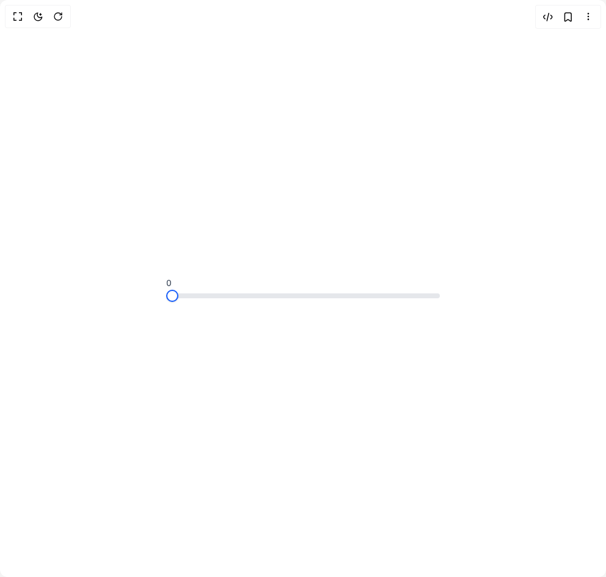

# Build Basic Slider in BuilderStudio

> Build this component in our Agentic IDE: [BuilderStudio](https://builderstudio.dev).
>
> Join the BuilderStudio community on [Discord](https://discord.gg/QdWeSGCqfe) and [Reddit](https://reddit.com/r/builderstudio).



## Component

- Author group: `anubra266`
- Component: `basic-slider`
- Variant: `default`
- Rendered HTML snapshot: [`rendered.html`](rendered.html)

## BuilderStudio prompt

You are implementing a React component based on a component reference.

## Component identity

- Author: anubra266
- Component slug: basic-slider
- Demo slug: default
- Title: basic-slider
- Description: 

## Goal

Recreate this component in a React + TypeScript + Tailwind CSS project. Preserve the visual layout, spacing, colors, border radius, shadows, interaction behavior, animation behavior, responsive behavior, and dark mode behavior shown in the rendered demo.

## Implementation requirements

- Use React and TypeScript.
- Use Tailwind CSS classes whenever possible.
- Keep the component self-contained unless the source files require helper components.
- If the source uses CSS variables, custom CSS, animations, or keyframes, include them.
- If the source uses external packages, list and use the required packages.
- Preserve accessibility attributes, button semantics, links, keyboard behavior, and ARIA attributes when visible in the source.
- Do not replace the component with a simplified placeholder.
- Return complete production-ready code.

## Dependencies

No reference metadata available.

## Rendered DOM snapshot

This is the rendered demo HTML extracted from the live preview. Use it to verify structure, class names, visible content, and layout.

```html
<div id="root"><div class="w-screen min-h-screen flex justify-center items-center"><div class="w-screen min-h-screen flex justify-center items-center"><div class="bg-white dark:bg-gray-800 w-full px-4 py-12 rounded-xl flex items-center justify-center"><div class="max-w-md w-full"><div data-scope="slider" data-part="root" data-orientation="horizontal" id="slider:«r0»" dir="ltr" style="--slider-thumb-offset-0: calc(0% - -10px); --slider-thumb-transform: translateX(-50%); --slider-range-start: 0%; --slider-range-end: 100%; --slider-thumb-width: 20px; --slider-thumb-height: 20px;"><span data-scope="slider" data-part="value-text" dir="ltr" data-orientation="horizontal" id="slider:«r0»:value-text" class="text-sm text-gray-600 dark:text-gray-400 mb-4">0</span><div data-scope="slider" data-part="control" dir="ltr" id="slider:«r0»:control" data-orientation="horizontal" class="relative flex items-center h-5" style="touch-action: none; user-select: none; position: relative;"><div data-scope="slider" data-part="track" dir="ltr" id="slider:«r0»:track" data-orientation="horizontal" class="relative flex-1 h-2 bg-gray-200 dark:bg-gray-700 rounded-full overflow-hidden" style="position: relative;"><div id="slider:«r0»:range" data-scope="slider" data-part="range" dir="ltr" data-orientation="horizontal" class="absolute h-full bg-blue-600 dark:bg-blue-500 rounded-full" style="position: absolute; left: var(--slider-range-start); right: var(--slider-range-end);"></div></div><div data-scope="slider" data-part="thumb" dir="ltr" data-index="0" id="slider:«r0»:thumb:0" data-orientation="horizontal" draggable="false" aria-labelledby="slider:«r0»:label" aria-orientation="horizontal" aria-valuemax="100" aria-valuemin="0" aria-valuenow="0" role="slider" tabindex="0" class="relative w-5 h-5 bg-white dark:bg-gray-800 border-2 border-blue-600 dark:border-blue-500 rounded-full shadow-sm outline-none focus:ring-2 focus:ring-blue-500 focus:ring-offset-2 dark:focus:ring-offset-gray-800 z-10" style="visibility: visible; position: absolute; transform: var(--slider-thumb-transform); inset-inline-start: var(--slider-thumb-offset-0);"><input hidden="" id="slider:«r0»:input:0" type="text" value="0"></div></div></div></div></div></div></div></div>
```

## Reference source files

No reference source files were available.
