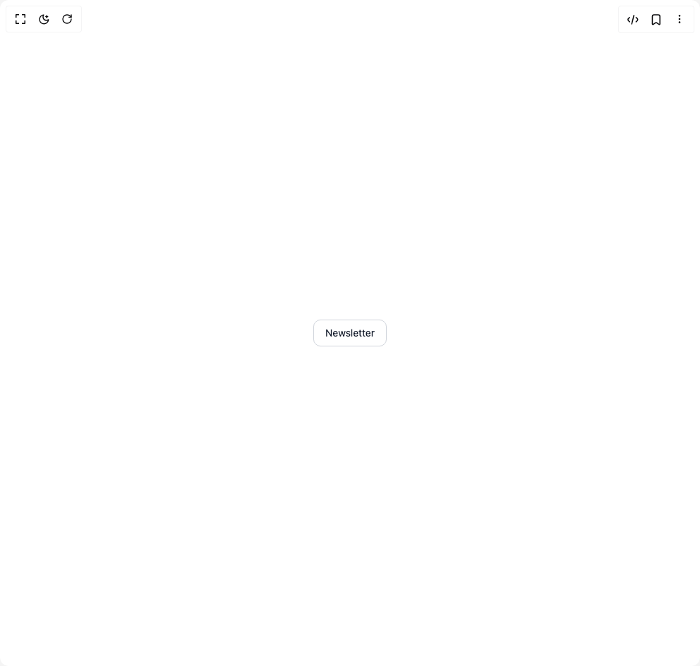

# Build Dialog 2 in BuilderStudio

> Build this component in our Agentic IDE: [BuilderStudio](https://builderstudio.dev).
>
> Join the BuilderStudio community on [Discord](https://discord.gg/QdWeSGCqfe) and [Reddit](https://reddit.com/r/builderstudio).



## Component

- Author group: `anubra266`
- Component: `dialog-2`
- Variant: `newsletter-dialog`
- Rendered HTML snapshot: [`rendered.html`](rendered.html)

## BuilderStudio prompt

You are implementing a React component based on a component reference.

## Component identity

- Author: anubra266
- Component slug: dialog-2
- Demo slug: newsletter-dialog
- Title: dialog-2
- Description: 

## Goal

Recreate this component in a React + TypeScript + Tailwind CSS project. Preserve the visual layout, spacing, colors, border radius, shadows, interaction behavior, animation behavior, responsive behavior, and dark mode behavior shown in the rendered demo.

## Implementation requirements

- Use React and TypeScript.
- Use Tailwind CSS classes whenever possible.
- Keep the component self-contained unless the source files require helper components.
- If the source uses CSS variables, custom CSS, animations, or keyframes, include them.
- If the source uses external packages, list and use the required packages.
- Preserve accessibility attributes, button semantics, links, keyboard behavior, and ARIA attributes when visible in the source.
- Do not replace the component with a simplified placeholder.
- Return complete production-ready code.

## Dependencies

No reference metadata available.

## Rendered DOM snapshot

This is the rendered demo HTML extracted from the live preview. Use it to verify structure, class names, visible content, and layout.

```html
<div id="root"><div class="w-screen min-h-screen flex justify-center items-center"><div class="w-screen min-h-screen flex justify-center items-center"><button class="rounded-lg border border-gray-300 dark:border-gray-600 bg-white dark:bg-gray-800 px-4 py-2 text-sm text-gray-900 dark:text-gray-100 hover:bg-gray-50 dark:hover:bg-gray-700 transition-colors cursor-pointer inline-flex items-center justify-center" data-scope="dialog" data-part="trigger" dir="ltr" id="dialog:«r0»:trigger" aria-haspopup="dialog" type="button" aria-expanded="false" data-state="closed" aria-controls="dialog:«r0»:content">Newsletter</button></div></div></div>
```

## Reference source files

No reference source files were available.
