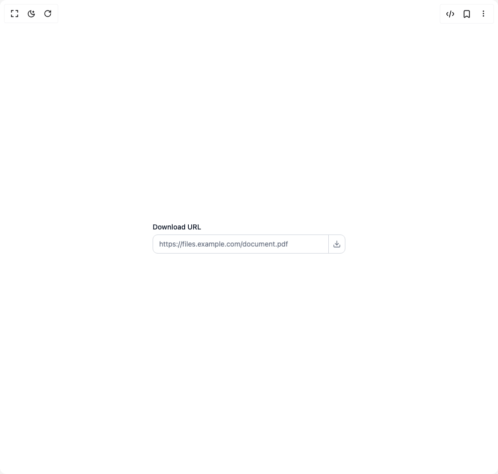

# Build Field Components in BuilderStudio

> Build this component in our Agentic IDE: [BuilderStudio](https://builderstudio.dev).
>
> Join the BuilderStudio community on [Discord](https://discord.gg/QdWeSGCqfe) and [Reddit](https://reddit.com/r/builderstudio).



## Component

- Author group: `anubra266`
- Component: `field-components`
- Variant: `input-and-icon-button`
- Rendered HTML snapshot: [`rendered.html`](rendered.html)

## BuilderStudio prompt

You are implementing a React component based on a component reference.

## Component identity

- Author: anubra266
- Component slug: field-components
- Demo slug: input-and-icon-button
- Title: field-components
- Description: 

## Goal

Recreate this component in a React + TypeScript + Tailwind CSS project. Preserve the visual layout, spacing, colors, border radius, shadows, interaction behavior, animation behavior, responsive behavior, and dark mode behavior shown in the rendered demo.

## Implementation requirements

- Use React and TypeScript.
- Use Tailwind CSS classes whenever possible.
- Keep the component self-contained unless the source files require helper components.
- If the source uses CSS variables, custom CSS, animations, or keyframes, include them.
- If the source uses external packages, list and use the required packages.
- Preserve accessibility attributes, button semantics, links, keyboard behavior, and ARIA attributes when visible in the source.
- Do not replace the component with a simplified placeholder.
- Return complete production-ready code.

## Dependencies

No reference metadata available.

## Rendered DOM snapshot

This is the rendered demo HTML extracted from the live preview. Use it to verify structure, class names, visible content, and layout.

```html
<div id="root"><div class="w-screen min-h-screen flex justify-center items-center"><div class="w-screen min-h-screen flex justify-center items-center"><div data-scope="field" data-part="root" id="field::«r0»" role="group" class="max-w-sm w-full"><label data-scope="field" data-part="label" id="field::«r0»::label" for="«r0»" class="text-sm font-medium text-gray-900 dark:text-gray-100">Download URL</label><div class="mt-1 flex rounded-lg overflow-hidden border border-gray-300 dark:border-gray-600 bg-white dark:bg-gray-800 focus-within:border-gray-900 dark:focus-within:border-gray-100 focus-within:ring-1 focus-within:ring-gray-900 dark:focus-within:ring-gray-100"><input id="«r0»" data-scope="field" data-part="input" placeholder="https://files.example.com/document.pdf" class="min-w-0 flex-1 border-0 bg-transparent px-3 py-2 text-sm text-gray-900 dark:text-gray-100 placeholder-gray-500 dark:placeholder-gray-400 focus:outline-hidden focus:ring-0" type="url"><div class="border-l border-gray-300 dark:border-gray-600"></div><button class="border-0 bg-transparent p-2 text-gray-500 dark:text-gray-400 hover:bg-gray-50 dark:hover:bg-gray-700 hover:text-gray-900 dark:hover:text-gray-100 focus:outline-hidden focus:ring-0"><svg xmlns="http://www.w3.org/2000/svg" width="24" height="24" viewBox="0 0 24 24" fill="none" stroke="currentColor" stroke-width="2" stroke-linecap="round" stroke-linejoin="round" class="lucide lucide-download h-4 w-4" aria-hidden="true"><path d="M21 15v4a2 2 0 0 1-2 2H5a2 2 0 0 1-2-2v-4"></path><polyline points="7 10 12 15 17 10"></polyline><line x1="12" x2="12" y1="15" y2="3"></line></svg></button></div></div></div></div></div>
```

## Reference source files

No reference source files were available.
